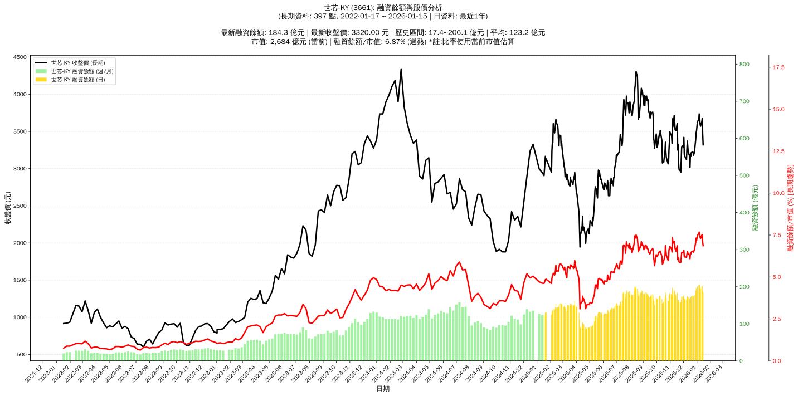

# :chart_with_upwards_trend: 世芯-KY (3661) 融資餘額報告

!!! info "基本資訊"
    **:building_construction: 名稱**: 世芯-KY
    **:identification_card: 代號**: 3661
    **:calendar: 分析期間**: 2025-07-18 ~ 2026-01-09 (共 242 個交易日)
    **:clock3: 最新資料**: 2026-01-09
    **🕒 更新時間**: 2026-01-11 23:12:53 CST

## :moneybag: 融資餘額現況

| :chart: 指標 | :1234: 數值 | :traffic_light: 狀態 |
|:------------:|:----------:|:-------------------:|
| **最新融資餘額** | 195.5 億元 (5,476 張) | - |
| **最新收盤價** | 3570.00 元 | - |
| **市值** | 2,887 億元 | - |
| **融資餘額/市值** | 6.77% | 🔴 過熱 |
| **日變化 (DoD)** | -2.8 億元 (-1.41%) | 📉 |
| **週變化 (WoW)** | -5.2 億元 (-2.59%) | 📉 |
| **月變化 (MoM)** | +20.9 億元 (+11.99%) | 📈 |

---

## :bar_chart: 歷史統計

| :chart: 指標 | :1234: 數值 |
|:------------:|:----------:|
| **歷史最高** | 206.1 億元 |
| **歷史最低** | 83.2 億元 |
| **平均值** | 154.6 億元 |
| **標準差** | 29.1 億元 |
| **當前相對位置** | 91.3% |

---

## :chart_with_upwards_trend: 融資餘額趨勢圖

    

---

## :clipboard: 詳細歷史記錄 (最近30日)

<table class="sortable-table">
<thead>
<tr>
<th>:calendar: 日期</th>
<th>:money_with_wings: 收盤價(元)</th>
<th>:chart: 漲跌(元)</th>
<th>:chart_with_upwards_trend: 漲跌(%)</th>
<th>:package: 融資餘額(億元)</th>
<th>:package: 融資餘額(張)</th>
<th>:arrow_up_down: 融資增減(張)</th>
<th>:chart: 融券餘額(張)</th>
<th>:balance_scale: 券資比(%)</th>
</tr>
</thead>
<tbody>
<tr>
<td>2026-01-09</td>
<td>3570.00</td>
<td>🔻 -30.00</td>
<td>-0.83%</td>
<td>195.5</td>
<td>5,476</td>
<td>📉 -32</td>
<td>67</td>
<td>1.22%</td>
</tr>
<tr>
<td>2026-01-08</td>
<td>3600.00</td>
<td>🔻 -80.00</td>
<td>-2.17%</td>
<td>198.3</td>
<td>5,508</td>
<td>📉 -29</td>
<td>68</td>
<td>1.23%</td>
</tr>
<tr>
<td>2026-01-07</td>
<td>3680.00</td>
<td>🔻 -55.00</td>
<td>-1.47%</td>
<td>203.8</td>
<td>5,537</td>
<td>📈 +18</td>
<td>68</td>
<td>1.23%</td>
</tr>
<tr>
<td>2026-01-06</td>
<td>3735.00</td>
<td>🔺 +85.00</td>
<td>+2.33%</td>
<td>206.1</td>
<td>5,519</td>
<td>📉 -55</td>
<td>75</td>
<td>1.36%</td>
</tr>
<tr>
<td>2026-01-05</td>
<td>3650.00</td>
<td>🔺 +15.00</td>
<td>+0.41%</td>
<td>203.5</td>
<td>5,574</td>
<td>📈 +53</td>
<td>74</td>
<td>1.33%</td>
</tr>
<tr>
<td>2026-01-02</td>
<td>3635.00</td>
<td>🔺 +125.00</td>
<td>+3.56%</td>
<td>200.7</td>
<td>5,521</td>
<td>📈 +39</td>
<td>72</td>
<td>1.30%</td>
</tr>
<tr>
<td>2025-12-31</td>
<td>3510.00</td>
<td>🔺 +25.00</td>
<td>+0.72%</td>
<td>192.4</td>
<td>5,482</td>
<td>📉 -156</td>
<td>62</td>
<td>1.13%</td>
</tr>
<tr>
<td>2025-12-30</td>
<td>3485.00</td>
<td>🔺 +95.00</td>
<td>+2.80%</td>
<td>196.5</td>
<td>5,638</td>
<td>📈 +50</td>
<td>60</td>
<td>1.06%</td>
</tr>
<tr>
<td>2025-12-29</td>
<td>3390.00</td>
<td>🔺 +175.00</td>
<td>+5.44%</td>
<td>189.4</td>
<td>5,588</td>
<td>📈 +66</td>
<td>55</td>
<td>0.98%</td>
</tr>
<tr>
<td>2025-12-26</td>
<td>3215.00</td>
<td>🔺 +35.00</td>
<td>+1.10%</td>
<td>177.5</td>
<td>5,522</td>
<td>📈 +50</td>
<td>47</td>
<td>0.85%</td>
</tr>
<tr>
<td>2025-12-24</td>
<td>3180.00</td>
<td>🔻 -40.00</td>
<td>-1.24%</td>
<td>174.0</td>
<td>5,472</td>
<td>📈 +19</td>
<td>52</td>
<td>0.95%</td>
</tr>
<tr>
<td>2025-12-23</td>
<td>3220.00</td>
<td>🔻 -5.00</td>
<td>-0.16%</td>
<td>175.6</td>
<td>5,453</td>
<td>📈 +7</td>
<td>53</td>
<td>0.97%</td>
</tr>
<tr>
<td>2025-12-22</td>
<td>3225.00</td>
<td>🔺 +10.00</td>
<td>+0.31%</td>
<td>175.6</td>
<td>5,446</td>
<td>📈 +29</td>
<td>53</td>
<td>0.97%</td>
</tr>
<tr>
<td>2025-12-19</td>
<td>3215.00</td>
<td>🔺 +45.00</td>
<td>+1.42%</td>
<td>174.2</td>
<td>5,417</td>
<td>📈 +20</td>
<td>55</td>
<td>1.02%</td>
</tr>
<tr>
<td>2025-12-18</td>
<td>3170.00</td>
<td>🔻 -30.00</td>
<td>-0.94%</td>
<td>171.1</td>
<td>5,397</td>
<td>📈 +9</td>
<td>51</td>
<td>0.94%</td>
</tr>
<tr>
<td>2025-12-17</td>
<td>3200.00</td>
<td>🔺 +185.00</td>
<td>+6.14%</td>
<td>172.4</td>
<td>5,388</td>
<td>📉 -33</td>
<td>49</td>
<td>0.91%</td>
</tr>
<tr>
<td>2025-12-16</td>
<td>3015.00</td>
<td>🔻 -155.00</td>
<td>-4.89%</td>
<td>163.4</td>
<td>5,421</td>
<td>📈 +92</td>
<td>51</td>
<td>0.94%</td>
</tr>
<tr>
<td>2025-12-15</td>
<td>3170.00</td>
<td>🔻 -50.00</td>
<td>-1.55%</td>
<td>168.9</td>
<td>5,329</td>
<td>📈 +8</td>
<td>46</td>
<td>0.86%</td>
</tr>
<tr>
<td>2025-12-12</td>
<td>3220.00</td>
<td>🔻 -75.00</td>
<td>-2.28%</td>
<td>171.3</td>
<td>5,321</td>
<td>📈 +76</td>
<td>45</td>
<td>0.85%</td>
</tr>
<tr>
<td>2025-12-11</td>
<td>3295.00</td>
<td>🔻 -75.00</td>
<td>-2.23%</td>
<td>172.8</td>
<td>5,245</td>
<td>📈 +65</td>
<td>45</td>
<td>0.86%</td>
</tr>
<tr>
<td>2025-12-10</td>
<td>3370.00</td>
<td>🔺 +110.00</td>
<td>+3.37%</td>
<td>174.6</td>
<td>5,180</td>
<td>📉 -58</td>
<td>47</td>
<td>0.91%</td>
</tr>
<tr>
<td>2025-12-09</td>
<td>3260.00</td>
<td>🔺 +140.00</td>
<td>+4.49%</td>
<td>170.8</td>
<td>5,238</td>
<td>📉 -64</td>
<td>45</td>
<td>0.86%</td>
</tr>
<tr>
<td>2025-12-08</td>
<td>3120.00</td>
<td>🔻 -35.00</td>
<td>-1.11%</td>
<td>165.4</td>
<td>5,302</td>
<td>📈 +16</td>
<td>39</td>
<td>0.74%</td>
</tr>
<tr>
<td>2025-12-05</td>
<td>3155.00</td>
<td>🔻 -15.00</td>
<td>-0.47%</td>
<td>166.8</td>
<td>5,286</td>
<td>📈 +42</td>
<td>42</td>
<td>0.79%</td>
</tr>
<tr>
<td>2025-12-04</td>
<td>3170.00</td>
<td>🔻 -20.00</td>
<td>-0.63%</td>
<td>166.2</td>
<td>5,244</td>
<td>📈 +18</td>
<td>45</td>
<td>0.86%</td>
</tr>
<tr>
<td>2025-12-03</td>
<td>3190.00</td>
<td>🔻 -230.00</td>
<td>-6.73%</td>
<td>166.7</td>
<td>5,226</td>
<td>📈 +53</td>
<td>50</td>
<td>0.96%</td>
</tr>
<tr>
<td>2025-12-02</td>
<td>3420.00</td>
<td>🔺 +130.00</td>
<td>+3.95%</td>
<td>176.9</td>
<td>5,173</td>
<td>📉 -104</td>
<td>70</td>
<td>1.35%</td>
</tr>
<tr>
<td>2025-12-01</td>
<td>3290.00</td>
<td>🔻 -15.00</td>
<td>-0.45%</td>
<td>173.6</td>
<td>5,277</td>
<td>📈 +27</td>
<td>50</td>
<td>0.95%</td>
</tr>
<tr>
<td>2025-11-28</td>
<td>3305.00</td>
<td>🔺 +20.00</td>
<td>+0.61%</td>
<td>173.5</td>
<td>5,250</td>
<td>📉 -27</td>
<td>51</td>
<td>0.97%</td>
</tr>
<tr>
<td>2025-11-27</td>
<td>3285.00</td>
<td>🔺 +175.00</td>
<td>+5.63%</td>
<td>173.3</td>
<td>5,277</td>
<td>📉 -22</td>
<td>60</td>
<td>1.14%</td>
</tr>
</tbody>
</table>

---

## :information_source: 資料來源與方法

!!! note "資料來源說明"
    - **主要來源**: `raw_margin_daily.csv` (Type 13: ShowMarginChart)
    - **資料頻率**: 每日更新
    - **資料範圍**: 近1年交易日資料

!!! info "報告元資訊"
    - **報告產生時間**: 2026-01-11 23:12:53
    - **分析期間**: 242 個交易日
    - **資料來源**: Stage 1 Raw Margin Daily Data

---

:material-information-outline: **本報告僅供參考，投資決策請審慎評估**

