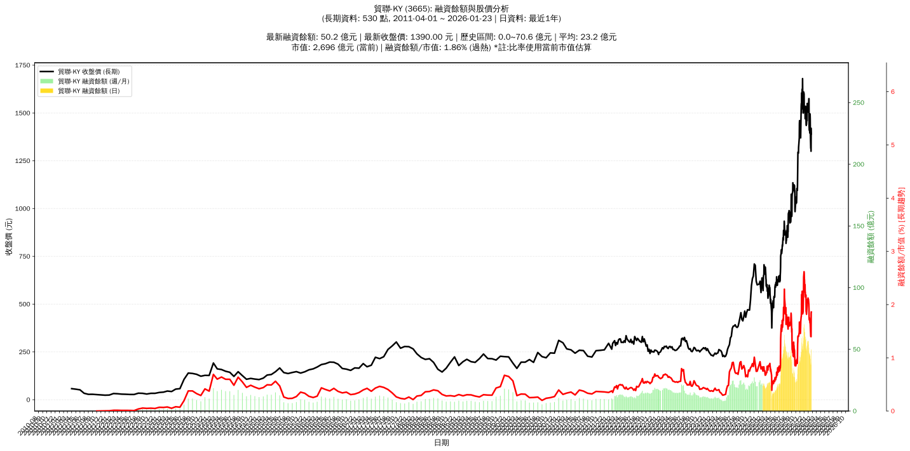

# :chart_with_upwards_trend: 貿聯-KY (3665) 融資餘額報告

!!! info "基本資訊"
    **:building_construction: 名稱**: 貿聯-KY
    **:identification_card: 代號**: 3665
    **:calendar: 分析期間**: 2025-07-18 ~ 2026-01-09 (共 242 個交易日)
    **:clock3: 最新資料**: 2026-01-09
    **🕒 更新時間**: 2026-01-11 23:11:55 CST

## :moneybag: 融資餘額現況

| :chart: 指標 | :1234: 數值 | :traffic_light: 狀態 |
|:------------:|:----------:|:-------------------:|
| **最新融資餘額** | 47.3 億元 (3,317 張) | - |
| **最新收盤價** | 1425.00 元 | - |
| **市值** | 2,764 億元 | - |
| **融資餘額/市值** | 1.71% | 🔴 過熱 |
| **日變化 (DoD)** | +1.1 億元 (+2.42%) | 📈 |
| **週變化 (WoW)** | -9.3 億元 (-16.46%) | 📉 |
| **月變化 (MoM)** | -13.0 億元 (-21.63%) | 📉 |

---

## :bar_chart: 歷史統計

| :chart: 指標 | :1234: 數值 |
|:------------:|:----------:|
| **歷史最高** | 70.6 億元 |
| **歷史最低** | 10.5 億元 |
| **平均值** | 34.9 億元 |
| **標準差** | 15.2 億元 |
| **當前相對位置** | 61.2% |

---

## :chart_with_upwards_trend: 融資餘額趨勢圖

{: style="max-width: 100%; height: auto;"}

---

## :clipboard: 詳細歷史記錄 (最近30日)

<table class="sortable-table">
<thead>
<tr>
<th>:calendar: 日期</th>
<th>:money_with_wings: 收盤價(元)</th>
<th>:chart: 漲跌(元)</th>
<th>:chart_with_upwards_trend: 漲跌(%)</th>
<th>:package: 融資餘額(億元)</th>
<th>:package: 融資餘額(張)</th>
<th>:arrow_up_down: 融資增減(張)</th>
<th>:chart: 融券餘額(張)</th>
<th>:balance_scale: 券資比(%)</th>
</tr>
</thead>
<tbody>
<tr>
<td>2026-01-09</td>
<td>1425.00</td>
<td>🔺 +15.00</td>
<td>+1.06%</td>
<td>47.3</td>
<td>3,317</td>
<td>📈 +44</td>
<td>155</td>
<td>4.67%</td>
</tr>
<tr>
<td>2026-01-08</td>
<td>1410.00</td>
<td>🔻 -20.00</td>
<td>-1.40%</td>
<td>46.1</td>
<td>3,273</td>
<td>📉 -23</td>
<td>148</td>
<td>4.52%</td>
</tr>
<tr>
<td>2026-01-07</td>
<td>1430.00</td>
<td>🔻 -145.00</td>
<td>-9.21%</td>
<td>47.1</td>
<td>3,296</td>
<td>📈 +37</td>
<td>149</td>
<td>4.52%</td>
</tr>
<tr>
<td>2026-01-06</td>
<td>1575.00</td>
<td>➖ +0.00</td>
<td>+0.00%</td>
<td>51.3</td>
<td>3,259</td>
<td>📉 -175</td>
<td>171</td>
<td>5.25%</td>
</tr>
<tr>
<td>2026-01-05</td>
<td>1575.00</td>
<td>🔺 +50.00</td>
<td>+3.28%</td>
<td>54.1</td>
<td>3,434</td>
<td>📉 -276</td>
<td>175</td>
<td>5.10%</td>
</tr>
<tr>
<td>2026-01-02</td>
<td>1525.00</td>
<td>🔺 +5.00</td>
<td>+0.33%</td>
<td>56.6</td>
<td>3,710</td>
<td>📉 -26</td>
<td>181</td>
<td>4.88%</td>
</tr>
<tr>
<td>2025-12-31</td>
<td>1520.00</td>
<td>🔺 +15.00</td>
<td>+1.00%</td>
<td>56.8</td>
<td>3,736</td>
<td>📉 -67</td>
<td>172</td>
<td>4.60%</td>
</tr>
<tr>
<td>2025-12-30</td>
<td>1505.00</td>
<td>➖ +0.00</td>
<td>+0.00%</td>
<td>57.2</td>
<td>3,803</td>
<td>📈 +50</td>
<td>171</td>
<td>4.50%</td>
</tr>
<tr>
<td>2025-12-29</td>
<td>1505.00</td>
<td>🔻 -40.00</td>
<td>-2.59%</td>
<td>56.5</td>
<td>3,753</td>
<td>📈 +167</td>
<td>172</td>
<td>4.58%</td>
</tr>
<tr>
<td>2025-12-26</td>
<td>1545.00</td>
<td>🔻 -5.00</td>
<td>-0.32%</td>
<td>55.4</td>
<td>3,586</td>
<td>📉 -58</td>
<td>192</td>
<td>5.35%</td>
</tr>
<tr>
<td>2025-12-24</td>
<td>1550.00</td>
<td>🔺 +90.00</td>
<td>+6.16%</td>
<td>56.5</td>
<td>3,644</td>
<td>📉 -8</td>
<td>197</td>
<td>5.41%</td>
</tr>
<tr>
<td>2025-12-23</td>
<td>1460.00</td>
<td>🔻 -15.00</td>
<td>-1.02%</td>
<td>53.3</td>
<td>3,652</td>
<td>📈 +97</td>
<td>168</td>
<td>4.60%</td>
</tr>
<tr>
<td>2025-12-22</td>
<td>1475.00</td>
<td>🔺 +35.00</td>
<td>+2.43%</td>
<td>52.4</td>
<td>3,555</td>
<td>📈 +151</td>
<td>170</td>
<td>4.78%</td>
</tr>
<tr>
<td>2025-12-19</td>
<td>1440.00</td>
<td>➖ +0.00</td>
<td>+0.00%</td>
<td>49.0</td>
<td>3,404</td>
<td>📉 -45</td>
<td>167</td>
<td>4.91%</td>
</tr>
<tr>
<td>2025-12-18</td>
<td>1440.00</td>
<td>🔺 +5.00</td>
<td>+0.35%</td>
<td>49.7</td>
<td>3,449</td>
<td>📉 -118</td>
<td>166</td>
<td>4.81%</td>
</tr>
<tr>
<td>2025-12-17</td>
<td>1435.00</td>
<td>🔻 -5.00</td>
<td>-0.35%</td>
<td>51.2</td>
<td>3,567</td>
<td>📈 +63</td>
<td>166</td>
<td>4.65%</td>
</tr>
<tr>
<td>2025-12-16</td>
<td>1440.00</td>
<td>🔻 -35.00</td>
<td>-2.37%</td>
<td>50.5</td>
<td>3,504</td>
<td>📉 -479</td>
<td>161</td>
<td>4.59%</td>
</tr>
<tr>
<td>2025-12-15</td>
<td>1475.00</td>
<td>🔻 -60.00</td>
<td>-3.91%</td>
<td>58.7</td>
<td>3,983</td>
<td>📈 +226</td>
<td>175</td>
<td>4.39%</td>
</tr>
<tr>
<td>2025-12-12</td>
<td>1535.00</td>
<td>➖ +0.00</td>
<td>+0.00%</td>
<td>57.7</td>
<td>3,757</td>
<td>📉 -14</td>
<td>193</td>
<td>5.14%</td>
</tr>
<tr>
<td>2025-12-11</td>
<td>1535.00</td>
<td>🔺 +10.00</td>
<td>+0.66%</td>
<td>57.9</td>
<td>3,771</td>
<td>📉 -184</td>
<td>192</td>
<td>5.09%</td>
</tr>
<tr>
<td>2025-12-10</td>
<td>1525.00</td>
<td>🔺 +55.00</td>
<td>+3.74%</td>
<td>60.3</td>
<td>3,955</td>
<td>📉 -127</td>
<td>190</td>
<td>4.80%</td>
</tr>
<tr>
<td>2025-12-09</td>
<td>1470.00</td>
<td>🔻 -45.00</td>
<td>-2.97%</td>
<td>60.0</td>
<td>4,082</td>
<td>📉 -148</td>
<td>210</td>
<td>5.14%</td>
</tr>
<tr>
<td>2025-12-08</td>
<td>1515.00</td>
<td>🔻 -10.00</td>
<td>-0.66%</td>
<td>64.1</td>
<td>4,230</td>
<td>📈 +39</td>
<td>188</td>
<td>4.44%</td>
</tr>
<tr>
<td>2025-12-05</td>
<td>1525.00</td>
<td>🔻 -5.00</td>
<td>-0.33%</td>
<td>63.9</td>
<td>4,191</td>
<td>📉 -156</td>
<td>213</td>
<td>5.08%</td>
</tr>
<tr>
<td>2025-12-04</td>
<td>1530.00</td>
<td>🔺 +5.00</td>
<td>+0.33%</td>
<td>66.5</td>
<td>4,347</td>
<td>📉 -48</td>
<td>202</td>
<td>4.65%</td>
</tr>
<tr>
<td>2025-12-03</td>
<td>1525.00</td>
<td>🔻 -10.00</td>
<td>-0.65%</td>
<td>67.0</td>
<td>4,395</td>
<td>📉 -147</td>
<td>192</td>
<td>4.37%</td>
</tr>
<tr>
<td>2025-12-02</td>
<td>1535.00</td>
<td>🔻 -65.00</td>
<td>-4.06%</td>
<td>69.7</td>
<td>4,542</td>
<td>📈 +131</td>
<td>192</td>
<td>4.23%</td>
</tr>
<tr>
<td>2025-12-01</td>
<td>1600.00</td>
<td>🔻 -10.00</td>
<td>-0.62%</td>
<td>70.6</td>
<td>4,411</td>
<td>📈 +202</td>
<td>209</td>
<td>4.74%</td>
</tr>
<tr>
<td>2025-11-28</td>
<td>1610.00</td>
<td>🔺 +70.00</td>
<td>+4.55%</td>
<td>67.8</td>
<td>4,209</td>
<td>📈 +360</td>
<td>218</td>
<td>5.18%</td>
</tr>
<tr>
<td>2025-11-27</td>
<td>1540.00</td>
<td>🔺 +40.00</td>
<td>+2.67%</td>
<td>59.3</td>
<td>3,849</td>
<td>📈 +46</td>
<td>217</td>
<td>5.64%</td>
</tr>
</tbody>
</table>

---

## :information_source: 資料來源與方法

!!! note "資料來源說明"
    - **主要來源**: `raw_margin_daily.csv` (Type 13: ShowMarginChart)
    - **資料頻率**: 每日更新
    - **資料範圍**: 近1年交易日資料

!!! info "報告元資訊"
    - **報告產生時間**: 2026-01-11 23:11:55
    - **分析期間**: 242 個交易日
    - **資料來源**: Stage 1 Raw Margin Daily Data

---

:material-information-outline: **本報告僅供參考，投資決策請審慎評估**

