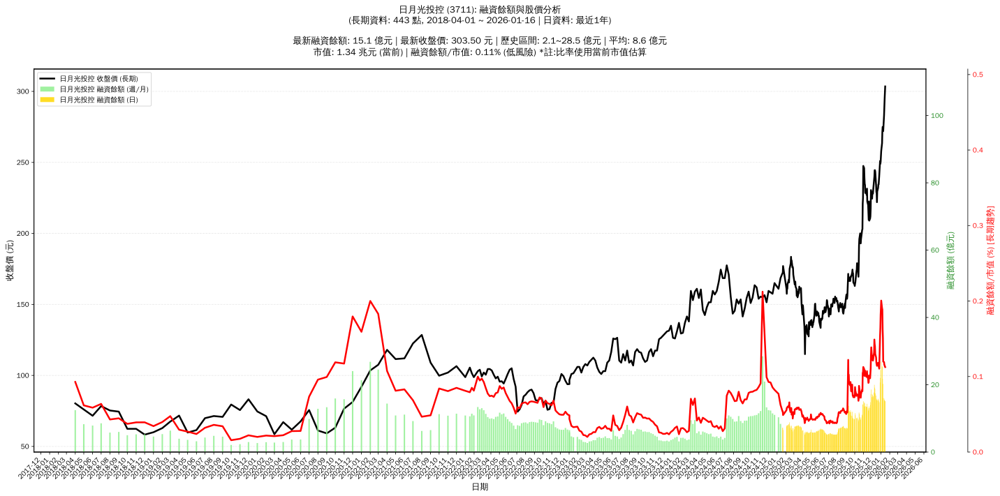

# 📈 日月光投控 (3711) 融資餘額報告

!!! info "基本資訊"
    **🏗️ 名稱**: 日月光投控
    **🪪 代號**: 3711
    **📅 分析期間**: 2025-07-18 ~ 2026-01-09 (共 242 個交易日)
    **🕒 最新資料**: 2026-01-09
    **🕒 更新時間**: 2026-01-12 17:18:17 CST

## 💰 融資餘額現況

| 📊 指標 | 🔢 數值 | 🚦 狀態 |
|:------------:|:----------:|:-------------------:|
| **最新融資餘額** | 16.1 億元 (5,905 張) | - |
| **最新收盤價** | 272.00 元 | - |
| **市值** | 1.20 兆元 | - |
| **融資餘額/市值** | 0.13% | 🟢 低風險 |
| **日變化 (DoD)** | -4.2 億元 (-20.65%) | 📉 |
| **週變化 (WoW)** | -10.8 億元 (-40.24%) | 📉 |
| **月變化 (MoM)** | -3.1 億元 (-16.11%) | 📉 |

---

## 📊 歷史統計

| 📊 指標 | 🔢 數值 |
|:------------:|:----------:|
| **歷史最高** | 26.9 億元 |
| **歷史最低** | 5.1 億元 |
| **平均值** | 9.2 億元 |
| **標準差** | 4.5 億元 |
| **當前相對位置** | 50.4% |

---

## 📈 融資餘額趨勢圖

{: style="max-width: 100%; height: auto;"}

---

## 📋 詳細歷史記錄 (最近30日)

<table class="sortable-table">
<thead>
<tr>
<th markdown="span">📅 日期</th>
<th markdown="span">💸 收盤價(元)</th>
<th markdown="span">📊 漲跌(元)</th>
<th markdown="span">📈 漲跌(%)</th>
<th markdown="span">📦 融資餘額(億元)</th>
<th markdown="span">📦 融資餘額(張)</th>
<th markdown="span">↕️ 融資增減(張)</th>
<th markdown="span">📊 融券餘額(張)</th>
<th markdown="span">⚖️ 券資比(%)</th>
</tr>
</thead>
<tbody>
<tr>
<td>2026-01-09</td>
<td>272.00</td>
<td>🔻 -1.50</td>
<td>-0.55%</td>
<td>16.1</td>
<td>5,905</td>
<td>📉 -1,496</td>
<td>560</td>
<td>9.48%</td>
</tr>
<tr>
<td>2026-01-08</td>
<td>273.50</td>
<td>🔻 -1.50</td>
<td>-0.55%</td>
<td>20.2</td>
<td>7,401</td>
<td>📉 -512</td>
<td>571</td>
<td>7.72%</td>
</tr>
<tr>
<td>2026-01-07</td>
<td>275.00</td>
<td>🔺 +3.50</td>
<td>+1.29%</td>
<td>21.8</td>
<td>7,913</td>
<td>📉 -1,404</td>
<td>578</td>
<td>7.30%</td>
</tr>
<tr>
<td>2026-01-06</td>
<td>271.50</td>
<td>🔺 +8.00</td>
<td>+3.04%</td>
<td>25.3</td>
<td>9,317</td>
<td>📉 -374</td>
<td>586</td>
<td>6.29%</td>
</tr>
<tr>
<td>2026-01-05</td>
<td>263.50</td>
<td>🔺 +5.50</td>
<td>+2.13%</td>
<td>25.5</td>
<td>9,691</td>
<td>📉 -727</td>
<td>519</td>
<td>5.36%</td>
</tr>
<tr>
<td>2026-01-02</td>
<td>258.00</td>
<td>🔺 +7.50</td>
<td>+2.99%</td>
<td>26.9</td>
<td>10,418</td>
<td>📈 +674</td>
<td>523</td>
<td>5.02%</td>
</tr>
<tr>
<td>2025-12-31</td>
<td>250.50</td>
<td>🔺 +1.50</td>
<td>+0.60%</td>
<td>24.4</td>
<td>9,744</td>
<td>📈 +890</td>
<td>513</td>
<td>5.26%</td>
</tr>
<tr>
<td>2025-12-30</td>
<td>249.00</td>
<td>🔻 -2.00</td>
<td>-0.80%</td>
<td>22.0</td>
<td>8,854</td>
<td>📈 +614</td>
<td>500</td>
<td>5.65%</td>
</tr>
<tr>
<td>2025-12-29</td>
<td>251.00</td>
<td>🔺 +10.50</td>
<td>+4.37%</td>
<td>20.7</td>
<td>8,240</td>
<td>📈 +2,086</td>
<td>500</td>
<td>6.07%</td>
</tr>
<tr>
<td>2025-12-26</td>
<td>240.50</td>
<td>🔺 +6.00</td>
<td>+2.56%</td>
<td>14.8</td>
<td>6,154</td>
<td>📉 -351</td>
<td>455</td>
<td>7.39%</td>
</tr>
<tr>
<td>2025-12-24</td>
<td>234.50</td>
<td>➖ +0.00</td>
<td>+0.00%</td>
<td>15.3</td>
<td>6,505</td>
<td>📉 -132</td>
<td>469</td>
<td>7.21%</td>
</tr>
<tr>
<td>2025-12-23</td>
<td>234.50</td>
<td>🔺 +2.50</td>
<td>+1.08%</td>
<td>15.6</td>
<td>6,637</td>
<td>📉 -189</td>
<td>473</td>
<td>7.13%</td>
</tr>
<tr>
<td>2025-12-22</td>
<td>232.00</td>
<td>🔺 +2.50</td>
<td>+1.09%</td>
<td>15.8</td>
<td>6,826</td>
<td>📈 +132</td>
<td>451</td>
<td>6.61%</td>
</tr>
<tr>
<td>2025-12-19</td>
<td>229.50</td>
<td>🔺 +7.50</td>
<td>+3.38%</td>
<td>15.4</td>
<td>6,694</td>
<td>📉 -198</td>
<td>456</td>
<td>6.81%</td>
</tr>
<tr>
<td>2025-12-18</td>
<td>222.00</td>
<td>🔻 -6.50</td>
<td>-2.84%</td>
<td>15.3</td>
<td>6,892</td>
<td>📈 +68</td>
<td>452</td>
<td>6.56%</td>
</tr>
<tr>
<td>2025-12-17</td>
<td>228.50</td>
<td>🔻 -0.50</td>
<td>-0.22%</td>
<td>15.6</td>
<td>6,824</td>
<td>📉 -102</td>
<td>437</td>
<td>6.40%</td>
</tr>
<tr>
<td>2025-12-16</td>
<td>229.00</td>
<td>🔻 -5.00</td>
<td>-2.14%</td>
<td>15.9</td>
<td>6,926</td>
<td>📉 -254</td>
<td>514</td>
<td>7.42%</td>
</tr>
<tr>
<td>2025-12-15</td>
<td>234.00</td>
<td>🔻 -9.50</td>
<td>-3.90%</td>
<td>16.8</td>
<td>7,180</td>
<td>📈 +26</td>
<td>508</td>
<td>7.08%</td>
</tr>
<tr>
<td>2025-12-12</td>
<td>243.50</td>
<td>🔻 -1.00</td>
<td>-0.41%</td>
<td>17.4</td>
<td>7,154</td>
<td>📉 -526</td>
<td>523</td>
<td>7.31%</td>
</tr>
<tr>
<td>2025-12-11</td>
<td>244.50</td>
<td>➖ +0.00</td>
<td>+0.00%</td>
<td>18.8</td>
<td>7,680</td>
<td>📉 -151</td>
<td>563</td>
<td>7.33%</td>
</tr>
<tr>
<td>2025-12-10</td>
<td>244.50</td>
<td>🔺 +4.50</td>
<td>+1.88%</td>
<td>19.1</td>
<td>7,831</td>
<td>📉 -487</td>
<td>539</td>
<td>6.88%</td>
</tr>
<tr>
<td>2025-12-09</td>
<td>240.00</td>
<td>🔺 +2.50</td>
<td>+1.05%</td>
<td>20.0</td>
<td>8,318</td>
<td>📈 +871</td>
<td>511</td>
<td>6.14%</td>
</tr>
<tr>
<td>2025-12-08</td>
<td>237.50</td>
<td>🔺 +6.50</td>
<td>+2.81%</td>
<td>17.7</td>
<td>7,447</td>
<td>📈 +275</td>
<td>495</td>
<td>6.65%</td>
</tr>
<tr>
<td>2025-12-05</td>
<td>231.00</td>
<td>🔺 +3.00</td>
<td>+1.32%</td>
<td>16.6</td>
<td>7,172</td>
<td>📈 +53</td>
<td>470</td>
<td>6.55%</td>
</tr>
<tr>
<td>2025-12-04</td>
<td>228.00</td>
<td>🔻 -1.00</td>
<td>-0.44%</td>
<td>16.2</td>
<td>7,119</td>
<td>📉 -244</td>
<td>472</td>
<td>6.63%</td>
</tr>
<tr>
<td>2025-12-03</td>
<td>229.00</td>
<td>🔺 +0.50</td>
<td>+0.22%</td>
<td>16.9</td>
<td>7,363</td>
<td>📉 -134</td>
<td>500</td>
<td>6.79%</td>
</tr>
<tr>
<td>2025-12-02</td>
<td>228.50</td>
<td>🔺 +4.00</td>
<td>+1.78%</td>
<td>17.1</td>
<td>7,497</td>
<td>📈 +220</td>
<td>500</td>
<td>6.67%</td>
</tr>
<tr>
<td>2025-12-01</td>
<td>224.50</td>
<td>🔻 -5.00</td>
<td>-2.18%</td>
<td>16.3</td>
<td>7,277</td>
<td>📉 -819</td>
<td>493</td>
<td>6.77%</td>
</tr>
<tr>
<td>2025-11-28</td>
<td>229.50</td>
<td>🔻 -1.00</td>
<td>-0.43%</td>
<td>18.6</td>
<td>8,096</td>
<td>📈 +624</td>
<td>498</td>
<td>6.15%</td>
</tr>
<tr>
<td>2025-11-27</td>
<td>230.50</td>
<td>🔺 +13.00</td>
<td>+5.98%</td>
<td>17.2</td>
<td>7,472</td>
<td>📈 +655</td>
<td>560</td>
<td>7.49%</td>
</tr>
</tbody>
</table>

---

## ℹ️ 資料來源與方法

!!! note "資料來源說明"
    - **主要來源**: `raw_margin_daily.csv` (Type 13: ShowMarginChart)
    - **資料頻率**: 每日更新
    - **資料範圍**: 近1年交易日資料

!!! info "報告元資訊"
    - **報告產生時間**: 2026-01-12 17:18:17
    - **分析期間**: 242 個交易日
    - **資料來源**: Stage 1 Raw Margin Daily Data

---

:material-information-outline: **本報告僅供參考，投資決策請審慎評估**

