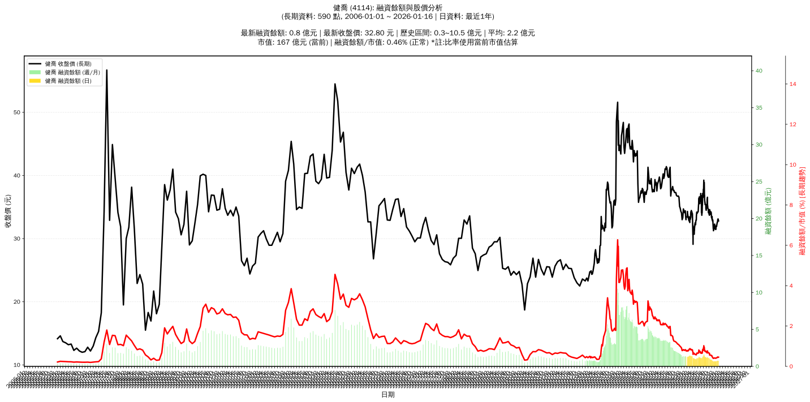

# :chart_with_upwards_trend: 健喬 (4114) 融資餘額報告

!!! info "基本資訊"
    **:building_construction: 名稱**: 健喬
    **:identification_card: 代號**: 4114
    **:calendar: 分析期間**: 2025-07-18 ~ 2026-01-09 (共 242 個交易日)
    **:clock3: 最新資料**: 2026-01-09
    **🕒 更新時間**: 2026-01-12 13:15:53 CST

## :moneybag: 融資餘額現況

| :chart: 指標 | :1234: 數值 | :traffic_light: 狀態 |
|:------------:|:----------:|:-------------------:|
| **最新融資餘額** | 0.8 億元 (2,282 張) | - |
| **最新收盤價** | 33.10 元 | - |
| **市值** | 169 億元 | - |
| **融資餘額/市值** | 0.45% | 🟡 正常 |
| **日變化 (DoD)** | -0.0 億元 (-0.48%) | 📉 |
| **週變化 (WoW)** | +0.0 億元 (+0.35%) | 📈 |
| **月變化 (MoM)** | +0.1 億元 (+10.68%) | 📈 |

---

## :bar_chart: 歷史統計

| :chart: 指標 | :1234: 數值 |
|:------------:|:----------:|
| **歷史最高** | 1.7 億元 |
| **歷史最低** | 0.7 億元 |
| **平均值** | 1.1 億元 |
| **標準差** | 0.2 億元 |
| **當前相對位置** | 8.8% |

---

## :chart_with_upwards_trend: 融資餘額趨勢圖

    

---

## :clipboard: 詳細歷史記錄 (最近30日)

<table class="sortable-table">
<thead>
<tr>
<th markdown="span">:calendar: 日期</th>
<th markdown="span">:money_with_wings: 收盤價(元)</th>
<th markdown="span">:chart: 漲跌(元)</th>
<th markdown="span">:chart_with_upwards_trend: 漲跌(%)</th>
<th markdown="span">:package: 融資餘額(億元)</th>
<th markdown="span">:package: 融資餘額(張)</th>
<th markdown="span">:arrow_up_down: 融資增減(張)</th>
<th markdown="span">:chart: 融券餘額(張)</th>
<th markdown="span">:balance_scale: 券資比(%)</th>
</tr>
</thead>
<tbody>
<tr>
<td>2026-01-09</td>
<td>33.10</td>
<td>🔺 +0.10</td>
<td>+0.30%</td>
<td>0.8</td>
<td>2,282</td>
<td>📉 -18</td>
<td>1</td>
<td>0.04%</td>
</tr>
<tr>
<td>2026-01-08</td>
<td>33.00</td>
<td>🔺 +0.05</td>
<td>+0.15%</td>
<td>0.8</td>
<td>2,300</td>
<td>📉 -69</td>
<td>1</td>
<td>0.04%</td>
</tr>
<tr>
<td>2026-01-07</td>
<td>32.95</td>
<td>🔺 +0.10</td>
<td>+0.30%</td>
<td>0.8</td>
<td>2,369</td>
<td>📈 +51</td>
<td>1</td>
<td>0.04%</td>
</tr>
<tr>
<td>2026-01-06</td>
<td>32.85</td>
<td>🔺 +0.25</td>
<td>+0.77%</td>
<td>0.8</td>
<td>2,318</td>
<td>📉 -16</td>
<td>1</td>
<td>0.04%</td>
</tr>
<tr>
<td>2026-01-05</td>
<td>32.60</td>
<td>➖ +0.00</td>
<td>+0.00%</td>
<td>0.8</td>
<td>2,334</td>
<td>📈 +25</td>
<td>1</td>
<td>0.04%</td>
</tr>
<tr>
<td>2026-01-02</td>
<td>32.60</td>
<td>🔺 +0.20</td>
<td>+0.62%</td>
<td>0.8</td>
<td>2,309</td>
<td>📉 -2</td>
<td>1</td>
<td>0.04%</td>
</tr>
<tr>
<td>2025-12-31</td>
<td>32.40</td>
<td>🔺 +0.10</td>
<td>+0.31%</td>
<td>0.7</td>
<td>2,311</td>
<td>📈 +37</td>
<td>1</td>
<td>0.04%</td>
</tr>
<tr>
<td>2025-12-30</td>
<td>32.30</td>
<td>➖ +0.00</td>
<td>+0.00%</td>
<td>0.7</td>
<td>2,274</td>
<td>📈 +72</td>
<td>1</td>
<td>0.04%</td>
</tr>
<tr>
<td>2025-12-29</td>
<td>32.30</td>
<td>🔺 +0.35</td>
<td>+1.10%</td>
<td>0.7</td>
<td>2,202</td>
<td>📈 +3</td>
<td>1</td>
<td>0.05%</td>
</tr>
<tr>
<td>2025-12-26</td>
<td>31.95</td>
<td>🔺 +0.05</td>
<td>+0.16%</td>
<td>0.7</td>
<td>2,199</td>
<td>📉 -3</td>
<td>3</td>
<td>0.14%</td>
</tr>
<tr>
<td>2025-12-24</td>
<td>31.90</td>
<td>🔻 -0.10</td>
<td>-0.31%</td>
<td>0.7</td>
<td>2,202</td>
<td>📈 +10</td>
<td>3</td>
<td>0.14%</td>
</tr>
<tr>
<td>2025-12-23</td>
<td>32.00</td>
<td>➖ +0.00</td>
<td>+0.00%</td>
<td>0.7</td>
<td>2,192</td>
<td>📈 +19</td>
<td>3</td>
<td>0.14%</td>
</tr>
<tr>
<td>2025-12-22</td>
<td>32.00</td>
<td>🔺 +0.15</td>
<td>+0.47%</td>
<td>0.7</td>
<td>2,173</td>
<td>📈 +4</td>
<td>3</td>
<td>0.14%</td>
</tr>
<tr>
<td>2025-12-19</td>
<td>31.85</td>
<td>🔺 +0.35</td>
<td>+1.11%</td>
<td>0.7</td>
<td>2,169</td>
<td>📈 +15</td>
<td>3</td>
<td>0.14%</td>
</tr>
<tr>
<td>2025-12-18</td>
<td>31.50</td>
<td>🔺 +0.05</td>
<td>+0.16%</td>
<td>0.7</td>
<td>2,154</td>
<td>📉 -6</td>
<td>3</td>
<td>0.14%</td>
</tr>
<tr>
<td>2025-12-17</td>
<td>31.45</td>
<td>➖ +0.00</td>
<td>+0.00%</td>
<td>0.7</td>
<td>2,160</td>
<td>📉 -4</td>
<td>3</td>
<td>0.14%</td>
</tr>
<tr>
<td>2025-12-16</td>
<td>31.45</td>
<td>🔻 -0.05</td>
<td>-0.16%</td>
<td>0.7</td>
<td>2,164</td>
<td>📈 +15</td>
<td>3</td>
<td>0.14%</td>
</tr>
<tr>
<td>2025-12-15</td>
<td>31.50</td>
<td>➖ +0.00</td>
<td>+0.00%</td>
<td>0.7</td>
<td>2,149</td>
<td>📈 +1</td>
<td>3</td>
<td>0.14%</td>
</tr>
<tr>
<td>2025-12-12</td>
<td>31.50</td>
<td>➖ +0.00</td>
<td>+0.00%</td>
<td>0.7</td>
<td>2,148</td>
<td>📉 -5</td>
<td>3</td>
<td>0.14%</td>
</tr>
<tr>
<td>2025-12-11</td>
<td>31.50</td>
<td>🔻 -0.05</td>
<td>-0.16%</td>
<td>0.7</td>
<td>2,153</td>
<td>📉 -10</td>
<td>3</td>
<td>0.14%</td>
</tr>
<tr>
<td>2025-12-10</td>
<td>31.55</td>
<td>🔻 -0.10</td>
<td>-0.32%</td>
<td>0.7</td>
<td>2,163</td>
<td>📉 -30</td>
<td>3</td>
<td>0.14%</td>
</tr>
<tr>
<td>2025-12-09</td>
<td>31.65</td>
<td>🔻 -0.40</td>
<td>-1.25%</td>
<td>0.7</td>
<td>2,193</td>
<td>📈 +59</td>
<td>4</td>
<td>0.18%</td>
</tr>
<tr>
<td>2025-12-08</td>
<td>32.05</td>
<td>🔻 -0.15</td>
<td>-0.47%</td>
<td>0.7</td>
<td>2,134</td>
<td>📉 -16</td>
<td>4</td>
<td>0.19%</td>
</tr>
<tr>
<td>2025-12-05</td>
<td>32.20</td>
<td>🔻 -0.10</td>
<td>-0.31%</td>
<td>0.7</td>
<td>2,150</td>
<td>📈 +10</td>
<td>4</td>
<td>0.19%</td>
</tr>
<tr>
<td>2025-12-04</td>
<td>32.30</td>
<td>🔺 +0.05</td>
<td>+0.16%</td>
<td>0.7</td>
<td>2,140</td>
<td>📉 -25</td>
<td>4</td>
<td>0.19%</td>
</tr>
<tr>
<td>2025-12-03</td>
<td>32.25</td>
<td>🔺 +0.10</td>
<td>+0.31%</td>
<td>0.7</td>
<td>2,165</td>
<td>📈 +2</td>
<td>4</td>
<td>0.18%</td>
</tr>
<tr>
<td>2025-12-02</td>
<td>32.15</td>
<td>➖ +0.00</td>
<td>+0.00%</td>
<td>0.7</td>
<td>2,163</td>
<td>📈 +2</td>
<td>4</td>
<td>0.18%</td>
</tr>
<tr>
<td>2025-12-01</td>
<td>32.15</td>
<td>➖ +0.00</td>
<td>+0.00%</td>
<td>0.7</td>
<td>2,161</td>
<td>📈 +4</td>
<td>4</td>
<td>0.19%</td>
</tr>
<tr>
<td>2025-11-28</td>
<td>32.15</td>
<td>🔺 +0.15</td>
<td>+0.47%</td>
<td>0.7</td>
<td>2,157</td>
<td>📈 +6</td>
<td>4</td>
<td>0.19%</td>
</tr>
<tr>
<td>2025-11-27</td>
<td>32.00</td>
<td>🔻 -0.10</td>
<td>-0.31%</td>
<td>0.7</td>
<td>2,151</td>
<td>📈 +7</td>
<td>4</td>
<td>0.19%</td>
</tr>
</tbody>
</table>

---

## :information_source: 資料來源與方法

!!! note "資料來源說明"
    - **主要來源**: `raw_margin_daily.csv` (Type 13: ShowMarginChart)
    - **資料頻率**: 每日更新
    - **資料範圍**: 近1年交易日資料

!!! info "報告元資訊"
    - **報告產生時間**: 2026-01-12 13:15:53
    - **分析期間**: 242 個交易日
    - **資料來源**: Stage 1 Raw Margin Daily Data

---

:material-information-outline: **本報告僅供參考，投資決策請審慎評估**

