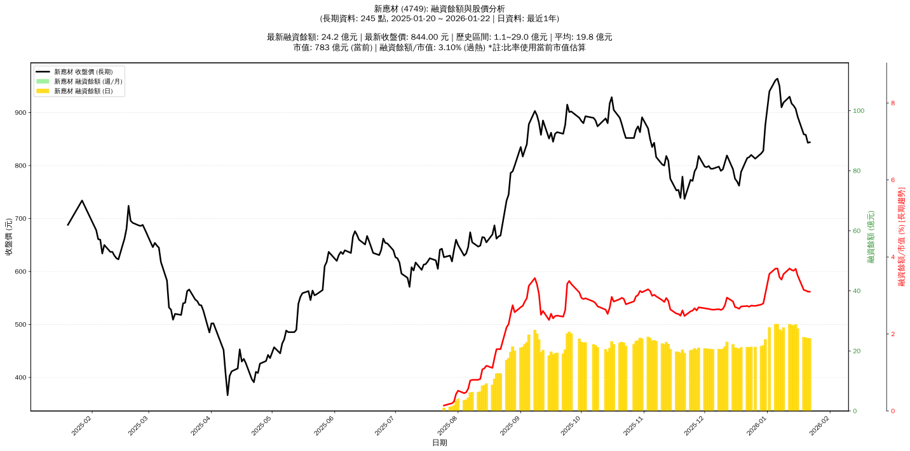

# :chart_with_upwards_trend: 新應材 (4749) 融資餘額報告

!!! info "基本資訊"
    **:building_construction: 名稱**: 新應材
    **:identification_card: 代號**: 4749
    **:calendar: 分析期間**: 2025-07-18 ~ 2026-01-09 (共 238 個交易日)
    **:clock3: 最新資料**: 2026-01-09
    **🕒 更新時間**: 2026-01-11 23:12:11 CST

## :moneybag: 融資餘額現況

| :chart: 指標 | :1234: 數值 | :traffic_light: 狀態 |
|:------------:|:----------:|:-------------------:|
| **最新融資餘額** | 27.8 億元 (3,028 張) | - |
| **最新收盤價** | 919.00 元 | - |
| **市值** | 852 億元 | - |
| **融資餘額/市值** | 3.27% | 🔴 過熱 |
| **日變化 (DoD)** | +1.1 億元 (+4.19%) | 📈 |
| **週變化 (WoW)** | -0.1 億元 (-0.19%) | 📉 |
| **月變化 (MoM)** | +7.1 億元 (+34.04%) | 📈 |

---

## :bar_chart: 歷史統計

| :chart: 指標 | :1234: 數值 |
|:------------:|:----------:|
| **歷史最高** | 29.0 億元 |
| **歷史最低** | 1.1 億元 |
| **平均值** | 19.3 億元 |
| **標準差** | 6.7 億元 |
| **當前相對位置** | 95.9% |

---

## :chart_with_upwards_trend: 融資餘額趨勢圖

{: style="max-width: 100%; height: auto;"}

---

## :clipboard: 詳細歷史記錄 (最近30日)

<table class="sortable-table">
<thead>
<tr>
<th>:calendar: 日期</th>
<th>:money_with_wings: 收盤價(元)</th>
<th>:chart: 漲跌(元)</th>
<th>:chart_with_upwards_trend: 漲跌(%)</th>
<th>:package: 融資餘額(億元)</th>
<th>:package: 融資餘額(張)</th>
<th>:arrow_up_down: 融資增減(張)</th>
<th>:chart: 融券餘額(張)</th>
<th>:balance_scale: 券資比(%)</th>
</tr>
</thead>
<tbody>
<tr>
<td>2026-01-09</td>
<td>919.00</td>
<td>🔺 +9.00</td>
<td>+0.99%</td>
<td>27.8</td>
<td>3,028</td>
<td>📈 +93</td>
<td>136</td>
<td>4.49%</td>
</tr>
<tr>
<td>2026-01-08</td>
<td>910.00</td>
<td>🔻 -40.00</td>
<td>-4.21%</td>
<td>26.7</td>
<td>2,935</td>
<td>📈 +71</td>
<td>142</td>
<td>4.84%</td>
</tr>
<tr>
<td>2026-01-07</td>
<td>950.00</td>
<td>🔻 -14.00</td>
<td>-1.45%</td>
<td>27.2</td>
<td>2,864</td>
<td>📉 -142</td>
<td>131</td>
<td>4.57%</td>
</tr>
<tr>
<td>2026-01-06</td>
<td>964.00</td>
<td>🔺 +3.00</td>
<td>+0.31%</td>
<td>29.0</td>
<td>3,006</td>
<td>📉 -6</td>
<td>146</td>
<td>4.86%</td>
</tr>
<tr>
<td>2026-01-05</td>
<td>961.00</td>
<td>🔺 +21.00</td>
<td>+2.23%</td>
<td>28.9</td>
<td>3,012</td>
<td>📈 +46</td>
<td>131</td>
<td>4.35%</td>
</tr>
<tr>
<td>2026-01-02</td>
<td>940.00</td>
<td>🔺 +63.00</td>
<td>+7.18%</td>
<td>27.9</td>
<td>2,966</td>
<td>📈 +242</td>
<td>132</td>
<td>4.45%</td>
</tr>
<tr>
<td>2025-12-31</td>
<td>877.00</td>
<td>🔺 +49.00</td>
<td>+5.92%</td>
<td>23.9</td>
<td>2,724</td>
<td>📈 +82</td>
<td>109</td>
<td>4.00%</td>
</tr>
<tr>
<td>2025-12-30</td>
<td>828.00</td>
<td>🔺 +5.00</td>
<td>+0.61%</td>
<td>21.9</td>
<td>2,642</td>
<td>📈 +12</td>
<td>91</td>
<td>3.44%</td>
</tr>
<tr>
<td>2025-12-29</td>
<td>823.00</td>
<td>🔺 +10.00</td>
<td>+1.23%</td>
<td>21.6</td>
<td>2,630</td>
<td>📈 +2</td>
<td>96</td>
<td>3.65%</td>
</tr>
<tr>
<td>2025-12-26</td>
<td>813.00</td>
<td>🔻 -7.00</td>
<td>-0.85%</td>
<td>21.4</td>
<td>2,628</td>
<td>📈 +15</td>
<td>95</td>
<td>3.61%</td>
</tr>
<tr>
<td>2025-12-24</td>
<td>820.00</td>
<td>🔺 +4.00</td>
<td>+0.49%</td>
<td>21.4</td>
<td>2,613</td>
<td>📈 +14</td>
<td>93</td>
<td>3.56%</td>
</tr>
<tr>
<td>2025-12-23</td>
<td>816.00</td>
<td>🔺 +2.00</td>
<td>+0.25%</td>
<td>21.2</td>
<td>2,599</td>
<td>📉 -23</td>
<td>94</td>
<td>3.62%</td>
</tr>
<tr>
<td>2025-12-22</td>
<td>814.00</td>
<td>🔺 +26.00</td>
<td>+3.30%</td>
<td>21.3</td>
<td>2,622</td>
<td>📉 -75</td>
<td>91</td>
<td>3.47%</td>
</tr>
<tr>
<td>2025-12-19</td>
<td>788.00</td>
<td>🔺 +26.00</td>
<td>+3.41%</td>
<td>21.3</td>
<td>2,697</td>
<td>📉 -31</td>
<td>84</td>
<td>3.11%</td>
</tr>
<tr>
<td>2025-12-18</td>
<td>762.00</td>
<td>🔻 -8.00</td>
<td>-1.04%</td>
<td>20.8</td>
<td>2,728</td>
<td>📈 +1</td>
<td>83</td>
<td>3.04%</td>
</tr>
<tr>
<td>2025-12-17</td>
<td>770.00</td>
<td>🔻 -5.00</td>
<td>-0.65%</td>
<td>21.0</td>
<td>2,727</td>
<td>➡️ +0</td>
<td>82</td>
<td>3.01%</td>
</tr>
<tr>
<td>2025-12-16</td>
<td>775.00</td>
<td>🔻 -18.00</td>
<td>-2.27%</td>
<td>21.1</td>
<td>2,727</td>
<td>📉 -81</td>
<td>83</td>
<td>3.04%</td>
</tr>
<tr>
<td>2025-12-15</td>
<td>793.00</td>
<td>🔻 -26.00</td>
<td>-3.17%</td>
<td>22.3</td>
<td>2,808</td>
<td>📉 -7</td>
<td>80</td>
<td>2.85%</td>
</tr>
<tr>
<td>2025-12-12</td>
<td>819.00</td>
<td>🔺 +13.00</td>
<td>+1.61%</td>
<td>23.1</td>
<td>2,815</td>
<td>📈 +147</td>
<td>82</td>
<td>2.91%</td>
</tr>
<tr>
<td>2025-12-11</td>
<td>806.00</td>
<td>🔺 +13.00</td>
<td>+1.64%</td>
<td>21.5</td>
<td>2,668</td>
<td>📈 +50</td>
<td>82</td>
<td>3.07%</td>
</tr>
<tr>
<td>2025-12-10</td>
<td>793.00</td>
<td>🔺 +3.00</td>
<td>+0.38%</td>
<td>20.8</td>
<td>2,618</td>
<td>📈 +17</td>
<td>81</td>
<td>3.09%</td>
</tr>
<tr>
<td>2025-12-09</td>
<td>790.00</td>
<td>🔻 -8.00</td>
<td>-1.00%</td>
<td>20.5</td>
<td>2,601</td>
<td>📈 +7</td>
<td>79</td>
<td>3.04%</td>
</tr>
<tr>
<td>2025-12-08</td>
<td>798.00</td>
<td>🔺 +4.00</td>
<td>+0.50%</td>
<td>20.7</td>
<td>2,594</td>
<td>📈 +1</td>
<td>79</td>
<td>3.05%</td>
</tr>
<tr>
<td>2025-12-05</td>
<td>794.00</td>
<td>➖ +0.00</td>
<td>+0.00%</td>
<td>20.6</td>
<td>2,593</td>
<td>📉 -8</td>
<td>80</td>
<td>3.09%</td>
</tr>
<tr>
<td>2025-12-04</td>
<td>794.00</td>
<td>🔻 -5.00</td>
<td>-0.63%</td>
<td>20.7</td>
<td>2,601</td>
<td>📈 +4</td>
<td>81</td>
<td>3.11%</td>
</tr>
<tr>
<td>2025-12-03</td>
<td>799.00</td>
<td>🔺 +2.00</td>
<td>+0.25%</td>
<td>20.8</td>
<td>2,597</td>
<td>📉 -16</td>
<td>81</td>
<td>3.12%</td>
</tr>
<tr>
<td>2025-12-02</td>
<td>797.00</td>
<td>🔻 -1.00</td>
<td>-0.13%</td>
<td>20.8</td>
<td>2,613</td>
<td>📉 -4</td>
<td>81</td>
<td>3.10%</td>
</tr>
<tr>
<td>2025-12-01</td>
<td>798.00</td>
<td>🔻 -20.00</td>
<td>-2.44%</td>
<td>20.9</td>
<td>2,617</td>
<td>📈 +40</td>
<td>80</td>
<td>3.06%</td>
</tr>
<tr>
<td>2025-11-28</td>
<td>818.00</td>
<td>🔺 +22.00</td>
<td>+2.76%</td>
<td>21.1</td>
<td>2,577</td>
<td>📈 +8</td>
<td>92</td>
<td>3.57%</td>
</tr>
<tr>
<td>2025-11-27</td>
<td>796.00</td>
<td>🔺 +7.00</td>
<td>+0.89%</td>
<td>20.4</td>
<td>2,569</td>
<td>📉 -79</td>
<td>96</td>
<td>3.74%</td>
</tr>
</tbody>
</table>

---

## :information_source: 資料來源與方法

!!! note "資料來源說明"
    - **主要來源**: `raw_margin_daily.csv` (Type 13: ShowMarginChart)
    - **資料頻率**: 每日更新
    - **資料範圍**: 近1年交易日資料

!!! info "報告元資訊"
    - **報告產生時間**: 2026-01-11 23:12:11
    - **分析期間**: 238 個交易日
    - **資料來源**: Stage 1 Raw Margin Daily Data

---

:material-information-outline: **本報告僅供參考，投資決策請審慎評估**

