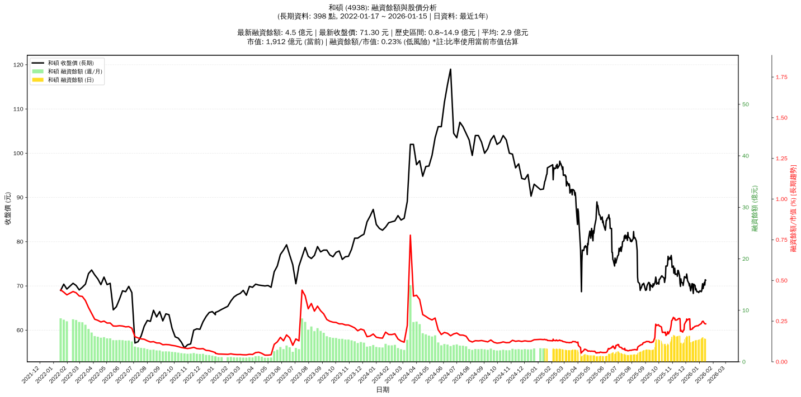

# :chart_with_upwards_trend: 和碩 (4938) 融資餘額報告

!!! info "基本資訊"
    **:building_construction: 名稱**: 和碩
    **:identification_card: 代號**: 4938
    **:calendar: 分析期間**: 2025-07-18 ~ 2026-01-09 (共 242 個交易日)
    **:clock3: 最新資料**: 2026-01-09
    **🕒 更新時間**: 2026-01-12 12:08:11 CST

## :moneybag: 融資餘額現況

| :chart: 指標 | :1234: 數值 | :traffic_light: 狀態 |
|:------------:|:----------:|:-------------------:|
| **最新融資餘額** | 4.8 億元 (6,885 張) | - |
| **最新收盤價** | 69.40 元 | - |
| **市值** | 1,861 億元 | - |
| **融資餘額/市值** | 0.26% | 🟢 低風險 |
| **日變化 (DoD)** | +0.0 億元 (+0.68%) | 📈 |
| **週變化 (WoW)** | +0.4 億元 (+8.70%) | 📈 |
| **月變化 (MoM)** | -0.3 億元 (-5.26%) | 📉 |

---

## :bar_chart: 歷史統計

| :chart: 指標 | :1234: 數值 |
|:------------:|:----------:|
| **歷史最高** | 5.2 億元 |
| **歷史最低** | 1.0 億元 |
| **平均值** | 2.6 億元 |
| **標準差** | 1.3 億元 |
| **當前相對位置** | 89.3% |

---

## :chart_with_upwards_trend: 融資餘額趨勢圖

    

---

## :clipboard: 詳細歷史記錄 (最近30日)

<table class="sortable-table">
<thead>
<tr>
<th>:calendar: 日期</th>
<th>:money_with_wings: 收盤價(元)</th>
<th>:chart: 漲跌(元)</th>
<th>:chart_with_upwards_trend: 漲跌(%)</th>
<th>:package: 融資餘額(億元)</th>
<th>:package: 融資餘額(張)</th>
<th>:arrow_up_down: 融資增減(張)</th>
<th>:chart: 融券餘額(張)</th>
<th>:balance_scale: 券資比(%)</th>
</tr>
</thead>
<tbody>
<tr>
<td>2026-01-09</td>
<td>69.40</td>
<td>🔻 -1.10</td>
<td>-1.56%</td>
<td>4.8</td>
<td>6,885</td>
<td>📈 +153</td>
<td>17</td>
<td>0.25%</td>
</tr>
<tr>
<td>2026-01-08</td>
<td>70.50</td>
<td>🔺 +0.90</td>
<td>+1.29%</td>
<td>4.7</td>
<td>6,732</td>
<td>📉 -41</td>
<td>17</td>
<td>0.25%</td>
</tr>
<tr>
<td>2026-01-07</td>
<td>69.60</td>
<td>🔺 +0.70</td>
<td>+1.02%</td>
<td>4.7</td>
<td>6,773</td>
<td>📈 +108</td>
<td>9</td>
<td>0.13%</td>
</tr>
<tr>
<td>2026-01-06</td>
<td>68.90</td>
<td>🔺 +0.20</td>
<td>+0.29%</td>
<td>4.6</td>
<td>6,665</td>
<td>📈 +124</td>
<td>14</td>
<td>0.21%</td>
</tr>
<tr>
<td>2026-01-05</td>
<td>68.70</td>
<td>🔻 -0.20</td>
<td>-0.29%</td>
<td>4.5</td>
<td>6,541</td>
<td>📈 +161</td>
<td>14</td>
<td>0.21%</td>
</tr>
<tr>
<td>2026-01-02</td>
<td>68.90</td>
<td>🔺 +0.30</td>
<td>+0.44%</td>
<td>4.4</td>
<td>6,380</td>
<td>📈 +58</td>
<td>15</td>
<td>0.24%</td>
</tr>
<tr>
<td>2025-12-31</td>
<td>68.60</td>
<td>🔺 +0.10</td>
<td>+0.15%</td>
<td>4.3</td>
<td>6,322</td>
<td>📈 +75</td>
<td>14</td>
<td>0.22%</td>
</tr>
<tr>
<td>2025-12-30</td>
<td>68.50</td>
<td>🔻 -0.20</td>
<td>-0.29%</td>
<td>4.3</td>
<td>6,247</td>
<td>📈 +73</td>
<td>16</td>
<td>0.26%</td>
</tr>
<tr>
<td>2025-12-29</td>
<td>68.70</td>
<td>➖ +0.00</td>
<td>+0.00%</td>
<td>4.2</td>
<td>6,174</td>
<td>📈 +14</td>
<td>19</td>
<td>0.31%</td>
</tr>
<tr>
<td>2025-12-26</td>
<td>68.70</td>
<td>🔻 -0.70</td>
<td>-1.01%</td>
<td>4.2</td>
<td>6,160</td>
<td>📈 +105</td>
<td>28</td>
<td>0.45%</td>
</tr>
<tr>
<td>2025-12-24</td>
<td>69.40</td>
<td>🔺 +0.30</td>
<td>+0.43%</td>
<td>4.2</td>
<td>6,055</td>
<td>📈 +22</td>
<td>28</td>
<td>0.46%</td>
</tr>
<tr>
<td>2025-12-23</td>
<td>69.10</td>
<td>🔻 -1.00</td>
<td>-1.43%</td>
<td>4.2</td>
<td>6,033</td>
<td>📈 +78</td>
<td>28</td>
<td>0.46%</td>
</tr>
<tr>
<td>2025-12-22</td>
<td>70.10</td>
<td>🔻 -0.30</td>
<td>-0.43%</td>
<td>4.2</td>
<td>5,955</td>
<td>📈 +216</td>
<td>108</td>
<td>1.81%</td>
</tr>
<tr>
<td>2025-12-19</td>
<td>70.40</td>
<td>🔺 +2.10</td>
<td>+3.07%</td>
<td>4.0</td>
<td>5,739</td>
<td>📉 -88</td>
<td>1,022</td>
<td>17.80%</td>
</tr>
<tr>
<td>2025-12-18</td>
<td>68.30</td>
<td>🔻 -0.90</td>
<td>-1.30%</td>
<td>4.0</td>
<td>5,827</td>
<td>📈 +28</td>
<td>25</td>
<td>0.43%</td>
</tr>
<tr>
<td>2025-12-17</td>
<td>69.20</td>
<td>🔻 -1.30</td>
<td>-1.84%</td>
<td>4.0</td>
<td>5,799</td>
<td>📈 +326</td>
<td>15</td>
<td>0.26%</td>
</tr>
<tr>
<td>2025-12-16</td>
<td>70.50</td>
<td>➖ +0.00</td>
<td>+0.00%</td>
<td>3.9</td>
<td>5,473</td>
<td>📈 +17</td>
<td>10</td>
<td>0.18%</td>
</tr>
<tr>
<td>2025-12-15</td>
<td>70.50</td>
<td>🔺 +1.60</td>
<td>+2.32%</td>
<td>3.8</td>
<td>5,456</td>
<td>📉 -57</td>
<td>229</td>
<td>4.20%</td>
</tr>
<tr>
<td>2025-12-12</td>
<td>68.90</td>
<td>🔻 -0.60</td>
<td>-0.86%</td>
<td>3.8</td>
<td>5,513</td>
<td>📈 +87</td>
<td>76</td>
<td>1.38%</td>
</tr>
<tr>
<td>2025-12-11</td>
<td>69.50</td>
<td>🔻 -1.00</td>
<td>-1.42%</td>
<td>3.8</td>
<td>5,426</td>
<td>📉 -1,728</td>
<td>142</td>
<td>2.62%</td>
</tr>
<tr>
<td>2025-12-10</td>
<td>70.50</td>
<td>🔺 +0.50</td>
<td>+0.71%</td>
<td>5.0</td>
<td>7,154</td>
<td>📉 -20</td>
<td>47</td>
<td>0.66%</td>
</tr>
<tr>
<td>2025-12-09</td>
<td>70.00</td>
<td>🔻 -0.60</td>
<td>-0.85%</td>
<td>5.0</td>
<td>7,174</td>
<td>📈 +27</td>
<td>32</td>
<td>0.45%</td>
</tr>
<tr>
<td>2025-12-08</td>
<td>70.60</td>
<td>🔻 -0.60</td>
<td>-0.84%</td>
<td>5.0</td>
<td>7,147</td>
<td>📈 +256</td>
<td>20</td>
<td>0.28%</td>
</tr>
<tr>
<td>2025-12-05</td>
<td>71.20</td>
<td>🔻 -0.80</td>
<td>-1.11%</td>
<td>4.9</td>
<td>6,891</td>
<td>📈 +2</td>
<td>15</td>
<td>0.22%</td>
</tr>
<tr>
<td>2025-12-04</td>
<td>72.00</td>
<td>🔻 -0.70</td>
<td>-0.96%</td>
<td>5.0</td>
<td>6,889</td>
<td>📉 -32</td>
<td>147</td>
<td>2.13%</td>
</tr>
<tr>
<td>2025-12-03</td>
<td>72.70</td>
<td>🔺 +0.90</td>
<td>+1.25%</td>
<td>5.0</td>
<td>6,921</td>
<td>📈 +329</td>
<td>15</td>
<td>0.22%</td>
</tr>
<tr>
<td>2025-12-02</td>
<td>71.80</td>
<td>🔻 -0.10</td>
<td>-0.14%</td>
<td>4.7</td>
<td>6,592</td>
<td>📈 +26</td>
<td>14</td>
<td>0.21%</td>
</tr>
<tr>
<td>2025-12-01</td>
<td>71.90</td>
<td>🔻 -0.20</td>
<td>-0.28%</td>
<td>4.7</td>
<td>6,566</td>
<td>📈 +469</td>
<td>14</td>
<td>0.21%</td>
</tr>
<tr>
<td>2025-11-28</td>
<td>72.10</td>
<td>🔺 +0.60</td>
<td>+0.84%</td>
<td>4.4</td>
<td>6,097</td>
<td>📈 +865</td>
<td>14</td>
<td>0.23%</td>
</tr>
<tr>
<td>2025-11-27</td>
<td>71.50</td>
<td>🔺 +0.70</td>
<td>+0.99%</td>
<td>3.7</td>
<td>5,232</td>
<td>📉 -48</td>
<td>18</td>
<td>0.34%</td>
</tr>
</tbody>
</table>

---

## :information_source: 資料來源與方法

!!! note "資料來源說明"
    - **主要來源**: `raw_margin_daily.csv` (Type 13: ShowMarginChart)
    - **資料頻率**: 每日更新
    - **資料範圍**: 近1年交易日資料

!!! info "報告元資訊"
    - **報告產生時間**: 2026-01-12 12:08:11
    - **分析期間**: 242 個交易日
    - **資料來源**: Stage 1 Raw Margin Daily Data

---

:material-information-outline: **本報告僅供參考，投資決策請審慎評估**

