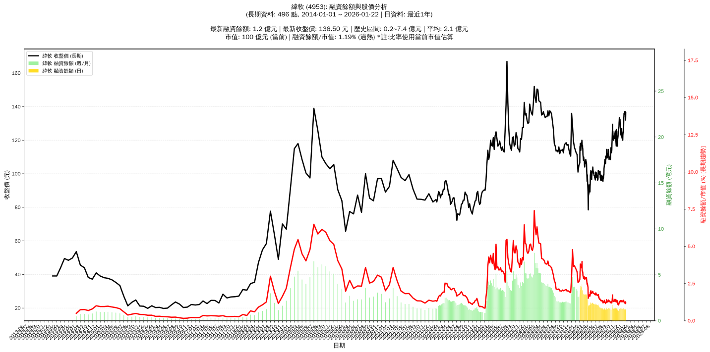

# :chart_with_upwards_trend: 緯軟 (4953) 融資餘額報告

!!! info "基本資訊"
    **:building_construction: 名稱**: 緯軟
    **:identification_card: 代號**: 4953
    **:calendar: 分析期間**: 2025-07-18 ~ 2026-01-09 (共 242 個交易日)
    **:clock3: 最新資料**: 2026-01-09
    **🕒 更新時間**: 2026-01-12 13:14:56 CST

## :moneybag: 融資餘額現況

| :chart: 指標 | :1234: 數值 | :traffic_light: 狀態 |
|:------------:|:----------:|:-------------------:|
| **最新融資餘額** | 1.3 億元 (927 張) | - |
| **最新收盤價** | 136.00 元 | - |
| **市值** | 99 億元 | - |
| **融資餘額/市值** | 1.27% | 🔴 過熱 |
| **日變化 (DoD)** | -0.0 億元 (-0.12%) | 📉 |
| **週變化 (WoW)** | -0.1 億元 (-7.64%) | 📉 |
| **月變化 (MoM)** | -0.1 億元 (-3.89%) | 📉 |

---

## :bar_chart: 歷史統計

| :chart: 指標 | :1234: 數值 |
|:------------:|:----------:|
| **歷史最高** | 4.0 億元 |
| **歷史最低** | 1.1 億元 |
| **平均值** | 1.8 億元 |
| **標準差** | 0.7 億元 |
| **當前相對位置** | 6.8% |

---

## :chart_with_upwards_trend: 融資餘額趨勢圖

    

---

## :clipboard: 詳細歷史記錄 (最近30日)

<table class="sortable-table">
<thead>
<tr>
<th markdown="span">:calendar: 日期</th>
<th markdown="span">:money_with_wings: 收盤價(元)</th>
<th markdown="span">:chart: 漲跌(元)</th>
<th markdown="span">:chart_with_upwards_trend: 漲跌(%)</th>
<th markdown="span">:package: 融資餘額(億元)</th>
<th markdown="span">:package: 融資餘額(張)</th>
<th markdown="span">:arrow_up_down: 融資增減(張)</th>
<th markdown="span">:chart: 融券餘額(張)</th>
<th markdown="span">:balance_scale: 券資比(%)</th>
</tr>
</thead>
<tbody>
<tr>
<td>2026-01-09</td>
<td>136.00</td>
<td>🔺 +2.00</td>
<td>+1.49%</td>
<td>1.3</td>
<td>927</td>
<td>📉 -15</td>
<td>3</td>
<td>0.32%</td>
</tr>
<tr>
<td>2026-01-08</td>
<td>134.00</td>
<td>🔺 +0.50</td>
<td>+0.37%</td>
<td>1.3</td>
<td>942</td>
<td>📉 -39</td>
<td>2</td>
<td>0.21%</td>
</tr>
<tr>
<td>2026-01-07</td>
<td>133.50</td>
<td>🔺 +4.50</td>
<td>+3.49%</td>
<td>1.3</td>
<td>981</td>
<td>📉 -87</td>
<td>2</td>
<td>0.20%</td>
</tr>
<tr>
<td>2026-01-06</td>
<td>129.00</td>
<td>🔺 +4.50</td>
<td>+3.61%</td>
<td>1.4</td>
<td>1,068</td>
<td>📉 -11</td>
<td>0</td>
<td>0.00%</td>
</tr>
<tr>
<td>2026-01-05</td>
<td>124.50</td>
<td>🔻 -0.50</td>
<td>-0.40%</td>
<td>1.3</td>
<td>1,079</td>
<td>📉 -13</td>
<td>0</td>
<td>0.00%</td>
</tr>
<tr>
<td>2026-01-02</td>
<td>125.00</td>
<td>🔺 +2.00</td>
<td>+1.63%</td>
<td>1.4</td>
<td>1,092</td>
<td>📈 +9</td>
<td>0</td>
<td>0.00%</td>
</tr>
<tr>
<td>2025-12-31</td>
<td>123.00</td>
<td>🔺 +3.00</td>
<td>+2.50%</td>
<td>1.3</td>
<td>1,083</td>
<td>📈 +11</td>
<td>0</td>
<td>0.00%</td>
</tr>
<tr>
<td>2025-12-30</td>
<td>120.00</td>
<td>🔻 -1.50</td>
<td>-1.23%</td>
<td>1.3</td>
<td>1,072</td>
<td>📉 -6</td>
<td>1</td>
<td>0.09%</td>
</tr>
<tr>
<td>2025-12-29</td>
<td>121.50</td>
<td>🔺 +0.50</td>
<td>+0.41%</td>
<td>1.3</td>
<td>1,078</td>
<td>📈 +21</td>
<td>1</td>
<td>0.09%</td>
</tr>
<tr>
<td>2025-12-26</td>
<td>121.00</td>
<td>🔻 -0.50</td>
<td>-0.41%</td>
<td>1.3</td>
<td>1,057</td>
<td>📉 -17</td>
<td>1</td>
<td>0.09%</td>
</tr>
<tr>
<td>2025-12-24</td>
<td>121.50</td>
<td>🔻 -1.00</td>
<td>-0.82%</td>
<td>1.3</td>
<td>1,074</td>
<td>📉 -4</td>
<td>2</td>
<td>0.19%</td>
</tr>
<tr>
<td>2025-12-23</td>
<td>122.50</td>
<td>🔻 -4.50</td>
<td>-3.54%</td>
<td>1.3</td>
<td>1,078</td>
<td>📈 +15</td>
<td>2</td>
<td>0.19%</td>
</tr>
<tr>
<td>2025-12-22</td>
<td>127.00</td>
<td>🔺 +2.00</td>
<td>+1.60%</td>
<td>1.4</td>
<td>1,063</td>
<td>📈 +35</td>
<td>1</td>
<td>0.09%</td>
</tr>
<tr>
<td>2025-12-19</td>
<td>125.00</td>
<td>🔺 +2.00</td>
<td>+1.63%</td>
<td>1.3</td>
<td>1,028</td>
<td>📉 -9</td>
<td>1</td>
<td>0.10%</td>
</tr>
<tr>
<td>2025-12-18</td>
<td>123.00</td>
<td>➖ +0.00</td>
<td>+0.00%</td>
<td>1.3</td>
<td>1,037</td>
<td>📉 -34</td>
<td>1</td>
<td>0.10%</td>
</tr>
<tr>
<td>2025-12-17</td>
<td>123.00</td>
<td>🔻 -1.00</td>
<td>-0.81%</td>
<td>1.3</td>
<td>1,071</td>
<td>📉 -18</td>
<td>1</td>
<td>0.09%</td>
</tr>
<tr>
<td>2025-12-16</td>
<td>124.00</td>
<td>🔺 +0.50</td>
<td>+0.40%</td>
<td>1.4</td>
<td>1,089</td>
<td>📈 +1</td>
<td>1</td>
<td>0.09%</td>
</tr>
<tr>
<td>2025-12-15</td>
<td>123.50</td>
<td>🔻 -3.50</td>
<td>-2.76%</td>
<td>1.3</td>
<td>1,088</td>
<td>📈 +30</td>
<td>1</td>
<td>0.09%</td>
</tr>
<tr>
<td>2025-12-12</td>
<td>127.00</td>
<td>🔻 -2.50</td>
<td>-1.93%</td>
<td>1.3</td>
<td>1,058</td>
<td>📈 +11</td>
<td>1</td>
<td>0.09%</td>
</tr>
<tr>
<td>2025-12-11</td>
<td>129.50</td>
<td>🔻 -0.50</td>
<td>-0.38%</td>
<td>1.4</td>
<td>1,047</td>
<td>📈 +38</td>
<td>1</td>
<td>0.10%</td>
</tr>
<tr>
<td>2025-12-10</td>
<td>130.00</td>
<td>🔻 -2.50</td>
<td>-1.89%</td>
<td>1.3</td>
<td>1,009</td>
<td>📈 +30</td>
<td>1</td>
<td>0.10%</td>
</tr>
<tr>
<td>2025-12-09</td>
<td>132.50</td>
<td>🔺 +1.50</td>
<td>+1.15%</td>
<td>1.3</td>
<td>979</td>
<td>📈 +24</td>
<td>1</td>
<td>0.10%</td>
</tr>
<tr>
<td>2025-12-08</td>
<td>131.00</td>
<td>🔻 -0.50</td>
<td>-0.38%</td>
<td>1.3</td>
<td>955</td>
<td>📉 -21</td>
<td>1</td>
<td>0.10%</td>
</tr>
<tr>
<td>2025-12-05</td>
<td>131.50</td>
<td>🔻 -2.00</td>
<td>-1.50%</td>
<td>1.3</td>
<td>976</td>
<td>📈 +5</td>
<td>1</td>
<td>0.10%</td>
</tr>
<tr>
<td>2025-12-04</td>
<td>133.50</td>
<td>🔺 +2.00</td>
<td>+1.52%</td>
<td>1.3</td>
<td>971</td>
<td>📈 +42</td>
<td>1</td>
<td>0.10%</td>
</tr>
<tr>
<td>2025-12-03</td>
<td>131.50</td>
<td>🔺 +1.00</td>
<td>+0.77%</td>
<td>1.2</td>
<td>929</td>
<td>📉 -3</td>
<td>1</td>
<td>0.11%</td>
</tr>
<tr>
<td>2025-12-02</td>
<td>130.50</td>
<td>🔺 +2.50</td>
<td>+1.95%</td>
<td>1.2</td>
<td>932</td>
<td>📈 +50</td>
<td>1</td>
<td>0.11%</td>
</tr>
<tr>
<td>2025-12-01</td>
<td>128.00</td>
<td>🔺 +2.00</td>
<td>+1.59%</td>
<td>1.1</td>
<td>882</td>
<td>📈 +24</td>
<td>1</td>
<td>0.11%</td>
</tr>
<tr>
<td>2025-11-28</td>
<td>126.00</td>
<td>➖ +0.00</td>
<td>+0.00%</td>
<td>1.1</td>
<td>858</td>
<td>📉 -29</td>
<td>1</td>
<td>0.12%</td>
</tr>
<tr>
<td>2025-11-27</td>
<td>126.00</td>
<td>🔺 +1.00</td>
<td>+0.80%</td>
<td>1.1</td>
<td>887</td>
<td>📈 +38</td>
<td>1</td>
<td>0.11%</td>
</tr>
</tbody>
</table>

---

## :information_source: 資料來源與方法

!!! note "資料來源說明"
    - **主要來源**: `raw_margin_daily.csv` (Type 13: ShowMarginChart)
    - **資料頻率**: 每日更新
    - **資料範圍**: 近1年交易日資料

!!! info "報告元資訊"
    - **報告產生時間**: 2026-01-12 13:14:56
    - **分析期間**: 242 個交易日
    - **資料來源**: Stage 1 Raw Margin Daily Data

---

:material-information-outline: **本報告僅供參考，投資決策請審慎評估**

