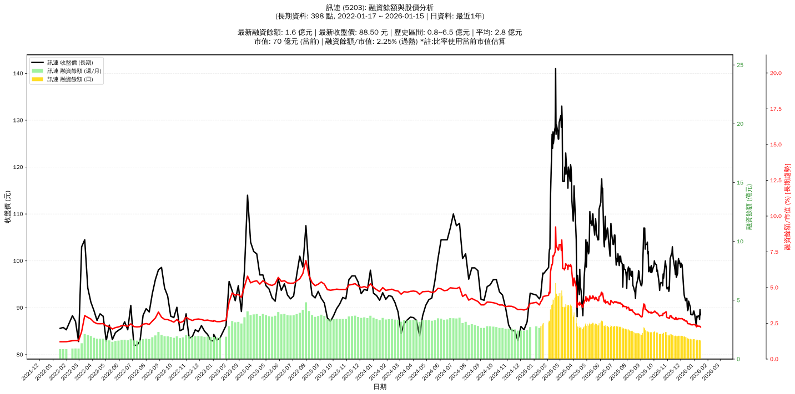

# :chart_with_upwards_trend: 訊連 (5203) 融資餘額報告

!!! info "基本資訊"
    **:building_construction: 名稱**: 訊連
    **:identification_card: 代號**: 5203
    **:calendar: 分析期間**: 2025-07-18 ~ 2026-01-09 (共 242 個交易日)
    **:clock3: 最新資料**: 2026-01-09
    **🕒 更新時間**: 2026-01-12 13:14:03 CST

## :moneybag: 融資餘額現況

| :chart: 指標 | :1234: 數值 | :traffic_light: 狀態 |
|:------------:|:----------:|:-------------------:|
| **最新融資餘額** | 1.6 億元 (1,822 張) | - |
| **最新收盤價** | 88.20 元 | - |
| **市值** | 70 億元 | - |
| **融資餘額/市值** | 2.30% | 🔴 過熱 |
| **日變化 (DoD)** | -0.0 億元 (-1.71%) | 📉 |
| **週變化 (WoW)** | -0.1 億元 (-4.93%) | 📉 |
| **月變化 (MoM)** | -0.3 億元 (-15.88%) | 📉 |

---

## :bar_chart: 歷史統計

| :chart: 指標 | :1234: 數值 |
|:------------:|:----------:|
| **歷史最高** | 6.5 億元 |
| **歷史最低** | 1.6 億元 |
| **平均值** | 2.8 億元 |
| **標準差** | 1.0 億元 |
| **當前相對位置** | 0.6% |

---

## :chart_with_upwards_trend: 融資餘額趨勢圖

    

---

## :clipboard: 詳細歷史記錄 (最近30日)

<table class="sortable-table">
<thead>
<tr>
<th markdown="span">:calendar: 日期</th>
<th markdown="span">:money_with_wings: 收盤價(元)</th>
<th markdown="span">:chart: 漲跌(元)</th>
<th markdown="span">:chart_with_upwards_trend: 漲跌(%)</th>
<th markdown="span">:package: 融資餘額(億元)</th>
<th markdown="span">:package: 融資餘額(張)</th>
<th markdown="span">:arrow_up_down: 融資增減(張)</th>
<th markdown="span">:chart: 融券餘額(張)</th>
<th markdown="span">:balance_scale: 券資比(%)</th>
</tr>
</thead>
<tbody>
<tr>
<td>2026-01-09</td>
<td>88.20</td>
<td>🔺 +0.20</td>
<td>+0.23%</td>
<td>1.6</td>
<td>1,822</td>
<td>📉 -36</td>
<td>0</td>
<td>0.00%</td>
</tr>
<tr>
<td>2026-01-08</td>
<td>88.00</td>
<td>🔻 -0.20</td>
<td>-0.23%</td>
<td>1.6</td>
<td>1,858</td>
<td>📉 -32</td>
<td>0</td>
<td>0.00%</td>
</tr>
<tr>
<td>2026-01-07</td>
<td>88.20</td>
<td>🔺 +1.20</td>
<td>+1.38%</td>
<td>1.7</td>
<td>1,890</td>
<td>📈 +77</td>
<td>0</td>
<td>0.00%</td>
</tr>
<tr>
<td>2026-01-06</td>
<td>87.00</td>
<td>🔺 +0.50</td>
<td>+0.58%</td>
<td>1.6</td>
<td>1,813</td>
<td>📉 -61</td>
<td>0</td>
<td>0.00%</td>
</tr>
<tr>
<td>2026-01-05</td>
<td>86.50</td>
<td>🔻 -2.00</td>
<td>-2.26%</td>
<td>1.6</td>
<td>1,874</td>
<td>📉 -36</td>
<td>0</td>
<td>0.00%</td>
</tr>
<tr>
<td>2026-01-02</td>
<td>88.50</td>
<td>🔻 -0.80</td>
<td>-0.90%</td>
<td>1.7</td>
<td>1,910</td>
<td>📈 +15</td>
<td>0</td>
<td>0.00%</td>
</tr>
<tr>
<td>2025-12-31</td>
<td>89.30</td>
<td>🔺 +0.10</td>
<td>+0.11%</td>
<td>1.7</td>
<td>1,895</td>
<td>➡️ +0</td>
<td>0</td>
<td>0.00%</td>
</tr>
<tr>
<td>2025-12-30</td>
<td>89.20</td>
<td>🔺 +0.70</td>
<td>+0.79%</td>
<td>1.7</td>
<td>1,895</td>
<td>➡️ +0</td>
<td>0</td>
<td>0.00%</td>
</tr>
<tr>
<td>2025-12-29</td>
<td>88.50</td>
<td>➖ +0.00</td>
<td>+0.00%</td>
<td>1.7</td>
<td>1,895</td>
<td>📉 -1</td>
<td>0</td>
<td>0.00%</td>
</tr>
<tr>
<td>2025-12-26</td>
<td>88.50</td>
<td>🔻 -0.10</td>
<td>-0.11%</td>
<td>1.7</td>
<td>1,896</td>
<td>📉 -2</td>
<td>0</td>
<td>0.00%</td>
</tr>
<tr>
<td>2025-12-24</td>
<td>88.60</td>
<td>🔻 -1.50</td>
<td>-1.66%</td>
<td>1.7</td>
<td>1,898</td>
<td>📉 -6</td>
<td>0</td>
<td>0.00%</td>
</tr>
<tr>
<td>2025-12-23</td>
<td>90.10</td>
<td>🔻 -0.30</td>
<td>-0.33%</td>
<td>1.7</td>
<td>1,904</td>
<td>📈 +5</td>
<td>0</td>
<td>0.00%</td>
</tr>
<tr>
<td>2025-12-22</td>
<td>90.40</td>
<td>🔻 -1.00</td>
<td>-1.09%</td>
<td>1.7</td>
<td>1,899</td>
<td>📈 +3</td>
<td>0</td>
<td>0.00%</td>
</tr>
<tr>
<td>2025-12-19</td>
<td>91.40</td>
<td>🔺 +1.70</td>
<td>+1.90%</td>
<td>1.7</td>
<td>1,896</td>
<td>📉 -28</td>
<td>0</td>
<td>0.00%</td>
</tr>
<tr>
<td>2025-12-18</td>
<td>89.70</td>
<td>🔺 +0.30</td>
<td>+0.34%</td>
<td>1.7</td>
<td>1,924</td>
<td>📉 -22</td>
<td>0</td>
<td>0.00%</td>
</tr>
<tr>
<td>2025-12-17</td>
<td>89.40</td>
<td>🔻 -0.80</td>
<td>-0.89%</td>
<td>1.7</td>
<td>1,946</td>
<td>📉 -36</td>
<td>0</td>
<td>0.00%</td>
</tr>
<tr>
<td>2025-12-16</td>
<td>90.20</td>
<td>🔻 -1.80</td>
<td>-1.96%</td>
<td>1.8</td>
<td>1,982</td>
<td>📉 -41</td>
<td>2</td>
<td>0.10%</td>
</tr>
<tr>
<td>2025-12-15</td>
<td>92.00</td>
<td>🔺 +0.50</td>
<td>+0.55%</td>
<td>1.9</td>
<td>2,023</td>
<td>📉 -12</td>
<td>2</td>
<td>0.10%</td>
</tr>
<tr>
<td>2025-12-12</td>
<td>91.50</td>
<td>🔻 -0.50</td>
<td>-0.54%</td>
<td>1.9</td>
<td>2,035</td>
<td>📈 +4</td>
<td>3</td>
<td>0.15%</td>
</tr>
<tr>
<td>2025-12-11</td>
<td>92.00</td>
<td>🔻 -0.20</td>
<td>-0.22%</td>
<td>1.9</td>
<td>2,031</td>
<td>📉 -41</td>
<td>2</td>
<td>0.10%</td>
</tr>
<tr>
<td>2025-12-10</td>
<td>92.20</td>
<td>🔻 -0.50</td>
<td>-0.54%</td>
<td>1.9</td>
<td>2,072</td>
<td>📉 -7</td>
<td>2</td>
<td>0.10%</td>
</tr>
<tr>
<td>2025-12-09</td>
<td>92.70</td>
<td>🔻 -1.00</td>
<td>-1.07%</td>
<td>1.9</td>
<td>2,079</td>
<td>📈 +40</td>
<td>2</td>
<td>0.10%</td>
</tr>
<tr>
<td>2025-12-08</td>
<td>93.70</td>
<td>🔻 -4.50</td>
<td>-4.58%</td>
<td>1.9</td>
<td>2,039</td>
<td>📈 +31</td>
<td>0</td>
<td>0.00%</td>
</tr>
<tr>
<td>2025-12-05</td>
<td>98.20</td>
<td>🔻 -1.00</td>
<td>-1.01%</td>
<td>2.0</td>
<td>2,008</td>
<td>📈 +19</td>
<td>0</td>
<td>0.00%</td>
</tr>
<tr>
<td>2025-12-04</td>
<td>99.20</td>
<td>🔺 +0.20</td>
<td>+0.20%</td>
<td>2.0</td>
<td>1,989</td>
<td>📉 -6</td>
<td>1</td>
<td>0.05%</td>
</tr>
<tr>
<td>2025-12-03</td>
<td>99.00</td>
<td>🔻 -0.50</td>
<td>-0.50%</td>
<td>2.0</td>
<td>1,995</td>
<td>➡️ +0</td>
<td>1</td>
<td>0.05%</td>
</tr>
<tr>
<td>2025-12-02</td>
<td>99.50</td>
<td>🔺 +0.90</td>
<td>+0.91%</td>
<td>2.0</td>
<td>1,995</td>
<td>📉 -6</td>
<td>1</td>
<td>0.05%</td>
</tr>
<tr>
<td>2025-12-01</td>
<td>98.60</td>
<td>🔻 -1.40</td>
<td>-1.40%</td>
<td>2.0</td>
<td>2,001</td>
<td>📈 +17</td>
<td>0</td>
<td>0.00%</td>
</tr>
<tr>
<td>2025-11-28</td>
<td>100.00</td>
<td>🔺 +0.50</td>
<td>+0.50%</td>
<td>2.0</td>
<td>1,984</td>
<td>📈 +5</td>
<td>0</td>
<td>0.00%</td>
</tr>
<tr>
<td>2025-11-27</td>
<td>99.50</td>
<td>🔻 -1.00</td>
<td>-1.00%</td>
<td>2.0</td>
<td>1,979</td>
<td>➡️ +0</td>
<td>0</td>
<td>0.00%</td>
</tr>
</tbody>
</table>

---

## :information_source: 資料來源與方法

!!! note "資料來源說明"
    - **主要來源**: `raw_margin_daily.csv` (Type 13: ShowMarginChart)
    - **資料頻率**: 每日更新
    - **資料範圍**: 近1年交易日資料

!!! info "報告元資訊"
    - **報告產生時間**: 2026-01-12 13:14:03
    - **分析期間**: 242 個交易日
    - **資料來源**: Stage 1 Raw Margin Daily Data

---

:material-information-outline: **本報告僅供參考，投資決策請審慎評估**

