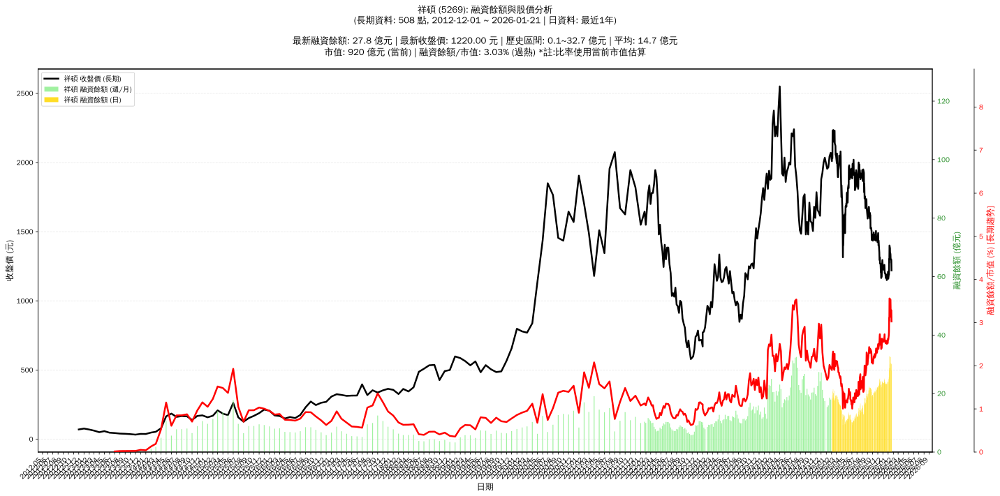

# :chart_with_upwards_trend: 祥碩 (5269) 融資餘額報告

!!! info "基本資訊"
    **:building_construction: 名稱**: 祥碩
    **:identification_card: 代號**: 5269
    **:calendar: 分析期間**: 2025-07-18 ~ 2026-01-09 (共 242 個交易日)
    **:clock3: 最新資料**: 2026-01-09
    **🕒 更新時間**: 2026-01-11 20:28:58 CST

## :moneybag: 融資餘額現況

| :chart: 指標 | :1234: 數值 | :traffic_light: 狀態 |
|:------------:|:----------:|:-------------------:|
| **最新融資餘額** | 32.7 億元 (2,339 張) | - |
| **最新收盤價** | 1400.00 元 | - |
| **市值** | 1,047 億元 | - |
| **融資餘額/市值** | 3.13% | 🔴 過熱 |
| **日變化 (DoD)** | +4.8 億元 (+17.06%) | 📈 |
| **週變化 (WoW)** | +8.8 億元 (+36.90%) | 📈 |
| **月變化 (MoM)** | +8.2 億元 (+33.28%) | 📈 |

---

## :bar_chart: 歷史統計

| :chart: 指標 | :1234: 數值 |
|:------------:|:----------:|
| **歷史最高** | 32.7 億元 |
| **歷史最低** | 9.3 億元 |
| **平均值** | 17.5 億元 |
| **標準差** | 4.8 億元 |
| **當前相對位置** | 100.0% |

---

## :chart_with_upwards_trend: 融資餘額趨勢圖

    

---

## :clipboard: 詳細歷史記錄 (最近30日)

<table class="sortable-table">
<thead>
<tr>
<th>:calendar: 日期</th>
<th>:money_with_wings: 收盤價(元)</th>
<th>:chart: 漲跌(元)</th>
<th>:chart_with_upwards_trend: 漲跌(%)</th>
<th>:package: 融資餘額(億元)</th>
<th>:package: 融資餘額(張)</th>
<th>:arrow_up_down: 融資增減(張)</th>
<th>:chart: 融券餘額(張)</th>
<th>:balance_scale: 券資比(%)</th>
</tr>
</thead>
<tbody>
<tr>
<td>2026-01-09</td>
<td>1400.00</td>
<td>🔺 +125.00</td>
<td>+9.80%</td>
<td>32.7</td>
<td>2,339</td>
<td>📈 +145</td>
<td>31</td>
<td>1.33%</td>
</tr>
<tr>
<td>2026-01-08</td>
<td>1275.00</td>
<td>🔻 -30.00</td>
<td>-2.30%</td>
<td>28.0</td>
<td>2,194</td>
<td>📉 -4</td>
<td>17</td>
<td>0.77%</td>
</tr>
<tr>
<td>2026-01-07</td>
<td>1305.00</td>
<td>🔺 +115.00</td>
<td>+9.66%</td>
<td>28.7</td>
<td>2,198</td>
<td>📈 +46</td>
<td>20</td>
<td>0.91%</td>
</tr>
<tr>
<td>2026-01-06</td>
<td>1190.00</td>
<td>➖ +0.00</td>
<td>+0.00%</td>
<td>25.6</td>
<td>2,152</td>
<td>📈 +57</td>
<td>7</td>
<td>0.33%</td>
</tr>
<tr>
<td>2026-01-05</td>
<td>1190.00</td>
<td>🔺 +30.00</td>
<td>+2.59%</td>
<td>24.9</td>
<td>2,095</td>
<td>📈 +33</td>
<td>6</td>
<td>0.29%</td>
</tr>
<tr>
<td>2026-01-02</td>
<td>1160.00</td>
<td>🔻 -50.00</td>
<td>-4.13%</td>
<td>23.9</td>
<td>2,062</td>
<td>📈 +63</td>
<td>7</td>
<td>0.34%</td>
</tr>
<tr>
<td>2025-12-31</td>
<td>1210.00</td>
<td>🔺 +35.00</td>
<td>+2.98%</td>
<td>24.2</td>
<td>1,999</td>
<td>📈 +18</td>
<td>8</td>
<td>0.40%</td>
</tr>
<tr>
<td>2025-12-30</td>
<td>1175.00</td>
<td>🔺 +5.00</td>
<td>+0.43%</td>
<td>23.3</td>
<td>1,981</td>
<td>➡️ +0</td>
<td>6</td>
<td>0.30%</td>
</tr>
<tr>
<td>2025-12-29</td>
<td>1170.00</td>
<td>🔺 +10.00</td>
<td>+0.86%</td>
<td>23.2</td>
<td>1,981</td>
<td>📉 -72</td>
<td>6</td>
<td>0.30%</td>
</tr>
<tr>
<td>2025-12-26</td>
<td>1160.00</td>
<td>🔺 +10.00</td>
<td>+0.87%</td>
<td>23.8</td>
<td>2,053</td>
<td>📈 +47</td>
<td>5</td>
<td>0.24%</td>
</tr>
<tr>
<td>2025-12-24</td>
<td>1150.00</td>
<td>🔻 -20.00</td>
<td>-1.71%</td>
<td>23.1</td>
<td>2,006</td>
<td>📈 +11</td>
<td>5</td>
<td>0.25%</td>
</tr>
<tr>
<td>2025-12-23</td>
<td>1170.00</td>
<td>🔻 -20.00</td>
<td>-1.68%</td>
<td>23.3</td>
<td>1,995</td>
<td>📈 +27</td>
<td>5</td>
<td>0.25%</td>
</tr>
<tr>
<td>2025-12-22</td>
<td>1190.00</td>
<td>🔺 +5.00</td>
<td>+0.42%</td>
<td>23.4</td>
<td>1,968</td>
<td>📉 -9</td>
<td>5</td>
<td>0.25%</td>
</tr>
<tr>
<td>2025-12-19</td>
<td>1185.00</td>
<td>🔺 +20.00</td>
<td>+1.72%</td>
<td>23.4</td>
<td>1,977</td>
<td>📉 -14</td>
<td>5</td>
<td>0.25%</td>
</tr>
<tr>
<td>2025-12-18</td>
<td>1165.00</td>
<td>🔻 -15.00</td>
<td>-1.27%</td>
<td>23.2</td>
<td>1,991</td>
<td>📈 +23</td>
<td>5</td>
<td>0.25%</td>
</tr>
<tr>
<td>2025-12-17</td>
<td>1180.00</td>
<td>🔻 -10.00</td>
<td>-0.84%</td>
<td>23.2</td>
<td>1,968</td>
<td>📈 +6</td>
<td>6</td>
<td>0.30%</td>
</tr>
<tr>
<td>2025-12-16</td>
<td>1190.00</td>
<td>🔻 -10.00</td>
<td>-0.83%</td>
<td>23.3</td>
<td>1,962</td>
<td>📉 -24</td>
<td>6</td>
<td>0.31%</td>
</tr>
<tr>
<td>2025-12-15</td>
<td>1200.00</td>
<td>➖ +0.00</td>
<td>+0.00%</td>
<td>23.8</td>
<td>1,986</td>
<td>📉 -4</td>
<td>7</td>
<td>0.35%</td>
</tr>
<tr>
<td>2025-12-12</td>
<td>1200.00</td>
<td>🔻 -30.00</td>
<td>-2.44%</td>
<td>23.9</td>
<td>1,990</td>
<td>📉 -51</td>
<td>6</td>
<td>0.30%</td>
</tr>
<tr>
<td>2025-12-11</td>
<td>1230.00</td>
<td>🔻 -30.00</td>
<td>-2.38%</td>
<td>25.1</td>
<td>2,041</td>
<td>📈 +91</td>
<td>7</td>
<td>0.34%</td>
</tr>
<tr>
<td>2025-12-10</td>
<td>1260.00</td>
<td>🔺 +15.00</td>
<td>+1.20%</td>
<td>24.6</td>
<td>1,950</td>
<td>📈 +17</td>
<td>7</td>
<td>0.36%</td>
</tr>
<tr>
<td>2025-12-09</td>
<td>1245.00</td>
<td>🔺 +15.00</td>
<td>+1.22%</td>
<td>24.1</td>
<td>1,933</td>
<td>📈 +14</td>
<td>7</td>
<td>0.36%</td>
</tr>
<tr>
<td>2025-12-08</td>
<td>1230.00</td>
<td>🔺 +5.00</td>
<td>+0.41%</td>
<td>23.6</td>
<td>1,919</td>
<td>📉 -2</td>
<td>7</td>
<td>0.36%</td>
</tr>
<tr>
<td>2025-12-05</td>
<td>1225.00</td>
<td>🔻 -5.00</td>
<td>-0.41%</td>
<td>23.5</td>
<td>1,921</td>
<td>📈 +5</td>
<td>6</td>
<td>0.31%</td>
</tr>
<tr>
<td>2025-12-04</td>
<td>1230.00</td>
<td>🔻 -5.00</td>
<td>-0.40%</td>
<td>23.6</td>
<td>1,916</td>
<td>📈 +7</td>
<td>6</td>
<td>0.31%</td>
</tr>
<tr>
<td>2025-12-03</td>
<td>1235.00</td>
<td>🔻 -5.00</td>
<td>-0.40%</td>
<td>23.6</td>
<td>1,909</td>
<td>📉 -2</td>
<td>6</td>
<td>0.31%</td>
</tr>
<tr>
<td>2025-12-02</td>
<td>1240.00</td>
<td>🔺 +5.00</td>
<td>+0.40%</td>
<td>23.7</td>
<td>1,911</td>
<td>📈 +8</td>
<td>6</td>
<td>0.31%</td>
</tr>
<tr>
<td>2025-12-01</td>
<td>1235.00</td>
<td>🔻 -60.00</td>
<td>-4.63%</td>
<td>23.5</td>
<td>1,903</td>
<td>📈 +45</td>
<td>6</td>
<td>0.32%</td>
</tr>
<tr>
<td>2025-11-28</td>
<td>1295.00</td>
<td>🔺 +25.00</td>
<td>+1.97%</td>
<td>24.1</td>
<td>1,858</td>
<td>📉 -28</td>
<td>8</td>
<td>0.43%</td>
</tr>
<tr>
<td>2025-11-27</td>
<td>1270.00</td>
<td>🔺 +5.00</td>
<td>+0.40%</td>
<td>24.0</td>
<td>1,886</td>
<td>📉 -25</td>
<td>10</td>
<td>0.53%</td>
</tr>
</tbody>
</table>

---

## :information_source: 資料來源與方法

!!! note "資料來源說明"
    - **主要來源**: `raw_margin_daily.csv` (Type 13: ShowMarginChart)
    - **資料頻率**: 每日更新
    - **資料範圍**: 近1年交易日資料

!!! info "報告元資訊"
    - **報告產生時間**: 2026-01-11 20:28:58
    - **分析期間**: 242 個交易日
    - **資料來源**: Stage 1 Raw Margin Daily Data

---

:material-information-outline: **本報告僅供參考，投資決策請審慎評估**

