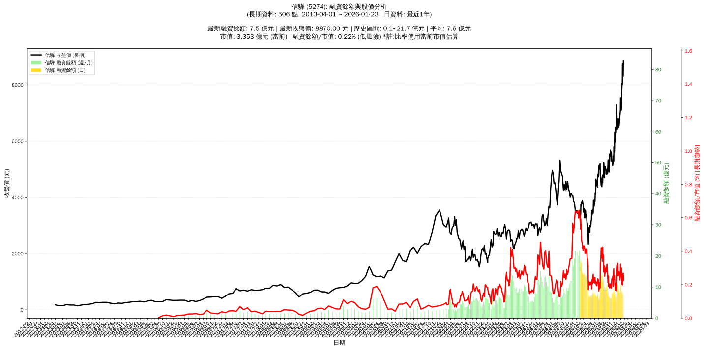

# :chart_with_upwards_trend: 信驊 (5274) 融資餘額報告

!!! info "基本資訊"
    **:building_construction: 名稱**: 信驊
    **:identification_card: 代號**: 5274
    **:calendar: 分析期間**: 2025-07-18 ~ 2026-01-09 (共 242 個交易日)
    **:clock3: 最新資料**: 2026-01-09
    **🕒 更新時間**: 2026-01-12 12:08:13 CST

## :moneybag: 融資餘額現況

| :chart: 指標 | :1234: 數值 | :traffic_light: 狀態 |
|:------------:|:----------:|:-------------------:|
| **最新融資餘額** | 8.7 億元 (113 張) | - |
| **最新收盤價** | 7665.00 元 | - |
| **市值** | 2,898 億元 | - |
| **融資餘額/市值** | 0.30% | 🟢 低風險 |
| **日變化 (DoD)** | +0.2 億元 (+2.00%) | 📈 |
| **週變化 (WoW)** | -1.6 億元 (-15.33%) | 📉 |
| **月變化 (MoM)** | -0.5 億元 (-5.09%) | 📉 |

---

## :bar_chart: 歷史統計

| :chart: 指標 | :1234: 數值 |
|:------------:|:----------:|
| **歷史最高** | 21.7 億元 |
| **歷史最低** | 5.4 億元 |
| **平均值** | 9.8 億元 |
| **標準差** | 3.7 億元 |
| **當前相對位置** | 19.8% |

---

## :chart_with_upwards_trend: 融資餘額趨勢圖

    

---

## :clipboard: 詳細歷史記錄 (最近30日)

<table class="sortable-table">
<thead>
<tr>
<th>:calendar: 日期</th>
<th>:money_with_wings: 收盤價(元)</th>
<th>:chart: 漲跌(元)</th>
<th>:chart_with_upwards_trend: 漲跌(%)</th>
<th>:package: 融資餘額(億元)</th>
<th>:package: 融資餘額(張)</th>
<th>:arrow_up_down: 融資增減(張)</th>
<th>:chart: 融券餘額(張)</th>
<th>:balance_scale: 券資比(%)</th>
</tr>
</thead>
<tbody>
<tr>
<td>2026-01-09</td>
<td>7665.00</td>
<td>🔺 +15.00</td>
<td>+0.20%</td>
<td>8.7</td>
<td>113</td>
<td>📈 +2</td>
<td>13</td>
<td>11.50%</td>
</tr>
<tr>
<td>2026-01-08</td>
<td>7650.00</td>
<td>🔺 +270.00</td>
<td>+3.66%</td>
<td>8.5</td>
<td>111</td>
<td>📈 +3</td>
<td>13</td>
<td>11.70%</td>
</tr>
<tr>
<td>2026-01-07</td>
<td>7380.00</td>
<td>🔺 +180.00</td>
<td>+2.50%</td>
<td>8.0</td>
<td>108</td>
<td>📉 -27</td>
<td>13</td>
<td>12.00%</td>
</tr>
<tr>
<td>2026-01-06</td>
<td>7200.00</td>
<td>🔺 +95.00</td>
<td>+1.34%</td>
<td>9.7</td>
<td>135</td>
<td>📉 -7</td>
<td>13</td>
<td>9.63%</td>
</tr>
<tr>
<td>2026-01-05</td>
<td>7105.00</td>
<td>🔻 -150.00</td>
<td>-2.07%</td>
<td>10.1</td>
<td>142</td>
<td>📈 +1</td>
<td>13</td>
<td>9.15%</td>
</tr>
<tr>
<td>2026-01-02</td>
<td>7255.00</td>
<td>🔻 -5.00</td>
<td>-0.07%</td>
<td>10.2</td>
<td>141</td>
<td>📉 -1</td>
<td>13</td>
<td>9.22%</td>
</tr>
<tr>
<td>2025-12-31</td>
<td>7260.00</td>
<td>🔻 -290.00</td>
<td>-3.84%</td>
<td>10.3</td>
<td>142</td>
<td>📉 -2</td>
<td>13</td>
<td>9.15%</td>
</tr>
<tr>
<td>2025-12-30</td>
<td>7550.00</td>
<td>🔺 +450.00</td>
<td>+6.34%</td>
<td>10.9</td>
<td>144</td>
<td>📈 +11</td>
<td>13</td>
<td>9.03%</td>
</tr>
<tr>
<td>2025-12-29</td>
<td>7100.00</td>
<td>🔺 +170.00</td>
<td>+2.45%</td>
<td>9.4</td>
<td>133</td>
<td>📈 +23</td>
<td>13</td>
<td>9.77%</td>
</tr>
<tr>
<td>2025-12-26</td>
<td>6930.00</td>
<td>🔺 +80.00</td>
<td>+1.17%</td>
<td>7.6</td>
<td>110</td>
<td>📉 -11</td>
<td>13</td>
<td>11.80%</td>
</tr>
<tr>
<td>2025-12-24</td>
<td>6850.00</td>
<td>🔻 -20.00</td>
<td>-0.29%</td>
<td>8.3</td>
<td>121</td>
<td>📈 +3</td>
<td>13</td>
<td>10.70%</td>
</tr>
<tr>
<td>2025-12-23</td>
<td>6870.00</td>
<td>🔺 +70.00</td>
<td>+1.03%</td>
<td>8.1</td>
<td>118</td>
<td>📉 -9</td>
<td>13</td>
<td>11.00%</td>
</tr>
<tr>
<td>2025-12-22</td>
<td>6800.00</td>
<td>🔺 +220.00</td>
<td>+3.34%</td>
<td>8.6</td>
<td>127</td>
<td>📉 -12</td>
<td>13</td>
<td>10.20%</td>
</tr>
<tr>
<td>2025-12-19</td>
<td>6580.00</td>
<td>🔻 -35.00</td>
<td>-0.53%</td>
<td>9.1</td>
<td>139</td>
<td>📈 +4</td>
<td>13</td>
<td>9.35%</td>
</tr>
<tr>
<td>2025-12-18</td>
<td>6615.00</td>
<td>🔺 +115.00</td>
<td>+1.77%</td>
<td>8.9</td>
<td>135</td>
<td>📉 -9</td>
<td>13</td>
<td>9.63%</td>
</tr>
<tr>
<td>2025-12-17</td>
<td>6500.00</td>
<td>🔻 -150.00</td>
<td>-2.26%</td>
<td>9.4</td>
<td>144</td>
<td>📈 +4</td>
<td>13</td>
<td>9.03%</td>
</tr>
<tr>
<td>2025-12-16</td>
<td>6650.00</td>
<td>🔻 -145.00</td>
<td>-2.13%</td>
<td>9.3</td>
<td>140</td>
<td>📈 +14</td>
<td>14</td>
<td>10.00%</td>
</tr>
<tr>
<td>2025-12-15</td>
<td>6795.00</td>
<td>🔺 +70.00</td>
<td>+1.04%</td>
<td>8.6</td>
<td>126</td>
<td>📉 -8</td>
<td>14</td>
<td>11.10%</td>
</tr>
<tr>
<td>2025-12-12</td>
<td>6725.00</td>
<td>🔻 -75.00</td>
<td>-1.10%</td>
<td>9.0</td>
<td>134</td>
<td>📈 +9</td>
<td>14</td>
<td>10.40%</td>
</tr>
<tr>
<td>2025-12-11</td>
<td>6800.00</td>
<td>🔺 +90.00</td>
<td>+1.34%</td>
<td>8.5</td>
<td>125</td>
<td>📉 -11</td>
<td>14</td>
<td>11.20%</td>
</tr>
<tr>
<td>2025-12-10</td>
<td>6710.00</td>
<td>🔺 +20.00</td>
<td>+0.30%</td>
<td>9.1</td>
<td>136</td>
<td>📉 -29</td>
<td>15</td>
<td>11.00%</td>
</tr>
<tr>
<td>2025-12-09</td>
<td>6690.00</td>
<td>🔺 +175.00</td>
<td>+2.69%</td>
<td>11.0</td>
<td>165</td>
<td>📉 -2</td>
<td>15</td>
<td>9.09%</td>
</tr>
<tr>
<td>2025-12-08</td>
<td>6515.00</td>
<td>🔻 -55.00</td>
<td>-0.84%</td>
<td>10.9</td>
<td>167</td>
<td>📈 +10</td>
<td>15</td>
<td>8.98%</td>
</tr>
<tr>
<td>2025-12-05</td>
<td>6570.00</td>
<td>🔺 +130.00</td>
<td>+2.02%</td>
<td>10.3</td>
<td>157</td>
<td>📉 -7</td>
<td>15</td>
<td>9.55%</td>
</tr>
<tr>
<td>2025-12-04</td>
<td>6440.00</td>
<td>🔻 -125.00</td>
<td>-1.90%</td>
<td>10.6</td>
<td>164</td>
<td>📈 +14</td>
<td>15</td>
<td>9.15%</td>
</tr>
<tr>
<td>2025-12-03</td>
<td>6565.00</td>
<td>🔻 -35.00</td>
<td>-0.53%</td>
<td>9.8</td>
<td>150</td>
<td>📈 +11</td>
<td>15</td>
<td>10.00%</td>
</tr>
<tr>
<td>2025-12-02</td>
<td>6600.00</td>
<td>🔻 -315.00</td>
<td>-4.56%</td>
<td>9.2</td>
<td>139</td>
<td>📈 +31</td>
<td>15</td>
<td>10.80%</td>
</tr>
<tr>
<td>2025-12-01</td>
<td>6915.00</td>
<td>🔻 -400.00</td>
<td>-5.47%</td>
<td>7.5</td>
<td>108</td>
<td>📈 +33</td>
<td>15</td>
<td>13.90%</td>
</tr>
<tr>
<td>2025-11-28</td>
<td>7315.00</td>
<td>🔺 +665.00</td>
<td>+10.00%</td>
<td>5.5</td>
<td>75</td>
<td>📉 -22</td>
<td>17</td>
<td>22.70%</td>
</tr>
<tr>
<td>2025-11-27</td>
<td>6650.00</td>
<td>🔺 +30.00</td>
<td>+0.45%</td>
<td>6.5</td>
<td>97</td>
<td>📉 -4</td>
<td>19</td>
<td>19.60%</td>
</tr>
</tbody>
</table>

---

## :information_source: 資料來源與方法

!!! note "資料來源說明"
    - **主要來源**: `raw_margin_daily.csv` (Type 13: ShowMarginChart)
    - **資料頻率**: 每日更新
    - **資料範圍**: 近1年交易日資料

!!! info "報告元資訊"
    - **報告產生時間**: 2026-01-12 12:08:13
    - **分析期間**: 242 個交易日
    - **資料來源**: Stage 1 Raw Margin Daily Data

---

:material-information-outline: **本報告僅供參考，投資決策請審慎評估**

