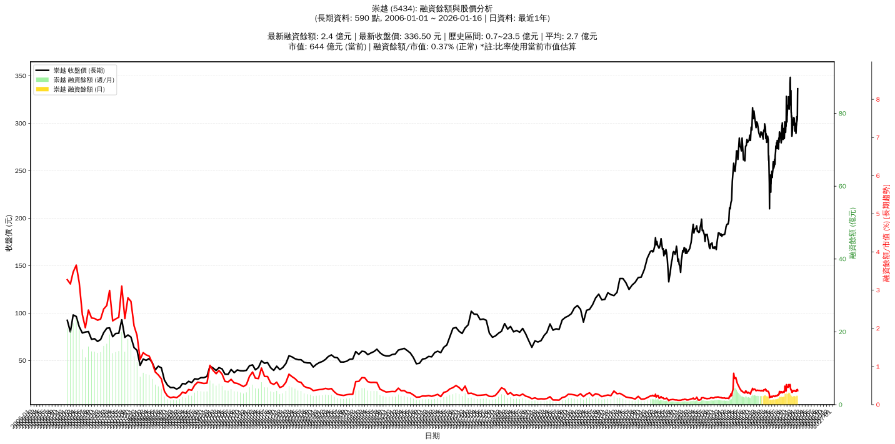

# :chart_with_upwards_trend: 崇越 (5434) 融資餘額報告

!!! info "基本資訊"
    **:building_construction: 名稱**: 崇越
    **:identification_card: 代號**: 5434
    **:calendar: 分析期間**: 2025-07-18 ~ 2026-01-09 (共 242 個交易日)
    **:clock3: 最新資料**: 2026-01-09
    **🕒 更新時間**: 2026-01-11 23:12:54 CST

## :moneybag: 融資餘額現況

| :chart: 指標 | :1234: 數值 | :traffic_light: 狀態 |
|:------------:|:----------:|:-------------------:|
| **最新融資餘額** | 2.4 億元 (807 張) | - |
| **最新收盤價** | 302.50 元 | - |
| **市值** | 579 億元 | - |
| **融資餘額/市值** | 0.42% | 🟡 正常 |
| **日變化 (DoD)** | -0.1 億元 (-2.57%) | 📉 |
| **週變化 (WoW)** | +0.2 億元 (+9.63%) | 📈 |
| **月變化 (MoM)** | +0.1 億元 (+3.51%) | 📈 |

---

## :bar_chart: 歷史統計

| :chart: 指標 | :1234: 數值 |
|:------------:|:----------:|
| **歷史最高** | 3.4 億元 |
| **歷史最低** | 1.2 億元 |
| **平均值** | 2.2 億元 |
| **標準差** | 0.5 億元 |
| **當前相對位置** | 56.7% |

---

## :chart_with_upwards_trend: 融資餘額趨勢圖

{: style="max-width: 100%; height: auto;"}

---

## :clipboard: 詳細歷史記錄 (最近30日)

<table class="sortable-table">
<thead>
<tr>
<th>:calendar: 日期</th>
<th>:money_with_wings: 收盤價(元)</th>
<th>:chart: 漲跌(元)</th>
<th>:chart_with_upwards_trend: 漲跌(%)</th>
<th>:package: 融資餘額(億元)</th>
<th>:package: 融資餘額(張)</th>
<th>:arrow_up_down: 融資增減(張)</th>
<th>:chart: 融券餘額(張)</th>
<th>:balance_scale: 券資比(%)</th>
</tr>
</thead>
<tbody>
<tr>
<td>2026-01-09</td>
<td>302.50</td>
<td>🔺 +1.00</td>
<td>+0.33%</td>
<td>2.4</td>
<td>807</td>
<td>📉 -24</td>
<td>5</td>
<td>0.62%</td>
</tr>
<tr>
<td>2026-01-08</td>
<td>301.50</td>
<td>🔻 -5.50</td>
<td>-1.79%</td>
<td>2.5</td>
<td>831</td>
<td>📈 +9</td>
<td>3</td>
<td>0.36%</td>
</tr>
<tr>
<td>2026-01-07</td>
<td>307.00</td>
<td>🔺 +4.50</td>
<td>+1.49%</td>
<td>2.5</td>
<td>822</td>
<td>📈 +18</td>
<td>3</td>
<td>0.36%</td>
</tr>
<tr>
<td>2026-01-06</td>
<td>302.50</td>
<td>🔺 +3.50</td>
<td>+1.17%</td>
<td>2.4</td>
<td>804</td>
<td>📈 +5</td>
<td>3</td>
<td>0.37%</td>
</tr>
<tr>
<td>2026-01-05</td>
<td>299.00</td>
<td>🔺 +2.50</td>
<td>+0.84%</td>
<td>2.4</td>
<td>799</td>
<td>📈 +48</td>
<td>3</td>
<td>0.38%</td>
</tr>
<tr>
<td>2026-01-02</td>
<td>296.50</td>
<td>🔺 +5.50</td>
<td>+1.89%</td>
<td>2.2</td>
<td>751</td>
<td>📉 -26</td>
<td>3</td>
<td>0.40%</td>
</tr>
<tr>
<td>2025-12-31</td>
<td>291.00</td>
<td>🔺 +1.50</td>
<td>+0.52%</td>
<td>2.3</td>
<td>777</td>
<td>📈 +9</td>
<td>4</td>
<td>0.51%</td>
</tr>
<tr>
<td>2025-12-30</td>
<td>289.50</td>
<td>🔻 -2.50</td>
<td>-0.86%</td>
<td>2.2</td>
<td>768</td>
<td>📉 -4</td>
<td>4</td>
<td>0.52%</td>
</tr>
<tr>
<td>2025-12-29</td>
<td>292.00</td>
<td>➖ +0.00</td>
<td>+0.00%</td>
<td>2.3</td>
<td>772</td>
<td>📈 +11</td>
<td>4</td>
<td>0.52%</td>
</tr>
<tr>
<td>2025-12-26</td>
<td>292.00</td>
<td>🔻 -4.00</td>
<td>-1.35%</td>
<td>2.2</td>
<td>761</td>
<td>📉 -5</td>
<td>17</td>
<td>2.23%</td>
</tr>
<tr>
<td>2025-12-24</td>
<td>296.00</td>
<td>🔻 -1.50</td>
<td>-0.50%</td>
<td>2.3</td>
<td>766</td>
<td>📉 -4</td>
<td>6</td>
<td>0.78%</td>
</tr>
<tr>
<td>2025-12-23</td>
<td>297.50</td>
<td>🔻 -2.50</td>
<td>-0.83%</td>
<td>2.3</td>
<td>770</td>
<td>📈 +4</td>
<td>6</td>
<td>0.78%</td>
</tr>
<tr>
<td>2025-12-22</td>
<td>300.00</td>
<td>🔺 +2.50</td>
<td>+0.84%</td>
<td>2.3</td>
<td>766</td>
<td>📉 -24</td>
<td>12</td>
<td>1.57%</td>
</tr>
<tr>
<td>2025-12-19</td>
<td>297.50</td>
<td>🔺 +5.50</td>
<td>+1.88%</td>
<td>2.4</td>
<td>790</td>
<td>📉 -1</td>
<td>12</td>
<td>1.52%</td>
</tr>
<tr>
<td>2025-12-18</td>
<td>292.00</td>
<td>🔻 -8.50</td>
<td>-2.83%</td>
<td>2.3</td>
<td>791</td>
<td>📈 +7</td>
<td>11</td>
<td>1.39%</td>
</tr>
<tr>
<td>2025-12-17</td>
<td>300.50</td>
<td>🔺 +3.00</td>
<td>+1.01%</td>
<td>2.4</td>
<td>784</td>
<td>📈 +11</td>
<td>10</td>
<td>1.28%</td>
</tr>
<tr>
<td>2025-12-16</td>
<td>297.50</td>
<td>🔻 -2.00</td>
<td>-0.67%</td>
<td>2.3</td>
<td>773</td>
<td>➡️ +0</td>
<td>10</td>
<td>1.29%</td>
</tr>
<tr>
<td>2025-12-15</td>
<td>299.50</td>
<td>🔻 -6.00</td>
<td>-1.96%</td>
<td>2.3</td>
<td>773</td>
<td>📉 -8</td>
<td>10</td>
<td>1.29%</td>
</tr>
<tr>
<td>2025-12-12</td>
<td>305.50</td>
<td>🔺 +2.00</td>
<td>+0.66%</td>
<td>2.4</td>
<td>781</td>
<td>📉 -6</td>
<td>10</td>
<td>1.28%</td>
</tr>
<tr>
<td>2025-12-11</td>
<td>303.50</td>
<td>🔻 -2.00</td>
<td>-0.65%</td>
<td>2.4</td>
<td>787</td>
<td>📈 +15</td>
<td>10</td>
<td>1.27%</td>
</tr>
<tr>
<td>2025-12-10</td>
<td>305.50</td>
<td>🔻 -0.50</td>
<td>-0.16%</td>
<td>2.4</td>
<td>772</td>
<td>📉 -7</td>
<td>12</td>
<td>1.55%</td>
</tr>
<tr>
<td>2025-12-09</td>
<td>306.00</td>
<td>🔺 +0.50</td>
<td>+0.16%</td>
<td>2.4</td>
<td>779</td>
<td>📈 +31</td>
<td>12</td>
<td>1.54%</td>
</tr>
<tr>
<td>2025-12-08</td>
<td>305.50</td>
<td>🔻 -0.50</td>
<td>-0.16%</td>
<td>2.3</td>
<td>748</td>
<td>📈 +6</td>
<td>16</td>
<td>2.14%</td>
</tr>
<tr>
<td>2025-12-05</td>
<td>306.00</td>
<td>🔺 +4.00</td>
<td>+1.32%</td>
<td>2.3</td>
<td>742</td>
<td>📉 -32</td>
<td>15</td>
<td>2.02%</td>
</tr>
<tr>
<td>2025-12-04</td>
<td>302.00</td>
<td>🔻 -2.50</td>
<td>-0.82%</td>
<td>2.3</td>
<td>774</td>
<td>📈 +8</td>
<td>15</td>
<td>1.94%</td>
</tr>
<tr>
<td>2025-12-03</td>
<td>304.50</td>
<td>🔺 +0.50</td>
<td>+0.16%</td>
<td>2.3</td>
<td>766</td>
<td>📈 +7</td>
<td>15</td>
<td>1.96%</td>
</tr>
<tr>
<td>2025-12-02</td>
<td>304.00</td>
<td>🔺 +6.00</td>
<td>+2.01%</td>
<td>2.3</td>
<td>759</td>
<td>📉 -1</td>
<td>11</td>
<td>1.45%</td>
</tr>
<tr>
<td>2025-12-01</td>
<td>298.00</td>
<td>🔻 -4.50</td>
<td>-1.49%</td>
<td>2.3</td>
<td>760</td>
<td>📈 +3</td>
<td>11</td>
<td>1.45%</td>
</tr>
<tr>
<td>2025-11-28</td>
<td>302.50</td>
<td>🔺 +1.50</td>
<td>+0.50%</td>
<td>2.3</td>
<td>757</td>
<td>📈 +12</td>
<td>10</td>
<td>1.32%</td>
</tr>
<tr>
<td>2025-11-27</td>
<td>301.00</td>
<td>🔺 +1.50</td>
<td>+0.50%</td>
<td>2.2</td>
<td>745</td>
<td>📈 +11</td>
<td>10</td>
<td>1.34%</td>
</tr>
</tbody>
</table>

---

## :information_source: 資料來源與方法

!!! note "資料來源說明"
    - **主要來源**: `raw_margin_daily.csv` (Type 13: ShowMarginChart)
    - **資料頻率**: 每日更新
    - **資料範圍**: 近1年交易日資料

!!! info "報告元資訊"
    - **報告產生時間**: 2026-01-11 23:12:54
    - **分析期間**: 242 個交易日
    - **資料來源**: Stage 1 Raw Margin Daily Data

---

:material-information-outline: **本報告僅供參考，投資決策請審慎評估**

