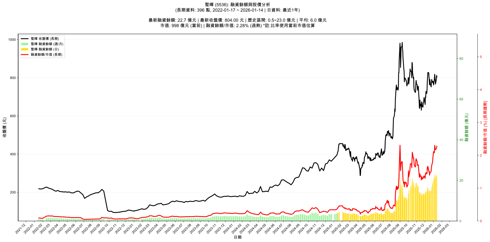

# :chart_with_upwards_trend: 聖暉 (5536) 融資餘額報告

!!! info "基本資訊"
    **:building_construction: 名稱**: 聖暉
    **:identification_card: 代號**: 5536
    **:calendar: 分析期間**: 2025-07-18 ~ 2026-01-09 (共 242 個交易日)
    **:clock3: 最新資料**: 2026-01-09
    **🕒 更新時間**: 2026-01-12 12:08:45 CST

## :moneybag: 融資餘額現況

| :chart: 指標 | :1234: 數值 | :traffic_light: 狀態 |
|:------------:|:----------:|:-------------------:|
| **最新融資餘額** | 21.7 億元 (2,827 張) | - |
| **最新收盤價** | 767.00 元 | - |
| **市值** | 952 億元 | - |
| **融資餘額/市值** | 2.28% | 🔴 過熱 |
| **日變化 (DoD)** | +0.0 億元 (+0.06%) | 📈 |
| **週變化 (WoW)** | +0.6 億元 (+2.84%) | 📈 |
| **月變化 (MoM)** | +5.4 億元 (+32.88%) | 📈 |

---

## :bar_chart: 歷史統計

| :chart: 指標 | :1234: 數值 |
|:------------:|:----------:|
| **歷史最高** | 23.0 億元 |
| **歷史最低** | 2.1 億元 |
| **平均值** | 8.5 億元 |
| **標準差** | 6.1 億元 |
| **當前相對位置** | 93.6% |

---

## :chart_with_upwards_trend: 融資餘額趨勢圖

    

---

## :clipboard: 詳細歷史記錄 (最近30日)

<table class="sortable-table">
<thead>
<tr>
<th>:calendar: 日期</th>
<th>:money_with_wings: 收盤價(元)</th>
<th>:chart: 漲跌(元)</th>
<th>:chart_with_upwards_trend: 漲跌(%)</th>
<th>:package: 融資餘額(億元)</th>
<th>:package: 融資餘額(張)</th>
<th>:arrow_up_down: 融資增減(張)</th>
<th>:chart: 融券餘額(張)</th>
<th>:balance_scale: 券資比(%)</th>
</tr>
</thead>
<tbody>
<tr>
<td>2026-01-09</td>
<td>767.00</td>
<td>🔻 -19.00</td>
<td>-2.42%</td>
<td>21.7</td>
<td>2,827</td>
<td>📈 +70</td>
<td>1</td>
<td>0.04%</td>
</tr>
<tr>
<td>2026-01-08</td>
<td>786.00</td>
<td>🔻 -16.00</td>
<td>-2.00%</td>
<td>21.7</td>
<td>2,757</td>
<td>📉 -42</td>
<td>24</td>
<td>0.87%</td>
</tr>
<tr>
<td>2026-01-07</td>
<td>802.00</td>
<td>🔻 -16.00</td>
<td>-1.96%</td>
<td>22.4</td>
<td>2,799</td>
<td>📉 -10</td>
<td>32</td>
<td>1.14%</td>
</tr>
<tr>
<td>2026-01-06</td>
<td>818.00</td>
<td>🔺 +23.00</td>
<td>+2.89%</td>
<td>23.0</td>
<td>2,809</td>
<td>📈 +200</td>
<td>39</td>
<td>1.39%</td>
</tr>
<tr>
<td>2026-01-05</td>
<td>795.00</td>
<td>🔺 +33.00</td>
<td>+4.33%</td>
<td>20.7</td>
<td>2,609</td>
<td>📉 -158</td>
<td>32</td>
<td>1.23%</td>
</tr>
<tr>
<td>2026-01-02</td>
<td>762.00</td>
<td>🔻 -19.00</td>
<td>-2.43%</td>
<td>21.1</td>
<td>2,767</td>
<td>📈 +240</td>
<td>32</td>
<td>1.16%</td>
</tr>
<tr>
<td>2025-12-31</td>
<td>781.00</td>
<td>🔺 +2.00</td>
<td>+0.26%</td>
<td>19.7</td>
<td>2,527</td>
<td>📈 +117</td>
<td>48</td>
<td>1.90%</td>
</tr>
<tr>
<td>2025-12-30</td>
<td>779.00</td>
<td>🔺 +4.00</td>
<td>+0.52%</td>
<td>18.8</td>
<td>2,410</td>
<td>📈 +110</td>
<td>54</td>
<td>2.24%</td>
</tr>
<tr>
<td>2025-12-29</td>
<td>775.00</td>
<td>🔻 -16.00</td>
<td>-2.02%</td>
<td>17.8</td>
<td>2,300</td>
<td>📈 +170</td>
<td>54</td>
<td>2.35%</td>
</tr>
<tr>
<td>2025-12-26</td>
<td>791.00</td>
<td>🔺 +39.00</td>
<td>+5.19%</td>
<td>16.8</td>
<td>2,130</td>
<td>📈 +112</td>
<td>60</td>
<td>2.82%</td>
</tr>
<tr>
<td>2025-12-24</td>
<td>752.00</td>
<td>🔻 -7.00</td>
<td>-0.92%</td>
<td>15.2</td>
<td>2,018</td>
<td>📈 +52</td>
<td>46</td>
<td>2.28%</td>
</tr>
<tr>
<td>2025-12-23</td>
<td>759.00</td>
<td>🔻 -2.00</td>
<td>-0.26%</td>
<td>14.9</td>
<td>1,966</td>
<td>📈 +26</td>
<td>48</td>
<td>2.44%</td>
</tr>
<tr>
<td>2025-12-22</td>
<td>761.00</td>
<td>🔻 -30.00</td>
<td>-3.79%</td>
<td>14.8</td>
<td>1,940</td>
<td>📈 +107</td>
<td>50</td>
<td>2.58%</td>
</tr>
<tr>
<td>2025-12-19</td>
<td>791.00</td>
<td>🔺 +28.00</td>
<td>+3.67%</td>
<td>14.5</td>
<td>1,833</td>
<td>📈 +9</td>
<td>61</td>
<td>3.33%</td>
</tr>
<tr>
<td>2025-12-18</td>
<td>763.00</td>
<td>🔻 -30.00</td>
<td>-3.78%</td>
<td>13.9</td>
<td>1,824</td>
<td>📉 -89</td>
<td>47</td>
<td>2.58%</td>
</tr>
<tr>
<td>2025-12-17</td>
<td>793.00</td>
<td>🔻 -15.00</td>
<td>-1.86%</td>
<td>15.2</td>
<td>1,913</td>
<td>📈 +62</td>
<td>55</td>
<td>2.88%</td>
</tr>
<tr>
<td>2025-12-16</td>
<td>808.00</td>
<td>🔻 -19.00</td>
<td>-2.30%</td>
<td>15.0</td>
<td>1,851</td>
<td>📉 -15</td>
<td>58</td>
<td>3.13%</td>
</tr>
<tr>
<td>2025-12-15</td>
<td>827.00</td>
<td>➖ +0.00</td>
<td>+0.00%</td>
<td>15.4</td>
<td>1,866</td>
<td>📉 -144</td>
<td>61</td>
<td>3.27%</td>
</tr>
<tr>
<td>2025-12-12</td>
<td>827.00</td>
<td>🔺 +24.00</td>
<td>+2.99%</td>
<td>16.6</td>
<td>2,010</td>
<td>📈 +47</td>
<td>62</td>
<td>3.08%</td>
</tr>
<tr>
<td>2025-12-11</td>
<td>803.00</td>
<td>🔺 +23.00</td>
<td>+2.95%</td>
<td>15.8</td>
<td>1,963</td>
<td>📉 -129</td>
<td>63</td>
<td>3.21%</td>
</tr>
<tr>
<td>2025-12-10</td>
<td>780.00</td>
<td>🔺 +40.00</td>
<td>+5.41%</td>
<td>16.3</td>
<td>2,092</td>
<td>📈 +144</td>
<td>60</td>
<td>2.87%</td>
</tr>
<tr>
<td>2025-12-09</td>
<td>740.00</td>
<td>🔺 +22.00</td>
<td>+3.06%</td>
<td>14.4</td>
<td>1,948</td>
<td>📉 -53</td>
<td>42</td>
<td>2.16%</td>
</tr>
<tr>
<td>2025-12-08</td>
<td>718.00</td>
<td>🔻 -10.00</td>
<td>-1.37%</td>
<td>14.4</td>
<td>2,001</td>
<td>📉 -19</td>
<td>39</td>
<td>1.95%</td>
</tr>
<tr>
<td>2025-12-05</td>
<td>728.00</td>
<td>🔺 +33.00</td>
<td>+4.75%</td>
<td>14.7</td>
<td>2,020</td>
<td>📉 -8</td>
<td>44</td>
<td>2.18%</td>
</tr>
<tr>
<td>2025-12-04</td>
<td>695.00</td>
<td>🔻 -5.00</td>
<td>-0.71%</td>
<td>14.1</td>
<td>2,028</td>
<td>📉 -18</td>
<td>30</td>
<td>1.48%</td>
</tr>
<tr>
<td>2025-12-03</td>
<td>700.00</td>
<td>🔺 +40.00</td>
<td>+6.06%</td>
<td>14.3</td>
<td>2,046</td>
<td>📈 +83</td>
<td>44</td>
<td>2.15%</td>
</tr>
<tr>
<td>2025-12-02</td>
<td>660.00</td>
<td>🔻 -11.00</td>
<td>-1.64%</td>
<td>13.0</td>
<td>1,963</td>
<td>📉 -6</td>
<td>25</td>
<td>1.27%</td>
</tr>
<tr>
<td>2025-12-01</td>
<td>671.00</td>
<td>🔻 -25.00</td>
<td>-3.59%</td>
<td>13.2</td>
<td>1,969</td>
<td>➡️ +0</td>
<td>30</td>
<td>1.52%</td>
</tr>
<tr>
<td>2025-11-28</td>
<td>696.00</td>
<td>🔺 +17.00</td>
<td>+2.50%</td>
<td>13.7</td>
<td>1,969</td>
<td>📈 +19</td>
<td>37</td>
<td>1.88%</td>
</tr>
<tr>
<td>2025-11-27</td>
<td>679.00</td>
<td>🔺 +7.00</td>
<td>+1.04%</td>
<td>13.2</td>
<td>1,950</td>
<td>📉 -30</td>
<td>42</td>
<td>2.15%</td>
</tr>
</tbody>
</table>

---

## :information_source: 資料來源與方法

!!! note "資料來源說明"
    - **主要來源**: `raw_margin_daily.csv` (Type 13: ShowMarginChart)
    - **資料頻率**: 每日更新
    - **資料範圍**: 近1年交易日資料

!!! info "報告元資訊"
    - **報告產生時間**: 2026-01-12 12:08:45
    - **分析期間**: 242 個交易日
    - **資料來源**: Stage 1 Raw Margin Daily Data

---

:material-information-outline: **本報告僅供參考，投資決策請審慎評估**

