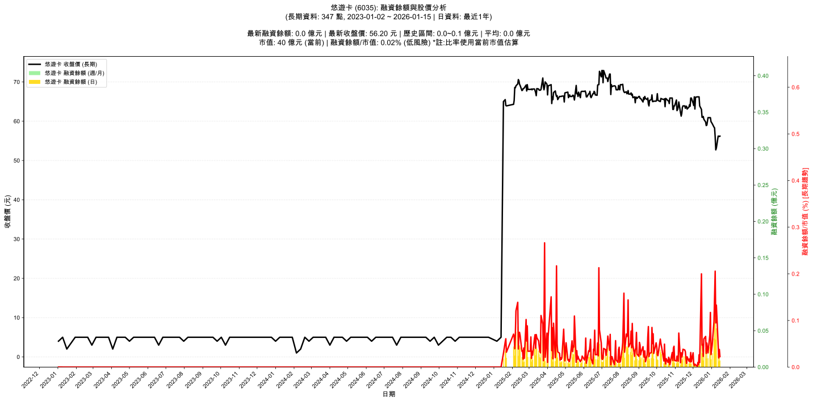

# 📈 悠遊卡 (6035) 融資餘額報告

!!! info "基本資訊"
    **🏗️ 名稱**: 悠遊卡
    **🪪 代號**: 6035
    **📅 分析期間**: 2025-07-23 ~ 2026-01-14 (共 242 個交易日)
    **🕒 最新資料**: 2026-01-14
    **🕒 更新時間**: 2026-01-15 13:26:32 CST

## 💰 融資餘額現況

| 📊 指標 | 🔢 數值 | 🚦 狀態 |
|:------------:|:----------:|:-------------------:|
| **最新融資餘額** | 0.0 億元 (27 張) | - |
| **最新收盤價** | 56.10 元 | - |
| **市值** | 40 億元 | - |
| **融資餘額/市值** | 0.04% | 🟢 低風險 |
| **日變化 (DoD)** | +0.0 億元 (+92.51%) | 📈 |
| **週變化 (WoW)** | -0.1 億元 (-81.60%) | 📉 |
| **兩週變化 (2Wo2W)** | +0.0 億元 (+681.25%) | 📈 |
| **月變化 (MoM)** | +0.0 億元 (+1150.00%) | 📈 |

---

## 📊 歷史統計

| 📊 指標 | 🔢 數值 |
|:------------:|:----------:|
| **歷史最高** | 0.1 億元 |
| **歷史最低** | 0.0 億元 |
| **平均值** | 0.0 億元 |
| **標準差** | 0.0 億元 |
| **當前相對位置** | 13.7% |

---

## 📈 融資餘額趨勢圖

{: style="max-width: 100%; height: auto;"}

---

## 📋 詳細歷史記錄 (最近30日)

<table class="sortable-table">
<thead>
<tr>
<th markdown="span">📅 日期</th>
<th markdown="span">💸 收盤價(元)</th>
<th markdown="span">📊 漲跌(元)</th>
<th markdown="span">📈 漲跌(%)</th>
<th markdown="span">📦 融資餘額(億元)</th>
<th markdown="span">📦 融資餘額(張)</th>
<th markdown="span">↕️ 融資增減(張)</th>
<th markdown="span">📊 融券餘額(張)</th>
<th markdown="span">⚖️ 券資比(%)</th>
</tr>
</thead>
<tbody>
<tr>
<td>2026-01-14</td>
<td>56.10</td>
<td>🔺 +56.20</td>
<td>+55.00%</td>
<td>0.0</td>
<td>27</td>
<td>📈 +11</td>
<td>nan</td>
<td>nan%</td>
</tr>
<tr>
<td>2026-01-13</td>
<td>56.20</td>
<td>🔺 +56.20</td>
<td>+53.50%</td>
<td>0.0</td>
<td>14</td>
<td>📈 +4</td>
<td>nan</td>
<td>nan%</td>
</tr>
<tr>
<td>2026-01-12</td>
<td>56.20</td>
<td>🔺 +56.30</td>
<td>+53.50%</td>
<td>0.0</td>
<td>34</td>
<td>📈 +11</td>
<td>nan</td>
<td>nan%</td>
</tr>
<tr>
<td>2026-01-09</td>
<td>53.20</td>
<td>🔺 +56.50</td>
<td>+52.50%</td>
<td>0.1</td>
<td>100</td>
<td>📈 +51</td>
<td>nan</td>
<td>nan%</td>
</tr>
<tr>
<td>2026-01-08</td>
<td>52.70</td>
<td>🔺 +54.60</td>
<td>+52.00%</td>
<td>0.0</td>
<td>72</td>
<td>📈 +25</td>
<td>nan</td>
<td>nan%</td>
</tr>
<tr>
<td>2026-01-07</td>
<td>56.00</td>
<td>🔺 +57.10</td>
<td>+52.50%</td>
<td>0.1</td>
<td>147</td>
<td>📈 +80</td>
<td>nan</td>
<td>nan%</td>
</tr>
<tr>
<td>2026-01-06</td>
<td>58.30</td>
<td>🔺 +58.30</td>
<td>+55.10%</td>
<td>0.1</td>
<td>105</td>
<td>📈 +63</td>
<td>nan</td>
<td>nan%</td>
</tr>
<tr>
<td>2026-01-05</td>
<td>58.50</td>
<td>🔺 +59.40</td>
<td>+55.60%</td>
<td>0.0</td>
<td>67</td>
<td>📈 +32</td>
<td>nan</td>
<td>nan%</td>
</tr>
<tr>
<td>2026-01-02</td>
<td>59.40</td>
<td>🔺 +59.60</td>
<td>+57.00%</td>
<td>0.0</td>
<td>32</td>
<td>📈 +34</td>
<td>nan</td>
<td>nan%</td>
</tr>
<tr>
<td>2025-12-31</td>
<td>59.90</td>
<td>🔺 +59.50</td>
<td>+56.90%</td>
<td>0.0</td>
<td>18</td>
<td>📈 +14</td>
<td>nan</td>
<td>nan%</td>
</tr>
<tr>
<td>2025-12-30</td>
<td>60.90</td>
<td>🔺 +59.90</td>
<td>+57.10%</td>
<td>0.0</td>
<td>77</td>
<td>📈 +56</td>
<td>nan</td>
<td>nan%</td>
</tr>
<tr>
<td>2025-12-29</td>
<td>60.90</td>
<td>🔺 +60.90</td>
<td>+58.00%</td>
<td>0.0</td>
<td>45</td>
<td>📈 +35</td>
<td>nan</td>
<td>nan%</td>
</tr>
<tr>
<td>2025-12-26</td>
<td>60.90</td>
<td>🔺 +60.90</td>
<td>+58.10%</td>
<td>0.0</td>
<td>20</td>
<td>📈 +11</td>
<td>nan</td>
<td>nan%</td>
</tr>
<tr>
<td>2025-12-24</td>
<td>59.00</td>
<td>🔺 +60.90</td>
<td>+58.10%</td>
<td>0.0</td>
<td>35</td>
<td>📈 +11</td>
<td>nan</td>
<td>nan%</td>
</tr>
<tr>
<td>2025-12-23</td>
<td>58.90</td>
<td>🔺 +60.90</td>
<td>+58.10%</td>
<td>0.0</td>
<td>20</td>
<td>📈 +9</td>
<td>nan</td>
<td>nan%</td>
</tr>
<tr>
<td>2025-12-22</td>
<td>59.80</td>
<td>🔺 +60.90</td>
<td>+58.10%</td>
<td>0.0</td>
<td>44</td>
<td>📈 +12</td>
<td>nan</td>
<td>nan%</td>
</tr>
<tr>
<td>2025-12-19</td>
<td>60.50</td>
<td>🔺 +60.90</td>
<td>+58.10%</td>
<td>0.0</td>
<td>40</td>
<td>📈 +25</td>
<td>nan</td>
<td>nan%</td>
</tr>
<tr>
<td>2025-12-18</td>
<td>61.20</td>
<td>🔺 +61.20</td>
<td>+60.00%</td>
<td>0.0</td>
<td>15</td>
<td>📈 +6</td>
<td>nan</td>
<td>nan%</td>
</tr>
<tr>
<td>2025-12-17</td>
<td>61.00</td>
<td>🔺 +61.70</td>
<td>+58.90%</td>
<td>0.0</td>
<td>32</td>
<td>📈 +14</td>
<td>nan</td>
<td>nan%</td>
</tr>
<tr>
<td>2025-12-16</td>
<td>61.00</td>
<td>🔺 +62.20</td>
<td>+60.00%</td>
<td>0.0</td>
<td>31</td>
<td>📈 +26</td>
<td>nan</td>
<td>nan%</td>
</tr>
<tr>
<td>2025-12-15</td>
<td>63.00</td>
<td>🔺 +62.00</td>
<td>+58.50%</td>
<td>0.1</td>
<td>127</td>
<td>📈 +92</td>
<td>-2</td>
<td>nan%</td>
</tr>
<tr>
<td>2025-12-12</td>
<td>63.90</td>
<td>🔺 +64.00</td>
<td>+63.00%</td>
<td>0.0</td>
<td>6</td>
<td>📈 +9</td>
<td>nan</td>
<td>nan%</td>
</tr>
<tr>
<td>2025-12-11</td>
<td>66.20</td>
<td>🔺 +64.00</td>
<td>+61.30%</td>
<td>0.0</td>
<td>16</td>
<td>📈 +10</td>
<td>-1</td>
<td>nan%</td>
</tr>
<tr>
<td>2025-12-10</td>
<td>66.20</td>
<td>🔺 +66.20</td>
<td>+63.10%</td>
<td>0.0</td>
<td>3</td>
<td>➡️ +0</td>
<td>nan</td>
<td>nan%</td>
</tr>
<tr>
<td>2025-12-09</td>
<td>66.20</td>
<td>🔺 +66.20</td>
<td>+63.10%</td>
<td>0.0</td>
<td>6</td>
<td>📈 +1</td>
<td>nan</td>
<td>nan%</td>
</tr>
<tr>
<td>2025-12-08</td>
<td>66.20</td>
<td>🔺 +66.20</td>
<td>+66.20%</td>
<td>0.0</td>
<td>1</td>
<td>➡️ +0</td>
<td>nan</td>
<td>nan%</td>
</tr>
<tr>
<td>2025-12-05</td>
<td>66.10</td>
<td>🔺 +66.20</td>
<td>+63.10%</td>
<td>0.0</td>
<td>3</td>
<td>➡️ +0</td>
<td>nan</td>
<td>nan%</td>
</tr>
<tr>
<td>2025-12-04</td>
<td>63.10</td>
<td>🔺 +66.10</td>
<td>+63.00%</td>
<td>0.0</td>
<td>4</td>
<td>📈 +1</td>
<td>nan</td>
<td>nan%</td>
</tr>
<tr>
<td>2025-12-03</td>
<td>66.20</td>
<td>🔺 +66.20</td>
<td>+63.10%</td>
<td>0.0</td>
<td>2</td>
<td>📈 +1</td>
<td>nan</td>
<td>nan%</td>
</tr>
<tr>
<td>2025-12-02</td>
<td>64.00</td>
<td>🔺 +66.20</td>
<td>+63.10%</td>
<td>0.0</td>
<td>5</td>
<td>📈 +6</td>
<td>nan</td>
<td>nan%</td>
</tr>
</tbody>
</table>

---

## ℹ️ 資料來源與方法

!!! note "資料來源說明"
    - **主要來源**: `raw_margin_daily.csv` (Type 13: ShowMarginChart)
    - **資料頻率**: 每日更新
    - **資料範圍**: 近1年交易日資料

!!! info "報告元資訊"
    - **報告產生時間**: 2026-01-15 13:26:32
    - **分析期間**: 242 個交易日
    - **資料來源**: Stage 1 Raw Margin Daily Data

---

:material-information-outline: **本報告僅供參考，投資決策請審慎評估**

