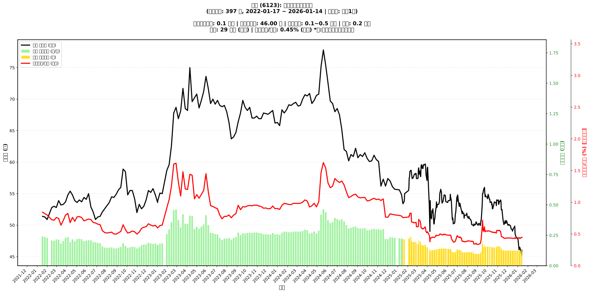

# :chart_with_upwards_trend: 上奇 (6123) 融資餘額報告

!!! info "基本資訊"
    **:building_construction: 名稱**: 上奇
    **:identification_card: 代號**: 6123
    **:calendar: 分析期間**: 2025-11-12 ~ 2026-01-09 (共 41 個交易日)
    **:clock3: 最新資料**: 2026-01-09
    **🕒 更新時間**: 2026-01-11 23:12:38 CST

## :moneybag: 融資餘額現況

| :chart: 指標 | :1234: 數值 | :traffic_light: 狀態 |
|:------------:|:----------:|:-------------------:|
| **最新融資餘額** | 0.1 億元 (268 張) | - |
| **最新收盤價** | 46.15 元 | - |
| **市值** | 29 億元 | - |
| **融資餘額/市值** | 0.43% | 🟡 正常 |
| **日變化 (DoD)** | +0.0 億元 (+0.70%) | 📈 |
| **週變化 (WoW)** | -0.0 億元 (-1.41%) | 📉 |
| **月變化 (MoM)** | -0.0 億元 (-0.86%) | 📉 |

---

## :bar_chart: 歷史統計

| :chart: 指標 | :1234: 數值 |
|:------------:|:----------:|
| **歷史最高** | 0.1 億元 |
| **歷史最低** | 0.1 億元 |
| **平均值** | 0.1 億元 |
| **標準差** | 0.0 億元 |
| **當前相對位置** | 8.8% |

---

## :chart_with_upwards_trend: 融資餘額趨勢圖

{: style="max-width: 100%; height: auto;"}

---

## :clipboard: 詳細歷史記錄 (最近30日)

<table class="sortable-table">
<thead>
<tr>
<th>:calendar: 日期</th>
<th>:money_with_wings: 收盤價(元)</th>
<th>:chart: 漲跌(元)</th>
<th>:chart_with_upwards_trend: 漲跌(%)</th>
<th>:package: 融資餘額(億元)</th>
<th>:package: 融資餘額(張)</th>
<th>:arrow_up_down: 融資增減(張)</th>
<th>:chart: 融券餘額(張)</th>
<th>:balance_scale: 券資比(%)</th>
</tr>
</thead>
<tbody>
<tr>
<td>2026-01-09</td>
<td>46.15</td>
<td>🔻 -0.20</td>
<td>-0.43%</td>
<td>0.1</td>
<td>268</td>
<td>📈 +3</td>
<td>0</td>
<td>0.00%</td>
</tr>
<tr>
<td>2026-01-08</td>
<td>46.35</td>
<td>🔻 -0.15</td>
<td>-0.32%</td>
<td>0.1</td>
<td>265</td>
<td>📉 -6</td>
<td>0</td>
<td>0.00%</td>
</tr>
<tr>
<td>2026-01-07</td>
<td>46.50</td>
<td>🔺 +0.05</td>
<td>+0.11%</td>
<td>0.1</td>
<td>271</td>
<td>➡️ +0</td>
<td>0</td>
<td>0.00%</td>
</tr>
<tr>
<td>2026-01-06</td>
<td>46.45</td>
<td>🔺 +0.35</td>
<td>+0.76%</td>
<td>0.1</td>
<td>271</td>
<td>📈 +2</td>
<td>0</td>
<td>0.00%</td>
</tr>
<tr>
<td>2026-01-05</td>
<td>46.10</td>
<td>🔻 -1.60</td>
<td>-3.35%</td>
<td>0.1</td>
<td>269</td>
<td>📈 +6</td>
<td>0</td>
<td>0.00%</td>
</tr>
<tr>
<td>2026-01-02</td>
<td>47.70</td>
<td>🔻 -0.30</td>
<td>-0.62%</td>
<td>0.1</td>
<td>263</td>
<td>📈 +4</td>
<td>0</td>
<td>0.00%</td>
</tr>
<tr>
<td>2025-12-31</td>
<td>48.00</td>
<td>➖ +0.00</td>
<td>+0.00%</td>
<td>0.1</td>
<td>259</td>
<td>📉 -1</td>
<td>0</td>
<td>0.00%</td>
</tr>
<tr>
<td>2025-12-30</td>
<td>48.00</td>
<td>🔺 +0.05</td>
<td>+0.10%</td>
<td>0.1</td>
<td>260</td>
<td>📈 +1</td>
<td>0</td>
<td>0.00%</td>
</tr>
<tr>
<td>2025-12-29</td>
<td>47.95</td>
<td>🔻 -0.30</td>
<td>-0.62%</td>
<td>0.1</td>
<td>259</td>
<td>📈 +4</td>
<td>0</td>
<td>0.00%</td>
</tr>
<tr>
<td>2025-12-26</td>
<td>48.25</td>
<td>🔻 -0.40</td>
<td>-0.82%</td>
<td>0.1</td>
<td>255</td>
<td>📈 +3</td>
<td>0</td>
<td>0.00%</td>
</tr>
<tr>
<td>2025-12-24</td>
<td>48.65</td>
<td>🔻 -0.20</td>
<td>-0.41%</td>
<td>0.1</td>
<td>252</td>
<td>➡️ +0</td>
<td>0</td>
<td>0.00%</td>
</tr>
<tr>
<td>2025-12-23</td>
<td>49.85</td>
<td>🔺 +0.20</td>
<td>+0.40%</td>
<td>0.1</td>
<td>252</td>
<td>📈 +2</td>
<td>0</td>
<td>0.00%</td>
</tr>
<tr>
<td>2025-12-22</td>
<td>49.65</td>
<td>🔺 +0.10</td>
<td>+0.20%</td>
<td>0.1</td>
<td>250</td>
<td>➡️ +0</td>
<td>0</td>
<td>0.00%</td>
</tr>
<tr>
<td>2025-12-19</td>
<td>49.55</td>
<td>🔺 +0.25</td>
<td>+0.51%</td>
<td>0.1</td>
<td>250</td>
<td>➡️ +0</td>
<td>0</td>
<td>0.00%</td>
</tr>
<tr>
<td>2025-12-18</td>
<td>49.30</td>
<td>🔺 +0.05</td>
<td>+0.10%</td>
<td>0.1</td>
<td>250</td>
<td>➡️ +0</td>
<td>0</td>
<td>0.00%</td>
</tr>
<tr>
<td>2025-12-17</td>
<td>49.25</td>
<td>🔺 +0.20</td>
<td>+0.41%</td>
<td>0.1</td>
<td>250</td>
<td>➡️ +0</td>
<td>0</td>
<td>0.00%</td>
</tr>
<tr>
<td>2025-12-16</td>
<td>49.05</td>
<td>🔻 -0.25</td>
<td>-0.51%</td>
<td>0.1</td>
<td>250</td>
<td>➡️ +0</td>
<td>0</td>
<td>0.00%</td>
</tr>
<tr>
<td>2025-12-15</td>
<td>49.30</td>
<td>🔻 -0.10</td>
<td>-0.20%</td>
<td>0.1</td>
<td>250</td>
<td>📉 -2</td>
<td>0</td>
<td>0.00%</td>
</tr>
<tr>
<td>2025-12-12</td>
<td>49.40</td>
<td>🔻 -0.25</td>
<td>-0.50%</td>
<td>0.1</td>
<td>252</td>
<td>📈 +1</td>
<td>0</td>
<td>0.00%</td>
</tr>
<tr>
<td>2025-12-11</td>
<td>49.65</td>
<td>🔻 -0.25</td>
<td>-0.50%</td>
<td>0.1</td>
<td>251</td>
<td>📈 +1</td>
<td>0</td>
<td>0.00%</td>
</tr>
<tr>
<td>2025-12-10</td>
<td>49.90</td>
<td>➖ +0.00</td>
<td>+0.00%</td>
<td>0.1</td>
<td>250</td>
<td>➡️ +0</td>
<td>0</td>
<td>0.00%</td>
</tr>
<tr>
<td>2025-12-09</td>
<td>49.90</td>
<td>🔻 -0.10</td>
<td>-0.20%</td>
<td>0.1</td>
<td>250</td>
<td>➡️ +0</td>
<td>0</td>
<td>0.00%</td>
</tr>
<tr>
<td>2025-12-08</td>
<td>50.00</td>
<td>🔻 -0.10</td>
<td>-0.20%</td>
<td>0.1</td>
<td>250</td>
<td>📈 +1</td>
<td>0</td>
<td>0.00%</td>
</tr>
<tr>
<td>2025-12-05</td>
<td>50.10</td>
<td>🔺 +0.10</td>
<td>+0.20%</td>
<td>0.1</td>
<td>249</td>
<td>➡️ +0</td>
<td>0</td>
<td>0.00%</td>
</tr>
<tr>
<td>2025-12-04</td>
<td>50.00</td>
<td>🔻 -0.10</td>
<td>-0.20%</td>
<td>0.1</td>
<td>249</td>
<td>➡️ +0</td>
<td>0</td>
<td>0.00%</td>
</tr>
<tr>
<td>2025-12-03</td>
<td>50.10</td>
<td>🔺 +0.10</td>
<td>+0.20%</td>
<td>0.1</td>
<td>249</td>
<td>📉 -1</td>
<td>0</td>
<td>0.00%</td>
</tr>
<tr>
<td>2025-12-02</td>
<td>50.00</td>
<td>🔻 -0.20</td>
<td>-0.40%</td>
<td>0.1</td>
<td>250</td>
<td>📈 +2</td>
<td>0</td>
<td>0.00%</td>
</tr>
<tr>
<td>2025-12-01</td>
<td>50.20</td>
<td>🔻 -0.50</td>
<td>-0.99%</td>
<td>0.1</td>
<td>248</td>
<td>📈 +2</td>
<td>0</td>
<td>0.00%</td>
</tr>
<tr>
<td>2025-11-28</td>
<td>50.70</td>
<td>➖ +0.00</td>
<td>+0.00%</td>
<td>0.1</td>
<td>246</td>
<td>➡️ +0</td>
<td>0</td>
<td>0.00%</td>
</tr>
<tr>
<td>2025-11-27</td>
<td>50.70</td>
<td>🔺 +0.40</td>
<td>+0.80%</td>
<td>0.1</td>
<td>246</td>
<td>📈 +1</td>
<td>0</td>
<td>0.00%</td>
</tr>
</tbody>
</table>

---

## :information_source: 資料來源與方法

!!! note "資料來源說明"
    - **主要來源**: `raw_margin_daily.csv` (Type 13: ShowMarginChart)
    - **資料頻率**: 每日更新
    - **資料範圍**: 近1年交易日資料

!!! info "報告元資訊"
    - **報告產生時間**: 2026-01-11 23:12:38
    - **分析期間**: 41 個交易日
    - **資料來源**: Stage 1 Raw Margin Daily Data

---

:material-information-outline: **本報告僅供參考，投資決策請審慎評估**

