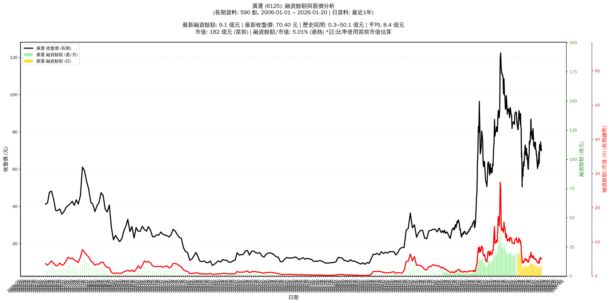

# :chart_with_upwards_trend: 廣運 (6125) 融資餘額報告

!!! info "基本資訊"
    **:building_construction: 名稱**: 廣運
    **:identification_card: 代號**: 6125
    **:calendar: 分析期間**: 2025-07-18 ~ 2026-01-09 (共 242 個交易日)
    **:clock3: 最新資料**: 2026-01-09
    **🕒 更新時間**: 2026-01-12 12:08:41 CST

## :moneybag: 融資餘額現況

| :chart: 指標 | :1234: 數值 | :traffic_light: 狀態 |
|:------------:|:----------:|:-------------------:|
| **最新融資餘額** | 9.3 億元 (13,087 張) | - |
| **最新收盤價** | 70.70 元 | - |
| **市值** | 183 億元 | - |
| **融資餘額/市值** | 5.05% | 🔴 過熱 |
| **日變化 (DoD)** | +0.0 億元 (+0.17%) | 📈 |
| **週變化 (WoW)** | -0.1 億元 (-0.95%) | 📉 |
| **月變化 (MoM)** | +2.0 億元 (+28.08%) | 📈 |

---

## :bar_chart: 歷史統計

| :chart: 指標 | :1234: 數值 |
|:------------:|:----------:|
| **歷史最高** | 20.5 億元 |
| **歷史最低** | 6.9 億元 |
| **平均值** | 10.8 億元 |
| **標準差** | 4.0 億元 |
| **當前相對位置** | 17.0% |

---

## :chart_with_upwards_trend: 融資餘額趨勢圖

    

---

## :clipboard: 詳細歷史記錄 (最近30日)

<table class="sortable-table">
<thead>
<tr>
<th>:calendar: 日期</th>
<th>:money_with_wings: 收盤價(元)</th>
<th>:chart: 漲跌(元)</th>
<th>:chart_with_upwards_trend: 漲跌(%)</th>
<th>:package: 融資餘額(億元)</th>
<th>:package: 融資餘額(張)</th>
<th>:arrow_up_down: 融資增減(張)</th>
<th>:chart: 融券餘額(張)</th>
<th>:balance_scale: 券資比(%)</th>
</tr>
</thead>
<tbody>
<tr>
<td>2026-01-09</td>
<td>70.70</td>
<td>🔺 +0.20</td>
<td>+0.28%</td>
<td>9.3</td>
<td>13,087</td>
<td>📉 -15</td>
<td>209</td>
<td>1.60%</td>
</tr>
<tr>
<td>2026-01-08</td>
<td>70.50</td>
<td>🔻 -4.20</td>
<td>-5.62%</td>
<td>9.2</td>
<td>13,102</td>
<td>📉 -115</td>
<td>209</td>
<td>1.60%</td>
</tr>
<tr>
<td>2026-01-07</td>
<td>74.70</td>
<td>🔺 +2.50</td>
<td>+3.46%</td>
<td>9.9</td>
<td>13,217</td>
<td>📈 +405</td>
<td>211</td>
<td>1.60%</td>
</tr>
<tr>
<td>2026-01-06</td>
<td>72.20</td>
<td>🔺 +1.20</td>
<td>+1.69%</td>
<td>9.3</td>
<td>12,812</td>
<td>📈 +258</td>
<td>180</td>
<td>1.40%</td>
</tr>
<tr>
<td>2026-01-05</td>
<td>71.00</td>
<td>🔻 -0.30</td>
<td>-0.42%</td>
<td>8.9</td>
<td>12,554</td>
<td>📉 -547</td>
<td>185</td>
<td>1.47%</td>
</tr>
<tr>
<td>2026-01-02</td>
<td>71.30</td>
<td>🔻 -0.80</td>
<td>-1.11%</td>
<td>9.3</td>
<td>13,101</td>
<td>📈 +59</td>
<td>212</td>
<td>1.62%</td>
</tr>
<tr>
<td>2025-12-31</td>
<td>72.10</td>
<td>🔻 -0.90</td>
<td>-1.23%</td>
<td>9.4</td>
<td>13,042</td>
<td>📉 -49</td>
<td>211</td>
<td>1.62%</td>
</tr>
<tr>
<td>2025-12-30</td>
<td>73.00</td>
<td>🔺 +0.80</td>
<td>+1.11%</td>
<td>9.6</td>
<td>13,091</td>
<td>📈 +114</td>
<td>227</td>
<td>1.73%</td>
</tr>
<tr>
<td>2025-12-29</td>
<td>72.20</td>
<td>🔺 +0.40</td>
<td>+0.56%</td>
<td>9.4</td>
<td>12,977</td>
<td>📉 -31</td>
<td>246</td>
<td>1.90%</td>
</tr>
<tr>
<td>2025-12-26</td>
<td>71.80</td>
<td>🔻 -0.60</td>
<td>-0.83%</td>
<td>9.3</td>
<td>13,008</td>
<td>📈 +326</td>
<td>251</td>
<td>1.93%</td>
</tr>
<tr>
<td>2025-12-24</td>
<td>72.40</td>
<td>🔻 -0.90</td>
<td>-1.23%</td>
<td>9.2</td>
<td>12,682</td>
<td>📈 +152</td>
<td>260</td>
<td>2.05%</td>
</tr>
<tr>
<td>2025-12-23</td>
<td>73.30</td>
<td>🔺 +0.60</td>
<td>+0.83%</td>
<td>9.2</td>
<td>12,530</td>
<td>📈 +934</td>
<td>289</td>
<td>2.31%</td>
</tr>
<tr>
<td>2025-12-22</td>
<td>72.70</td>
<td>🔺 +6.60</td>
<td>+9.98%</td>
<td>8.4</td>
<td>11,596</td>
<td>📈 +399</td>
<td>253</td>
<td>2.18%</td>
</tr>
<tr>
<td>2025-12-19</td>
<td>66.10</td>
<td>🔺 +2.50</td>
<td>+3.93%</td>
<td>7.4</td>
<td>11,197</td>
<td>📈 +92</td>
<td>229</td>
<td>2.05%</td>
</tr>
<tr>
<td>2025-12-18</td>
<td>63.60</td>
<td>🔺 +0.40</td>
<td>+0.63%</td>
<td>7.1</td>
<td>11,105</td>
<td>📈 +59</td>
<td>204</td>
<td>1.84%</td>
</tr>
<tr>
<td>2025-12-17</td>
<td>63.20</td>
<td>🔺 +0.10</td>
<td>+0.16%</td>
<td>7.0</td>
<td>11,046</td>
<td>📉 -22</td>
<td>202</td>
<td>1.83%</td>
</tr>
<tr>
<td>2025-12-16</td>
<td>63.10</td>
<td>🔻 -2.30</td>
<td>-3.52%</td>
<td>7.0</td>
<td>11,068</td>
<td>📉 -198</td>
<td>237</td>
<td>2.14%</td>
</tr>
<tr>
<td>2025-12-15</td>
<td>65.40</td>
<td>🔻 -4.00</td>
<td>-5.76%</td>
<td>7.4</td>
<td>11,266</td>
<td>📉 -224</td>
<td>273</td>
<td>2.42%</td>
</tr>
<tr>
<td>2025-12-12</td>
<td>69.40</td>
<td>🔺 +3.50</td>
<td>+5.31%</td>
<td>8.0</td>
<td>11,490</td>
<td>📉 -130</td>
<td>348</td>
<td>3.03%</td>
</tr>
<tr>
<td>2025-12-11</td>
<td>65.90</td>
<td>🔺 +2.00</td>
<td>+3.13%</td>
<td>7.7</td>
<td>11,620</td>
<td>📈 +315</td>
<td>202</td>
<td>1.74%</td>
</tr>
<tr>
<td>2025-12-10</td>
<td>63.90</td>
<td>🔻 -0.50</td>
<td>-0.78%</td>
<td>7.2</td>
<td>11,305</td>
<td>📉 -15</td>
<td>156</td>
<td>1.38%</td>
</tr>
<tr>
<td>2025-12-09</td>
<td>64.40</td>
<td>🔺 +0.40</td>
<td>+0.62%</td>
<td>7.3</td>
<td>11,320</td>
<td>📉 -51</td>
<td>150</td>
<td>1.33%</td>
</tr>
<tr>
<td>2025-12-08</td>
<td>64.00</td>
<td>🔻 -1.10</td>
<td>-1.69%</td>
<td>7.3</td>
<td>11,371</td>
<td>📈 +109</td>
<td>146</td>
<td>1.28%</td>
</tr>
<tr>
<td>2025-12-05</td>
<td>65.10</td>
<td>🔺 +1.00</td>
<td>+1.56%</td>
<td>7.3</td>
<td>11,262</td>
<td>📉 -178</td>
<td>156</td>
<td>1.39%</td>
</tr>
<tr>
<td>2025-12-04</td>
<td>64.10</td>
<td>🔺 +0.70</td>
<td>+1.10%</td>
<td>7.3</td>
<td>11,440</td>
<td>📈 +68</td>
<td>159</td>
<td>1.39%</td>
</tr>
<tr>
<td>2025-12-03</td>
<td>63.40</td>
<td>🔺 +1.80</td>
<td>+2.92%</td>
<td>7.2</td>
<td>11,372</td>
<td>📈 +71</td>
<td>171</td>
<td>1.50%</td>
</tr>
<tr>
<td>2025-12-02</td>
<td>61.60</td>
<td>🔻 -0.30</td>
<td>-0.48%</td>
<td>7.0</td>
<td>11,301</td>
<td>📉 -48</td>
<td>157</td>
<td>1.39%</td>
</tr>
<tr>
<td>2025-12-01</td>
<td>61.90</td>
<td>🔻 -0.40</td>
<td>-0.64%</td>
<td>7.0</td>
<td>11,349</td>
<td>📉 -108</td>
<td>174</td>
<td>1.53%</td>
</tr>
<tr>
<td>2025-11-28</td>
<td>62.30</td>
<td>🔻 -0.40</td>
<td>-0.64%</td>
<td>7.1</td>
<td>11,457</td>
<td>📉 -55</td>
<td>182</td>
<td>1.59%</td>
</tr>
<tr>
<td>2025-11-27</td>
<td>62.70</td>
<td>🔻 -0.30</td>
<td>-0.48%</td>
<td>7.2</td>
<td>11,512</td>
<td>📉 -33</td>
<td>183</td>
<td>1.59%</td>
</tr>
</tbody>
</table>

---

## :information_source: 資料來源與方法

!!! note "資料來源說明"
    - **主要來源**: `raw_margin_daily.csv` (Type 13: ShowMarginChart)
    - **資料頻率**: 每日更新
    - **資料範圍**: 近1年交易日資料

!!! info "報告元資訊"
    - **報告產生時間**: 2026-01-12 12:08:41
    - **分析期間**: 242 個交易日
    - **資料來源**: Stage 1 Raw Margin Daily Data

---

:material-information-outline: **本報告僅供參考，投資決策請審慎評估**

