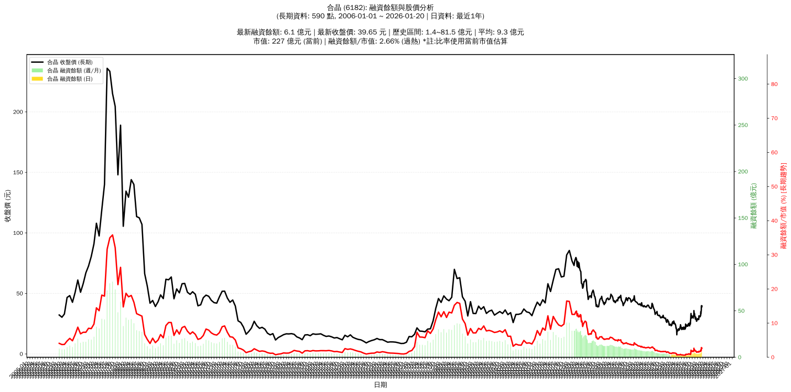

# :chart_with_upwards_trend: 合晶 (6182) 融資餘額報告

!!! info "基本資訊"
    **:building_construction: 名稱**: 合晶
    **:identification_card: 代號**: 6182
    **:calendar: 分析期間**: 2025-07-18 ~ 2026-01-09 (共 242 個交易日)
    **:clock3: 最新資料**: 2026-01-09
    **🕒 更新時間**: 2026-01-11 23:12:52 CST

## :moneybag: 融資餘額現況

| :chart: 指標 | :1234: 數值 | :traffic_light: 狀態 |
|:------------:|:----------:|:-------------------:|
| **最新融資餘額** | 4.1 億元 (12,526 張) | - |
| **最新收盤價** | 33.05 元 | - |
| **市值** | 190 億元 | - |
| **融資餘額/市值** | 2.18% | 🔴 過熱 |
| **日變化 (DoD)** | -0.2 億元 (-5.61%) | 📉 |
| **週變化 (WoW)** | +0.3 億元 (+6.93%) | 📈 |
| **月變化 (MoM)** | +0.6 億元 (+15.49%) | 📈 |

---

## :bar_chart: 歷史統計

| :chart: 指標 | :1234: 數值 |
|:------------:|:----------:|
| **歷史最高** | 6.0 億元 |
| **歷史最低** | 1.4 億元 |
| **平均值** | 2.7 億元 |
| **標準差** | 1.1 億元 |
| **當前相對位置** | 59.8% |

---

## :chart_with_upwards_trend: 融資餘額趨勢圖

    

---

## :clipboard: 詳細歷史記錄 (最近30日)

<table class="sortable-table">
<thead>
<tr>
<th>:calendar: 日期</th>
<th>:money_with_wings: 收盤價(元)</th>
<th>:chart: 漲跌(元)</th>
<th>:chart_with_upwards_trend: 漲跌(%)</th>
<th>:package: 融資餘額(億元)</th>
<th>:package: 融資餘額(張)</th>
<th>:arrow_up_down: 融資增減(張)</th>
<th>:chart: 融券餘額(張)</th>
<th>:balance_scale: 券資比(%)</th>
</tr>
</thead>
<tbody>
<tr>
<td>2026-01-09</td>
<td>33.05</td>
<td>🔻 -0.75</td>
<td>-2.22%</td>
<td>4.1</td>
<td>12,526</td>
<td>📉 -450</td>
<td>1,355</td>
<td>10.80%</td>
</tr>
<tr>
<td>2026-01-08</td>
<td>33.80</td>
<td>🔻 -1.15</td>
<td>-3.29%</td>
<td>4.4</td>
<td>12,976</td>
<td>📉 -29</td>
<td>1,446</td>
<td>11.10%</td>
</tr>
<tr>
<td>2026-01-07</td>
<td>34.95</td>
<td>🔺 +1.55</td>
<td>+4.64%</td>
<td>4.5</td>
<td>13,005</td>
<td>📉 -1,469</td>
<td>1,468</td>
<td>11.30%</td>
</tr>
<tr>
<td>2026-01-06</td>
<td>33.40</td>
<td>🔺 +1.70</td>
<td>+5.36%</td>
<td>4.8</td>
<td>14,474</td>
<td>📈 +1,824</td>
<td>1,319</td>
<td>9.11%</td>
</tr>
<tr>
<td>2026-01-05</td>
<td>31.70</td>
<td>🔺 +0.45</td>
<td>+1.44%</td>
<td>4.0</td>
<td>12,650</td>
<td>📈 +261</td>
<td>1,245</td>
<td>9.84%</td>
</tr>
<tr>
<td>2026-01-02</td>
<td>31.25</td>
<td>🔺 +0.45</td>
<td>+1.46%</td>
<td>3.9</td>
<td>12,389</td>
<td>📉 -121</td>
<td>1,222</td>
<td>9.86%</td>
</tr>
<tr>
<td>2025-12-31</td>
<td>30.80</td>
<td>🔻 -0.15</td>
<td>-0.48%</td>
<td>3.9</td>
<td>12,510</td>
<td>📈 +130</td>
<td>1,213</td>
<td>9.70%</td>
</tr>
<tr>
<td>2025-12-30</td>
<td>30.95</td>
<td>🔺 +0.25</td>
<td>+0.81%</td>
<td>3.8</td>
<td>12,380</td>
<td>📉 -162</td>
<td>1,230</td>
<td>9.94%</td>
</tr>
<tr>
<td>2025-12-29</td>
<td>30.70</td>
<td>🔻 -0.50</td>
<td>-1.60%</td>
<td>3.9</td>
<td>12,542</td>
<td>📈 +57</td>
<td>1,217</td>
<td>9.70%</td>
</tr>
<tr>
<td>2025-12-26</td>
<td>31.20</td>
<td>🔺 +0.55</td>
<td>+1.79%</td>
<td>3.9</td>
<td>12,485</td>
<td>📈 +71</td>
<td>1,221</td>
<td>9.78%</td>
</tr>
<tr>
<td>2025-12-24</td>
<td>30.65</td>
<td>🔻 -0.55</td>
<td>-1.76%</td>
<td>3.8</td>
<td>12,414</td>
<td>📈 +97</td>
<td>1,152</td>
<td>9.28%</td>
</tr>
<tr>
<td>2025-12-23</td>
<td>31.20</td>
<td>🔻 -0.20</td>
<td>-0.64%</td>
<td>3.8</td>
<td>12,317</td>
<td>📉 -189</td>
<td>1,212</td>
<td>9.84%</td>
</tr>
<tr>
<td>2025-12-22</td>
<td>31.40</td>
<td>🔺 +1.00</td>
<td>+3.29%</td>
<td>3.9</td>
<td>12,506</td>
<td>📉 -535</td>
<td>1,217</td>
<td>9.73%</td>
</tr>
<tr>
<td>2025-12-19</td>
<td>30.40</td>
<td>🔻 -0.55</td>
<td>-1.78%</td>
<td>4.0</td>
<td>13,041</td>
<td>📈 +466</td>
<td>1,177</td>
<td>9.03%</td>
</tr>
<tr>
<td>2025-12-18</td>
<td>30.95</td>
<td>🔻 -0.55</td>
<td>-1.75%</td>
<td>3.9</td>
<td>12,575</td>
<td>📉 -119</td>
<td>1,302</td>
<td>10.40%</td>
</tr>
<tr>
<td>2025-12-17</td>
<td>31.50</td>
<td>🔺 +2.85</td>
<td>+9.95%</td>
<td>4.0</td>
<td>12,694</td>
<td>📈 +708</td>
<td>1,200</td>
<td>9.45%</td>
</tr>
<tr>
<td>2025-12-16</td>
<td>28.65</td>
<td>🔻 -0.35</td>
<td>-1.21%</td>
<td>3.4</td>
<td>11,986</td>
<td>📈 +80</td>
<td>1,086</td>
<td>9.06%</td>
</tr>
<tr>
<td>2025-12-15</td>
<td>29.00</td>
<td>➖ +0.00</td>
<td>+0.00%</td>
<td>3.5</td>
<td>11,906</td>
<td>📉 -53</td>
<td>1,094</td>
<td>9.19%</td>
</tr>
<tr>
<td>2025-12-12</td>
<td>29.00</td>
<td>🔺 +0.65</td>
<td>+2.29%</td>
<td>3.5</td>
<td>11,959</td>
<td>📉 -266</td>
<td>1,140</td>
<td>9.53%</td>
</tr>
<tr>
<td>2025-12-11</td>
<td>28.35</td>
<td>🔻 -0.45</td>
<td>-1.56%</td>
<td>3.5</td>
<td>12,225</td>
<td>📉 -221</td>
<td>1,126</td>
<td>9.21%</td>
</tr>
<tr>
<td>2025-12-10</td>
<td>28.80</td>
<td>🔻 -0.20</td>
<td>-0.69%</td>
<td>3.6</td>
<td>12,446</td>
<td>📈 +68</td>
<td>1,132</td>
<td>9.10%</td>
</tr>
<tr>
<td>2025-12-09</td>
<td>29.00</td>
<td>🔻 -0.10</td>
<td>-0.34%</td>
<td>3.6</td>
<td>12,378</td>
<td>📈 +47</td>
<td>1,147</td>
<td>9.27%</td>
</tr>
<tr>
<td>2025-12-08</td>
<td>29.10</td>
<td>🔺 +0.10</td>
<td>+0.34%</td>
<td>3.6</td>
<td>12,331</td>
<td>📉 -168</td>
<td>1,150</td>
<td>9.33%</td>
</tr>
<tr>
<td>2025-12-05</td>
<td>29.00</td>
<td>➖ +0.00</td>
<td>+0.00%</td>
<td>3.6</td>
<td>12,499</td>
<td>📉 -18</td>
<td>1,205</td>
<td>9.64%</td>
</tr>
<tr>
<td>2025-12-04</td>
<td>29.00</td>
<td>🔻 -0.25</td>
<td>-0.85%</td>
<td>3.6</td>
<td>12,517</td>
<td>📈 +116</td>
<td>1,215</td>
<td>9.71%</td>
</tr>
<tr>
<td>2025-12-03</td>
<td>29.25</td>
<td>🔺 +0.85</td>
<td>+2.99%</td>
<td>3.6</td>
<td>12,401</td>
<td>📉 -373</td>
<td>1,229</td>
<td>9.91%</td>
</tr>
<tr>
<td>2025-12-02</td>
<td>28.40</td>
<td>🔻 -0.25</td>
<td>-0.87%</td>
<td>3.6</td>
<td>12,774</td>
<td>📈 +1</td>
<td>1,205</td>
<td>9.43%</td>
</tr>
<tr>
<td>2025-12-01</td>
<td>28.65</td>
<td>➖ +0.00</td>
<td>+0.00%</td>
<td>3.7</td>
<td>12,773</td>
<td>📈 +870</td>
<td>1,206</td>
<td>9.44%</td>
</tr>
<tr>
<td>2025-11-28</td>
<td>28.65</td>
<td>➖ +0.00</td>
<td>+0.00%</td>
<td>3.4</td>
<td>11,903</td>
<td>📉 -47</td>
<td>1,160</td>
<td>9.75%</td>
</tr>
<tr>
<td>2025-11-27</td>
<td>28.65</td>
<td>🔺 +0.10</td>
<td>+0.35%</td>
<td>3.4</td>
<td>11,950</td>
<td>📉 -44</td>
<td>1,152</td>
<td>9.64%</td>
</tr>
</tbody>
</table>

---

## :information_source: 資料來源與方法

!!! note "資料來源說明"
    - **主要來源**: `raw_margin_daily.csv` (Type 13: ShowMarginChart)
    - **資料頻率**: 每日更新
    - **資料範圍**: 近1年交易日資料

!!! info "報告元資訊"
    - **報告產生時間**: 2026-01-11 23:12:52
    - **分析期間**: 242 個交易日
    - **資料來源**: Stage 1 Raw Margin Daily Data

---

:material-information-outline: **本報告僅供參考，投資決策請審慎評估**

