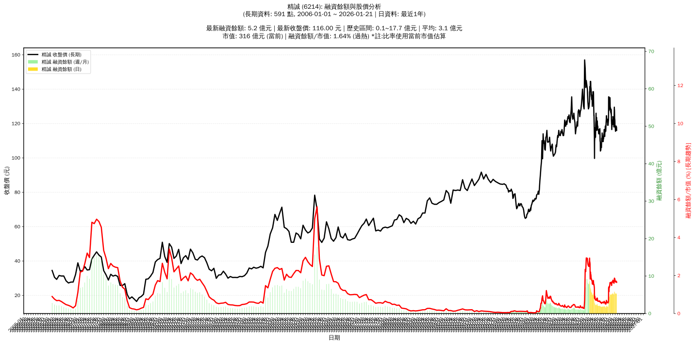

# :chart_with_upwards_trend: 精誠 (6214) 融資餘額報告

!!! info "基本資訊"
    **:building_construction: 名稱**: 精誠
    **:identification_card: 代號**: 6214
    **:calendar: 分析期間**: 2025-07-18 ~ 2026-01-09 (共 242 個交易日)
    **:clock3: 最新資料**: 2026-01-09
    **🕒 更新時間**: 2026-01-11 20:27:28 CST

## :moneybag: 融資餘額現況

| :chart: 指標 | :1234: 數值 | :traffic_light: 狀態 |
|:------------:|:----------:|:-------------------:|
| **最新融資餘額** | 5.3 億元 (4,559 張) | - |
| **最新收盤價** | 116.50 元 | - |
| **市值** | 317 億元 | - |
| **融資餘額/市值** | 1.67% | 🔴 過熱 |
| **日變化 (DoD)** | +0.0 億元 (+0.30%) | 📈 |
| **週變化 (WoW)** | -0.1 億元 (-2.04%) | 📉 |
| **月變化 (MoM)** | +0.1 億元 (+2.37%) | 📈 |

---

## :bar_chart: 歷史統計

| :chart: 指標 | :1234: 數值 |
|:------------:|:----------:|
| **歷史最高** | 9.2 億元 |
| **歷史最低** | 1.6 億元 |
| **平均值** | 3.7 億元 |
| **標準差** | 2.0 億元 |
| **當前相對位置** | 49.0% |

---

## :chart_with_upwards_trend: 融資餘額趨勢圖

    

---

## :clipboard: 詳細歷史記錄 (最近30日)

<table class="sortable-table">
<thead>
<tr>
<th>:calendar: 日期</th>
<th>:money_with_wings: 收盤價(元)</th>
<th>:chart: 漲跌(元)</th>
<th>:chart_with_upwards_trend: 漲跌(%)</th>
<th>:package: 融資餘額(億元)</th>
<th>:package: 融資餘額(張)</th>
<th>:arrow_up_down: 融資增減(張)</th>
<th>:chart: 融券餘額(張)</th>
<th>:balance_scale: 券資比(%)</th>
</tr>
</thead>
<tbody>
<tr>
<td>2026-01-09</td>
<td>116.50</td>
<td>🔺 +0.50</td>
<td>+0.43%</td>
<td>5.3</td>
<td>4,559</td>
<td>📉 -6</td>
<td>8</td>
<td>0.18%</td>
</tr>
<tr>
<td>2026-01-08</td>
<td>116.00</td>
<td>🔺 +0.50</td>
<td>+0.43%</td>
<td>5.3</td>
<td>4,565</td>
<td>📈 +9</td>
<td>8</td>
<td>0.18%</td>
</tr>
<tr>
<td>2026-01-07</td>
<td>115.50</td>
<td>➖ +0.00</td>
<td>+0.00%</td>
<td>5.3</td>
<td>4,556</td>
<td>📈 +15</td>
<td>8</td>
<td>0.18%</td>
</tr>
<tr>
<td>2026-01-06</td>
<td>115.50</td>
<td>🔻 -1.00</td>
<td>-0.86%</td>
<td>5.2</td>
<td>4,541</td>
<td>📈 +27</td>
<td>9</td>
<td>0.20%</td>
</tr>
<tr>
<td>2026-01-05</td>
<td>116.50</td>
<td>🔻 -1.50</td>
<td>-1.27%</td>
<td>5.3</td>
<td>4,514</td>
<td>📉 -81</td>
<td>9</td>
<td>0.20%</td>
</tr>
<tr>
<td>2026-01-02</td>
<td>118.00</td>
<td>➖ +0.00</td>
<td>+0.00%</td>
<td>5.4</td>
<td>4,595</td>
<td>📈 +19</td>
<td>8</td>
<td>0.17%</td>
</tr>
<tr>
<td>2025-12-31</td>
<td>118.00</td>
<td>🔻 -2.00</td>
<td>-1.67%</td>
<td>5.4</td>
<td>4,576</td>
<td>📉 -124</td>
<td>8</td>
<td>0.17%</td>
</tr>
<tr>
<td>2025-12-30</td>
<td>120.00</td>
<td>🔻 -2.00</td>
<td>-1.64%</td>
<td>5.6</td>
<td>4,700</td>
<td>📉 -16</td>
<td>10</td>
<td>0.21%</td>
</tr>
<tr>
<td>2025-12-29</td>
<td>122.00</td>
<td>🔻 -1.00</td>
<td>-0.81%</td>
<td>5.8</td>
<td>4,716</td>
<td>📈 +32</td>
<td>10</td>
<td>0.21%</td>
</tr>
<tr>
<td>2025-12-26</td>
<td>123.00</td>
<td>🔻 -5.00</td>
<td>-3.91%</td>
<td>5.8</td>
<td>4,684</td>
<td>📈 +89</td>
<td>11</td>
<td>0.23%</td>
</tr>
<tr>
<td>2025-12-24</td>
<td>128.00</td>
<td>🔺 +0.50</td>
<td>+0.39%</td>
<td>5.9</td>
<td>4,595</td>
<td>📈 +7</td>
<td>11</td>
<td>0.24%</td>
</tr>
<tr>
<td>2025-12-23</td>
<td>127.50</td>
<td>🔻 -2.00</td>
<td>-1.54%</td>
<td>5.8</td>
<td>4,588</td>
<td>📈 +135</td>
<td>12</td>
<td>0.26%</td>
</tr>
<tr>
<td>2025-12-22</td>
<td>129.50</td>
<td>🔺 +7.50</td>
<td>+6.15%</td>
<td>5.8</td>
<td>4,453</td>
<td>📈 +99</td>
<td>13</td>
<td>0.29%</td>
</tr>
<tr>
<td>2025-12-19</td>
<td>122.00</td>
<td>🔺 +4.00</td>
<td>+3.39%</td>
<td>5.3</td>
<td>4,354</td>
<td>📈 +86</td>
<td>13</td>
<td>0.30%</td>
</tr>
<tr>
<td>2025-12-18</td>
<td>118.00</td>
<td>➖ +0.00</td>
<td>+0.00%</td>
<td>5.0</td>
<td>4,268</td>
<td>📉 -5</td>
<td>15</td>
<td>0.35%</td>
</tr>
<tr>
<td>2025-12-17</td>
<td>118.00</td>
<td>➖ +0.00</td>
<td>+0.00%</td>
<td>5.0</td>
<td>4,273</td>
<td>📉 -4</td>
<td>15</td>
<td>0.35%</td>
</tr>
<tr>
<td>2025-12-16</td>
<td>118.00</td>
<td>🔻 -1.00</td>
<td>-0.84%</td>
<td>5.0</td>
<td>4,277</td>
<td>📈 +21</td>
<td>16</td>
<td>0.37%</td>
</tr>
<tr>
<td>2025-12-15</td>
<td>119.00</td>
<td>🔻 -2.50</td>
<td>-2.06%</td>
<td>5.1</td>
<td>4,256</td>
<td>📉 -7</td>
<td>16</td>
<td>0.38%</td>
</tr>
<tr>
<td>2025-12-12</td>
<td>121.50</td>
<td>🔺 +1.00</td>
<td>+0.83%</td>
<td>5.2</td>
<td>4,263</td>
<td>📉 -17</td>
<td>16</td>
<td>0.38%</td>
</tr>
<tr>
<td>2025-12-11</td>
<td>120.50</td>
<td>🔻 -0.50</td>
<td>-0.41%</td>
<td>5.2</td>
<td>4,280</td>
<td>📉 -8</td>
<td>16</td>
<td>0.37%</td>
</tr>
<tr>
<td>2025-12-10</td>
<td>121.00</td>
<td>🔻 -1.50</td>
<td>-1.22%</td>
<td>5.2</td>
<td>4,288</td>
<td>📉 -13</td>
<td>16</td>
<td>0.37%</td>
</tr>
<tr>
<td>2025-12-09</td>
<td>122.50</td>
<td>🔺 +0.50</td>
<td>+0.41%</td>
<td>5.3</td>
<td>4,301</td>
<td>📉 -52</td>
<td>16</td>
<td>0.37%</td>
</tr>
<tr>
<td>2025-12-08</td>
<td>122.00</td>
<td>🔺 +1.50</td>
<td>+1.24%</td>
<td>5.3</td>
<td>4,353</td>
<td>📉 -67</td>
<td>16</td>
<td>0.37%</td>
</tr>
<tr>
<td>2025-12-05</td>
<td>120.50</td>
<td>🔻 -2.00</td>
<td>-1.63%</td>
<td>5.3</td>
<td>4,420</td>
<td>📉 -57</td>
<td>16</td>
<td>0.36%</td>
</tr>
<tr>
<td>2025-12-04</td>
<td>122.50</td>
<td>🔻 -1.50</td>
<td>-1.21%</td>
<td>5.5</td>
<td>4,477</td>
<td>📈 +13</td>
<td>15</td>
<td>0.34%</td>
</tr>
<tr>
<td>2025-12-03</td>
<td>124.00</td>
<td>🔺 +3.00</td>
<td>+2.48%</td>
<td>5.5</td>
<td>4,464</td>
<td>📈 +65</td>
<td>14</td>
<td>0.31%</td>
</tr>
<tr>
<td>2025-12-02</td>
<td>121.00</td>
<td>🔺 +1.50</td>
<td>+1.26%</td>
<td>5.3</td>
<td>4,399</td>
<td>📉 -4</td>
<td>14</td>
<td>0.32%</td>
</tr>
<tr>
<td>2025-12-01</td>
<td>119.50</td>
<td>🔻 -1.00</td>
<td>-0.83%</td>
<td>5.3</td>
<td>4,403</td>
<td>📈 +3</td>
<td>13</td>
<td>0.30%</td>
</tr>
<tr>
<td>2025-11-28</td>
<td>120.50</td>
<td>🔻 -1.50</td>
<td>-1.23%</td>
<td>5.3</td>
<td>4,400</td>
<td>📈 +26</td>
<td>13</td>
<td>0.30%</td>
</tr>
<tr>
<td>2025-11-27</td>
<td>122.00</td>
<td>➖ +0.00</td>
<td>+0.00%</td>
<td>5.3</td>
<td>4,374</td>
<td>📈 +30</td>
<td>14</td>
<td>0.32%</td>
</tr>
</tbody>
</table>

---

## :information_source: 資料來源與方法

!!! note "資料來源說明"
    - **主要來源**: `raw_margin_daily.csv` (Type 13: ShowMarginChart)
    - **資料頻率**: 每日更新
    - **資料範圍**: 近1年交易日資料

!!! info "報告元資訊"
    - **報告產生時間**: 2026-01-11 20:27:28
    - **分析期間**: 242 個交易日
    - **資料來源**: Stage 1 Raw Margin Daily Data

---

:material-information-outline: **本報告僅供參考，投資決策請審慎評估**

