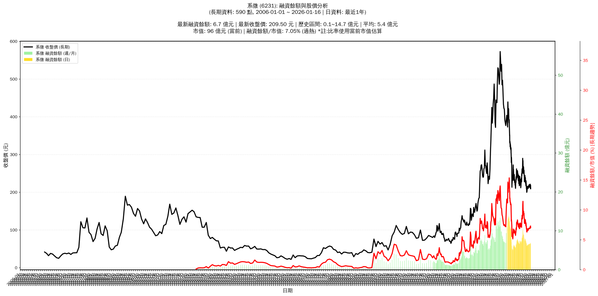

# :chart_with_upwards_trend: 系微 (6231) 融資餘額報告

!!! info "基本資訊"
    **:building_construction: 名稱**: 系微
    **:identification_card: 代號**: 6231
    **:calendar: 分析期間**: 2025-07-18 ~ 2026-01-09 (共 242 個交易日)
    **:clock3: 最新資料**: 2026-01-09
    **🕒 更新時間**: 2026-01-12 13:16:27 CST

## :moneybag: 融資餘額現況

| :chart: 指標 | :1234: 數值 | :traffic_light: 狀態 |
|:------------:|:----------:|:-------------------:|
| **最新融資餘額** | 6.8 億元 (3,127 張) | - |
| **最新收盤價** | 216.50 元 | - |
| **市值** | 99 億元 | - |
| **融資餘額/市值** | 6.85% | 🔴 過熱 |
| **日變化 (DoD)** | -0.0 億元 (-0.02%) | 📉 |
| **週變化 (WoW)** | +0.1 億元 (+1.19%) | 📈 |
| **月變化 (MoM)** | +0.4 億元 (+5.66%) | 📈 |

---

## :bar_chart: 歷史統計

| :chart: 指標 | :1234: 數值 |
|:------------:|:----------:|
| **歷史最高** | 14.7 億元 |
| **歷史最低** | 4.9 億元 |
| **平均值** | 7.9 億元 |
| **標準差** | 2.2 億元 |
| **當前相對位置** | 18.8% |

---

## :chart_with_upwards_trend: 融資餘額趨勢圖

    

---

## :clipboard: 詳細歷史記錄 (最近30日)

<table class="sortable-table">
<thead>
<tr>
<th markdown="span">:calendar: 日期</th>
<th markdown="span">:money_with_wings: 收盤價(元)</th>
<th markdown="span">:chart: 漲跌(元)</th>
<th markdown="span">:chart_with_upwards_trend: 漲跌(%)</th>
<th markdown="span">:package: 融資餘額(億元)</th>
<th markdown="span">:package: 融資餘額(張)</th>
<th markdown="span">:arrow_up_down: 融資增減(張)</th>
<th markdown="span">:chart: 融券餘額(張)</th>
<th markdown="span">:balance_scale: 券資比(%)</th>
</tr>
</thead>
<tbody>
<tr>
<td>2026-01-09</td>
<td>216.50</td>
<td>🔻 -3.50</td>
<td>-1.59%</td>
<td>6.8</td>
<td>3,127</td>
<td>📈 +49</td>
<td>5</td>
<td>0.16%</td>
</tr>
<tr>
<td>2026-01-08</td>
<td>220.00</td>
<td>🔻 -1.50</td>
<td>-0.68%</td>
<td>6.8</td>
<td>3,078</td>
<td>📉 -18</td>
<td>5</td>
<td>0.16%</td>
</tr>
<tr>
<td>2026-01-07</td>
<td>221.50</td>
<td>🔺 +7.50</td>
<td>+3.50%</td>
<td>6.9</td>
<td>3,096</td>
<td>📉 -2</td>
<td>5</td>
<td>0.16%</td>
</tr>
<tr>
<td>2026-01-06</td>
<td>214.00</td>
<td>🔺 +1.00</td>
<td>+0.47%</td>
<td>6.6</td>
<td>3,098</td>
<td>➡️ +0</td>
<td>5</td>
<td>0.16%</td>
</tr>
<tr>
<td>2026-01-05</td>
<td>213.00</td>
<td>🔻 -5.50</td>
<td>-2.52%</td>
<td>6.6</td>
<td>3,098</td>
<td>📈 +36</td>
<td>5</td>
<td>0.16%</td>
</tr>
<tr>
<td>2026-01-02</td>
<td>218.50</td>
<td>🔺 +4.50</td>
<td>+2.10%</td>
<td>6.7</td>
<td>3,062</td>
<td>📉 -17</td>
<td>5</td>
<td>0.16%</td>
</tr>
<tr>
<td>2025-12-31</td>
<td>214.00</td>
<td>🔻 -2.50</td>
<td>-1.15%</td>
<td>6.6</td>
<td>3,079</td>
<td>📈 +15</td>
<td>5</td>
<td>0.16%</td>
</tr>
<tr>
<td>2025-12-30</td>
<td>216.50</td>
<td>🔺 +1.00</td>
<td>+0.46%</td>
<td>6.6</td>
<td>3,064</td>
<td>📈 +3</td>
<td>5</td>
<td>0.16%</td>
</tr>
<tr>
<td>2025-12-29</td>
<td>215.50</td>
<td>🔺 +1.00</td>
<td>+0.47%</td>
<td>6.6</td>
<td>3,061</td>
<td>📉 -7</td>
<td>5</td>
<td>0.16%</td>
</tr>
<tr>
<td>2025-12-26</td>
<td>214.50</td>
<td>🔻 -4.00</td>
<td>-1.83%</td>
<td>6.6</td>
<td>3,068</td>
<td>📈 +32</td>
<td>5</td>
<td>0.16%</td>
</tr>
<tr>
<td>2025-12-24</td>
<td>218.50</td>
<td>🔻 -1.50</td>
<td>-0.68%</td>
<td>6.6</td>
<td>3,036</td>
<td>📈 +18</td>
<td>7</td>
<td>0.23%</td>
</tr>
<tr>
<td>2025-12-23</td>
<td>220.00</td>
<td>🔺 +1.50</td>
<td>+0.69%</td>
<td>6.6</td>
<td>3,018</td>
<td>📈 +1</td>
<td>7</td>
<td>0.23%</td>
</tr>
<tr>
<td>2025-12-22</td>
<td>218.50</td>
<td>🔺 +5.00</td>
<td>+2.34%</td>
<td>6.6</td>
<td>3,017</td>
<td>📉 -43</td>
<td>7</td>
<td>0.23%</td>
</tr>
<tr>
<td>2025-12-19</td>
<td>213.50</td>
<td>➖ +0.00</td>
<td>+0.00%</td>
<td>6.5</td>
<td>3,060</td>
<td>📉 -2</td>
<td>5</td>
<td>0.16%</td>
</tr>
<tr>
<td>2025-12-18</td>
<td>213.50</td>
<td>🔻 -2.50</td>
<td>-1.16%</td>
<td>6.5</td>
<td>3,062</td>
<td>📉 -12</td>
<td>6</td>
<td>0.20%</td>
</tr>
<tr>
<td>2025-12-17</td>
<td>216.00</td>
<td>🔺 +1.00</td>
<td>+0.47%</td>
<td>6.6</td>
<td>3,074</td>
<td>📉 -9</td>
<td>6</td>
<td>0.20%</td>
</tr>
<tr>
<td>2025-12-16</td>
<td>215.00</td>
<td>🔻 -2.00</td>
<td>-0.92%</td>
<td>6.6</td>
<td>3,083</td>
<td>📈 +60</td>
<td>6</td>
<td>0.19%</td>
</tr>
<tr>
<td>2025-12-15</td>
<td>217.00</td>
<td>🔺 +6.00</td>
<td>+2.84%</td>
<td>6.6</td>
<td>3,023</td>
<td>📉 -7</td>
<td>6</td>
<td>0.20%</td>
</tr>
<tr>
<td>2025-12-12</td>
<td>211.00</td>
<td>➖ +0.00</td>
<td>+0.00%</td>
<td>6.4</td>
<td>3,030</td>
<td>📈 +2</td>
<td>5</td>
<td>0.17%</td>
</tr>
<tr>
<td>2025-12-11</td>
<td>211.00</td>
<td>🔻 -2.00</td>
<td>-0.94%</td>
<td>6.4</td>
<td>3,028</td>
<td>📈 +20</td>
<td>5</td>
<td>0.17%</td>
</tr>
<tr>
<td>2025-12-10</td>
<td>213.00</td>
<td>🔻 -1.50</td>
<td>-0.70%</td>
<td>6.4</td>
<td>3,008</td>
<td>📈 +30</td>
<td>6</td>
<td>0.20%</td>
</tr>
<tr>
<td>2025-12-09</td>
<td>214.50</td>
<td>🔺 +4.00</td>
<td>+1.90%</td>
<td>6.4</td>
<td>2,978</td>
<td>📉 -10</td>
<td>9</td>
<td>0.30%</td>
</tr>
<tr>
<td>2025-12-08</td>
<td>210.50</td>
<td>🔺 +0.50</td>
<td>+0.24%</td>
<td>6.3</td>
<td>2,988</td>
<td>📉 -5</td>
<td>8</td>
<td>0.27%</td>
</tr>
<tr>
<td>2025-12-05</td>
<td>210.00</td>
<td>🔻 -2.00</td>
<td>-0.94%</td>
<td>6.3</td>
<td>2,993</td>
<td>📉 -7</td>
<td>10</td>
<td>0.33%</td>
</tr>
<tr>
<td>2025-12-04</td>
<td>212.00</td>
<td>🔻 -1.50</td>
<td>-0.70%</td>
<td>6.4</td>
<td>3,000</td>
<td>📉 -19</td>
<td>10</td>
<td>0.33%</td>
</tr>
<tr>
<td>2025-12-03</td>
<td>213.50</td>
<td>🔻 -0.50</td>
<td>-0.23%</td>
<td>6.4</td>
<td>3,019</td>
<td>📉 -1</td>
<td>10</td>
<td>0.33%</td>
</tr>
<tr>
<td>2025-12-02</td>
<td>214.00</td>
<td>🔻 -2.00</td>
<td>-0.93%</td>
<td>6.5</td>
<td>3,020</td>
<td>📉 -8</td>
<td>10</td>
<td>0.33%</td>
</tr>
<tr>
<td>2025-12-01</td>
<td>216.00</td>
<td>🔺 +3.00</td>
<td>+1.41%</td>
<td>6.5</td>
<td>3,028</td>
<td>📈 +59</td>
<td>11</td>
<td>0.36%</td>
</tr>
<tr>
<td>2025-11-28</td>
<td>213.00</td>
<td>🔺 +2.50</td>
<td>+1.19%</td>
<td>6.3</td>
<td>2,969</td>
<td>📉 -12</td>
<td>19</td>
<td>0.64%</td>
</tr>
<tr>
<td>2025-11-27</td>
<td>210.50</td>
<td>🔻 -0.50</td>
<td>-0.24%</td>
<td>6.3</td>
<td>2,981</td>
<td>📉 -8</td>
<td>19</td>
<td>0.64%</td>
</tr>
</tbody>
</table>

---

## :information_source: 資料來源與方法

!!! note "資料來源說明"
    - **主要來源**: `raw_margin_daily.csv` (Type 13: ShowMarginChart)
    - **資料頻率**: 每日更新
    - **資料範圍**: 近1年交易日資料

!!! info "報告元資訊"
    - **報告產生時間**: 2026-01-12 13:16:27
    - **分析期間**: 242 個交易日
    - **資料來源**: Stage 1 Raw Margin Daily Data

---

:material-information-outline: **本報告僅供參考，投資決策請審慎評估**

