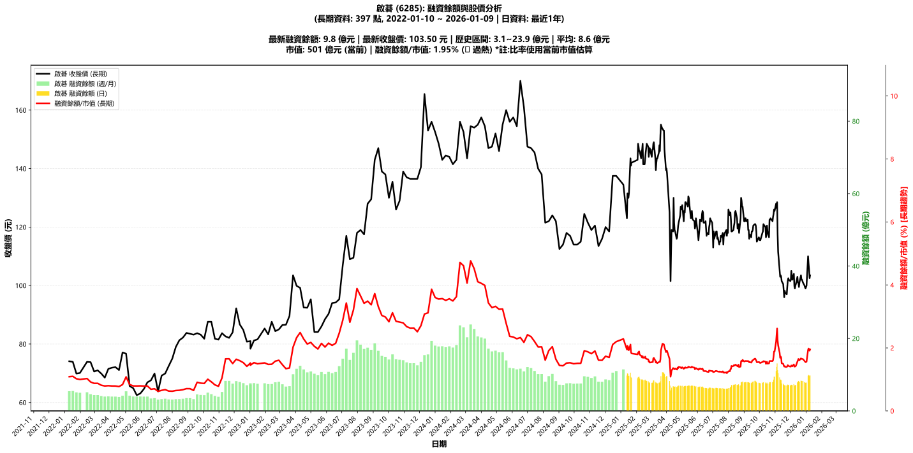

# :chart_with_upwards_trend: 啟碁 (6285) 融資餘額報告

!!! info "基本資訊"
    **:building_construction: 名稱**: 啟碁
    **:identification_card: 代號**: 6285
    **:calendar: 分析期間**: 2025-07-18 ~ 2026-01-09 (共 242 個交易日)
    **:clock3: 最新資料**: 2026-01-09
    **🕒 更新時間**: 2026-01-12 13:14:17 CST

## :moneybag: 融資餘額現況

| :chart: 指標 | :1234: 數值 | :traffic_light: 狀態 |
|:------------:|:----------:|:-------------------:|
| **最新融資餘額** | 9.8 億元 (9,448 張) | - |
| **最新收盤價** | 103.50 元 | - |
| **市值** | 501 億元 | - |
| **融資餘額/市值** | 1.95% | 🔴 過熱 |
| **日變化 (DoD)** | +0.2 億元 (+2.09%) | 📈 |
| **週變化 (WoW)** | +2.0 億元 (+24.97%) | 📈 |
| **月變化 (MoM)** | +2.7 億元 (+38.71%) | 📈 |

---

## :bar_chart: 歷史統計

| :chart: 指標 | :1234: 數值 |
|:------------:|:----------:|
| **歷史最高** | 13.1 億元 |
| **歷史最低** | 5.4 億元 |
| **平均值** | 7.7 億元 |
| **標準差** | 1.2 億元 |
| **當前相對位置** | 56.6% |

---

## :chart_with_upwards_trend: 融資餘額趨勢圖

    

---

## :clipboard: 詳細歷史記錄 (最近30日)

<table class="sortable-table">
<thead>
<tr>
<th markdown="span">:calendar: 日期</th>
<th markdown="span">:money_with_wings: 收盤價(元)</th>
<th markdown="span">:chart: 漲跌(元)</th>
<th markdown="span">:chart_with_upwards_trend: 漲跌(%)</th>
<th markdown="span">:package: 融資餘額(億元)</th>
<th markdown="span">:package: 融資餘額(張)</th>
<th markdown="span">:arrow_up_down: 融資增減(張)</th>
<th markdown="span">:chart: 融券餘額(張)</th>
<th markdown="span">:balance_scale: 券資比(%)</th>
</tr>
</thead>
<tbody>
<tr>
<td>2026-01-09</td>
<td>103.50</td>
<td>🔺 +1.00</td>
<td>+0.98%</td>
<td>9.8</td>
<td>9,448</td>
<td>📈 +103</td>
<td>26</td>
<td>0.28%</td>
</tr>
<tr>
<td>2026-01-08</td>
<td>102.50</td>
<td>🔻 -3.00</td>
<td>-2.84%</td>
<td>9.6</td>
<td>9,345</td>
<td>📈 +49</td>
<td>24</td>
<td>0.26%</td>
</tr>
<tr>
<td>2026-01-07</td>
<td>105.50</td>
<td>🔻 -2.00</td>
<td>-1.86%</td>
<td>9.8</td>
<td>9,296</td>
<td>📈 +64</td>
<td>32</td>
<td>0.34%</td>
</tr>
<tr>
<td>2026-01-06</td>
<td>107.50</td>
<td>🔻 -2.50</td>
<td>-2.27%</td>
<td>9.9</td>
<td>9,232</td>
<td>📈 +419</td>
<td>126</td>
<td>1.36%</td>
</tr>
<tr>
<td>2026-01-05</td>
<td>110.00</td>
<td>🔺 +10.00</td>
<td>+10.00%</td>
<td>9.7</td>
<td>8,813</td>
<td>📈 +988</td>
<td>84</td>
<td>0.95%</td>
</tr>
<tr>
<td>2026-01-02</td>
<td>100.00</td>
<td>🔺 +1.00</td>
<td>+1.01%</td>
<td>7.8</td>
<td>7,825</td>
<td>📉 -7</td>
<td>16</td>
<td>0.20%</td>
</tr>
<tr>
<td>2025-12-31</td>
<td>99.00</td>
<td>🔻 -0.40</td>
<td>-0.40%</td>
<td>7.8</td>
<td>7,832</td>
<td>📉 -72</td>
<td>18</td>
<td>0.23%</td>
</tr>
<tr>
<td>2025-12-30</td>
<td>99.40</td>
<td>🔻 -0.60</td>
<td>-0.60%</td>
<td>7.9</td>
<td>7,904</td>
<td>📉 -35</td>
<td>14</td>
<td>0.18%</td>
</tr>
<tr>
<td>2025-12-29</td>
<td>100.00</td>
<td>🔻 -1.00</td>
<td>-0.99%</td>
<td>7.9</td>
<td>7,939</td>
<td>📉 -210</td>
<td>14</td>
<td>0.18%</td>
</tr>
<tr>
<td>2025-12-26</td>
<td>101.00</td>
<td>🔻 -1.00</td>
<td>-0.98%</td>
<td>8.2</td>
<td>8,149</td>
<td>📈 +32</td>
<td>18</td>
<td>0.22%</td>
</tr>
<tr>
<td>2025-12-24</td>
<td>102.00</td>
<td>➖ +0.00</td>
<td>+0.00%</td>
<td>8.3</td>
<td>8,117</td>
<td>📈 +16</td>
<td>14</td>
<td>0.17%</td>
</tr>
<tr>
<td>2025-12-23</td>
<td>102.00</td>
<td>🔻 -1.50</td>
<td>-1.45%</td>
<td>8.3</td>
<td>8,101</td>
<td>📈 +26</td>
<td>14</td>
<td>0.17%</td>
</tr>
<tr>
<td>2025-12-22</td>
<td>103.50</td>
<td>🔺 +2.50</td>
<td>+2.48%</td>
<td>8.4</td>
<td>8,075</td>
<td>📈 +102</td>
<td>14</td>
<td>0.17%</td>
</tr>
<tr>
<td>2025-12-19</td>
<td>101.00</td>
<td>🔺 +1.50</td>
<td>+1.51%</td>
<td>8.1</td>
<td>7,973</td>
<td>📉 -144</td>
<td>11</td>
<td>0.14%</td>
</tr>
<tr>
<td>2025-12-18</td>
<td>99.50</td>
<td>🔻 -1.50</td>
<td>-1.49%</td>
<td>8.1</td>
<td>8,117</td>
<td>📉 -68</td>
<td>13</td>
<td>0.16%</td>
</tr>
<tr>
<td>2025-12-17</td>
<td>101.00</td>
<td>➖ +0.00</td>
<td>+0.00%</td>
<td>8.3</td>
<td>8,185</td>
<td>📈 +231</td>
<td>13</td>
<td>0.16%</td>
</tr>
<tr>
<td>2025-12-16</td>
<td>101.00</td>
<td>🔻 -2.00</td>
<td>-1.94%</td>
<td>8.0</td>
<td>7,954</td>
<td>📈 +332</td>
<td>13</td>
<td>0.16%</td>
</tr>
<tr>
<td>2025-12-15</td>
<td>103.00</td>
<td>🔺 +2.50</td>
<td>+2.49%</td>
<td>7.9</td>
<td>7,622</td>
<td>📈 +500</td>
<td>15</td>
<td>0.20%</td>
</tr>
<tr>
<td>2025-12-12</td>
<td>100.50</td>
<td>🔺 +0.50</td>
<td>+0.50%</td>
<td>7.2</td>
<td>7,122</td>
<td>📈 +16</td>
<td>11</td>
<td>0.15%</td>
</tr>
<tr>
<td>2025-12-11</td>
<td>100.00</td>
<td>🔺 +1.00</td>
<td>+1.01%</td>
<td>7.1</td>
<td>7,106</td>
<td>📉 -15</td>
<td>18</td>
<td>0.25%</td>
</tr>
<tr>
<td>2025-12-10</td>
<td>99.00</td>
<td>🔻 -0.80</td>
<td>-0.80%</td>
<td>7.0</td>
<td>7,121</td>
<td>📈 +57</td>
<td>20</td>
<td>0.28%</td>
</tr>
<tr>
<td>2025-12-09</td>
<td>99.80</td>
<td>🔻 -4.20</td>
<td>-4.04%</td>
<td>7.0</td>
<td>7,064</td>
<td>📉 -45</td>
<td>13</td>
<td>0.18%</td>
</tr>
<tr>
<td>2025-12-08</td>
<td>104.00</td>
<td>🔺 +2.00</td>
<td>+1.96%</td>
<td>7.4</td>
<td>7,109</td>
<td>📈 +147</td>
<td>13</td>
<td>0.18%</td>
</tr>
<tr>
<td>2025-12-05</td>
<td>102.00</td>
<td>🔻 -1.50</td>
<td>-1.45%</td>
<td>7.1</td>
<td>6,962</td>
<td>📈 +6</td>
<td>14</td>
<td>0.20%</td>
</tr>
<tr>
<td>2025-12-04</td>
<td>103.50</td>
<td>🔻 -1.50</td>
<td>-1.43%</td>
<td>7.2</td>
<td>6,956</td>
<td>📈 +75</td>
<td>16</td>
<td>0.23%</td>
</tr>
<tr>
<td>2025-12-03</td>
<td>105.00</td>
<td>🔺 +3.00</td>
<td>+2.94%</td>
<td>7.2</td>
<td>6,881</td>
<td>📉 -34</td>
<td>16</td>
<td>0.23%</td>
</tr>
<tr>
<td>2025-12-02</td>
<td>102.00</td>
<td>🔺 +0.50</td>
<td>+0.49%</td>
<td>7.1</td>
<td>6,915</td>
<td>📉 -31</td>
<td>17</td>
<td>0.25%</td>
</tr>
<tr>
<td>2025-12-01</td>
<td>101.50</td>
<td>🔻 -0.50</td>
<td>-0.49%</td>
<td>7.1</td>
<td>6,946</td>
<td>📉 -42</td>
<td>16</td>
<td>0.23%</td>
</tr>
<tr>
<td>2025-11-28</td>
<td>102.00</td>
<td>🔻 -0.50</td>
<td>-0.49%</td>
<td>7.1</td>
<td>6,988</td>
<td>📉 -27</td>
<td>15</td>
<td>0.21%</td>
</tr>
<tr>
<td>2025-11-27</td>
<td>102.50</td>
<td>🔺 +1.00</td>
<td>+0.99%</td>
<td>7.2</td>
<td>7,015</td>
<td>📉 -151</td>
<td>15</td>
<td>0.21%</td>
</tr>
</tbody>
</table>

---

## :information_source: 資料來源與方法

!!! note "資料來源說明"
    - **主要來源**: `raw_margin_daily.csv` (Type 13: ShowMarginChart)
    - **資料頻率**: 每日更新
    - **資料範圍**: 近1年交易日資料

!!! info "報告元資訊"
    - **報告產生時間**: 2026-01-12 13:14:17
    - **分析期間**: 242 個交易日
    - **資料來源**: Stage 1 Raw Margin Daily Data

---

:material-information-outline: **本報告僅供參考，投資決策請審慎評估**

