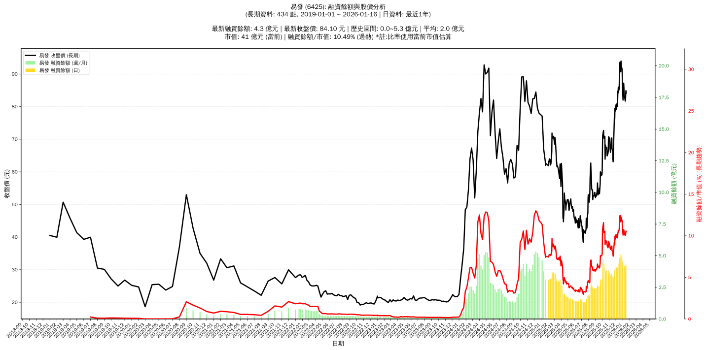

# 📈 易發 (6425) 融資餘額報告

!!! info "基本資訊"
    **🏗️ 名稱**: 易發
    **🪪 代號**: 6425
    **📅 分析期間**: 2025-07-23 ~ 2026-01-14 (共 242 個交易日)
    **🕒 最新資料**: 2026-01-14
    **🕒 更新時間**: 2026-01-15 12:56:07 CST

## 💰 融資餘額現況

| 📊 指標 | 🔢 數值 | 🚦 狀態 |
|:------------:|:----------:|:-------------------:|
| **最新融資餘額** | 4.2 億元 (5,067 張) | - |
| **最新收盤價** | 83.80 元 | - |
| **市值** | 41 億元 | - |
| **融資餘額/市值** | 10.26% | 🔴 過熱 |
| **日變化 (DoD)** | +0.1 億元 (+2.76%) | 📈 |
| **週變化 (WoW)** | -0.0 億元 (-0.82%) | 📉 |
| **月變化 (MoM)** | -0.1 億元 (-2.98%) | 📉 |

---

## 📊 歷史統計

| 📊 指標 | 🔢 數值 |
|:------------:|:----------:|
| **歷史最高** | 5.1 億元 |
| **歷史最低** | 1.2 億元 |
| **平均值** | 2.8 億元 |
| **標準差** | 1.1 億元 |
| **當前相對位置** | 78.0% |

---

## 📈 融資餘額趨勢圖

{: style="max-width: 100%; height: auto;"}

---

## 📋 詳細歷史記錄 (最近30日)

<table class="sortable-table">
<thead>
<tr>
<th markdown="span">📅 日期</th>
<th markdown="span">💸 收盤價(元)</th>
<th markdown="span">📊 漲跌(元)</th>
<th markdown="span">📈 漲跌(%)</th>
<th markdown="span">📦 融資餘額(億元)</th>
<th markdown="span">📦 融資餘額(張)</th>
<th markdown="span">↕️ 融資增減(張)</th>
<th markdown="span">📊 融券餘額(張)</th>
<th markdown="span">⚖️ 券資比(%)</th>
</tr>
</thead>
<tbody>
<tr>
<td>2026-01-14</td>
<td>83.80</td>
<td>🔺 +1.80</td>
<td>+2.20%</td>
<td>4.2</td>
<td>5,067</td>
<td>📈 +28</td>
<td>395</td>
<td>7.80%</td>
</tr>
<tr>
<td>2026-01-13</td>
<td>82.00</td>
<td>🔺 +0.30</td>
<td>+0.37%</td>
<td>4.1</td>
<td>5,039</td>
<td>📈 +1</td>
<td>396</td>
<td>7.86%</td>
</tr>
<tr>
<td>2026-01-12</td>
<td>81.70</td>
<td>🔻 -1.30</td>
<td>-1.57%</td>
<td>4.1</td>
<td>5,038</td>
<td>📉 -3</td>
<td>393</td>
<td>7.80%</td>
</tr>
<tr>
<td>2026-01-09</td>
<td>83.00</td>
<td>➖ +0.00</td>
<td>+0.00%</td>
<td>4.2</td>
<td>5,041</td>
<td>📉 -2</td>
<td>397</td>
<td>7.88%</td>
</tr>
<tr>
<td>2026-01-08</td>
<td>83.00</td>
<td>🔻 -0.60</td>
<td>-0.72%</td>
<td>4.2</td>
<td>5,043</td>
<td>📉 -78</td>
<td>407</td>
<td>8.07%</td>
</tr>
<tr>
<td>2026-01-07</td>
<td>83.60</td>
<td>🔻 -2.30</td>
<td>-2.68%</td>
<td>4.3</td>
<td>5,121</td>
<td>📈 +44</td>
<td>418</td>
<td>8.16%</td>
</tr>
<tr>
<td>2026-01-06</td>
<td>85.90</td>
<td>🔻 -1.30</td>
<td>-1.49%</td>
<td>4.4</td>
<td>5,077</td>
<td>📈 +20</td>
<td>432</td>
<td>8.51%</td>
</tr>
<tr>
<td>2026-01-05</td>
<td>87.20</td>
<td>🔺 +5.20</td>
<td>+6.34%</td>
<td>4.4</td>
<td>5,057</td>
<td>📈 +9</td>
<td>427</td>
<td>8.44%</td>
</tr>
<tr>
<td>2026-01-02</td>
<td>82.00</td>
<td>🔻 -3.10</td>
<td>-3.64%</td>
<td>4.1</td>
<td>5,048</td>
<td>📉 -158</td>
<td>417</td>
<td>8.26%</td>
</tr>
<tr>
<td>2025-12-31</td>
<td>85.10</td>
<td>🔻 -2.70</td>
<td>-3.08%</td>
<td>4.4</td>
<td>5,206</td>
<td>📉 -45</td>
<td>459</td>
<td>8.82%</td>
</tr>
<tr>
<td>2025-12-30</td>
<td>87.80</td>
<td>🔻 -3.60</td>
<td>-3.94%</td>
<td>4.6</td>
<td>5,251</td>
<td>📉 -41</td>
<td>472</td>
<td>8.99%</td>
</tr>
<tr>
<td>2025-12-29</td>
<td>91.40</td>
<td>🔻 -0.90</td>
<td>-0.98%</td>
<td>4.8</td>
<td>5,292</td>
<td>📉 -77</td>
<td>497</td>
<td>9.39%</td>
</tr>
<tr>
<td>2025-12-26</td>
<td>92.30</td>
<td>🔻 -1.70</td>
<td>-1.81%</td>
<td>5.0</td>
<td>5,369</td>
<td>📈 +16</td>
<td>521</td>
<td>9.70%</td>
</tr>
<tr>
<td>2025-12-24</td>
<td>94.00</td>
<td>🔺 +3.30</td>
<td>+3.64%</td>
<td>5.0</td>
<td>5,353</td>
<td>📈 +65</td>
<td>541</td>
<td>10.10%</td>
</tr>
<tr>
<td>2025-12-23</td>
<td>90.70</td>
<td>🔻 -2.50</td>
<td>-2.68%</td>
<td>4.8</td>
<td>5,288</td>
<td>📉 -184</td>
<td>577</td>
<td>10.90%</td>
</tr>
<tr>
<td>2025-12-22</td>
<td>93.20</td>
<td>🔻 -0.40</td>
<td>-0.43%</td>
<td>5.1</td>
<td>5,472</td>
<td>📈 +26</td>
<td>635</td>
<td>11.60%</td>
</tr>
<tr>
<td>2025-12-19</td>
<td>93.60</td>
<td>🔺 +3.20</td>
<td>+3.54%</td>
<td>5.1</td>
<td>5,446</td>
<td>📈 +64</td>
<td>645</td>
<td>11.80%</td>
</tr>
<tr>
<td>2025-12-18</td>
<td>90.40</td>
<td>🔺 +0.50</td>
<td>+0.56%</td>
<td>4.9</td>
<td>5,382</td>
<td>📈 +32</td>
<td>613</td>
<td>11.40%</td>
</tr>
<tr>
<td>2025-12-17</td>
<td>89.90</td>
<td>🔺 +3.90</td>
<td>+4.53%</td>
<td>4.8</td>
<td>5,350</td>
<td>📈 +236</td>
<td>524</td>
<td>9.79%</td>
</tr>
<tr>
<td>2025-12-16</td>
<td>86.00</td>
<td>🔺 +0.90</td>
<td>+1.06%</td>
<td>4.4</td>
<td>5,114</td>
<td>📉 -29</td>
<td>447</td>
<td>8.74%</td>
</tr>
<tr>
<td>2025-12-15</td>
<td>85.10</td>
<td>🔻 -0.90</td>
<td>-1.05%</td>
<td>4.4</td>
<td>5,143</td>
<td>📈 +54</td>
<td>447</td>
<td>8.69%</td>
</tr>
<tr>
<td>2025-12-12</td>
<td>86.00</td>
<td>🔺 +1.80</td>
<td>+2.14%</td>
<td>4.4</td>
<td>5,089</td>
<td>📈 +11</td>
<td>436</td>
<td>8.57%</td>
</tr>
<tr>
<td>2025-12-11</td>
<td>84.20</td>
<td>🔻 -0.60</td>
<td>-0.71%</td>
<td>4.3</td>
<td>5,078</td>
<td>📈 +72</td>
<td>436</td>
<td>8.59%</td>
</tr>
<tr>
<td>2025-12-10</td>
<td>84.80</td>
<td>🔺 +2.80</td>
<td>+3.41%</td>
<td>4.2</td>
<td>5,006</td>
<td>📈 +39</td>
<td>424</td>
<td>8.47%</td>
</tr>
<tr>
<td>2025-12-09</td>
<td>82.00</td>
<td>🔺 +2.00</td>
<td>+2.50%</td>
<td>4.1</td>
<td>4,967</td>
<td>📉 -41</td>
<td>400</td>
<td>8.05%</td>
</tr>
<tr>
<td>2025-12-08</td>
<td>80.00</td>
<td>🔻 -0.80</td>
<td>-0.99%</td>
<td>4.0</td>
<td>5,008</td>
<td>📈 +20</td>
<td>381</td>
<td>7.61%</td>
</tr>
<tr>
<td>2025-12-05</td>
<td>80.80</td>
<td>➖ +0.00</td>
<td>+0.00%</td>
<td>4.0</td>
<td>4,988</td>
<td>📉 -55</td>
<td>382</td>
<td>7.66%</td>
</tr>
<tr>
<td>2025-12-04</td>
<td>80.80</td>
<td>🔺 +1.60</td>
<td>+2.02%</td>
<td>4.1</td>
<td>5,043</td>
<td>📉 -36</td>
<td>379</td>
<td>7.52%</td>
</tr>
<tr>
<td>2025-12-03</td>
<td>79.20</td>
<td>🔻 -1.40</td>
<td>-1.74%</td>
<td>4.0</td>
<td>5,079</td>
<td>📉 -102</td>
<td>340</td>
<td>6.69%</td>
</tr>
<tr>
<td>2025-12-02</td>
<td>80.60</td>
<td>🔺 +0.40</td>
<td>+0.50%</td>
<td>4.2</td>
<td>5,181</td>
<td>📈 +45</td>
<td>377</td>
<td>7.28%</td>
</tr>
</tbody>
</table>

---

## ℹ️ 資料來源與方法

!!! note "資料來源說明"
    - **主要來源**: `raw_margin_daily.csv` (Type 13: ShowMarginChart)
    - **資料頻率**: 每日更新
    - **資料範圍**: 近1年交易日資料

!!! info "報告元資訊"
    - **報告產生時間**: 2026-01-15 12:56:07
    - **分析期間**: 242 個交易日
    - **資料來源**: Stage 1 Raw Margin Daily Data

---

:material-information-outline: **本報告僅供參考，投資決策請審慎評估**

