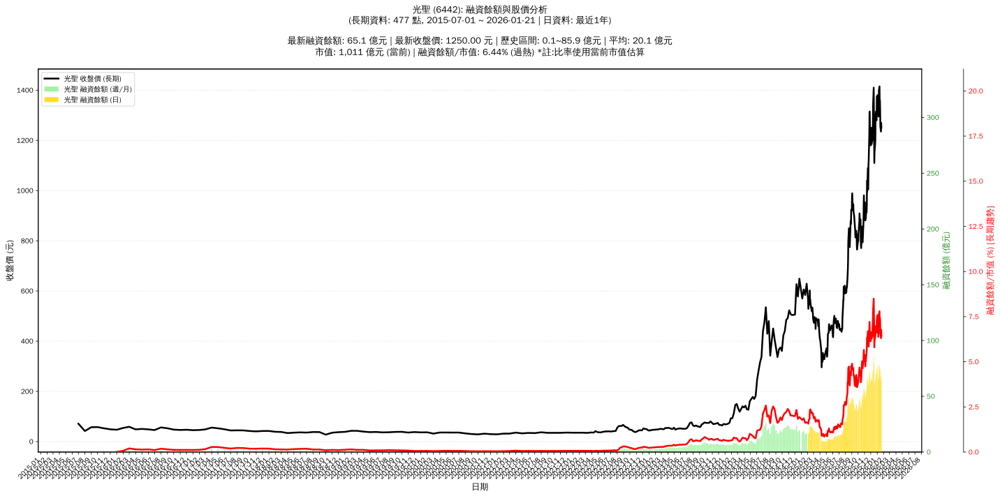

# :chart_with_upwards_trend: 光聖 (6442) 融資餘額報告

!!! info "基本資訊"
    **:building_construction: 名稱**: 光聖
    **:identification_card: 代號**: 6442
    **:calendar: 分析期間**: 2025-07-18 ~ 2026-01-09 (共 242 個交易日)
    **:clock3: 最新資料**: 2026-01-09
    **🕒 更新時間**: 2026-01-11 20:29:29 CST

## :moneybag: 融資餘額現況

| :chart: 指標 | :1234: 數值 | :traffic_light: 狀態 |
|:------------:|:----------:|:-------------------:|
| **最新融資餘額** | 77.3 億元 (5,519 張) | - |
| **最新收盤價** | 1400.00 元 | - |
| **市值** | 1,093 億元 | - |
| **融資餘額/市值** | 7.07% | 🔴 過熱 |
| **日變化 (DoD)** | +10.6 億元 (+15.87%) | 📈 |
| **週變化 (WoW)** | +0.6 億元 (+0.76%) | 📈 |
| **月變化 (MoM)** | +6.7 億元 (+9.46%) | 📈 |

---

## :bar_chart: 歷史統計

| :chart: 指標 | :1234: 數值 |
|:------------:|:----------:|
| **歷史最高** | 85.9 億元 |
| **歷史最低** | 8.6 億元 |
| **平均值** | 32.2 億元 |
| **標準差** | 20.9 億元 |
| **當前相對位置** | 88.9% |

---

## :chart_with_upwards_trend: 融資餘額趨勢圖

    

---

## :clipboard: 詳細歷史記錄 (最近30日)

<table class="sortable-table">
<thead>
<tr>
<th>:calendar: 日期</th>
<th>:money_with_wings: 收盤價(元)</th>
<th>:chart: 漲跌(元)</th>
<th>:chart_with_upwards_trend: 漲跌(%)</th>
<th>:package: 融資餘額(億元)</th>
<th>:package: 融資餘額(張)</th>
<th>:arrow_up_down: 融資增減(張)</th>
<th>:chart: 融券餘額(張)</th>
<th>:balance_scale: 券資比(%)</th>
</tr>
</thead>
<tbody>
<tr>
<td>2026-01-09</td>
<td>1400.00</td>
<td>🔺 +70.00</td>
<td>+5.26%</td>
<td>77.3</td>
<td>5,519</td>
<td>📈 +505</td>
<td>393</td>
<td>7.12%</td>
</tr>
<tr>
<td>2026-01-08</td>
<td>1330.00</td>
<td>🔺 +35.00</td>
<td>+2.70%</td>
<td>66.7</td>
<td>5,014</td>
<td>📉 -29</td>
<td>374</td>
<td>7.46%</td>
</tr>
<tr>
<td>2026-01-07</td>
<td>1295.00</td>
<td>🔻 -5.00</td>
<td>-0.38%</td>
<td>65.3</td>
<td>5,043</td>
<td>📈 +83</td>
<td>371</td>
<td>7.36%</td>
</tr>
<tr>
<td>2026-01-06</td>
<td>1300.00</td>
<td>🔻 -25.00</td>
<td>-1.89%</td>
<td>64.5</td>
<td>4,960</td>
<td>📉 -346</td>
<td>370</td>
<td>7.46%</td>
</tr>
<tr>
<td>2026-01-05</td>
<td>1325.00</td>
<td>🔻 -55.00</td>
<td>-3.99%</td>
<td>70.3</td>
<td>5,306</td>
<td>📉 -251</td>
<td>388</td>
<td>7.31%</td>
</tr>
<tr>
<td>2026-01-02</td>
<td>1380.00</td>
<td>🔺 +20.00</td>
<td>+1.47%</td>
<td>76.7</td>
<td>5,557</td>
<td>📈 +17</td>
<td>396</td>
<td>7.13%</td>
</tr>
<tr>
<td>2025-12-31</td>
<td>1360.00</td>
<td>🔻 -15.00</td>
<td>-1.09%</td>
<td>75.3</td>
<td>5,540</td>
<td>📈 +204</td>
<td>397</td>
<td>7.17%</td>
</tr>
<tr>
<td>2025-12-30</td>
<td>1375.00</td>
<td>🔺 +95.00</td>
<td>+7.42%</td>
<td>73.4</td>
<td>5,336</td>
<td>📈 +113</td>
<td>411</td>
<td>7.70%</td>
</tr>
<tr>
<td>2025-12-29</td>
<td>1280.00</td>
<td>🔻 -35.00</td>
<td>-2.66%</td>
<td>66.9</td>
<td>5,223</td>
<td>📉 -146</td>
<td>391</td>
<td>7.49%</td>
</tr>
<tr>
<td>2025-12-26</td>
<td>1315.00</td>
<td>🔺 +20.00</td>
<td>+1.54%</td>
<td>70.6</td>
<td>5,369</td>
<td>📉 -30</td>
<td>404</td>
<td>7.52%</td>
</tr>
<tr>
<td>2025-12-24</td>
<td>1295.00</td>
<td>🔺 +90.00</td>
<td>+7.47%</td>
<td>69.9</td>
<td>5,399</td>
<td>📉 -41</td>
<td>414</td>
<td>7.67%</td>
</tr>
<tr>
<td>2025-12-23</td>
<td>1205.00</td>
<td>🔺 +20.00</td>
<td>+1.69%</td>
<td>65.6</td>
<td>5,440</td>
<td>📈 +11</td>
<td>424</td>
<td>7.79%</td>
</tr>
<tr>
<td>2025-12-22</td>
<td>1185.00</td>
<td>🔺 +30.00</td>
<td>+2.60%</td>
<td>64.3</td>
<td>5,429</td>
<td>📈 +39</td>
<td>436</td>
<td>8.03%</td>
</tr>
<tr>
<td>2025-12-19</td>
<td>1155.00</td>
<td>🔺 +45.00</td>
<td>+4.05%</td>
<td>62.3</td>
<td>5,390</td>
<td>📈 +108</td>
<td>429</td>
<td>7.96%</td>
</tr>
<tr>
<td>2025-12-18</td>
<td>1110.00</td>
<td>🔻 -105.00</td>
<td>-8.64%</td>
<td>58.6</td>
<td>5,282</td>
<td>📉 -720</td>
<td>407</td>
<td>7.71%</td>
</tr>
<tr>
<td>2025-12-17</td>
<td>1215.00</td>
<td>🔻 -120.00</td>
<td>-8.99%</td>
<td>72.9</td>
<td>6,002</td>
<td>📈 +38</td>
<td>448</td>
<td>7.46%</td>
</tr>
<tr>
<td>2025-12-16</td>
<td>1335.00</td>
<td>🔻 -75.00</td>
<td>-5.32%</td>
<td>79.6</td>
<td>5,964</td>
<td>📉 -126</td>
<td>455</td>
<td>7.63%</td>
</tr>
<tr>
<td>2025-12-15</td>
<td>1410.00</td>
<td>🔺 +70.00</td>
<td>+5.22%</td>
<td>85.9</td>
<td>6,090</td>
<td>📈 +158</td>
<td>489</td>
<td>8.03%</td>
</tr>
<tr>
<td>2025-12-12</td>
<td>1340.00</td>
<td>🔺 +80.00</td>
<td>+6.35%</td>
<td>79.5</td>
<td>5,932</td>
<td>📈 +173</td>
<td>460</td>
<td>7.75%</td>
</tr>
<tr>
<td>2025-12-11</td>
<td>1260.00</td>
<td>🔺 +10.00</td>
<td>+0.80%</td>
<td>72.6</td>
<td>5,759</td>
<td>📈 +112</td>
<td>456</td>
<td>7.92%</td>
</tr>
<tr>
<td>2025-12-10</td>
<td>1250.00</td>
<td>🔺 +50.00</td>
<td>+4.17%</td>
<td>70.6</td>
<td>5,647</td>
<td>📈 +234</td>
<td>457</td>
<td>8.09%</td>
</tr>
<tr>
<td>2025-12-09</td>
<td>1200.00</td>
<td>➖ +0.00</td>
<td>+0.00%</td>
<td>65.0</td>
<td>5,413</td>
<td>📈 +45</td>
<td>463</td>
<td>8.55%</td>
</tr>
<tr>
<td>2025-12-08</td>
<td>1200.00</td>
<td>🔺 +15.00</td>
<td>+1.27%</td>
<td>64.4</td>
<td>5,368</td>
<td>📈 +1</td>
<td>478</td>
<td>8.90%</td>
</tr>
<tr>
<td>2025-12-05</td>
<td>1185.00</td>
<td>🔻 -15.00</td>
<td>-1.25%</td>
<td>63.6</td>
<td>5,367</td>
<td>📉 -44</td>
<td>473</td>
<td>8.81%</td>
</tr>
<tr>
<td>2025-12-04</td>
<td>1200.00</td>
<td>🔻 -50.00</td>
<td>-4.00%</td>
<td>64.9</td>
<td>5,411</td>
<td>📈 +37</td>
<td>495</td>
<td>9.15%</td>
</tr>
<tr>
<td>2025-12-03</td>
<td>1250.00</td>
<td>🔺 +20.00</td>
<td>+1.63%</td>
<td>67.2</td>
<td>5,374</td>
<td>📈 +30</td>
<td>506</td>
<td>9.42%</td>
</tr>
<tr>
<td>2025-12-02</td>
<td>1230.00</td>
<td>🔺 +50.00</td>
<td>+4.24%</td>
<td>65.7</td>
<td>5,344</td>
<td>📈 +76</td>
<td>511</td>
<td>9.56%</td>
</tr>
<tr>
<td>2025-12-01</td>
<td>1180.00</td>
<td>🔻 -10.00</td>
<td>-0.84%</td>
<td>62.2</td>
<td>5,268</td>
<td>📈 +55</td>
<td>511</td>
<td>9.70%</td>
</tr>
<tr>
<td>2025-11-28</td>
<td>1190.00</td>
<td>🔻 -65.00</td>
<td>-5.18%</td>
<td>62.0</td>
<td>5,213</td>
<td>📈 +130</td>
<td>514</td>
<td>9.86%</td>
</tr>
<tr>
<td>2025-11-27</td>
<td>1255.00</td>
<td>🔻 -60.00</td>
<td>-4.56%</td>
<td>63.8</td>
<td>5,083</td>
<td>📉 -263</td>
<td>572</td>
<td>11.30%</td>
</tr>
</tbody>
</table>

---

## :information_source: 資料來源與方法

!!! note "資料來源說明"
    - **主要來源**: `raw_margin_daily.csv` (Type 13: ShowMarginChart)
    - **資料頻率**: 每日更新
    - **資料範圍**: 近1年交易日資料

!!! info "報告元資訊"
    - **報告產生時間**: 2026-01-11 20:29:29
    - **分析期間**: 242 個交易日
    - **資料來源**: Stage 1 Raw Margin Daily Data

---

:material-information-outline: **本報告僅供參考，投資決策請審慎評估**

