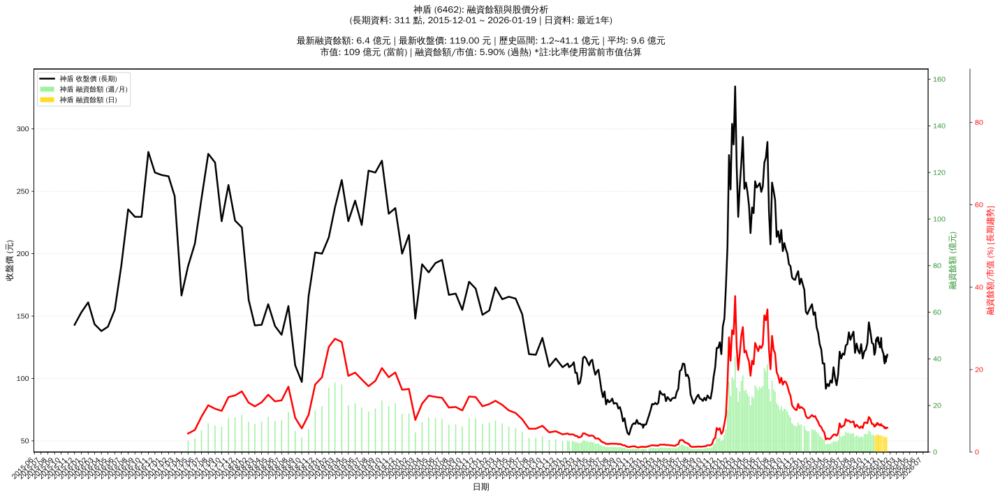

# :chart_with_upwards_trend: 神盾 (6462) 融資餘額報告

!!! info "基本資訊"
    **:building_construction: 名稱**: 神盾
    **:identification_card: 代號**: 6462
    **:calendar: 分析期間**: 2025-07-18 ~ 2026-01-09 (共 242 個交易日)
    **:clock3: 最新資料**: 2026-01-09
    **🕒 更新時間**: 2026-01-12 13:16:03 CST

## :moneybag: 融資餘額現況

| :chart: 指標 | :1234: 數值 | :traffic_light: 狀態 |
|:------------:|:----------:|:-------------------:|
| **最新融資餘額** | 6.3 億元 (5,501 張) | - |
| **最新收盤價** | 114.50 元 | - |
| **市值** | 104 億元 | - |
| **融資餘額/市值** | 6.03% | 🔴 過熱 |
| **日變化 (DoD)** | -0.2 億元 (-3.56%) | 📉 |
| **週變化 (WoW)** | -0.5 億元 (-6.83%) | 📉 |
| **月變化 (MoM)** | -0.9 億元 (-12.39%) | 📉 |

---

## :bar_chart: 歷史統計

| :chart: 指標 | :1234: 數值 |
|:------------:|:----------:|
| **歷史最高** | 10.9 億元 |
| **歷史最低** | 3.3 億元 |
| **平均值** | 7.0 億元 |
| **標準差** | 1.7 億元 |
| **當前相對位置** | 39.5% |

---

## :chart_with_upwards_trend: 融資餘額趨勢圖

    

---

## :clipboard: 詳細歷史記錄 (最近30日)

<table class="sortable-table">
<thead>
<tr>
<th markdown="span">:calendar: 日期</th>
<th markdown="span">:money_with_wings: 收盤價(元)</th>
<th markdown="span">:chart: 漲跌(元)</th>
<th markdown="span">:chart_with_upwards_trend: 漲跌(%)</th>
<th markdown="span">:package: 融資餘額(億元)</th>
<th markdown="span">:package: 融資餘額(張)</th>
<th markdown="span">:arrow_up_down: 融資增減(張)</th>
<th markdown="span">:chart: 融券餘額(張)</th>
<th markdown="span">:balance_scale: 券資比(%)</th>
</tr>
</thead>
<tbody>
<tr>
<td>2026-01-09</td>
<td>114.50</td>
<td>🔻 -3.50</td>
<td>-2.97%</td>
<td>6.3</td>
<td>5,501</td>
<td>📉 -34</td>
<td>299</td>
<td>5.44%</td>
</tr>
<tr>
<td>2026-01-08</td>
<td>118.00</td>
<td>🔺 +6.00</td>
<td>+5.36%</td>
<td>6.5</td>
<td>5,535</td>
<td>📉 -94</td>
<td>308</td>
<td>5.56%</td>
</tr>
<tr>
<td>2026-01-07</td>
<td>112.00</td>
<td>🔻 -2.00</td>
<td>-1.75%</td>
<td>6.3</td>
<td>5,629</td>
<td>📉 -37</td>
<td>301</td>
<td>5.35%</td>
</tr>
<tr>
<td>2026-01-06</td>
<td>114.00</td>
<td>🔺 +0.50</td>
<td>+0.44%</td>
<td>6.5</td>
<td>5,666</td>
<td>📈 +18</td>
<td>304</td>
<td>5.37%</td>
</tr>
<tr>
<td>2026-01-05</td>
<td>113.50</td>
<td>🔻 -6.00</td>
<td>-5.02%</td>
<td>6.4</td>
<td>5,648</td>
<td>📉 -9</td>
<td>302</td>
<td>5.35%</td>
</tr>
<tr>
<td>2026-01-02</td>
<td>119.50</td>
<td>🔻 -1.00</td>
<td>-0.83%</td>
<td>6.8</td>
<td>5,657</td>
<td>📈 +3</td>
<td>322</td>
<td>5.69%</td>
</tr>
<tr>
<td>2025-12-31</td>
<td>120.50</td>
<td>🔻 -0.50</td>
<td>-0.41%</td>
<td>6.8</td>
<td>5,654</td>
<td>📉 -16</td>
<td>323</td>
<td>5.71%</td>
</tr>
<tr>
<td>2025-12-30</td>
<td>121.00</td>
<td>🔻 -0.50</td>
<td>-0.41%</td>
<td>6.9</td>
<td>5,670</td>
<td>📈 +32</td>
<td>352</td>
<td>6.21%</td>
</tr>
<tr>
<td>2025-12-29</td>
<td>121.50</td>
<td>🔻 -2.00</td>
<td>-1.62%</td>
<td>6.9</td>
<td>5,638</td>
<td>📉 -9</td>
<td>354</td>
<td>6.28%</td>
</tr>
<tr>
<td>2025-12-26</td>
<td>123.50</td>
<td>🔻 -1.00</td>
<td>-0.80%</td>
<td>7.0</td>
<td>5,647</td>
<td>📉 -11</td>
<td>358</td>
<td>6.34%</td>
</tr>
<tr>
<td>2025-12-24</td>
<td>124.50</td>
<td>🔻 -4.50</td>
<td>-3.49%</td>
<td>7.0</td>
<td>5,658</td>
<td>📈 +110</td>
<td>358</td>
<td>6.33%</td>
</tr>
<tr>
<td>2025-12-23</td>
<td>129.00</td>
<td>🔻 -3.50</td>
<td>-2.64%</td>
<td>7.2</td>
<td>5,548</td>
<td>📉 -28</td>
<td>382</td>
<td>6.89%</td>
</tr>
<tr>
<td>2025-12-22</td>
<td>132.50</td>
<td>🔺 +7.00</td>
<td>+5.58%</td>
<td>7.4</td>
<td>5,576</td>
<td>📉 -26</td>
<td>430</td>
<td>7.71%</td>
</tr>
<tr>
<td>2025-12-19</td>
<td>125.50</td>
<td>➖ +0.00</td>
<td>+0.00%</td>
<td>7.0</td>
<td>5,602</td>
<td>📉 -2</td>
<td>416</td>
<td>7.43%</td>
</tr>
<tr>
<td>2025-12-18</td>
<td>125.50</td>
<td>🔻 -3.50</td>
<td>-2.71%</td>
<td>7.0</td>
<td>5,604</td>
<td>📈 +23</td>
<td>448</td>
<td>7.99%</td>
</tr>
<tr>
<td>2025-12-17</td>
<td>129.00</td>
<td>🔺 +4.00</td>
<td>+3.20%</td>
<td>7.2</td>
<td>5,581</td>
<td>📉 -47</td>
<td>453</td>
<td>8.12%</td>
</tr>
<tr>
<td>2025-12-16</td>
<td>125.00</td>
<td>🔻 -2.00</td>
<td>-1.57%</td>
<td>7.0</td>
<td>5,628</td>
<td>📉 -36</td>
<td>440</td>
<td>7.82%</td>
</tr>
<tr>
<td>2025-12-15</td>
<td>127.00</td>
<td>🔻 -0.50</td>
<td>-0.39%</td>
<td>7.2</td>
<td>5,664</td>
<td>📉 -31</td>
<td>452</td>
<td>7.98%</td>
</tr>
<tr>
<td>2025-12-12</td>
<td>127.50</td>
<td>🔻 -1.00</td>
<td>-0.78%</td>
<td>7.3</td>
<td>5,695</td>
<td>📈 +20</td>
<td>429</td>
<td>7.53%</td>
</tr>
<tr>
<td>2025-12-11</td>
<td>128.50</td>
<td>➖ +0.00</td>
<td>+0.00%</td>
<td>7.3</td>
<td>5,675</td>
<td>📈 +80</td>
<td>437</td>
<td>7.70%</td>
</tr>
<tr>
<td>2025-12-10</td>
<td>128.50</td>
<td>🔻 -3.50</td>
<td>-2.65%</td>
<td>7.2</td>
<td>5,595</td>
<td>📉 -20</td>
<td>443</td>
<td>7.92%</td>
</tr>
<tr>
<td>2025-12-09</td>
<td>132.00</td>
<td>🔻 -1.00</td>
<td>-0.75%</td>
<td>7.4</td>
<td>5,615</td>
<td>📉 -56</td>
<td>477</td>
<td>8.50%</td>
</tr>
<tr>
<td>2025-12-08</td>
<td>133.00</td>
<td>➖ +0.00</td>
<td>+0.00%</td>
<td>7.5</td>
<td>5,671</td>
<td>📉 -15</td>
<td>489</td>
<td>8.62%</td>
</tr>
<tr>
<td>2025-12-05</td>
<td>133.00</td>
<td>🔺 +1.00</td>
<td>+0.76%</td>
<td>7.6</td>
<td>5,686</td>
<td>📉 -126</td>
<td>495</td>
<td>8.71%</td>
</tr>
<tr>
<td>2025-12-04</td>
<td>132.00</td>
<td>🔺 +2.00</td>
<td>+1.54%</td>
<td>7.7</td>
<td>5,812</td>
<td>📈 +191</td>
<td>489</td>
<td>8.41%</td>
</tr>
<tr>
<td>2025-12-03</td>
<td>130.00</td>
<td>🔻 -0.50</td>
<td>-0.38%</td>
<td>7.3</td>
<td>5,621</td>
<td>📈 +56</td>
<td>489</td>
<td>8.70%</td>
</tr>
<tr>
<td>2025-12-02</td>
<td>130.50</td>
<td>🔻 -1.50</td>
<td>-1.14%</td>
<td>7.3</td>
<td>5,565</td>
<td>📈 +10</td>
<td>479</td>
<td>8.61%</td>
</tr>
<tr>
<td>2025-12-01</td>
<td>132.00</td>
<td>🔺 +1.50</td>
<td>+1.15%</td>
<td>7.3</td>
<td>5,555</td>
<td>📉 -22</td>
<td>479</td>
<td>8.62%</td>
</tr>
<tr>
<td>2025-11-28</td>
<td>130.50</td>
<td>🔺 +6.50</td>
<td>+5.24%</td>
<td>7.3</td>
<td>5,577</td>
<td>📈 +9</td>
<td>477</td>
<td>8.55%</td>
</tr>
<tr>
<td>2025-11-27</td>
<td>124.00</td>
<td>🔺 +0.50</td>
<td>+0.40%</td>
<td>6.9</td>
<td>5,568</td>
<td>📉 -105</td>
<td>462</td>
<td>8.30%</td>
</tr>
</tbody>
</table>

---

## :information_source: 資料來源與方法

!!! note "資料來源說明"
    - **主要來源**: `raw_margin_daily.csv` (Type 13: ShowMarginChart)
    - **資料頻率**: 每日更新
    - **資料範圍**: 近1年交易日資料

!!! info "報告元資訊"
    - **報告產生時間**: 2026-01-12 13:16:03
    - **分析期間**: 242 個交易日
    - **資料來源**: Stage 1 Raw Margin Daily Data

---

:material-information-outline: **本報告僅供參考，投資決策請審慎評估**

