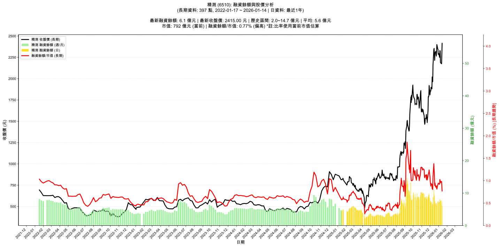

# :chart_with_upwards_trend: 精測 (6510) 融資餘額報告

!!! info "基本資訊"
    **:building_construction: 名稱**: 精測
    **:identification_card: 代號**: 6510
    **:calendar: 分析期間**: 2025-07-18 ~ 2026-01-09 (共 242 個交易日)
    **:clock3: 最新資料**: 2026-01-09
    **🕒 更新時間**: 2026-01-12 13:16:23 CST

## :moneybag: 融資餘額現況

| :chart: 指標 | :1234: 數值 | :traffic_light: 狀態 |
|:------------:|:----------:|:-------------------:|
| **最新融資餘額** | 7.6 億元 (349 張) | - |
| **最新收盤價** | 2185.00 元 | - |
| **市值** | 716 億元 | - |
| **融資餘額/市值** | 1.06% | 🔴 過熱 |
| **日變化 (DoD)** | -0.2 億元 (-3.01%) | 📉 |
| **週變化 (WoW)** | +0.3 億元 (+3.84%) | 📈 |
| **月變化 (MoM)** | +0.9 億元 (+13.47%) | 📈 |

---

## :bar_chart: 歷史統計

| :chart: 指標 | :1234: 數值 |
|:------------:|:----------:|
| **歷史最高** | 14.7 億元 |
| **歷史最低** | 2.0 億元 |
| **平均值** | 5.8 億元 |
| **標準差** | 2.8 億元 |
| **當前相對位置** | 44.0% |

---

## :chart_with_upwards_trend: 融資餘額趨勢圖

    

---

## :clipboard: 詳細歷史記錄 (最近30日)

<table class="sortable-table">
<thead>
<tr>
<th markdown="span">:calendar: 日期</th>
<th markdown="span">:money_with_wings: 收盤價(元)</th>
<th markdown="span">:chart: 漲跌(元)</th>
<th markdown="span">:chart_with_upwards_trend: 漲跌(%)</th>
<th markdown="span">:package: 融資餘額(億元)</th>
<th markdown="span">:package: 融資餘額(張)</th>
<th markdown="span">:arrow_up_down: 融資增減(張)</th>
<th markdown="span">:chart: 融券餘額(張)</th>
<th markdown="span">:balance_scale: 券資比(%)</th>
</tr>
</thead>
<tbody>
<tr>
<td>2026-01-09</td>
<td>2185.00</td>
<td>🔻 -5.00</td>
<td>-0.23%</td>
<td>7.6</td>
<td>349</td>
<td>📉 -10</td>
<td>37</td>
<td>10.60%</td>
</tr>
<tr>
<td>2026-01-08</td>
<td>2190.00</td>
<td>🔻 -135.00</td>
<td>-5.81%</td>
<td>7.9</td>
<td>359</td>
<td>📈 +34</td>
<td>39</td>
<td>10.90%</td>
</tr>
<tr>
<td>2026-01-07</td>
<td>2325.00</td>
<td>🔻 -5.00</td>
<td>-0.21%</td>
<td>7.6</td>
<td>325</td>
<td>📉 -24</td>
<td>41</td>
<td>12.60%</td>
</tr>
<tr>
<td>2026-01-06</td>
<td>2330.00</td>
<td>🔺 +80.00</td>
<td>+3.56%</td>
<td>8.1</td>
<td>349</td>
<td>📈 +24</td>
<td>42</td>
<td>12.00%</td>
</tr>
<tr>
<td>2026-01-05</td>
<td>2250.00</td>
<td>🔻 -45.00</td>
<td>-1.96%</td>
<td>7.3</td>
<td>325</td>
<td>📈 +5</td>
<td>40</td>
<td>12.30%</td>
</tr>
<tr>
<td>2026-01-02</td>
<td>2295.00</td>
<td>🔺 +10.00</td>
<td>+0.44%</td>
<td>7.3</td>
<td>320</td>
<td>📉 -8</td>
<td>41</td>
<td>12.80%</td>
</tr>
<tr>
<td>2025-12-31</td>
<td>2285.00</td>
<td>🔻 -60.00</td>
<td>-2.56%</td>
<td>7.5</td>
<td>328</td>
<td>📈 +19</td>
<td>41</td>
<td>12.50%</td>
</tr>
<tr>
<td>2025-12-30</td>
<td>2345.00</td>
<td>🔻 -5.00</td>
<td>-0.21%</td>
<td>7.2</td>
<td>309</td>
<td>📈 +3</td>
<td>42</td>
<td>13.60%</td>
</tr>
<tr>
<td>2025-12-29</td>
<td>2350.00</td>
<td>🔻 -50.00</td>
<td>-2.08%</td>
<td>7.2</td>
<td>306</td>
<td>📈 +38</td>
<td>43</td>
<td>14.10%</td>
</tr>
<tr>
<td>2025-12-26</td>
<td>2400.00</td>
<td>🔺 +135.00</td>
<td>+5.96%</td>
<td>6.4</td>
<td>268</td>
<td>📉 -41</td>
<td>44</td>
<td>16.40%</td>
</tr>
<tr>
<td>2025-12-24</td>
<td>2265.00</td>
<td>🔻 -15.00</td>
<td>-0.66%</td>
<td>7.0</td>
<td>309</td>
<td>📈 +10</td>
<td>44</td>
<td>14.20%</td>
</tr>
<tr>
<td>2025-12-23</td>
<td>2280.00</td>
<td>🔻 -40.00</td>
<td>-1.72%</td>
<td>6.8</td>
<td>299</td>
<td>📈 +7</td>
<td>44</td>
<td>14.70%</td>
</tr>
<tr>
<td>2025-12-22</td>
<td>2320.00</td>
<td>🔺 +20.00</td>
<td>+0.87%</td>
<td>6.8</td>
<td>292</td>
<td>📉 -35</td>
<td>47</td>
<td>16.10%</td>
</tr>
<tr>
<td>2025-12-19</td>
<td>2300.00</td>
<td>🔺 +85.00</td>
<td>+3.84%</td>
<td>7.5</td>
<td>327</td>
<td>📈 +8</td>
<td>47</td>
<td>14.40%</td>
</tr>
<tr>
<td>2025-12-18</td>
<td>2215.00</td>
<td>🔻 -75.00</td>
<td>-3.28%</td>
<td>7.1</td>
<td>319</td>
<td>📉 -83</td>
<td>45</td>
<td>14.10%</td>
</tr>
<tr>
<td>2025-12-17</td>
<td>2290.00</td>
<td>🔻 -65.00</td>
<td>-2.76%</td>
<td>9.2</td>
<td>402</td>
<td>📉 -13</td>
<td>55</td>
<td>13.70%</td>
</tr>
<tr>
<td>2025-12-16</td>
<td>2355.00</td>
<td>🔺 +15.00</td>
<td>+0.64%</td>
<td>9.8</td>
<td>415</td>
<td>📉 -52</td>
<td>55</td>
<td>13.30%</td>
</tr>
<tr>
<td>2025-12-15</td>
<td>2340.00</td>
<td>🔺 +180.00</td>
<td>+8.33%</td>
<td>10.9</td>
<td>467</td>
<td>📈 +64</td>
<td>59</td>
<td>12.60%</td>
</tr>
<tr>
<td>2025-12-12</td>
<td>2160.00</td>
<td>🔺 +195.00</td>
<td>+9.92%</td>
<td>8.7</td>
<td>403</td>
<td>📈 +80</td>
<td>59</td>
<td>14.60%</td>
</tr>
<tr>
<td>2025-12-11</td>
<td>1965.00</td>
<td>➖ +0.00</td>
<td>+0.00%</td>
<td>6.3</td>
<td>323</td>
<td>📉 -19</td>
<td>55</td>
<td>17.00%</td>
</tr>
<tr>
<td>2025-12-10</td>
<td>1965.00</td>
<td>🔻 -55.00</td>
<td>-2.72%</td>
<td>6.7</td>
<td>342</td>
<td>📈 +20</td>
<td>55</td>
<td>16.10%</td>
</tr>
<tr>
<td>2025-12-09</td>
<td>2020.00</td>
<td>🔺 +140.00</td>
<td>+7.45%</td>
<td>6.5</td>
<td>322</td>
<td>📉 -64</td>
<td>58</td>
<td>18.00%</td>
</tr>
<tr>
<td>2025-12-08</td>
<td>1880.00</td>
<td>🔻 -20.00</td>
<td>-1.05%</td>
<td>7.3</td>
<td>386</td>
<td>📉 -5</td>
<td>55</td>
<td>14.20%</td>
</tr>
<tr>
<td>2025-12-05</td>
<td>1900.00</td>
<td>🔺 +45.00</td>
<td>+2.43%</td>
<td>7.4</td>
<td>391</td>
<td>📈 +15</td>
<td>54</td>
<td>13.80%</td>
</tr>
<tr>
<td>2025-12-04</td>
<td>1855.00</td>
<td>🔻 -5.00</td>
<td>-0.27%</td>
<td>7.0</td>
<td>376</td>
<td>📉 -23</td>
<td>54</td>
<td>14.40%</td>
</tr>
<tr>
<td>2025-12-03</td>
<td>1860.00</td>
<td>🔺 +15.00</td>
<td>+0.81%</td>
<td>7.4</td>
<td>399</td>
<td>📉 -23</td>
<td>53</td>
<td>13.30%</td>
</tr>
<tr>
<td>2025-12-02</td>
<td>1845.00</td>
<td>🔺 +35.00</td>
<td>+1.93%</td>
<td>7.8</td>
<td>422</td>
<td>📉 -53</td>
<td>53</td>
<td>12.60%</td>
</tr>
<tr>
<td>2025-12-01</td>
<td>1810.00</td>
<td>🔻 -110.00</td>
<td>-5.73%</td>
<td>8.6</td>
<td>475</td>
<td>📉 -36</td>
<td>51</td>
<td>10.70%</td>
</tr>
<tr>
<td>2025-11-28</td>
<td>1920.00</td>
<td>🔺 +120.00</td>
<td>+6.67%</td>
<td>9.8</td>
<td>511</td>
<td>📉 -14</td>
<td>68</td>
<td>13.30%</td>
</tr>
<tr>
<td>2025-11-27</td>
<td>1800.00</td>
<td>🔺 +15.00</td>
<td>+0.84%</td>
<td>9.4</td>
<td>525</td>
<td>📈 +7</td>
<td>51</td>
<td>9.71%</td>
</tr>
</tbody>
</table>

---

## :information_source: 資料來源與方法

!!! note "資料來源說明"
    - **主要來源**: `raw_margin_daily.csv` (Type 13: ShowMarginChart)
    - **資料頻率**: 每日更新
    - **資料範圍**: 近1年交易日資料

!!! info "報告元資訊"
    - **報告產生時間**: 2026-01-12 13:16:23
    - **分析期間**: 242 個交易日
    - **資料來源**: Stage 1 Raw Margin Daily Data

---

:material-information-outline: **本報告僅供參考，投資決策請審慎評估**

