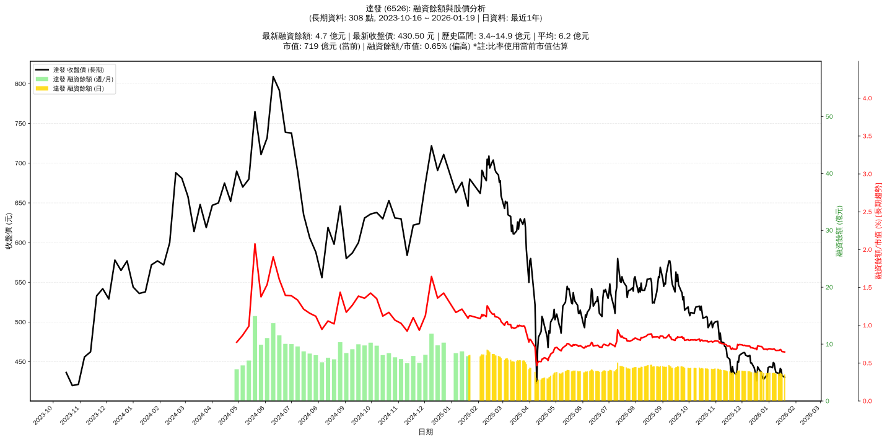

# :chart_with_upwards_trend: 達發 (6526) 融資餘額報告

!!! info "基本資訊"
    **:building_construction: 名稱**: 達發
    **:identification_card: 代號**: 6526
    **:calendar: 分析期間**: 2025-07-18 ~ 2026-01-09 (共 242 個交易日)
    **:clock3: 最新資料**: 2026-01-09
    **🕒 更新時間**: 2026-01-11 20:28:27 CST

## :moneybag: 融資餘額現況

| :chart: 指標 | :1234: 數值 | :traffic_light: 狀態 |
|:------------:|:----------:|:-------------------:|
| **最新融資餘額** | 4.8 億元 (1,101 張) | - |
| **最新收盤價** | 436.50 元 | - |
| **市值** | 731 億元 | - |
| **融資餘額/市值** | 0.66% | 🟠 偏高 |
| **日變化 (DoD)** | -0.1 億元 (-1.20%) | 📉 |
| **週變化 (WoW)** | -0.2 億元 (-3.27%) | 📉 |
| **月變化 (MoM)** | -0.4 億元 (-7.79%) | 📉 |

---

## :bar_chart: 歷史統計

| :chart: 指標 | :1234: 數值 |
|:------------:|:----------:|
| **歷史最高** | 9.0 億元 |
| **歷史最低** | 3.4 億元 |
| **平均值** | 5.9 億元 |
| **標準差** | 1.1 億元 |
| **當前相對位置** | 25.5% |

---

## :chart_with_upwards_trend: 融資餘額趨勢圖

    

---

## :clipboard: 詳細歷史記錄 (最近30日)

<table class="sortable-table">
<thead>
<tr>
<th>:calendar: 日期</th>
<th>:money_with_wings: 收盤價(元)</th>
<th>:chart: 漲跌(元)</th>
<th>:chart_with_upwards_trend: 漲跌(%)</th>
<th>:package: 融資餘額(億元)</th>
<th>:package: 融資餘額(張)</th>
<th>:arrow_up_down: 融資增減(張)</th>
<th>:chart: 融券餘額(張)</th>
<th>:balance_scale: 券資比(%)</th>
</tr>
</thead>
<tbody>
<tr>
<td>2026-01-09</td>
<td>436.50</td>
<td>🔻 -4.50</td>
<td>-1.02%</td>
<td>4.8</td>
<td>1,101</td>
<td>📉 -2</td>
<td>0</td>
<td>0.00%</td>
</tr>
<tr>
<td>2026-01-08</td>
<td>441.00</td>
<td>🔻 -7.00</td>
<td>-1.56%</td>
<td>4.9</td>
<td>1,103</td>
<td>📉 -3</td>
<td>0</td>
<td>0.00%</td>
</tr>
<tr>
<td>2026-01-07</td>
<td>448.00</td>
<td>🔻 -1.00</td>
<td>-0.22%</td>
<td>5.0</td>
<td>1,106</td>
<td>📈 +5</td>
<td>0</td>
<td>0.00%</td>
</tr>
<tr>
<td>2026-01-06</td>
<td>449.00</td>
<td>🔺 +6.50</td>
<td>+1.47%</td>
<td>4.9</td>
<td>1,101</td>
<td>📉 -9</td>
<td>0</td>
<td>0.00%</td>
</tr>
<tr>
<td>2026-01-05</td>
<td>442.50</td>
<td>🔻 -1.50</td>
<td>-0.34%</td>
<td>4.9</td>
<td>1,110</td>
<td>📉 -9</td>
<td>0</td>
<td>0.00%</td>
</tr>
<tr>
<td>2026-01-02</td>
<td>444.00</td>
<td>🔺 +1.50</td>
<td>+0.34%</td>
<td>5.0</td>
<td>1,119</td>
<td>➡️ +0</td>
<td>0</td>
<td>0.00%</td>
</tr>
<tr>
<td>2025-12-31</td>
<td>442.50</td>
<td>🔺 +11.00</td>
<td>+2.55%</td>
<td>5.0</td>
<td>1,119</td>
<td>📉 -9</td>
<td>0</td>
<td>0.00%</td>
</tr>
<tr>
<td>2025-12-30</td>
<td>431.50</td>
<td>🔻 -1.00</td>
<td>-0.23%</td>
<td>4.9</td>
<td>1,128</td>
<td>📉 -11</td>
<td>0</td>
<td>0.00%</td>
</tr>
<tr>
<td>2025-12-29</td>
<td>432.50</td>
<td>🔺 +4.50</td>
<td>+1.05%</td>
<td>4.9</td>
<td>1,139</td>
<td>📉 -10</td>
<td>0</td>
<td>0.00%</td>
</tr>
<tr>
<td>2025-12-26</td>
<td>428.00</td>
<td>🔻 -4.00</td>
<td>-0.93%</td>
<td>4.9</td>
<td>1,149</td>
<td>📉 -42</td>
<td>0</td>
<td>0.00%</td>
</tr>
<tr>
<td>2025-12-24</td>
<td>432.00</td>
<td>🔻 -5.50</td>
<td>-1.26%</td>
<td>5.1</td>
<td>1,191</td>
<td>📈 +5</td>
<td>0</td>
<td>0.00%</td>
</tr>
<tr>
<td>2025-12-23</td>
<td>437.50</td>
<td>🔻 -0.50</td>
<td>-0.11%</td>
<td>5.2</td>
<td>1,186</td>
<td>📈 +3</td>
<td>0</td>
<td>0.00%</td>
</tr>
<tr>
<td>2025-12-22</td>
<td>438.00</td>
<td>🔻 -5.50</td>
<td>-1.24%</td>
<td>5.2</td>
<td>1,183</td>
<td>📈 +1</td>
<td>0</td>
<td>0.00%</td>
</tr>
<tr>
<td>2025-12-19</td>
<td>443.50</td>
<td>🔺 +17.50</td>
<td>+4.11%</td>
<td>5.2</td>
<td>1,182</td>
<td>📈 +36</td>
<td>0</td>
<td>0.00%</td>
</tr>
<tr>
<td>2025-12-18</td>
<td>426.00</td>
<td>🔻 -8.00</td>
<td>-1.84%</td>
<td>4.9</td>
<td>1,146</td>
<td>📉 -10</td>
<td>1</td>
<td>0.09%</td>
</tr>
<tr>
<td>2025-12-17</td>
<td>434.00</td>
<td>🔻 -4.00</td>
<td>-0.91%</td>
<td>5.0</td>
<td>1,156</td>
<td>📈 +21</td>
<td>0</td>
<td>0.00%</td>
</tr>
<tr>
<td>2025-12-16</td>
<td>438.00</td>
<td>🔻 -4.50</td>
<td>-1.02%</td>
<td>5.0</td>
<td>1,135</td>
<td>📈 +4</td>
<td>0</td>
<td>0.00%</td>
</tr>
<tr>
<td>2025-12-15</td>
<td>442.50</td>
<td>🔻 -6.00</td>
<td>-1.34%</td>
<td>5.0</td>
<td>1,131</td>
<td>➡️ +0</td>
<td>0</td>
<td>0.00%</td>
</tr>
<tr>
<td>2025-12-12</td>
<td>448.50</td>
<td>➖ +0.00</td>
<td>+0.00%</td>
<td>5.1</td>
<td>1,131</td>
<td>📈 +2</td>
<td>0</td>
<td>0.00%</td>
</tr>
<tr>
<td>2025-12-11</td>
<td>448.50</td>
<td>🔻 -9.50</td>
<td>-2.07%</td>
<td>5.1</td>
<td>1,129</td>
<td>📉 -9</td>
<td>0</td>
<td>0.00%</td>
</tr>
<tr>
<td>2025-12-10</td>
<td>458.00</td>
<td>🔺 +0.50</td>
<td>+0.11%</td>
<td>5.2</td>
<td>1,138</td>
<td>📉 -4</td>
<td>0</td>
<td>0.00%</td>
</tr>
<tr>
<td>2025-12-09</td>
<td>457.50</td>
<td>🔺 +1.00</td>
<td>+0.22%</td>
<td>5.2</td>
<td>1,142</td>
<td>📉 -2</td>
<td>0</td>
<td>0.00%</td>
</tr>
<tr>
<td>2025-12-08</td>
<td>456.50</td>
<td>🔻 -2.00</td>
<td>-0.44%</td>
<td>5.2</td>
<td>1,144</td>
<td>📉 -3</td>
<td>0</td>
<td>0.00%</td>
</tr>
<tr>
<td>2025-12-05</td>
<td>458.50</td>
<td>🔻 -3.00</td>
<td>-0.65%</td>
<td>5.3</td>
<td>1,147</td>
<td>📉 -2</td>
<td>0</td>
<td>0.00%</td>
</tr>
<tr>
<td>2025-12-04</td>
<td>461.50</td>
<td>➖ +0.00</td>
<td>+0.00%</td>
<td>5.3</td>
<td>1,149</td>
<td>📈 +5</td>
<td>0</td>
<td>0.00%</td>
</tr>
<tr>
<td>2025-12-03</td>
<td>461.50</td>
<td>🔺 +0.50</td>
<td>+0.11%</td>
<td>5.3</td>
<td>1,144</td>
<td>📉 -5</td>
<td>0</td>
<td>0.00%</td>
</tr>
<tr>
<td>2025-12-02</td>
<td>461.00</td>
<td>🔺 +0.50</td>
<td>+0.11%</td>
<td>5.3</td>
<td>1,149</td>
<td>📉 -10</td>
<td>0</td>
<td>0.00%</td>
</tr>
<tr>
<td>2025-12-01</td>
<td>460.50</td>
<td>🔺 +2.50</td>
<td>+0.55%</td>
<td>5.3</td>
<td>1,159</td>
<td>📉 -13</td>
<td>0</td>
<td>0.00%</td>
</tr>
<tr>
<td>2025-11-28</td>
<td>458.00</td>
<td>🔺 +8.50</td>
<td>+1.89%</td>
<td>5.4</td>
<td>1,172</td>
<td>📉 -10</td>
<td>0</td>
<td>0.00%</td>
</tr>
<tr>
<td>2025-11-27</td>
<td>449.50</td>
<td>🔻 -1.00</td>
<td>-0.22%</td>
<td>5.3</td>
<td>1,182</td>
<td>📉 -12</td>
<td>1</td>
<td>0.08%</td>
</tr>
</tbody>
</table>

---

## :information_source: 資料來源與方法

!!! note "資料來源說明"
    - **主要來源**: `raw_margin_daily.csv` (Type 13: ShowMarginChart)
    - **資料頻率**: 每日更新
    - **資料範圍**: 近1年交易日資料

!!! info "報告元資訊"
    - **報告產生時間**: 2026-01-11 20:28:27
    - **分析期間**: 242 個交易日
    - **資料來源**: Stage 1 Raw Margin Daily Data

---

:material-information-outline: **本報告僅供參考，投資決策請審慎評估**

