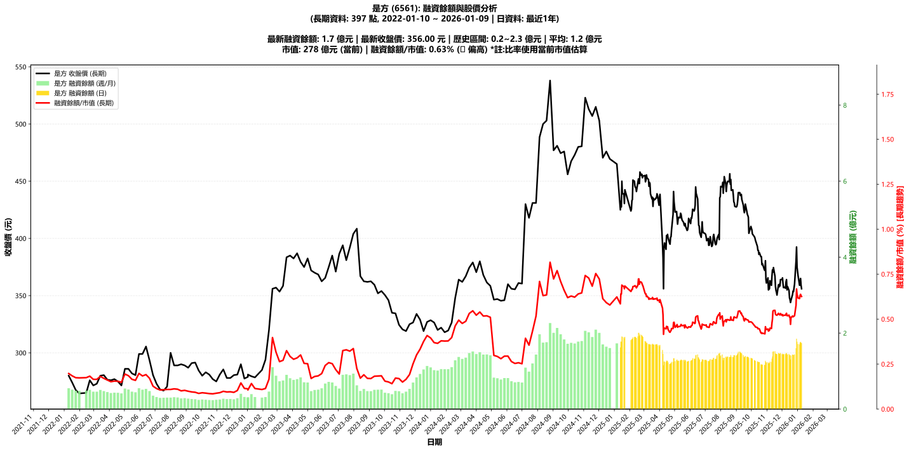

# :chart_with_upwards_trend: 是方 (6561) 融資餘額報告

!!! info "基本資訊"
    **:building_construction: 名稱**: 是方
    **:identification_card: 代號**: 6561
    **:calendar: 分析期間**: 2025-07-18 ~ 2026-01-09 (共 242 個交易日)
    **:clock3: 最新資料**: 2026-01-09
    **🕒 更新時間**: 2026-01-11 20:28:33 CST

## :moneybag: 融資餘額現況

| :chart: 指標 | :1234: 數值 | :traffic_light: 狀態 |
|:------------:|:----------:|:-------------------:|
| **最新融資餘額** | 1.7 億元 (488 張) | - |
| **最新收盤價** | 356.00 元 | - |
| **市值** | 278 億元 | - |
| **融資餘額/市值** | 0.63% | 🟠 偏高 |
| **日變化 (DoD)** | -0.0 億元 (-0.63%) | 📉 |
| **週變化 (WoW)** | +0.0 億元 (+1.44%) | 📈 |
| **月變化 (MoM)** | +0.3 億元 (+17.56%) | 📈 |

---

## :bar_chart: 歷史統計

| :chart: 指標 | :1234: 數值 |
|:------------:|:----------:|
| **歷史最高** | 2.0 億元 |
| **歷史最低** | 1.2 億元 |
| **平均值** | 1.5 億元 |
| **標準差** | 0.2 億元 |
| **當前相對位置** | 68.4% |

---

## :chart_with_upwards_trend: 融資餘額趨勢圖

    

---

## :clipboard: 詳細歷史記錄 (最近30日)

<table class="sortable-table">
<thead>
<tr>
<th>:calendar: 日期</th>
<th>:money_with_wings: 收盤價(元)</th>
<th>:chart: 漲跌(元)</th>
<th>:chart_with_upwards_trend: 漲跌(%)</th>
<th>:package: 融資餘額(億元)</th>
<th>:package: 融資餘額(張)</th>
<th>:arrow_up_down: 融資增減(張)</th>
<th>:chart: 融券餘額(張)</th>
<th>:balance_scale: 券資比(%)</th>
</tr>
</thead>
<tbody>
<tr>
<td>2026-01-09</td>
<td>356.00</td>
<td>🔻 -3.00</td>
<td>-0.84%</td>
<td>1.7</td>
<td>488</td>
<td>📈 +1</td>
<td>0</td>
<td>0.00%</td>
</tr>
<tr>
<td>2026-01-08</td>
<td>359.00</td>
<td>🔻 -6.00</td>
<td>-1.64%</td>
<td>1.7</td>
<td>487</td>
<td>📈 +2</td>
<td>0</td>
<td>0.00%</td>
</tr>
<tr>
<td>2026-01-07</td>
<td>365.00</td>
<td>🔺 +3.50</td>
<td>+0.97%</td>
<td>1.8</td>
<td>485</td>
<td>➡️ +0</td>
<td>0</td>
<td>0.00%</td>
</tr>
<tr>
<td>2026-01-06</td>
<td>361.50</td>
<td>🔺 +2.50</td>
<td>+0.70%</td>
<td>1.8</td>
<td>485</td>
<td>📈 +10</td>
<td>0</td>
<td>0.00%</td>
</tr>
<tr>
<td>2026-01-05</td>
<td>359.00</td>
<td>🔻 -8.50</td>
<td>-2.31%</td>
<td>1.7</td>
<td>475</td>
<td>📈 +9</td>
<td>0</td>
<td>0.00%</td>
</tr>
<tr>
<td>2026-01-02</td>
<td>367.50</td>
<td>🔻 -7.50</td>
<td>-2.00%</td>
<td>1.7</td>
<td>466</td>
<td>📉 -7</td>
<td>0</td>
<td>0.00%</td>
</tr>
<tr>
<td>2025-12-31</td>
<td>375.00</td>
<td>🔻 -11.00</td>
<td>-2.85%</td>
<td>1.8</td>
<td>473</td>
<td>📈 +1</td>
<td>0</td>
<td>0.00%</td>
</tr>
<tr>
<td>2025-12-30</td>
<td>392.50</td>
<td>🔺 +12.00</td>
<td>+3.15%</td>
<td>1.9</td>
<td>472</td>
<td>📈 +51</td>
<td>0</td>
<td>0.00%</td>
</tr>
<tr>
<td>2025-12-29</td>
<td>380.50</td>
<td>🔺 +20.50</td>
<td>+5.69%</td>
<td>1.6</td>
<td>421</td>
<td>📈 +21</td>
<td>0</td>
<td>0.00%</td>
</tr>
<tr>
<td>2025-12-26</td>
<td>360.00</td>
<td>🔺 +6.50</td>
<td>+1.84%</td>
<td>1.4</td>
<td>400</td>
<td>📉 -4</td>
<td>0</td>
<td>0.00%</td>
</tr>
<tr>
<td>2025-12-24</td>
<td>353.50</td>
<td>🔻 -0.50</td>
<td>-0.14%</td>
<td>1.4</td>
<td>404</td>
<td>📈 +2</td>
<td>0</td>
<td>0.00%</td>
</tr>
<tr>
<td>2025-12-23</td>
<td>354.00</td>
<td>🔺 +3.00</td>
<td>+0.85%</td>
<td>1.4</td>
<td>402</td>
<td>📉 -7</td>
<td>0</td>
<td>0.00%</td>
</tr>
<tr>
<td>2025-12-22</td>
<td>351.00</td>
<td>🔺 +5.00</td>
<td>+1.45%</td>
<td>1.4</td>
<td>409</td>
<td>📈 +1</td>
<td>0</td>
<td>0.00%</td>
</tr>
<tr>
<td>2025-12-19</td>
<td>346.00</td>
<td>🔺 +2.00</td>
<td>+0.58%</td>
<td>1.4</td>
<td>408</td>
<td>📈 +28</td>
<td>0</td>
<td>0.00%</td>
</tr>
<tr>
<td>2025-12-18</td>
<td>344.00</td>
<td>🔻 -2.50</td>
<td>-0.72%</td>
<td>1.3</td>
<td>380</td>
<td>📉 -30</td>
<td>0</td>
<td>0.00%</td>
</tr>
<tr>
<td>2025-12-17</td>
<td>346.50</td>
<td>🔻 -1.50</td>
<td>-0.43%</td>
<td>1.4</td>
<td>410</td>
<td>📈 +2</td>
<td>0</td>
<td>0.00%</td>
</tr>
<tr>
<td>2025-12-16</td>
<td>348.00</td>
<td>🔻 -6.50</td>
<td>-1.83%</td>
<td>1.4</td>
<td>408</td>
<td>📉 -1</td>
<td>0</td>
<td>0.00%</td>
</tr>
<tr>
<td>2025-12-15</td>
<td>354.50</td>
<td>🔻 -3.50</td>
<td>-0.98%</td>
<td>1.4</td>
<td>409</td>
<td>📈 +7</td>
<td>0</td>
<td>0.00%</td>
</tr>
<tr>
<td>2025-12-12</td>
<td>358.00</td>
<td>🔺 +3.00</td>
<td>+0.85%</td>
<td>1.4</td>
<td>402</td>
<td>📉 -4</td>
<td>0</td>
<td>0.00%</td>
</tr>
<tr>
<td>2025-12-11</td>
<td>355.00</td>
<td>🔻 -9.00</td>
<td>-2.47%</td>
<td>1.4</td>
<td>406</td>
<td>➡️ +0</td>
<td>0</td>
<td>0.00%</td>
</tr>
<tr>
<td>2025-12-10</td>
<td>364.00</td>
<td>🔺 +2.00</td>
<td>+0.55%</td>
<td>1.5</td>
<td>406</td>
<td>📈 +1</td>
<td>1</td>
<td>0.25%</td>
</tr>
<tr>
<td>2025-12-09</td>
<td>362.00</td>
<td>🔺 +5.50</td>
<td>+1.54%</td>
<td>1.5</td>
<td>405</td>
<td>📉 -1</td>
<td>1</td>
<td>0.25%</td>
</tr>
<tr>
<td>2025-12-08</td>
<td>356.50</td>
<td>🔻 -1.00</td>
<td>-0.28%</td>
<td>1.4</td>
<td>406</td>
<td>📈 +1</td>
<td>1</td>
<td>0.25%</td>
</tr>
<tr>
<td>2025-12-05</td>
<td>357.50</td>
<td>🔺 +0.50</td>
<td>+0.14%</td>
<td>1.4</td>
<td>405</td>
<td>➡️ +0</td>
<td>1</td>
<td>0.25%</td>
</tr>
<tr>
<td>2025-12-04</td>
<td>357.00</td>
<td>🔻 -3.50</td>
<td>-0.97%</td>
<td>1.4</td>
<td>405</td>
<td>📈 +6</td>
<td>1</td>
<td>0.25%</td>
</tr>
<tr>
<td>2025-12-03</td>
<td>360.50</td>
<td>🔻 -5.00</td>
<td>-1.37%</td>
<td>1.4</td>
<td>399</td>
<td>➡️ +0</td>
<td>1</td>
<td>0.25%</td>
</tr>
<tr>
<td>2025-12-02</td>
<td>365.50</td>
<td>🔺 +1.50</td>
<td>+0.41%</td>
<td>1.5</td>
<td>399</td>
<td>📈 +2</td>
<td>1</td>
<td>0.25%</td>
</tr>
<tr>
<td>2025-12-01</td>
<td>364.00</td>
<td>➖ +0.00</td>
<td>+0.00%</td>
<td>1.4</td>
<td>397</td>
<td>📉 -8</td>
<td>1</td>
<td>0.25%</td>
</tr>
<tr>
<td>2025-11-28</td>
<td>364.00</td>
<td>🔺 +5.50</td>
<td>+1.53%</td>
<td>1.5</td>
<td>405</td>
<td>➡️ +0</td>
<td>1</td>
<td>0.25%</td>
</tr>
<tr>
<td>2025-11-27</td>
<td>358.50</td>
<td>🔻 -1.50</td>
<td>-0.42%</td>
<td>1.5</td>
<td>405</td>
<td>📉 -1</td>
<td>1</td>
<td>0.25%</td>
</tr>
</tbody>
</table>

---

## :information_source: 資料來源與方法

!!! note "資料來源說明"
    - **主要來源**: `raw_margin_daily.csv` (Type 13: ShowMarginChart)
    - **資料頻率**: 每日更新
    - **資料範圍**: 近1年交易日資料

!!! info "報告元資訊"
    - **報告產生時間**: 2026-01-11 20:28:33
    - **分析期間**: 242 個交易日
    - **資料來源**: Stage 1 Raw Margin Daily Data

---

:material-information-outline: **本報告僅供參考，投資決策請審慎評估**

