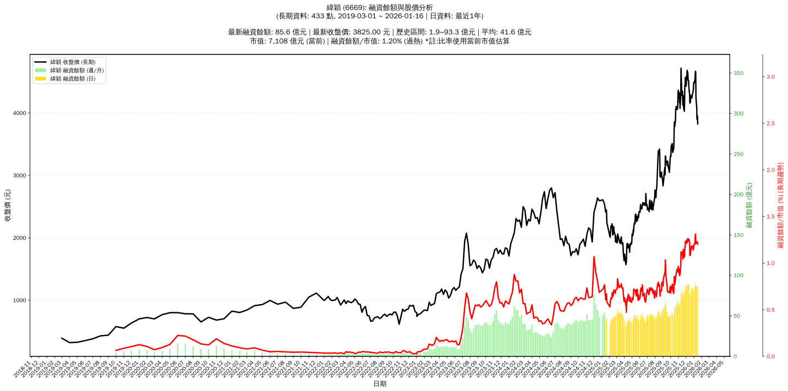

# :chart_with_upwards_trend: 緯穎 (6669) 融資餘額報告

!!! info "基本資訊"
    **:building_construction: 名稱**: 緯穎
    **:identification_card: 代號**: 6669
    **:calendar: 分析期間**: 2025-07-18 ~ 2026-01-09 (共 242 個交易日)
    **:clock3: 最新資料**: 2026-01-09
    **🕒 更新時間**: 2026-01-12 13:17:10 CST

## :moneybag: 融資餘額現況

| :chart: 指標 | :1234: 數值 | :traffic_light: 狀態 |
|:------------:|:----------:|:-------------------:|
| **最新融資餘額** | 86.0 億元 (2,028 張) | - |
| **最新收盤價** | 4240.00 元 | - |
| **市值** | 7,880 億元 | - |
| **融資餘額/市值** | 1.09% | 🔴 過熱 |
| **日變化 (DoD)** | -2.3 億元 (-2.57%) | 📉 |
| **週變化 (WoW)** | +0.3 億元 (+0.33%) | 📈 |
| **月變化 (MoM)** | -2.7 億元 (-3.10%) | 📉 |

---

## :bar_chart: 歷史統計

| :chart: 指標 | :1234: 數值 |
|:------------:|:----------:|
| **歷史最高** | 93.3 億元 |
| **歷史最低** | 33.6 億元 |
| **平均值** | 56.2 億元 |
| **標準差** | 14.0 億元 |
| **當前相對位置** | 87.8% |

---

## :chart_with_upwards_trend: 融資餘額趨勢圖

    

---

## :clipboard: 詳細歷史記錄 (最近30日)

<table class="sortable-table">
<thead>
<tr>
<th markdown="span">:calendar: 日期</th>
<th markdown="span">:money_with_wings: 收盤價(元)</th>
<th markdown="span">:chart: 漲跌(元)</th>
<th markdown="span">:chart_with_upwards_trend: 漲跌(%)</th>
<th markdown="span">:package: 融資餘額(億元)</th>
<th markdown="span">:package: 融資餘額(張)</th>
<th markdown="span">:arrow_up_down: 融資增減(張)</th>
<th markdown="span">:chart: 融券餘額(張)</th>
<th markdown="span">:balance_scale: 券資比(%)</th>
</tr>
</thead>
<tbody>
<tr>
<td>2026-01-09</td>
<td>4240.00</td>
<td>🔻 -410.00</td>
<td>-8.82%</td>
<td>86.0</td>
<td>2,028</td>
<td>📈 +130</td>
<td>68</td>
<td>3.35%</td>
</tr>
<tr>
<td>2026-01-08</td>
<td>4650.00</td>
<td>🔻 -20.00</td>
<td>-0.43%</td>
<td>88.3</td>
<td>1,898</td>
<td>📉 -99</td>
<td>80</td>
<td>4.21%</td>
</tr>
<tr>
<td>2026-01-07</td>
<td>4670.00</td>
<td>🔺 +55.00</td>
<td>+1.19%</td>
<td>93.3</td>
<td>1,997</td>
<td>📈 +20</td>
<td>74</td>
<td>3.71%</td>
</tr>
<tr>
<td>2026-01-06</td>
<td>4615.00</td>
<td>🔺 +75.00</td>
<td>+1.65%</td>
<td>91.2</td>
<td>1,977</td>
<td>📈 +92</td>
<td>74</td>
<td>3.74%</td>
</tr>
<tr>
<td>2026-01-05</td>
<td>4540.00</td>
<td>🔺 +60.00</td>
<td>+1.34%</td>
<td>85.6</td>
<td>1,885</td>
<td>📉 -28</td>
<td>74</td>
<td>3.93%</td>
</tr>
<tr>
<td>2026-01-02</td>
<td>4480.00</td>
<td>🔻 -5.00</td>
<td>-0.11%</td>
<td>85.7</td>
<td>1,913</td>
<td>📈 +63</td>
<td>77</td>
<td>4.03%</td>
</tr>
<tr>
<td>2025-12-31</td>
<td>4485.00</td>
<td>🔺 +90.00</td>
<td>+2.05%</td>
<td>83.0</td>
<td>1,850</td>
<td>📉 -34</td>
<td>76</td>
<td>4.11%</td>
</tr>
<tr>
<td>2025-12-30</td>
<td>4395.00</td>
<td>🔺 +45.00</td>
<td>+1.03%</td>
<td>82.8</td>
<td>1,884</td>
<td>📈 +20</td>
<td>78</td>
<td>4.14%</td>
</tr>
<tr>
<td>2025-12-29</td>
<td>4350.00</td>
<td>🔺 +50.00</td>
<td>+1.16%</td>
<td>81.1</td>
<td>1,864</td>
<td>📉 -92</td>
<td>82</td>
<td>4.40%</td>
</tr>
<tr>
<td>2025-12-26</td>
<td>4300.00</td>
<td>🔺 +60.00</td>
<td>+1.42%</td>
<td>84.1</td>
<td>1,956</td>
<td>📉 -22</td>
<td>83</td>
<td>4.24%</td>
</tr>
<tr>
<td>2025-12-24</td>
<td>4240.00</td>
<td>🔻 -15.00</td>
<td>-0.35%</td>
<td>83.9</td>
<td>1,978</td>
<td>📈 +1</td>
<td>84</td>
<td>4.25%</td>
</tr>
<tr>
<td>2025-12-23</td>
<td>4255.00</td>
<td>🔺 +5.00</td>
<td>+0.12%</td>
<td>84.1</td>
<td>1,977</td>
<td>📈 +1</td>
<td>84</td>
<td>4.25%</td>
</tr>
<tr>
<td>2025-12-22</td>
<td>4250.00</td>
<td>🔻 -35.00</td>
<td>-0.82%</td>
<td>84.0</td>
<td>1,976</td>
<td>📈 +122</td>
<td>84</td>
<td>4.25%</td>
</tr>
<tr>
<td>2025-12-19</td>
<td>4285.00</td>
<td>🔺 +110.00</td>
<td>+2.63%</td>
<td>79.4</td>
<td>1,854</td>
<td>📈 +11</td>
<td>89</td>
<td>4.80%</td>
</tr>
<tr>
<td>2025-12-18</td>
<td>4175.00</td>
<td>➖ +0.00</td>
<td>+0.00%</td>
<td>76.9</td>
<td>1,843</td>
<td>📉 -15</td>
<td>89</td>
<td>4.83%</td>
</tr>
<tr>
<td>2025-12-17</td>
<td>4175.00</td>
<td>🔺 +15.00</td>
<td>+0.36%</td>
<td>77.6</td>
<td>1,858</td>
<td>📈 +7</td>
<td>88</td>
<td>4.74%</td>
</tr>
<tr>
<td>2025-12-16</td>
<td>4160.00</td>
<td>🔻 -130.00</td>
<td>-3.03%</td>
<td>77.0</td>
<td>1,851</td>
<td>📉 -180</td>
<td>93</td>
<td>5.02%</td>
</tr>
<tr>
<td>2025-12-15</td>
<td>4290.00</td>
<td>🔻 -115.00</td>
<td>-2.61%</td>
<td>87.1</td>
<td>2,031</td>
<td>📈 +4</td>
<td>95</td>
<td>4.68%</td>
</tr>
<tr>
<td>2025-12-12</td>
<td>4405.00</td>
<td>🔻 -115.00</td>
<td>-2.54%</td>
<td>89.3</td>
<td>2,027</td>
<td>📈 +85</td>
<td>92</td>
<td>4.54%</td>
</tr>
<tr>
<td>2025-12-11</td>
<td>4520.00</td>
<td>🔻 -5.00</td>
<td>-0.11%</td>
<td>87.8</td>
<td>1,942</td>
<td>📉 -19</td>
<td>97</td>
<td>4.99%</td>
</tr>
<tr>
<td>2025-12-10</td>
<td>4525.00</td>
<td>🔺 +5.00</td>
<td>+0.11%</td>
<td>88.7</td>
<td>1,961</td>
<td>📉 -11</td>
<td>99</td>
<td>5.05%</td>
</tr>
<tr>
<td>2025-12-09</td>
<td>4520.00</td>
<td>🔻 -110.00</td>
<td>-2.38%</td>
<td>89.1</td>
<td>1,972</td>
<td>📈 +33</td>
<td>99</td>
<td>5.02%</td>
</tr>
<tr>
<td>2025-12-08</td>
<td>4630.00</td>
<td>🔻 -55.00</td>
<td>-1.17%</td>
<td>89.8</td>
<td>1,939</td>
<td>📈 +85</td>
<td>102</td>
<td>5.26%</td>
</tr>
<tr>
<td>2025-12-05</td>
<td>4685.00</td>
<td>🔺 +140.00</td>
<td>+3.08%</td>
<td>86.9</td>
<td>1,854</td>
<td>📉 -44</td>
<td>103</td>
<td>5.56%</td>
</tr>
<tr>
<td>2025-12-04</td>
<td>4545.00</td>
<td>🔻 -55.00</td>
<td>-1.20%</td>
<td>86.3</td>
<td>1,898</td>
<td>📉 -30</td>
<td>104</td>
<td>5.48%</td>
</tr>
<tr>
<td>2025-12-03</td>
<td>4600.00</td>
<td>🔺 +120.00</td>
<td>+2.68%</td>
<td>88.7</td>
<td>1,928</td>
<td>📉 -25</td>
<td>105</td>
<td>5.45%</td>
</tr>
<tr>
<td>2025-12-02</td>
<td>4480.00</td>
<td>🔺 +50.00</td>
<td>+1.13%</td>
<td>87.5</td>
<td>1,953</td>
<td>📉 -12</td>
<td>105</td>
<td>5.38%</td>
</tr>
<tr>
<td>2025-12-01</td>
<td>4430.00</td>
<td>🔻 -140.00</td>
<td>-3.06%</td>
<td>87.0</td>
<td>1,965</td>
<td>📈 +46</td>
<td>100</td>
<td>5.09%</td>
</tr>
<tr>
<td>2025-11-28</td>
<td>4570.00</td>
<td>🔺 +120.00</td>
<td>+2.70%</td>
<td>87.7</td>
<td>1,919</td>
<td>📈 +61</td>
<td>128</td>
<td>6.67%</td>
</tr>
<tr>
<td>2025-11-27</td>
<td>4450.00</td>
<td>➖ +0.00</td>
<td>+0.00%</td>
<td>82.7</td>
<td>1,858</td>
<td>📈 +1</td>
<td>129</td>
<td>6.94%</td>
</tr>
</tbody>
</table>

---

## :information_source: 資料來源與方法

!!! note "資料來源說明"
    - **主要來源**: `raw_margin_daily.csv` (Type 13: ShowMarginChart)
    - **資料頻率**: 每日更新
    - **資料範圍**: 近1年交易日資料

!!! info "報告元資訊"
    - **報告產生時間**: 2026-01-12 13:17:10
    - **分析期間**: 242 個交易日
    - **資料來源**: Stage 1 Raw Margin Daily Data

---

:material-information-outline: **本報告僅供參考，投資決策請審慎評估**

