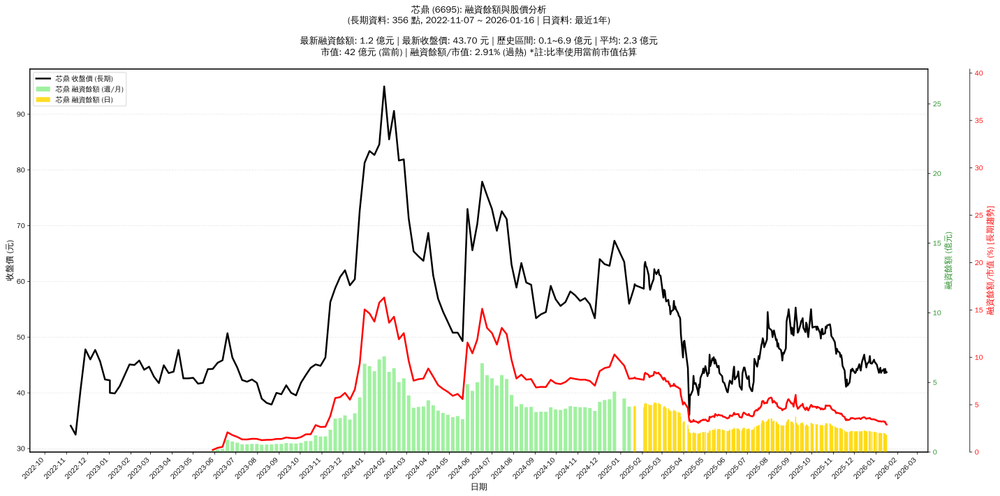

# :chart_with_upwards_trend: 芯鼎 (6695) 融資餘額報告

!!! info "基本資訊"
    **:building_construction: 名稱**: 芯鼎
    **:identification_card: 代號**: 6695
    **:calendar: 分析期間**: 2025-07-18 ~ 2026-01-09 (共 242 個交易日)
    **:clock3: 最新資料**: 2026-01-09
    **🕒 更新時間**: 2026-01-12 13:17:12 CST

## :moneybag: 融資餘額現況

| :chart: 指標 | :1234: 數值 | :traffic_light: 狀態 |
|:------------:|:----------:|:-------------------:|
| **最新融資餘額** | 1.4 億元 (3,097 張) | - |
| **最新收盤價** | 43.85 元 | - |
| **市值** | 42 億元 | - |
| **融資餘額/市值** | 3.21% | 🔴 過熱 |
| **日變化 (DoD)** | +0.0 億元 (+0.38%) | 📈 |
| **週變化 (WoW)** | -0.0 億元 (-3.47%) | 📉 |
| **月變化 (MoM)** | -0.1 億元 (-7.40%) | 📉 |

---

## :bar_chart: 歷史統計

| :chart: 指標 | :1234: 數值 |
|:------------:|:----------:|
| **歷史最高** | 3.6 億元 |
| **歷史最低** | 1.3 億元 |
| **平均值** | 2.0 億元 |
| **標準差** | 0.7 億元 |
| **當前相對位置** | 2.8% |

---

## :chart_with_upwards_trend: 融資餘額趨勢圖

    

---

## :clipboard: 詳細歷史記錄 (最近30日)

<table class="sortable-table">
<thead>
<tr>
<th markdown="span">:calendar: 日期</th>
<th markdown="span">:money_with_wings: 收盤價(元)</th>
<th markdown="span">:chart: 漲跌(元)</th>
<th markdown="span">:chart_with_upwards_trend: 漲跌(%)</th>
<th markdown="span">:package: 融資餘額(億元)</th>
<th markdown="span">:package: 融資餘額(張)</th>
<th markdown="span">:arrow_up_down: 融資增減(張)</th>
<th markdown="span">:chart: 融券餘額(張)</th>
<th markdown="span">:balance_scale: 券資比(%)</th>
</tr>
</thead>
<tbody>
<tr>
<td>2026-01-09</td>
<td>43.85</td>
<td>🔺 +0.25</td>
<td>+0.57%</td>
<td>1.4</td>
<td>3,097</td>
<td>📉 -6</td>
<td>8</td>
<td>0.26%</td>
</tr>
<tr>
<td>2026-01-08</td>
<td>43.60</td>
<td>🔻 -0.90</td>
<td>-2.02%</td>
<td>1.4</td>
<td>3,103</td>
<td>📈 +17</td>
<td>9</td>
<td>0.29%</td>
</tr>
<tr>
<td>2026-01-07</td>
<td>44.50</td>
<td>🔺 +0.30</td>
<td>+0.68%</td>
<td>1.4</td>
<td>3,086</td>
<td>📉 -24</td>
<td>9</td>
<td>0.29%</td>
</tr>
<tr>
<td>2026-01-06</td>
<td>44.20</td>
<td>🔺 +0.60</td>
<td>+1.38%</td>
<td>1.4</td>
<td>3,110</td>
<td>📉 -13</td>
<td>9</td>
<td>0.29%</td>
</tr>
<tr>
<td>2026-01-05</td>
<td>43.60</td>
<td>🔻 -1.45</td>
<td>-3.22%</td>
<td>1.4</td>
<td>3,123</td>
<td>➡️ +0</td>
<td>10</td>
<td>0.32%</td>
</tr>
<tr>
<td>2026-01-02</td>
<td>45.05</td>
<td>🔻 -0.35</td>
<td>-0.77%</td>
<td>1.4</td>
<td>3,123</td>
<td>📉 -36</td>
<td>13</td>
<td>0.42%</td>
</tr>
<tr>
<td>2025-12-31</td>
<td>45.40</td>
<td>🔻 -0.10</td>
<td>-0.22%</td>
<td>1.4</td>
<td>3,159</td>
<td>📉 -10</td>
<td>16</td>
<td>0.51%</td>
</tr>
<tr>
<td>2025-12-30</td>
<td>45.50</td>
<td>🔻 -0.45</td>
<td>-0.98%</td>
<td>1.4</td>
<td>3,169</td>
<td>📉 -8</td>
<td>13</td>
<td>0.41%</td>
</tr>
<tr>
<td>2025-12-29</td>
<td>45.95</td>
<td>🔺 +0.70</td>
<td>+1.55%</td>
<td>1.5</td>
<td>3,177</td>
<td>📉 -39</td>
<td>13</td>
<td>0.41%</td>
</tr>
<tr>
<td>2025-12-26</td>
<td>45.25</td>
<td>🔻 -0.05</td>
<td>-0.11%</td>
<td>1.5</td>
<td>3,216</td>
<td>📉 -40</td>
<td>13</td>
<td>0.40%</td>
</tr>
<tr>
<td>2025-12-24</td>
<td>45.30</td>
<td>🔻 -1.30</td>
<td>-2.79%</td>
<td>1.5</td>
<td>3,256</td>
<td>➡️ +0</td>
<td>13</td>
<td>0.40%</td>
</tr>
<tr>
<td>2025-12-23</td>
<td>46.60</td>
<td>🔺 +0.95</td>
<td>+2.08%</td>
<td>1.5</td>
<td>3,256</td>
<td>📉 -45</td>
<td>15</td>
<td>0.46%</td>
</tr>
<tr>
<td>2025-12-22</td>
<td>45.65</td>
<td>🔺 +0.50</td>
<td>+1.11%</td>
<td>1.5</td>
<td>3,301</td>
<td>📉 -10</td>
<td>13</td>
<td>0.39%</td>
</tr>
<tr>
<td>2025-12-19</td>
<td>45.15</td>
<td>🔺 +0.60</td>
<td>+1.35%</td>
<td>1.5</td>
<td>3,311</td>
<td>📉 -8</td>
<td>13</td>
<td>0.39%</td>
</tr>
<tr>
<td>2025-12-18</td>
<td>44.55</td>
<td>🔻 -0.85</td>
<td>-1.87%</td>
<td>1.5</td>
<td>3,319</td>
<td>📈 +5</td>
<td>13</td>
<td>0.39%</td>
</tr>
<tr>
<td>2025-12-17</td>
<td>45.40</td>
<td>🔻 -0.45</td>
<td>-0.98%</td>
<td>1.5</td>
<td>3,314</td>
<td>📉 -17</td>
<td>13</td>
<td>0.39%</td>
</tr>
<tr>
<td>2025-12-16</td>
<td>45.85</td>
<td>🔻 -1.00</td>
<td>-2.13%</td>
<td>1.5</td>
<td>3,331</td>
<td>📈 +16</td>
<td>14</td>
<td>0.42%</td>
</tr>
<tr>
<td>2025-12-15</td>
<td>46.85</td>
<td>🔺 +1.20</td>
<td>+2.63%</td>
<td>1.6</td>
<td>3,315</td>
<td>📉 -19</td>
<td>14</td>
<td>0.42%</td>
</tr>
<tr>
<td>2025-12-12</td>
<td>45.65</td>
<td>🔺 +0.75</td>
<td>+1.67%</td>
<td>1.5</td>
<td>3,334</td>
<td>📉 -6</td>
<td>12</td>
<td>0.36%</td>
</tr>
<tr>
<td>2025-12-11</td>
<td>44.90</td>
<td>🔺 +0.90</td>
<td>+2.05%</td>
<td>1.5</td>
<td>3,340</td>
<td>📈 +7</td>
<td>37</td>
<td>1.11%</td>
</tr>
<tr>
<td>2025-12-10</td>
<td>44.00</td>
<td>🔻 -0.45</td>
<td>-1.01%</td>
<td>1.5</td>
<td>3,333</td>
<td>📉 -1</td>
<td>36</td>
<td>1.08%</td>
</tr>
<tr>
<td>2025-12-09</td>
<td>44.45</td>
<td>🔻 -0.70</td>
<td>-1.55%</td>
<td>1.5</td>
<td>3,334</td>
<td>📉 -9</td>
<td>38</td>
<td>1.14%</td>
</tr>
<tr>
<td>2025-12-08</td>
<td>45.15</td>
<td>🔺 +1.10</td>
<td>+2.50%</td>
<td>1.5</td>
<td>3,343</td>
<td>📉 -36</td>
<td>38</td>
<td>1.14%</td>
</tr>
<tr>
<td>2025-12-05</td>
<td>44.05</td>
<td>🔻 -0.25</td>
<td>-0.56%</td>
<td>1.5</td>
<td>3,379</td>
<td>📉 -2</td>
<td>39</td>
<td>1.15%</td>
</tr>
<tr>
<td>2025-12-04</td>
<td>44.30</td>
<td>🔺 +0.60</td>
<td>+1.37%</td>
<td>1.5</td>
<td>3,381</td>
<td>📉 -7</td>
<td>39</td>
<td>1.15%</td>
</tr>
<tr>
<td>2025-12-03</td>
<td>43.70</td>
<td>🔺 +0.15</td>
<td>+0.34%</td>
<td>1.5</td>
<td>3,388</td>
<td>📈 +10</td>
<td>41</td>
<td>1.21%</td>
</tr>
<tr>
<td>2025-12-02</td>
<td>43.55</td>
<td>🔻 -0.15</td>
<td>-0.34%</td>
<td>1.5</td>
<td>3,378</td>
<td>📉 -25</td>
<td>42</td>
<td>1.24%</td>
</tr>
<tr>
<td>2025-12-01</td>
<td>43.70</td>
<td>🔻 -0.65</td>
<td>-1.47%</td>
<td>1.5</td>
<td>3,403</td>
<td>📉 -7</td>
<td>42</td>
<td>1.23%</td>
</tr>
<tr>
<td>2025-11-28</td>
<td>44.35</td>
<td>🔺 +0.45</td>
<td>+1.03%</td>
<td>1.5</td>
<td>3,410</td>
<td>📉 -15</td>
<td>42</td>
<td>1.23%</td>
</tr>
<tr>
<td>2025-11-27</td>
<td>43.90</td>
<td>🔻 -0.25</td>
<td>-0.57%</td>
<td>1.5</td>
<td>3,425</td>
<td>📉 -10</td>
<td>35</td>
<td>1.02%</td>
</tr>
</tbody>
</table>

---

## :information_source: 資料來源與方法

!!! note "資料來源說明"
    - **主要來源**: `raw_margin_daily.csv` (Type 13: ShowMarginChart)
    - **資料頻率**: 每日更新
    - **資料範圍**: 近1年交易日資料

!!! info "報告元資訊"
    - **報告產生時間**: 2026-01-12 13:17:12
    - **分析期間**: 242 個交易日
    - **資料來源**: Stage 1 Raw Margin Daily Data

---

:material-information-outline: **本報告僅供參考，投資決策請審慎評估**

