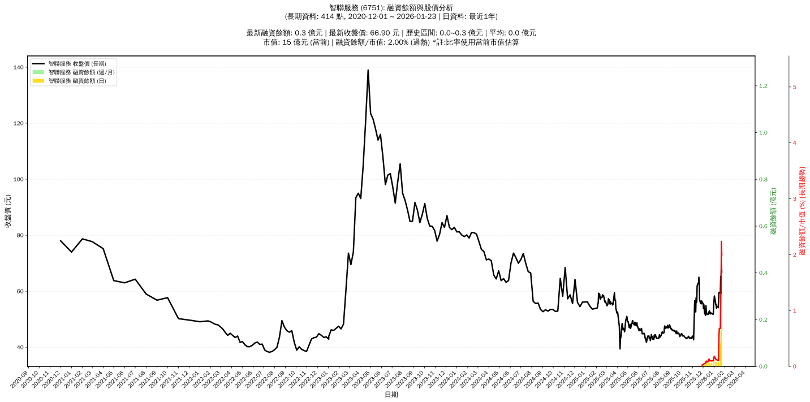

# 📈 智聯服務 (6751) 融資餘額報告

!!! info "基本資訊"
    **🏗️ 名稱**: 智聯服務
    **🪪 代號**: 6751
    **📅 分析期間**: 2025-07-23 ~ 2026-01-14 (共 242 個交易日)
    **🕒 最新資料**: 2026-01-14
    **🕒 更新時間**: 2026-01-15 13:26:38 CST

## 💰 融資餘額現況

| 📊 指標 | 🔢 數值 | 🚦 狀態 |
|:------------:|:----------:|:-------------------:|
| **最新融資餘額** | 0.0 億元 (29 張) | - |
| **最新收盤價** | 56.40 元 | - |
| **市值** | 13 億元 | - |
| **融資餘額/市值** | 0.13% | 🟢 低風險 |
| **日變化 (DoD)** | +0.0 億元 (+4.25%) | 📈 |
| **週變化 (WoW)** | -0.0 億元 (-7.57%) | 📉 |
| **兩週變化 (2Wo2W)** | +0.0 億元 (+19.78%) | 📈 |
| **月變化 (MoM)** | +0.0 億元 (+53.04%) | 📈 |

---

## 📊 歷史統計

| 📊 指標 | 🔢 數值 |
|:------------:|:----------:|
| **歷史最高** | 0.0 億元 |
| **歷史最低** | 0.0 億元 |
| **平均值** | 0.0 億元 |
| **標準差** | 0.0 億元 |
| **當前相對位置** | 55.4% |

---

## 📈 融資餘額趨勢圖

{: style="max-width: 100%; height: auto;"}

---

## 📋 詳細歷史記錄 (最近30日)

<table class="sortable-table">
<thead>
<tr>
<th markdown="span">📅 日期</th>
<th markdown="span">💸 收盤價(元)</th>
<th markdown="span">📊 漲跌(元)</th>
<th markdown="span">📈 漲跌(%)</th>
<th markdown="span">📦 融資餘額(億元)</th>
<th markdown="span">📦 融資餘額(張)</th>
<th markdown="span">↕️ 融資增減(張)</th>
<th markdown="span">📊 融券餘額(張)</th>
<th markdown="span">⚖️ 券資比(%)</th>
</tr>
</thead>
<tbody>
<tr>
<td>2026-01-14</td>
<td>56.40</td>
<td>🔺 +2.30</td>
<td>+4.25%</td>
<td>0.0</td>
<td>29</td>
<td>➡️ +0</td>
<td>0</td>
<td>0.00%</td>
</tr>
<tr>
<td>2026-01-13</td>
<td>54.10</td>
<td>🔻 -0.50</td>
<td>-0.92%</td>
<td>0.0</td>
<td>29</td>
<td>➡️ +0</td>
<td>0</td>
<td>0.00%</td>
</tr>
<tr>
<td>2026-01-12</td>
<td>54.60</td>
<td>🔺 +0.10</td>
<td>+0.18%</td>
<td>0.0</td>
<td>29</td>
<td>📉 -3</td>
<td>0</td>
<td>0.00%</td>
</tr>
<tr>
<td>2026-01-09</td>
<td>54.50</td>
<td>🔺 +0.60</td>
<td>+1.11%</td>
<td>0.0</td>
<td>32</td>
<td>📉 -2</td>
<td>0</td>
<td>0.00%</td>
</tr>
<tr>
<td>2026-01-08</td>
<td>53.90</td>
<td>🔻 -1.40</td>
<td>-2.53%</td>
<td>0.0</td>
<td>34</td>
<td>📈 +2</td>
<td>0</td>
<td>0.00%</td>
</tr>
<tr>
<td>2026-01-07</td>
<td>55.30</td>
<td>🔺 +0.20</td>
<td>+0.36%</td>
<td>0.0</td>
<td>32</td>
<td>📉 -3</td>
<td>0</td>
<td>0.00%</td>
</tr>
<tr>
<td>2026-01-06</td>
<td>55.10</td>
<td>🔻 -1.20</td>
<td>-2.13%</td>
<td>0.0</td>
<td>35</td>
<td>📉 -1</td>
<td>0</td>
<td>0.00%</td>
</tr>
<tr>
<td>2026-01-05</td>
<td>56.30</td>
<td>🔻 -2.00</td>
<td>-3.43%</td>
<td>0.0</td>
<td>36</td>
<td>📉 -10</td>
<td>0</td>
<td>0.00%</td>
</tr>
<tr>
<td>2026-01-02</td>
<td>58.30</td>
<td>🔺 +3.30</td>
<td>+6.00%</td>
<td>0.0</td>
<td>46</td>
<td>📈 +6</td>
<td>0</td>
<td>0.00%</td>
</tr>
<tr>
<td>2025-12-31</td>
<td>55.00</td>
<td>🔺 +3.20</td>
<td>+6.18%</td>
<td>0.0</td>
<td>40</td>
<td>📈 +9</td>
<td>0</td>
<td>0.00%</td>
</tr>
<tr>
<td>2025-12-30</td>
<td>51.80</td>
<td>➖ +0.00</td>
<td>+0.00%</td>
<td>0.0</td>
<td>31</td>
<td>📈 +2</td>
<td>0</td>
<td>0.00%</td>
</tr>
<tr>
<td>2025-12-29</td>
<td>51.80</td>
<td>🔻 -0.20</td>
<td>-0.38%</td>
<td>0.0</td>
<td>29</td>
<td>📈 +1</td>
<td>0</td>
<td>0.00%</td>
</tr>
<tr>
<td>2025-12-26</td>
<td>52.00</td>
<td>🔻 -0.10</td>
<td>-0.19%</td>
<td>0.0</td>
<td>28</td>
<td>➡️ +0</td>
<td>0</td>
<td>0.00%</td>
</tr>
<tr>
<td>2025-12-24</td>
<td>52.10</td>
<td>🔻 -0.20</td>
<td>-0.38%</td>
<td>0.0</td>
<td>28</td>
<td>📉 -1</td>
<td>0</td>
<td>0.00%</td>
</tr>
<tr>
<td>2025-12-23</td>
<td>52.30</td>
<td>🔺 +0.40</td>
<td>+0.77%</td>
<td>0.0</td>
<td>29</td>
<td>➡️ +0</td>
<td>0</td>
<td>0.00%</td>
</tr>
<tr>
<td>2025-12-22</td>
<td>51.90</td>
<td>🔻 -1.10</td>
<td>-2.08%</td>
<td>0.0</td>
<td>29</td>
<td>📈 +1</td>
<td>0</td>
<td>0.00%</td>
</tr>
<tr>
<td>2025-12-19</td>
<td>53.00</td>
<td>🔺 +1.00</td>
<td>+1.92%</td>
<td>0.0</td>
<td>28</td>
<td>📉 -9</td>
<td>0</td>
<td>0.00%</td>
</tr>
<tr>
<td>2025-12-18</td>
<td>52.00</td>
<td>🔻 -0.60</td>
<td>-1.14%</td>
<td>0.0</td>
<td>37</td>
<td>📈 +2</td>
<td>0</td>
<td>0.00%</td>
</tr>
<tr>
<td>2025-12-17</td>
<td>52.60</td>
<td>🔺 +0.80</td>
<td>+1.54%</td>
<td>0.0</td>
<td>35</td>
<td>➡️ +0</td>
<td>0</td>
<td>0.00%</td>
</tr>
<tr>
<td>2025-12-16</td>
<td>51.80</td>
<td>🔺 +0.10</td>
<td>+0.19%</td>
<td>0.0</td>
<td>35</td>
<td>📈 +10</td>
<td>0</td>
<td>0.00%</td>
</tr>
<tr>
<td>2025-12-15</td>
<td>51.70</td>
<td>🔻 -0.10</td>
<td>-0.19%</td>
<td>0.0</td>
<td>25</td>
<td>📈 +3</td>
<td>0</td>
<td>0.00%</td>
</tr>
<tr>
<td>2025-12-12</td>
<td>51.80</td>
<td>🔻 -0.30</td>
<td>-0.58%</td>
<td>0.0</td>
<td>22</td>
<td>📉 -5</td>
<td>0</td>
<td>0.00%</td>
</tr>
<tr>
<td>2025-12-11</td>
<td>52.10</td>
<td>🔻 -1.00</td>
<td>-1.88%</td>
<td>0.0</td>
<td>27</td>
<td>📈 +4</td>
<td>0</td>
<td>0.00%</td>
</tr>
<tr>
<td>2025-12-10</td>
<td>53.10</td>
<td>🔻 -1.80</td>
<td>-3.28%</td>
<td>0.0</td>
<td>23</td>
<td>➡️ +0</td>
<td>0</td>
<td>0.00%</td>
</tr>
<tr>
<td>2025-12-09</td>
<td>54.90</td>
<td>🔺 +3.50</td>
<td>+6.81%</td>
<td>0.0</td>
<td>23</td>
<td>📈 +6</td>
<td>0</td>
<td>0.00%</td>
</tr>
<tr>
<td>2025-12-08</td>
<td>51.40</td>
<td>🔻 -0.90</td>
<td>-1.72%</td>
<td>0.0</td>
<td>17</td>
<td>📈 +3</td>
<td>0</td>
<td>0.00%</td>
</tr>
<tr>
<td>2025-12-05</td>
<td>52.30</td>
<td>🔻 -1.70</td>
<td>-3.15%</td>
<td>0.0</td>
<td>14</td>
<td>📈 +1</td>
<td>0</td>
<td>0.00%</td>
</tr>
<tr>
<td>2025-12-04</td>
<td>54.00</td>
<td>🔻 -1.30</td>
<td>-2.35%</td>
<td>0.0</td>
<td>13</td>
<td>📈 +1</td>
<td>0</td>
<td>0.00%</td>
</tr>
<tr>
<td>2025-12-03</td>
<td>55.30</td>
<td>🔺 +1.40</td>
<td>+2.60%</td>
<td>0.0</td>
<td>12</td>
<td>📈 +2</td>
<td>0</td>
<td>0.00%</td>
</tr>
<tr>
<td>2025-12-02</td>
<td>53.90</td>
<td>🔻 -1.70</td>
<td>-3.06%</td>
<td>0.0</td>
<td>10</td>
<td>📈 +1</td>
<td>0</td>
<td>0.00%</td>
</tr>
</tbody>
</table>

---

## ℹ️ 資料來源與方法

!!! note "資料來源說明"
    - **主要來源**: `raw_margin_daily.csv` (Type 13: ShowMarginChart)
    - **資料頻率**: 每日更新
    - **資料範圍**: 近1年交易日資料

!!! info "報告元資訊"
    - **報告產生時間**: 2026-01-15 13:26:38
    - **分析期間**: 242 個交易日
    - **資料來源**: Stage 1 Raw Margin Daily Data

---

:material-information-outline: **本報告僅供參考，投資決策請審慎評估**

