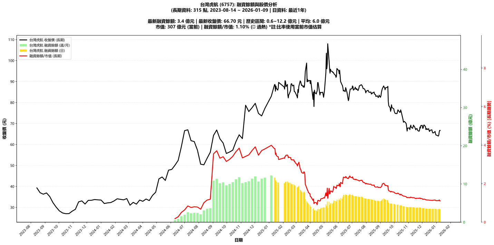

# :chart_with_upwards_trend: 台灣虎航 (6757) 融資餘額報告

!!! info "基本資訊"
    **:building_construction: 名稱**: 台灣虎航
    **:identification_card: 代號**: 6757
    **:calendar: 分析期間**: 2025-07-18 ~ 2026-01-09 (共 242 個交易日)
    **:clock3: 最新資料**: 2026-01-09
    **🕒 更新時間**: 2026-01-11 20:27:35 CST

## :moneybag: 融資餘額現況

| :chart: 指標 | :1234: 數值 | :traffic_light: 狀態 |
|:------------:|:----------:|:-------------------:|
| **最新融資餘額** | 3.4 億元 (5,072 張) | - |
| **最新收盤價** | 66.70 元 | - |
| **市值** | 307 億元 | - |
| **融資餘額/市值** | 1.10% | 🔴 過熱 |
| **日變化 (DoD)** | -0.0 億元 (-0.69%) | 📉 |
| **週變化 (WoW)** | -0.0 億元 (-1.42%) | 📉 |
| **月變化 (MoM)** | -0.2 億元 (-4.65%) | 📉 |

---

## :bar_chart: 歷史統計

| :chart: 指標 | :1234: 數值 |
|:------------:|:----------:|
| **歷史最高** | 11.7 億元 |
| **歷史最低** | 2.8 億元 |
| **平均值** | 5.8 億元 |
| **標準差** | 2.2 億元 |
| **當前相對位置** | 6.8% |

---

## :chart_with_upwards_trend: 融資餘額趨勢圖

    

---

## :clipboard: 詳細歷史記錄 (最近30日)

<table class="sortable-table">
<thead>
<tr>
<th>:calendar: 日期</th>
<th>:money_with_wings: 收盤價(元)</th>
<th>:chart: 漲跌(元)</th>
<th>:chart_with_upwards_trend: 漲跌(%)</th>
<th>:package: 融資餘額(億元)</th>
<th>:package: 融資餘額(張)</th>
<th>:arrow_up_down: 融資增減(張)</th>
<th>:chart: 融券餘額(張)</th>
<th>:balance_scale: 券資比(%)</th>
</tr>
</thead>
<tbody>
<tr>
<td>2026-01-09</td>
<td>66.70</td>
<td>➖ +0.00</td>
<td>+0.00%</td>
<td>3.4</td>
<td>5,072</td>
<td>📉 -35</td>
<td>320</td>
<td>6.31%</td>
</tr>
<tr>
<td>2026-01-08</td>
<td>66.70</td>
<td>🔺 +0.70</td>
<td>+1.06%</td>
<td>3.4</td>
<td>5,107</td>
<td>📉 -253</td>
<td>367</td>
<td>7.19%</td>
</tr>
<tr>
<td>2026-01-07</td>
<td>66.00</td>
<td>🔺 +1.60</td>
<td>+2.48%</td>
<td>3.5</td>
<td>5,360</td>
<td>📉 -13</td>
<td>428</td>
<td>7.99%</td>
</tr>
<tr>
<td>2026-01-06</td>
<td>64.40</td>
<td>🔺 +0.40</td>
<td>+0.62%</td>
<td>3.5</td>
<td>5,373</td>
<td>📈 +27</td>
<td>433</td>
<td>8.06%</td>
</tr>
<tr>
<td>2026-01-05</td>
<td>64.00</td>
<td>🔻 -0.40</td>
<td>-0.62%</td>
<td>3.4</td>
<td>5,346</td>
<td>📈 +17</td>
<td>429</td>
<td>8.02%</td>
</tr>
<tr>
<td>2026-01-02</td>
<td>64.40</td>
<td>🔻 -0.10</td>
<td>-0.16%</td>
<td>3.4</td>
<td>5,329</td>
<td>📈 +28</td>
<td>442</td>
<td>8.29%</td>
</tr>
<tr>
<td>2025-12-31</td>
<td>64.50</td>
<td>🔻 -0.50</td>
<td>-0.77%</td>
<td>3.4</td>
<td>5,301</td>
<td>📉 -50</td>
<td>443</td>
<td>8.36%</td>
</tr>
<tr>
<td>2025-12-30</td>
<td>65.00</td>
<td>🔻 -1.20</td>
<td>-1.81%</td>
<td>3.5</td>
<td>5,351</td>
<td>📈 +19</td>
<td>442</td>
<td>8.26%</td>
</tr>
<tr>
<td>2025-12-29</td>
<td>66.20</td>
<td>🔺 +0.60</td>
<td>+0.91%</td>
<td>3.5</td>
<td>5,332</td>
<td>📉 -5</td>
<td>535</td>
<td>10.00%</td>
</tr>
<tr>
<td>2025-12-26</td>
<td>65.60</td>
<td>🔺 +0.10</td>
<td>+0.15%</td>
<td>3.5</td>
<td>5,337</td>
<td>➡️ +0</td>
<td>542</td>
<td>10.20%</td>
</tr>
<tr>
<td>2025-12-24</td>
<td>65.50</td>
<td>🔻 -0.50</td>
<td>-0.76%</td>
<td>3.5</td>
<td>5,337</td>
<td>📈 +86</td>
<td>551</td>
<td>10.30%</td>
</tr>
<tr>
<td>2025-12-23</td>
<td>66.00</td>
<td>🔻 -1.00</td>
<td>-1.49%</td>
<td>3.5</td>
<td>5,251</td>
<td>📈 +68</td>
<td>685</td>
<td>13.00%</td>
</tr>
<tr>
<td>2025-12-22</td>
<td>67.00</td>
<td>🔺 +0.20</td>
<td>+0.30%</td>
<td>3.5</td>
<td>5,183</td>
<td>📉 -43</td>
<td>757</td>
<td>14.60%</td>
</tr>
<tr>
<td>2025-12-19</td>
<td>66.80</td>
<td>🔺 +0.10</td>
<td>+0.15%</td>
<td>3.5</td>
<td>5,226</td>
<td>📉 -4</td>
<td>758</td>
<td>14.50%</td>
</tr>
<tr>
<td>2025-12-18</td>
<td>66.70</td>
<td>🔺 +0.50</td>
<td>+0.76%</td>
<td>3.5</td>
<td>5,230</td>
<td>📉 -49</td>
<td>763</td>
<td>14.60%</td>
</tr>
<tr>
<td>2025-12-17</td>
<td>66.20</td>
<td>🔻 -0.40</td>
<td>-0.60%</td>
<td>3.5</td>
<td>5,279</td>
<td>📈 +35</td>
<td>663</td>
<td>12.60%</td>
</tr>
<tr>
<td>2025-12-16</td>
<td>66.60</td>
<td>🔻 -0.90</td>
<td>-1.33%</td>
<td>3.5</td>
<td>5,244</td>
<td>📈 +20</td>
<td>669</td>
<td>12.80%</td>
</tr>
<tr>
<td>2025-12-15</td>
<td>67.50</td>
<td>🔺 +0.40</td>
<td>+0.60%</td>
<td>3.5</td>
<td>5,224</td>
<td>📉 -25</td>
<td>736</td>
<td>14.10%</td>
</tr>
<tr>
<td>2025-12-12</td>
<td>67.10</td>
<td>🔻 -0.50</td>
<td>-0.74%</td>
<td>3.5</td>
<td>5,249</td>
<td>📈 +12</td>
<td>740</td>
<td>14.10%</td>
</tr>
<tr>
<td>2025-12-11</td>
<td>67.60</td>
<td>🔺 +0.30</td>
<td>+0.45%</td>
<td>3.5</td>
<td>5,237</td>
<td>📉 -35</td>
<td>745</td>
<td>14.20%</td>
</tr>
<tr>
<td>2025-12-10</td>
<td>67.30</td>
<td>🔺 +0.20</td>
<td>+0.30%</td>
<td>3.5</td>
<td>5,272</td>
<td>📈 +1</td>
<td>714</td>
<td>13.50%</td>
</tr>
<tr>
<td>2025-12-09</td>
<td>67.10</td>
<td>🔻 -1.40</td>
<td>-2.04%</td>
<td>3.5</td>
<td>5,271</td>
<td>➡️ +0</td>
<td>711</td>
<td>13.50%</td>
</tr>
<tr>
<td>2025-12-08</td>
<td>68.50</td>
<td>🔻 -0.80</td>
<td>-1.15%</td>
<td>3.6</td>
<td>5,271</td>
<td>📉 -30</td>
<td>746</td>
<td>14.20%</td>
</tr>
<tr>
<td>2025-12-05</td>
<td>69.30</td>
<td>🔺 +0.30</td>
<td>+0.43%</td>
<td>3.7</td>
<td>5,301</td>
<td>📉 -24</td>
<td>748</td>
<td>14.10%</td>
</tr>
<tr>
<td>2025-12-04</td>
<td>69.00</td>
<td>🔺 +1.20</td>
<td>+1.77%</td>
<td>3.7</td>
<td>5,325</td>
<td>📉 -15</td>
<td>746</td>
<td>14.00%</td>
</tr>
<tr>
<td>2025-12-03</td>
<td>67.80</td>
<td>🔺 +0.10</td>
<td>+0.15%</td>
<td>3.6</td>
<td>5,340</td>
<td>📉 -36</td>
<td>749</td>
<td>14.00%</td>
</tr>
<tr>
<td>2025-12-02</td>
<td>67.70</td>
<td>🔻 -1.40</td>
<td>-2.03%</td>
<td>3.6</td>
<td>5,376</td>
<td>📉 -27</td>
<td>747</td>
<td>13.90%</td>
</tr>
<tr>
<td>2025-12-01</td>
<td>69.10</td>
<td>🔺 +0.10</td>
<td>+0.14%</td>
<td>3.7</td>
<td>5,403</td>
<td>📉 -75</td>
<td>762</td>
<td>14.10%</td>
</tr>
<tr>
<td>2025-11-28</td>
<td>69.00</td>
<td>🔺 +1.20</td>
<td>+1.77%</td>
<td>3.8</td>
<td>5,478</td>
<td>📉 -47</td>
<td>745</td>
<td>13.60%</td>
</tr>
<tr>
<td>2025-11-27</td>
<td>67.80</td>
<td>🔻 -0.50</td>
<td>-0.73%</td>
<td>3.7</td>
<td>5,525</td>
<td>📉 -114</td>
<td>744</td>
<td>13.50%</td>
</tr>
</tbody>
</table>

---

## :information_source: 資料來源與方法

!!! note "資料來源說明"
    - **主要來源**: `raw_margin_daily.csv` (Type 13: ShowMarginChart)
    - **資料頻率**: 每日更新
    - **資料範圍**: 近1年交易日資料

!!! info "報告元資訊"
    - **報告產生時間**: 2026-01-11 20:27:35
    - **分析期間**: 242 個交易日
    - **資料來源**: Stage 1 Raw Margin Daily Data

---

:material-information-outline: **本報告僅供參考，投資決策請審慎評估**

