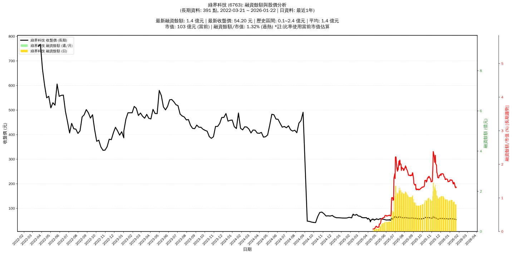

# :chart_with_upwards_trend: 綠界科技 (6763) 融資餘額報告

!!! info "基本資訊"
    **:building_construction: 名稱**: 綠界科技
    **:identification_card: 代號**: 6763
    **:calendar: 分析期間**: 2025-07-18 ~ 2026-01-09 (共 242 個交易日)
    **:clock3: 最新資料**: 2026-01-09
    **🕒 更新時間**: 2026-01-12 12:09:48 CST

## :moneybag: 融資餘額現況

| :chart: 指標 | :1234: 數值 | :traffic_light: 狀態 |
|:------------:|:----------:|:-------------------:|
| **最新融資餘額** | 1.6 億元 (2,681 張) | - |
| **最新收盤價** | 57.90 元 | - |
| **市值** | 107 億元 | - |
| **融資餘額/市值** | 1.46% | 🔴 過熱 |
| **日變化 (DoD)** | -0.0 億元 (-0.77%) | 📉 |
| **週變化 (WoW)** | -0.0 億元 (-1.79%) | 📉 |
| **月變化 (MoM)** | -0.2 億元 (-11.42%) | 📉 |

---

## :bar_chart: 歷史統計

| :chart: 指標 | :1234: 數值 |
|:------------:|:----------:|
| **歷史最高** | 2.4 億元 |
| **歷史最低** | 0.1 億元 |
| **平均值** | 1.4 億元 |
| **標準差** | 0.6 億元 |
| **當前相對位置** | 62.4% |

---

## :chart_with_upwards_trend: 融資餘額趨勢圖

    

---

## :clipboard: 詳細歷史記錄 (最近30日)

<table class="sortable-table">
<thead>
<tr>
<th>:calendar: 日期</th>
<th>:money_with_wings: 收盤價(元)</th>
<th>:chart: 漲跌(元)</th>
<th>:chart_with_upwards_trend: 漲跌(%)</th>
<th>:package: 融資餘額(億元)</th>
<th>:package: 融資餘額(張)</th>
<th>:arrow_up_down: 融資增減(張)</th>
<th>:chart: 融券餘額(張)</th>
<th>:balance_scale: 券資比(%)</th>
</tr>
</thead>
<tbody>
<tr>
<td>2026-01-09</td>
<td>57.90</td>
<td>🔺 +0.70</td>
<td>+1.22%</td>
<td>1.6</td>
<td>2,681</td>
<td>📉 -54</td>
<td>0</td>
<td>0.00%</td>
</tr>
<tr>
<td>2026-01-08</td>
<td>57.20</td>
<td>➖ +0.00</td>
<td>+0.00%</td>
<td>1.6</td>
<td>2,735</td>
<td>📉 -18</td>
<td>0</td>
<td>0.00%</td>
</tr>
<tr>
<td>2026-01-07</td>
<td>57.20</td>
<td>🔺 +0.20</td>
<td>+0.35%</td>
<td>1.6</td>
<td>2,753</td>
<td>📈 +9</td>
<td>0</td>
<td>0.00%</td>
</tr>
<tr>
<td>2026-01-06</td>
<td>57.00</td>
<td>🔺 +0.10</td>
<td>+0.18%</td>
<td>1.6</td>
<td>2,744</td>
<td>📉 -3</td>
<td>1</td>
<td>0.04%</td>
</tr>
<tr>
<td>2026-01-05</td>
<td>56.90</td>
<td>🔻 -1.60</td>
<td>-2.74%</td>
<td>1.6</td>
<td>2,747</td>
<td>📈 +45</td>
<td>3</td>
<td>0.11%</td>
</tr>
<tr>
<td>2026-01-02</td>
<td>58.50</td>
<td>🔺 +1.00</td>
<td>+1.74%</td>
<td>1.6</td>
<td>2,702</td>
<td>📈 +43</td>
<td>2</td>
<td>0.07%</td>
</tr>
<tr>
<td>2025-12-31</td>
<td>57.50</td>
<td>🔺 +0.70</td>
<td>+1.23%</td>
<td>1.5</td>
<td>2,659</td>
<td>📉 -46</td>
<td>2</td>
<td>0.08%</td>
</tr>
<tr>
<td>2025-12-30</td>
<td>56.80</td>
<td>🔻 -0.10</td>
<td>-0.18%</td>
<td>1.5</td>
<td>2,705</td>
<td>📈 +10</td>
<td>2</td>
<td>0.07%</td>
</tr>
<tr>
<td>2025-12-29</td>
<td>56.90</td>
<td>🔺 +0.10</td>
<td>+0.18%</td>
<td>1.5</td>
<td>2,695</td>
<td>📈 +27</td>
<td>2</td>
<td>0.07%</td>
</tr>
<tr>
<td>2025-12-26</td>
<td>56.80</td>
<td>🔻 -0.70</td>
<td>-1.22%</td>
<td>1.5</td>
<td>2,668</td>
<td>📉 -92</td>
<td>2</td>
<td>0.07%</td>
</tr>
<tr>
<td>2025-12-24</td>
<td>57.50</td>
<td>🔻 -0.30</td>
<td>-0.52%</td>
<td>1.6</td>
<td>2,760</td>
<td>📉 -4</td>
<td>2</td>
<td>0.07%</td>
</tr>
<tr>
<td>2025-12-23</td>
<td>57.80</td>
<td>🔻 -0.20</td>
<td>-0.34%</td>
<td>1.6</td>
<td>2,764</td>
<td>📈 +9</td>
<td>2</td>
<td>0.07%</td>
</tr>
<tr>
<td>2025-12-22</td>
<td>58.00</td>
<td>🔻 -0.20</td>
<td>-0.34%</td>
<td>1.6</td>
<td>2,755</td>
<td>📉 -5</td>
<td>2</td>
<td>0.07%</td>
</tr>
<tr>
<td>2025-12-19</td>
<td>58.20</td>
<td>🔺 +1.30</td>
<td>+2.28%</td>
<td>1.6</td>
<td>2,760</td>
<td>📉 -26</td>
<td>2</td>
<td>0.07%</td>
</tr>
<tr>
<td>2025-12-18</td>
<td>56.90</td>
<td>🔻 -0.20</td>
<td>-0.35%</td>
<td>1.6</td>
<td>2,786</td>
<td>📈 +11</td>
<td>2</td>
<td>0.07%</td>
</tr>
<tr>
<td>2025-12-17</td>
<td>57.10</td>
<td>➖ +0.00</td>
<td>+0.00%</td>
<td>1.6</td>
<td>2,775</td>
<td>📉 -11</td>
<td>2</td>
<td>0.07%</td>
</tr>
<tr>
<td>2025-12-16</td>
<td>57.10</td>
<td>🔻 -0.80</td>
<td>-1.38%</td>
<td>1.6</td>
<td>2,786</td>
<td>📉 -63</td>
<td>2</td>
<td>0.07%</td>
</tr>
<tr>
<td>2025-12-15</td>
<td>57.90</td>
<td>🔺 +0.10</td>
<td>+0.17%</td>
<td>1.6</td>
<td>2,849</td>
<td>📉 -60</td>
<td>6</td>
<td>0.21%</td>
</tr>
<tr>
<td>2025-12-12</td>
<td>57.80</td>
<td>🔻 -0.20</td>
<td>-0.34%</td>
<td>1.7</td>
<td>2,909</td>
<td>📉 -53</td>
<td>6</td>
<td>0.21%</td>
</tr>
<tr>
<td>2025-12-11</td>
<td>58.00</td>
<td>🔻 -0.30</td>
<td>-0.51%</td>
<td>1.7</td>
<td>2,962</td>
<td>📉 -44</td>
<td>6</td>
<td>0.20%</td>
</tr>
<tr>
<td>2025-12-10</td>
<td>58.30</td>
<td>➖ +0.00</td>
<td>+0.00%</td>
<td>1.8</td>
<td>3,006</td>
<td>📉 -4</td>
<td>6</td>
<td>0.20%</td>
</tr>
<tr>
<td>2025-12-09</td>
<td>58.30</td>
<td>🔻 -0.70</td>
<td>-1.19%</td>
<td>1.8</td>
<td>3,010</td>
<td>📈 +17</td>
<td>6</td>
<td>0.20%</td>
</tr>
<tr>
<td>2025-12-08</td>
<td>59.00</td>
<td>🔺 +0.40</td>
<td>+0.68%</td>
<td>1.8</td>
<td>2,993</td>
<td>📉 -3</td>
<td>6</td>
<td>0.20%</td>
</tr>
<tr>
<td>2025-12-05</td>
<td>58.60</td>
<td>➖ +0.00</td>
<td>+0.00%</td>
<td>1.8</td>
<td>2,996</td>
<td>📈 +10</td>
<td>6</td>
<td>0.20%</td>
</tr>
<tr>
<td>2025-12-04</td>
<td>58.60</td>
<td>🔻 -0.10</td>
<td>-0.17%</td>
<td>1.7</td>
<td>2,986</td>
<td>📉 -19</td>
<td>6</td>
<td>0.20%</td>
</tr>
<tr>
<td>2025-12-03</td>
<td>58.70</td>
<td>🔺 +0.60</td>
<td>+1.03%</td>
<td>1.8</td>
<td>3,005</td>
<td>📈 +64</td>
<td>5</td>
<td>0.17%</td>
</tr>
<tr>
<td>2025-12-02</td>
<td>58.10</td>
<td>🔻 -1.20</td>
<td>-2.02%</td>
<td>1.7</td>
<td>2,941</td>
<td>📉 -7</td>
<td>5</td>
<td>0.17%</td>
</tr>
<tr>
<td>2025-12-01</td>
<td>59.30</td>
<td>🔺 +0.60</td>
<td>+1.02%</td>
<td>1.7</td>
<td>2,948</td>
<td>📈 +21</td>
<td>5</td>
<td>0.17%</td>
</tr>
<tr>
<td>2025-11-28</td>
<td>58.70</td>
<td>🔺 +0.70</td>
<td>+1.21%</td>
<td>1.7</td>
<td>2,927</td>
<td>📈 +2</td>
<td>5</td>
<td>0.17%</td>
</tr>
<tr>
<td>2025-11-27</td>
<td>58.00</td>
<td>🔻 -0.20</td>
<td>-0.34%</td>
<td>1.7</td>
<td>2,925</td>
<td>📉 -13</td>
<td>8</td>
<td>0.27%</td>
</tr>
</tbody>
</table>

---

## :information_source: 資料來源與方法

!!! note "資料來源說明"
    - **主要來源**: `raw_margin_daily.csv` (Type 13: ShowMarginChart)
    - **資料頻率**: 每日更新
    - **資料範圍**: 近1年交易日資料

!!! info "報告元資訊"
    - **報告產生時間**: 2026-01-12 12:09:48
    - **分析期間**: 242 個交易日
    - **資料來源**: Stage 1 Raw Margin Daily Data

---

:material-information-outline: **本報告僅供參考，投資決策請審慎評估**

