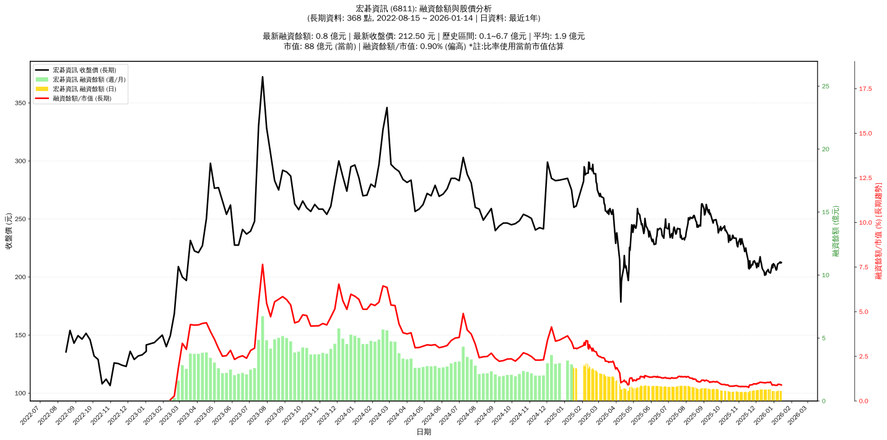

# :chart_with_upwards_trend: 宏碁資訊 (6811) 融資餘額報告

!!! info "基本資訊"
    **:building_construction: 名稱**: 宏碁資訊
    **:identification_card: 代號**: 6811
    **:calendar: 分析期間**: 2025-07-18 ~ 2026-01-09 (共 242 個交易日)
    **:clock3: 最新資料**: 2026-01-09
    **🕒 更新時間**: 2026-01-12 12:08:36 CST

## :moneybag: 融資餘額現況

| :chart: 指標 | :1234: 數值 | :traffic_light: 狀態 |
|:------------:|:----------:|:-------------------:|
| **最新融資餘額** | 0.8 億元 (390 張) | - |
| **最新收盤價** | 211.50 元 | - |
| **市值** | 88 億元 | - |
| **融資餘額/市值** | 0.94% | 🟠 偏高 |
| **日變化 (DoD)** | +0.0 億元 (+0.00%) | ➡️ |
| **週變化 (WoW)** | +0.0 億元 (+4.77%) | 📈 |
| **月變化 (MoM)** | -0.1 億元 (-10.35%) | 📉 |

---

## :bar_chart: 歷史統計

| :chart: 指標 | :1234: 數值 |
|:------------:|:----------:|
| **歷史最高** | 3.0 億元 |
| **歷史最低** | 0.7 億元 |
| **平均值** | 1.3 億元 |
| **標準差** | 0.6 億元 |
| **當前相對位置** | 6.8% |

---

## :chart_with_upwards_trend: 融資餘額趨勢圖

    

---

## :clipboard: 詳細歷史記錄 (最近30日)

<table class="sortable-table">
<thead>
<tr>
<th>:calendar: 日期</th>
<th>:money_with_wings: 收盤價(元)</th>
<th>:chart: 漲跌(元)</th>
<th>:chart_with_upwards_trend: 漲跌(%)</th>
<th>:package: 融資餘額(億元)</th>
<th>:package: 融資餘額(張)</th>
<th>:arrow_up_down: 融資增減(張)</th>
<th>:chart: 融券餘額(張)</th>
<th>:balance_scale: 券資比(%)</th>
</tr>
</thead>
<tbody>
<tr>
<td>2026-01-09</td>
<td>211.50</td>
<td>➖ +0.00</td>
<td>+0.00%</td>
<td>0.8</td>
<td>390</td>
<td>➡️ +0</td>
<td>0</td>
<td>0.00%</td>
</tr>
<tr>
<td>2026-01-08</td>
<td>211.50</td>
<td>🔺 +1.50</td>
<td>+0.71%</td>
<td>0.8</td>
<td>390</td>
<td>📈 +20</td>
<td>0</td>
<td>0.00%</td>
</tr>
<tr>
<td>2026-01-07</td>
<td>210.00</td>
<td>🔺 +3.50</td>
<td>+1.69%</td>
<td>0.8</td>
<td>370</td>
<td>📉 -8</td>
<td>0</td>
<td>0.00%</td>
</tr>
<tr>
<td>2026-01-06</td>
<td>206.50</td>
<td>🔺 +0.50</td>
<td>+0.24%</td>
<td>0.8</td>
<td>378</td>
<td>📈 +4</td>
<td>0</td>
<td>0.00%</td>
</tr>
<tr>
<td>2026-01-05</td>
<td>206.00</td>
<td>🔻 -4.50</td>
<td>-2.14%</td>
<td>0.8</td>
<td>374</td>
<td>➡️ +0</td>
<td>0</td>
<td>0.00%</td>
</tr>
<tr>
<td>2026-01-02</td>
<td>210.50</td>
<td>🔻 -1.00</td>
<td>-0.47%</td>
<td>0.8</td>
<td>374</td>
<td>📉 -5</td>
<td>0</td>
<td>0.00%</td>
</tr>
<tr>
<td>2025-12-31</td>
<td>211.50</td>
<td>🔺 +3.50</td>
<td>+1.68%</td>
<td>0.8</td>
<td>379</td>
<td>📈 +2</td>
<td>0</td>
<td>0.00%</td>
</tr>
<tr>
<td>2025-12-30</td>
<td>208.00</td>
<td>🔻 -2.50</td>
<td>-1.19%</td>
<td>0.8</td>
<td>377</td>
<td>📈 +2</td>
<td>0</td>
<td>0.00%</td>
</tr>
<tr>
<td>2025-12-29</td>
<td>210.50</td>
<td>🔺 +7.00</td>
<td>+3.44%</td>
<td>0.8</td>
<td>375</td>
<td>📉 -88</td>
<td>0</td>
<td>0.00%</td>
</tr>
<tr>
<td>2025-12-26</td>
<td>203.50</td>
<td>🔻 -0.50</td>
<td>-0.25%</td>
<td>0.9</td>
<td>463</td>
<td>📈 +15</td>
<td>0</td>
<td>0.00%</td>
</tr>
<tr>
<td>2025-12-24</td>
<td>204.00</td>
<td>🔻 -0.50</td>
<td>-0.24%</td>
<td>0.9</td>
<td>448</td>
<td>📈 +1</td>
<td>0</td>
<td>0.00%</td>
</tr>
<tr>
<td>2025-12-23</td>
<td>204.50</td>
<td>🔻 -2.00</td>
<td>-0.97%</td>
<td>0.9</td>
<td>447</td>
<td>➡️ +0</td>
<td>0</td>
<td>0.00%</td>
</tr>
<tr>
<td>2025-12-22</td>
<td>206.50</td>
<td>🔺 +2.00</td>
<td>+0.98%</td>
<td>0.9</td>
<td>447</td>
<td>📈 +2</td>
<td>0</td>
<td>0.00%</td>
</tr>
<tr>
<td>2025-12-19</td>
<td>204.50</td>
<td>🔺 +2.50</td>
<td>+1.24%</td>
<td>0.9</td>
<td>445</td>
<td>📈 +1</td>
<td>0</td>
<td>0.00%</td>
</tr>
<tr>
<td>2025-12-18</td>
<td>202.00</td>
<td>🔻 -1.50</td>
<td>-0.74%</td>
<td>0.9</td>
<td>444</td>
<td>📈 +1</td>
<td>0</td>
<td>0.00%</td>
</tr>
<tr>
<td>2025-12-17</td>
<td>203.50</td>
<td>🔺 +2.00</td>
<td>+0.99%</td>
<td>0.9</td>
<td>443</td>
<td>📉 -3</td>
<td>0</td>
<td>0.00%</td>
</tr>
<tr>
<td>2025-12-16</td>
<td>201.50</td>
<td>🔻 -3.00</td>
<td>-1.47%</td>
<td>0.9</td>
<td>446</td>
<td>📈 +6</td>
<td>0</td>
<td>0.00%</td>
</tr>
<tr>
<td>2025-12-15</td>
<td>204.50</td>
<td>🔻 -2.50</td>
<td>-1.21%</td>
<td>0.9</td>
<td>440</td>
<td>📉 -1</td>
<td>0</td>
<td>0.00%</td>
</tr>
<tr>
<td>2025-12-12</td>
<td>207.00</td>
<td>🔻 -2.00</td>
<td>-0.96%</td>
<td>0.9</td>
<td>441</td>
<td>📈 +2</td>
<td>0</td>
<td>0.00%</td>
</tr>
<tr>
<td>2025-12-11</td>
<td>209.00</td>
<td>🔻 -3.00</td>
<td>-1.42%</td>
<td>0.9</td>
<td>439</td>
<td>📈 +5</td>
<td>0</td>
<td>0.00%</td>
</tr>
<tr>
<td>2025-12-10</td>
<td>212.00</td>
<td>🔻 -2.00</td>
<td>-0.93%</td>
<td>0.9</td>
<td>434</td>
<td>📈 +5</td>
<td>0</td>
<td>0.00%</td>
</tr>
<tr>
<td>2025-12-09</td>
<td>214.00</td>
<td>🔻 -3.50</td>
<td>-1.61%</td>
<td>0.9</td>
<td>429</td>
<td>📈 +1</td>
<td>1</td>
<td>0.23%</td>
</tr>
<tr>
<td>2025-12-08</td>
<td>217.50</td>
<td>🔺 +8.50</td>
<td>+4.07%</td>
<td>0.9</td>
<td>428</td>
<td>📈 +9</td>
<td>1</td>
<td>0.23%</td>
</tr>
<tr>
<td>2025-12-05</td>
<td>209.00</td>
<td>🔻 -2.00</td>
<td>-0.95%</td>
<td>0.9</td>
<td>419</td>
<td>📈 +5</td>
<td>0</td>
<td>0.00%</td>
</tr>
<tr>
<td>2025-12-04</td>
<td>211.00</td>
<td>🔻 -1.00</td>
<td>-0.47%</td>
<td>0.9</td>
<td>414</td>
<td>📈 +2</td>
<td>0</td>
<td>0.00%</td>
</tr>
<tr>
<td>2025-12-03</td>
<td>212.00</td>
<td>🔺 +4.00</td>
<td>+1.92%</td>
<td>0.9</td>
<td>412</td>
<td>📈 +8</td>
<td>0</td>
<td>0.00%</td>
</tr>
<tr>
<td>2025-12-02</td>
<td>208.00</td>
<td>🔻 -2.50</td>
<td>-1.19%</td>
<td>0.8</td>
<td>404</td>
<td>📈 +4</td>
<td>0</td>
<td>0.00%</td>
</tr>
<tr>
<td>2025-12-01</td>
<td>210.50</td>
<td>🔻 -3.50</td>
<td>-1.64%</td>
<td>0.8</td>
<td>400</td>
<td>📈 +5</td>
<td>0</td>
<td>0.00%</td>
</tr>
<tr>
<td>2025-11-28</td>
<td>214.00</td>
<td>🔺 +1.00</td>
<td>+0.47%</td>
<td>0.8</td>
<td>395</td>
<td>📉 -3</td>
<td>0</td>
<td>0.00%</td>
</tr>
<tr>
<td>2025-11-27</td>
<td>213.00</td>
<td>🔻 -0.50</td>
<td>-0.23%</td>
<td>0.8</td>
<td>398</td>
<td>📈 +5</td>
<td>0</td>
<td>0.00%</td>
</tr>
</tbody>
</table>

---

## :information_source: 資料來源與方法

!!! note "資料來源說明"
    - **主要來源**: `raw_margin_daily.csv` (Type 13: ShowMarginChart)
    - **資料頻率**: 每日更新
    - **資料範圍**: 近1年交易日資料

!!! info "報告元資訊"
    - **報告產生時間**: 2026-01-12 12:08:36
    - **分析期間**: 242 個交易日
    - **資料來源**: Stage 1 Raw Margin Daily Data

---

:material-information-outline: **本報告僅供參考，投資決策請審慎評估**

