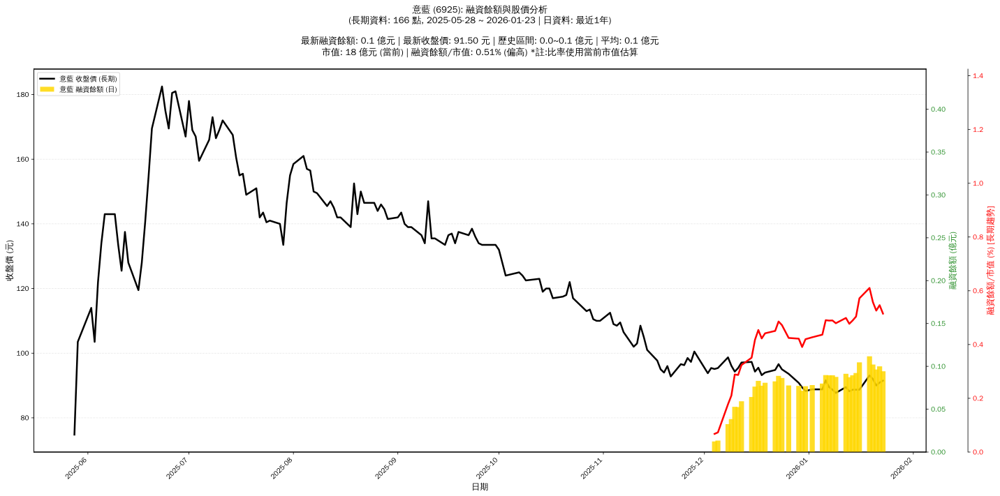

# :chart_with_upwards_trend: 意藍 (6925) 融資餘額報告

!!! info "基本資訊"
    **:building_construction: 名稱**: 意藍
    **:identification_card: 代號**: 6925
    **:calendar: 分析期間**: 2025-07-18 ~ 2026-01-09 (共 156 個交易日)
    **:clock3: 最新資料**: 2026-01-09
    **🕒 更新時間**: 2026-01-12 13:13:59 CST

## :moneybag: 融資餘額現況

| :chart: 指標 | :1234: 數值 | :traffic_light: 狀態 |
|:------------:|:----------:|:-------------------:|
| **最新融資餘額** | 0.1 億元 (100 張) | - |
| **最新收盤價** | 87.70 元 | - |
| **市值** | 18 億元 | - |
| **融資餘額/市值** | 0.50% | 🟠 偏高 |
| **日變化 (DoD)** | -0.0 億元 (-2.11%) | 📉 |
| **週變化 (WoW)** | +0.0 億元 (+12.23%) | 📈 |
| **月變化 (MoM)** | +0.0 億元 (+66.07%) | 📈 |

---

## :bar_chart: 歷史統計

| :chart: 指標 | :1234: 數值 |
|:------------:|:----------:|
| **歷史最高** | 0.1 億元 |
| **歷史最低** | 0.0 億元 |
| **平均值** | 0.1 億元 |
| **標準差** | 0.0 億元 |
| **當前相對位置** | 97.3% |

---

## :chart_with_upwards_trend: 融資餘額趨勢圖

    

---

## :clipboard: 詳細歷史記錄 (最近30日)

<table class="sortable-table">
<thead>
<tr>
<th markdown="span">:calendar: 日期</th>
<th markdown="span">:money_with_wings: 收盤價(元)</th>
<th markdown="span">:chart: 漲跌(元)</th>
<th markdown="span">:chart_with_upwards_trend: 漲跌(%)</th>
<th markdown="span">:package: 融資餘額(億元)</th>
<th markdown="span">:package: 融資餘額(張)</th>
<th markdown="span">:arrow_up_down: 融資增減(張)</th>
<th markdown="span">:chart: 融券餘額(張)</th>
<th markdown="span">:balance_scale: 券資比(%)</th>
</tr>
</thead>
<tbody>
<tr>
<td>2026-01-09</td>
<td>87.70</td>
<td>🔻 -1.00</td>
<td>-1.13%</td>
<td>0.1</td>
<td>100</td>
<td>📉 -1</td>
<td>0</td>
<td>0.00%</td>
</tr>
<tr>
<td>2026-01-08</td>
<td>88.70</td>
<td>🔻 -0.80</td>
<td>-0.89%</td>
<td>0.1</td>
<td>101</td>
<td>📈 +1</td>
<td>0</td>
<td>0.00%</td>
</tr>
<tr>
<td>2026-01-07</td>
<td>89.50</td>
<td>🔻 -2.10</td>
<td>-2.29%</td>
<td>0.1</td>
<td>100</td>
<td>📈 +2</td>
<td>0</td>
<td>0.00%</td>
</tr>
<tr>
<td>2026-01-06</td>
<td>91.60</td>
<td>🔺 +2.80</td>
<td>+3.15%</td>
<td>0.1</td>
<td>98</td>
<td>📈 +8</td>
<td>0</td>
<td>0.00%</td>
</tr>
<tr>
<td>2026-01-05</td>
<td>88.80</td>
<td>➖ +0.00</td>
<td>+0.00%</td>
<td>0.1</td>
<td>90</td>
<td>📈 +2</td>
<td>0</td>
<td>0.00%</td>
</tr>
<tr>
<td>2026-01-02</td>
<td>88.80</td>
<td>🔺 +0.50</td>
<td>+0.57%</td>
<td>0.1</td>
<td>88</td>
<td>📈 +1</td>
<td>0</td>
<td>0.00%</td>
</tr>
<tr>
<td>2025-12-31</td>
<td>88.30</td>
<td>🔻 -1.10</td>
<td>-1.23%</td>
<td>0.1</td>
<td>87</td>
<td>📈 +7</td>
<td>0</td>
<td>0.00%</td>
</tr>
<tr>
<td>2025-12-30</td>
<td>89.40</td>
<td>🔻 -1.40</td>
<td>-1.54%</td>
<td>0.1</td>
<td>80</td>
<td>📉 -5</td>
<td>0</td>
<td>0.00%</td>
</tr>
<tr>
<td>2025-12-29</td>
<td>90.80</td>
<td>🔻 -2.80</td>
<td>-2.99%</td>
<td>0.1</td>
<td>85</td>
<td>📈 +2</td>
<td>0</td>
<td>0.00%</td>
</tr>
<tr>
<td>2025-12-26</td>
<td>93.60</td>
<td>🔻 -1.40</td>
<td>-1.47%</td>
<td>0.1</td>
<td>83</td>
<td>📉 -8</td>
<td>0</td>
<td>0.00%</td>
</tr>
<tr>
<td>2025-12-24</td>
<td>95.00</td>
<td>🔻 -1.60</td>
<td>-1.66%</td>
<td>0.1</td>
<td>91</td>
<td>📉 -1</td>
<td>0</td>
<td>0.00%</td>
</tr>
<tr>
<td>2025-12-23</td>
<td>96.60</td>
<td>🔺 +1.80</td>
<td>+1.90%</td>
<td>0.1</td>
<td>92</td>
<td>📈 +5</td>
<td>0</td>
<td>0.00%</td>
</tr>
<tr>
<td>2025-12-22</td>
<td>94.80</td>
<td>🔺 +0.80</td>
<td>+0.85%</td>
<td>0.1</td>
<td>87</td>
<td>📈 +1</td>
<td>0</td>
<td>0.00%</td>
</tr>
<tr>
<td>2025-12-19</td>
<td>94.00</td>
<td>🔺 +0.80</td>
<td>+0.86%</td>
<td>0.1</td>
<td>86</td>
<td>📈 +3</td>
<td>0</td>
<td>0.00%</td>
</tr>
<tr>
<td>2025-12-18</td>
<td>93.20</td>
<td>🔻 -2.30</td>
<td>-2.41%</td>
<td>0.1</td>
<td>83</td>
<td>📉 -4</td>
<td>0</td>
<td>0.00%</td>
</tr>
<tr>
<td>2025-12-17</td>
<td>95.50</td>
<td>🔺 +1.20</td>
<td>+1.27%</td>
<td>0.1</td>
<td>87</td>
<td>📈 +6</td>
<td>0</td>
<td>0.00%</td>
</tr>
<tr>
<td>2025-12-16</td>
<td>94.30</td>
<td>🔻 -3.00</td>
<td>-3.08%</td>
<td>0.1</td>
<td>81</td>
<td>📈 +15</td>
<td>0</td>
<td>0.00%</td>
</tr>
<tr>
<td>2025-12-15</td>
<td>97.30</td>
<td>🔺 +0.20</td>
<td>+0.21%</td>
<td>0.1</td>
<td>66</td>
<td>📈 +5</td>
<td>0</td>
<td>0.00%</td>
</tr>
<tr>
<td>2025-12-12</td>
<td>97.10</td>
<td>🔺 +1.70</td>
<td>+1.78%</td>
<td>0.1</td>
<td>61</td>
<td>📈 +6</td>
<td>0</td>
<td>0.00%</td>
</tr>
<tr>
<td>2025-12-11</td>
<td>95.40</td>
<td>🔺 +1.10</td>
<td>+1.17%</td>
<td>0.1</td>
<td>55</td>
<td>📉 -1</td>
<td>0</td>
<td>0.00%</td>
</tr>
<tr>
<td>2025-12-10</td>
<td>94.30</td>
<td>🔻 -1.80</td>
<td>-1.87%</td>
<td>0.1</td>
<td>56</td>
<td>📈 +16</td>
<td>0</td>
<td>0.00%</td>
</tr>
<tr>
<td>2025-12-09</td>
<td>96.10</td>
<td>🔻 -2.60</td>
<td>-2.63%</td>
<td>0.0</td>
<td>40</td>
<td>📈 +7</td>
<td>0</td>
<td>0.00%</td>
</tr>
<tr>
<td>2025-12-08</td>
<td>98.70</td>
<td>🔺 +3.30</td>
<td>+3.46%</td>
<td>0.0</td>
<td>33</td>
<td>📈 +19</td>
<td>0</td>
<td>0.00%</td>
</tr>
<tr>
<td>2025-12-05</td>
<td>95.40</td>
<td>🔺 +0.30</td>
<td>+0.32%</td>
<td>0.0</td>
<td>14</td>
<td>📈 +1</td>
<td>0</td>
<td>0.00%</td>
</tr>
<tr>
<td>2025-12-04</td>
<td>95.10</td>
<td>🔻 -0.30</td>
<td>-0.31%</td>
<td>0.0</td>
<td>13</td>
<td>📈 +13</td>
<td>0</td>
<td>0.00%</td>
</tr>
<tr>
<td>2025-12-03</td>
<td>95.40</td>
<td>🔺 +1.60</td>
<td>+1.71%</td>
<td>nan</td>
<td>nan</td>
<td>➡️ +nan</td>
<td>nan</td>
<td>nan%</td>
</tr>
<tr>
<td>2025-12-02</td>
<td>93.80</td>
<td>🔻 -1.70</td>
<td>-1.78%</td>
<td>nan</td>
<td>nan</td>
<td>➡️ +nan</td>
<td>nan</td>
<td>nan%</td>
</tr>
<tr>
<td>2025-12-01</td>
<td>95.50</td>
<td>🔻 -5.00</td>
<td>-4.98%</td>
<td>nan</td>
<td>nan</td>
<td>➡️ +nan</td>
<td>nan</td>
<td>nan%</td>
</tr>
<tr>
<td>2025-11-28</td>
<td>100.50</td>
<td>🔺 +3.20</td>
<td>+3.29%</td>
<td>nan</td>
<td>nan</td>
<td>➡️ +nan</td>
<td>nan</td>
<td>nan%</td>
</tr>
<tr>
<td>2025-11-27</td>
<td>97.30</td>
<td>🔻 -1.20</td>
<td>-1.22%</td>
<td>nan</td>
<td>nan</td>
<td>➡️ +nan</td>
<td>nan</td>
<td>nan%</td>
</tr>
</tbody>
</table>

---

## :information_source: 資料來源與方法

!!! note "資料來源說明"
    - **主要來源**: `raw_margin_daily.csv` (Type 13: ShowMarginChart)
    - **資料頻率**: 每日更新
    - **資料範圍**: 近1年交易日資料

!!! info "報告元資訊"
    - **報告產生時間**: 2026-01-12 13:13:59
    - **分析期間**: 156 個交易日
    - **資料來源**: Stage 1 Raw Margin Daily Data

---

:material-information-outline: **本報告僅供參考，投資決策請審慎評估**

