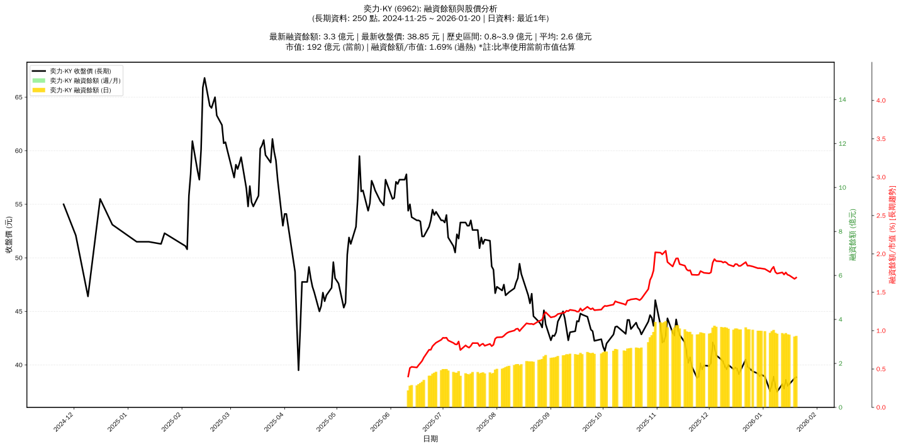

# :chart_with_upwards_trend: 奕力-KY (6962) 融資餘額報告

!!! info "基本資訊"
    **:building_construction: 名稱**: 奕力-KY
    **:identification_card: 代號**: 6962
    **:calendar: 分析期間**: 2025-07-18 ~ 2026-01-09 (共 242 個交易日)
    **:clock3: 最新資料**: 2026-01-09
    **🕒 更新時間**: 2026-01-11 20:27:41 CST

## :moneybag: 融資餘額現況

| :chart: 指標 | :1234: 數值 | :traffic_light: 狀態 |
|:------------:|:----------:|:-------------------:|
| **最新融資餘額** | 3.4 億元 (8,942 張) | - |
| **最新收盤價** | 37.50 元 | - |
| **日變化 (DoD)** | -0.0 億元 (-1.17%) | 📉 |
| **週變化 (WoW)** | -0.1 億元 (-3.31%) | 📉 |
| **月變化 (MoM)** | -0.3 億元 (-8.08%) | 📉 |

---

## :bar_chart: 歷史統計

| :chart: 指標 | :1234: 數值 |
|:------------:|:----------:|
| **歷史最高** | 3.9 億元 |
| **歷史最低** | 0.8 億元 |
| **平均值** | 2.5 億元 |
| **標準差** | 0.8 億元 |
| **當前相對位置** | 81.9% |

---

## :chart_with_upwards_trend: 融資餘額趨勢圖

    

---

## :clipboard: 詳細歷史記錄 (最近30日)

<table class="sortable-table">
<thead>
<tr>
<th>:calendar: 日期</th>
<th>:money_with_wings: 收盤價(元)</th>
<th>:chart: 漲跌(元)</th>
<th>:chart_with_upwards_trend: 漲跌(%)</th>
<th>:package: 融資餘額(億元)</th>
<th>:package: 融資餘額(張)</th>
<th>:arrow_up_down: 融資增減(張)</th>
<th>:chart: 融券餘額(張)</th>
<th>:balance_scale: 券資比(%)</th>
</tr>
</thead>
<tbody>
<tr>
<td>2026-01-09</td>
<td>37.50</td>
<td>🔻 -0.50</td>
<td>-1.32%</td>
<td>3.4</td>
<td>8,942</td>
<td>📈 +13</td>
<td>107</td>
<td>1.20%</td>
</tr>
<tr>
<td>2026-01-08</td>
<td>38.00</td>
<td>🔻 -0.90</td>
<td>-2.31%</td>
<td>3.4</td>
<td>8,929</td>
<td>📉 -128</td>
<td>99</td>
<td>1.11%</td>
</tr>
<tr>
<td>2026-01-07</td>
<td>38.90</td>
<td>🔺 +0.75</td>
<td>+1.97%</td>
<td>3.5</td>
<td>9,057</td>
<td>📉 -39</td>
<td>89</td>
<td>0.98%</td>
</tr>
<tr>
<td>2026-01-06</td>
<td>38.15</td>
<td>🔺 +0.60</td>
<td>+1.60%</td>
<td>3.5</td>
<td>9,096</td>
<td>📈 +68</td>
<td>95</td>
<td>1.04%</td>
</tr>
<tr>
<td>2026-01-05</td>
<td>37.55</td>
<td>🔻 -1.35</td>
<td>-3.47%</td>
<td>3.4</td>
<td>9,028</td>
<td>📈 +113</td>
<td>97</td>
<td>1.07%</td>
</tr>
<tr>
<td>2026-01-02</td>
<td>38.90</td>
<td>🔻 -0.20</td>
<td>-0.51%</td>
<td>3.5</td>
<td>8,915</td>
<td>📈 +11</td>
<td>73</td>
<td>0.82%</td>
</tr>
<tr>
<td>2025-12-31</td>
<td>39.10</td>
<td>🔺 +0.15</td>
<td>+0.39%</td>
<td>3.5</td>
<td>8,904</td>
<td>📉 -51</td>
<td>73</td>
<td>0.82%</td>
</tr>
<tr>
<td>2025-12-30</td>
<td>38.95</td>
<td>🔻 -0.25</td>
<td>-0.64%</td>
<td>3.5</td>
<td>8,955</td>
<td>📈 +59</td>
<td>73</td>
<td>0.82%</td>
</tr>
<tr>
<td>2025-12-29</td>
<td>39.20</td>
<td>🔻 -0.20</td>
<td>-0.51%</td>
<td>3.5</td>
<td>8,896</td>
<td>📉 -67</td>
<td>72</td>
<td>0.81%</td>
</tr>
<tr>
<td>2025-12-26</td>
<td>39.40</td>
<td>🔻 -0.30</td>
<td>-0.76%</td>
<td>3.5</td>
<td>8,963</td>
<td>📈 +16</td>
<td>70</td>
<td>0.78%</td>
</tr>
<tr>
<td>2025-12-24</td>
<td>39.70</td>
<td>🔻 -0.15</td>
<td>-0.38%</td>
<td>3.6</td>
<td>8,947</td>
<td>📈 +35</td>
<td>70</td>
<td>0.78%</td>
</tr>
<tr>
<td>2025-12-23</td>
<td>39.85</td>
<td>🔻 -0.65</td>
<td>-1.60%</td>
<td>3.6</td>
<td>8,912</td>
<td>📉 -76</td>
<td>71</td>
<td>0.80%</td>
</tr>
<tr>
<td>2025-12-22</td>
<td>40.50</td>
<td>🔺 +1.00</td>
<td>+2.53%</td>
<td>3.6</td>
<td>8,988</td>
<td>📈 +9</td>
<td>70</td>
<td>0.78%</td>
</tr>
<tr>
<td>2025-12-19</td>
<td>39.50</td>
<td>🔺 +0.35</td>
<td>+0.89%</td>
<td>3.5</td>
<td>8,979</td>
<td>📉 -74</td>
<td>73</td>
<td>0.81%</td>
</tr>
<tr>
<td>2025-12-18</td>
<td>39.15</td>
<td>🔻 -0.50</td>
<td>-1.26%</td>
<td>3.5</td>
<td>9,053</td>
<td>📈 +4</td>
<td>75</td>
<td>0.83%</td>
</tr>
<tr>
<td>2025-12-17</td>
<td>39.65</td>
<td>🔻 -0.10</td>
<td>-0.25%</td>
<td>3.6</td>
<td>9,049</td>
<td>📈 +14</td>
<td>72</td>
<td>0.80%</td>
</tr>
<tr>
<td>2025-12-16</td>
<td>39.75</td>
<td>🔺 +0.15</td>
<td>+0.38%</td>
<td>3.6</td>
<td>9,035</td>
<td>📈 +111</td>
<td>73</td>
<td>0.81%</td>
</tr>
<tr>
<td>2025-12-15</td>
<td>39.60</td>
<td>🔻 -0.40</td>
<td>-1.00%</td>
<td>3.5</td>
<td>8,924</td>
<td>📉 -21</td>
<td>80</td>
<td>0.90%</td>
</tr>
<tr>
<td>2025-12-12</td>
<td>40.00</td>
<td>🔺 +0.40</td>
<td>+1.01%</td>
<td>3.6</td>
<td>8,945</td>
<td>📉 -208</td>
<td>105</td>
<td>1.17%</td>
</tr>
<tr>
<td>2025-12-11</td>
<td>39.60</td>
<td>🔻 -0.25</td>
<td>-0.63%</td>
<td>3.6</td>
<td>9,153</td>
<td>📉 -1</td>
<td>86</td>
<td>0.94%</td>
</tr>
<tr>
<td>2025-12-10</td>
<td>39.85</td>
<td>🔻 -0.45</td>
<td>-1.12%</td>
<td>3.6</td>
<td>9,154</td>
<td>📈 +147</td>
<td>77</td>
<td>0.84%</td>
</tr>
<tr>
<td>2025-12-09</td>
<td>40.30</td>
<td>🔻 -0.20</td>
<td>-0.49%</td>
<td>3.6</td>
<td>9,007</td>
<td>📉 -22</td>
<td>77</td>
<td>0.85%</td>
</tr>
<tr>
<td>2025-12-08</td>
<td>40.50</td>
<td>🔻 -0.40</td>
<td>-0.98%</td>
<td>3.7</td>
<td>9,029</td>
<td>📈 +64</td>
<td>75</td>
<td>0.83%</td>
</tr>
<tr>
<td>2025-12-05</td>
<td>40.90</td>
<td>🔻 -0.80</td>
<td>-1.92%</td>
<td>3.7</td>
<td>8,965</td>
<td>📈 +56</td>
<td>95</td>
<td>1.06%</td>
</tr>
<tr>
<td>2025-12-04</td>
<td>41.70</td>
<td>🔻 -0.40</td>
<td>-0.95%</td>
<td>3.7</td>
<td>8,909</td>
<td>📈 +294</td>
<td>79</td>
<td>0.89%</td>
</tr>
<tr>
<td>2025-12-03</td>
<td>42.10</td>
<td>🔺 +1.90</td>
<td>+4.73%</td>
<td>3.6</td>
<td>8,615</td>
<td>📈 +198</td>
<td>96</td>
<td>1.11%</td>
</tr>
<tr>
<td>2025-12-02</td>
<td>40.20</td>
<td>🔺 +0.30</td>
<td>+0.75%</td>
<td>3.4</td>
<td>8,417</td>
<td>➡️ +0</td>
<td>108</td>
<td>1.28%</td>
</tr>
<tr>
<td>2025-12-01</td>
<td>39.90</td>
<td>🔻 -0.05</td>
<td>-0.13%</td>
<td>3.4</td>
<td>8,417</td>
<td>📉 -23</td>
<td>110</td>
<td>1.31%</td>
</tr>
<tr>
<td>2025-11-28</td>
<td>39.95</td>
<td>🔺 +0.35</td>
<td>+0.88%</td>
<td>3.4</td>
<td>8,440</td>
<td>📉 -128</td>
<td>101</td>
<td>1.20%</td>
</tr>
<tr>
<td>2025-11-27</td>
<td>39.60</td>
<td>🔻 -0.55</td>
<td>-1.37%</td>
<td>3.4</td>
<td>8,568</td>
<td>📈 +63</td>
<td>112</td>
<td>1.31%</td>
</tr>
</tbody>
</table>

---

## :information_source: 資料來源與方法

!!! note "資料來源說明"
    - **主要來源**: `raw_margin_daily.csv` (Type 13: ShowMarginChart)
    - **資料頻率**: 每日更新
    - **資料範圍**: 近1年交易日資料

!!! info "報告元資訊"
    - **報告產生時間**: 2026-01-11 20:27:41
    - **分析期間**: 242 個交易日
    - **資料來源**: Stage 1 Raw Margin Daily Data

---

:material-information-outline: **本報告僅供參考，投資決策請審慎評估**

