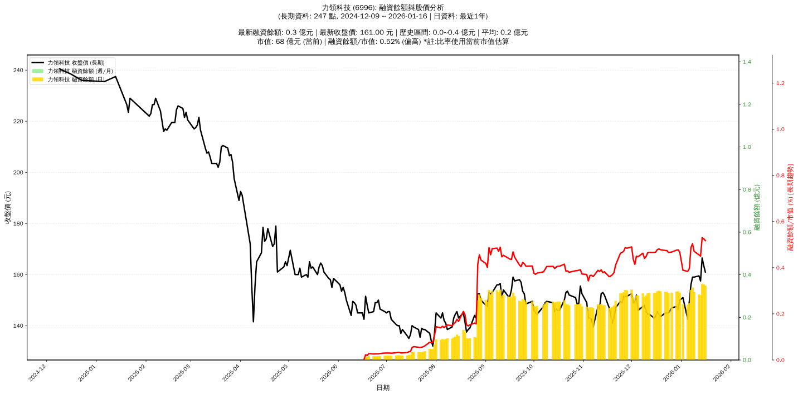

# 📈 力領科技 (6996) 融資餘額報告

!!! info "基本資訊"
    **🏗️ 名稱**: 力領科技
    **🪪 代號**: 6996
    **📅 分析期間**: 2025-07-22 ~ 2026-01-13 (共 242 個交易日)
    **🕒 最新資料**: 2026-01-13
    **🕒 更新時間**: 2026-01-14 22:40:38 CST

## 💰 融資餘額現況

| 📊 指標 | 🔢 數值 | 🚦 狀態 |
|:------------:|:----------:|:-------------------:|
| **最新融資餘額** | 0.3 億元 (193 張) | - |
| **最新收盤價** | 157.50 元 | - |
| **市值** | 70 億元 | - |
| **融資餘額/市值** | 0.44% | 🟡 正常 |
| **日變化 (DoD)** | -0.0 億元 (-1.25%) | 📉 |
| **週變化 (WoW)** | +0.0 億元 (+13.59%) | 📈 |
| **月變化 (MoM)** | -0.0 億元 (-3.50%) | 📉 |

---

## 📊 歷史統計

| 📊 指標 | 🔢 數值 |
|:------------:|:----------:|
| **歷史最高** | 0.3 億元 |
| **歷史最低** | 0.0 億元 |
| **平均值** | 0.2 億元 |
| **標準差** | 0.1 億元 |
| **當前相對位置** | 89.3% |

---

## 📈 融資餘額趨勢圖

{: style="max-width: 100%; height: auto;"}

---

## 📋 詳細歷史記錄 (最近30日)

<table class="sortable-table">
<thead>
<tr>
<th markdown="span">📅 日期</th>
<th markdown="span">💸 收盤價(元)</th>
<th markdown="span">📊 漲跌(元)</th>
<th markdown="span">📈 漲跌(%)</th>
<th markdown="span">📦 融資餘額(億元)</th>
<th markdown="span">📦 融資餘額(張)</th>
<th markdown="span">↕️ 融資增減(張)</th>
<th markdown="span">📊 融券餘額(張)</th>
<th markdown="span">⚖️ 券資比(%)</th>
</tr>
</thead>
<tbody>
<tr>
<td>2026-01-13</td>
<td>157.50</td>
<td>🔻 -2.00</td>
<td>-1.25%</td>
<td>0.3</td>
<td>193</td>
<td>➡️ +0</td>
<td>0</td>
<td>0.00%</td>
</tr>
<tr>
<td>2026-01-12</td>
<td>159.50</td>
<td>🔺 +0.50</td>
<td>+0.31%</td>
<td>0.3</td>
<td>193</td>
<td>📉 -7</td>
<td>0</td>
<td>0.00%</td>
</tr>
<tr>
<td>2026-01-09</td>
<td>159.00</td>
<td>➖ +0.00</td>
<td>+0.00%</td>
<td>0.3</td>
<td>200</td>
<td>📉 -14</td>
<td>0</td>
<td>0.00%</td>
</tr>
<tr>
<td>2026-01-08</td>
<td>159.00</td>
<td>🔺 +3.00</td>
<td>+1.92%</td>
<td>0.3</td>
<td>214</td>
<td>📈 +3</td>
<td>0</td>
<td>0.00%</td>
</tr>
<tr>
<td>2026-01-07</td>
<td>156.00</td>
<td>🔺 +6.50</td>
<td>+4.35%</td>
<td>0.3</td>
<td>211</td>
<td>📈 +32</td>
<td>0</td>
<td>0.00%</td>
</tr>
<tr>
<td>2026-01-06</td>
<td>149.50</td>
<td>🔺 +7.00</td>
<td>+4.91%</td>
<td>0.3</td>
<td>179</td>
<td>📉 -3</td>
<td>0</td>
<td>0.00%</td>
</tr>
<tr>
<td>2026-01-05</td>
<td>142.50</td>
<td>🔻 -8.50</td>
<td>-5.63%</td>
<td>0.3</td>
<td>182</td>
<td>📈 +8</td>
<td>0</td>
<td>0.00%</td>
</tr>
<tr>
<td>2026-01-02</td>
<td>151.00</td>
<td>🔺 +1.00</td>
<td>+0.67%</td>
<td>0.3</td>
<td>174</td>
<td>📉 -37</td>
<td>0</td>
<td>0.00%</td>
</tr>
<tr>
<td>2025-12-31</td>
<td>150.00</td>
<td>🔺 +3.50</td>
<td>+2.39%</td>
<td>0.3</td>
<td>211</td>
<td>📉 -9</td>
<td>0</td>
<td>0.00%</td>
</tr>
<tr>
<td>2025-12-30</td>
<td>146.50</td>
<td>🔻 -1.00</td>
<td>-0.68%</td>
<td>0.3</td>
<td>220</td>
<td>📈 +2</td>
<td>0</td>
<td>0.00%</td>
</tr>
<tr>
<td>2025-12-29</td>
<td>147.50</td>
<td>🔺 +0.50</td>
<td>+0.34%</td>
<td>0.3</td>
<td>218</td>
<td>📈 +3</td>
<td>0</td>
<td>0.00%</td>
</tr>
<tr>
<td>2025-12-26</td>
<td>147.00</td>
<td>🔺 +2.00</td>
<td>+1.38%</td>
<td>0.3</td>
<td>215</td>
<td>📉 -2</td>
<td>0</td>
<td>0.00%</td>
</tr>
<tr>
<td>2025-12-24</td>
<td>145.00</td>
<td>➖ +0.00</td>
<td>+0.00%</td>
<td>0.3</td>
<td>217</td>
<td>📉 -4</td>
<td>0</td>
<td>0.00%</td>
</tr>
<tr>
<td>2025-12-23</td>
<td>145.00</td>
<td>➖ +0.00</td>
<td>+0.00%</td>
<td>0.3</td>
<td>221</td>
<td>➡️ +0</td>
<td>0</td>
<td>0.00%</td>
</tr>
<tr>
<td>2025-12-22</td>
<td>145.00</td>
<td>🔺 +1.50</td>
<td>+1.05%</td>
<td>0.3</td>
<td>221</td>
<td>📉 -4</td>
<td>0</td>
<td>0.00%</td>
</tr>
<tr>
<td>2025-12-19</td>
<td>143.50</td>
<td>🔻 -1.00</td>
<td>-0.69%</td>
<td>0.3</td>
<td>225</td>
<td>➡️ +0</td>
<td>0</td>
<td>0.00%</td>
</tr>
<tr>
<td>2025-12-18</td>
<td>144.50</td>
<td>🔻 -1.00</td>
<td>-0.69%</td>
<td>0.3</td>
<td>225</td>
<td>📈 +3</td>
<td>0</td>
<td>0.00%</td>
</tr>
<tr>
<td>2025-12-17</td>
<td>145.50</td>
<td>🔺 +2.00</td>
<td>+1.39%</td>
<td>0.3</td>
<td>222</td>
<td>📈 +2</td>
<td>0</td>
<td>0.00%</td>
</tr>
<tr>
<td>2025-12-16</td>
<td>143.50</td>
<td>🔺 +0.50</td>
<td>+0.35%</td>
<td>0.3</td>
<td>220</td>
<td>➡️ +0</td>
<td>0</td>
<td>0.00%</td>
</tr>
<tr>
<td>2025-12-15</td>
<td>143.00</td>
<td>🔻 -1.50</td>
<td>-1.04%</td>
<td>0.3</td>
<td>220</td>
<td>📈 +2</td>
<td>0</td>
<td>0.00%</td>
</tr>
<tr>
<td>2025-12-12</td>
<td>144.50</td>
<td>➖ +0.00</td>
<td>+0.00%</td>
<td>0.3</td>
<td>218</td>
<td>📈 +1</td>
<td>0</td>
<td>0.00%</td>
</tr>
<tr>
<td>2025-12-11</td>
<td>144.50</td>
<td>🔻 -1.00</td>
<td>-0.69%</td>
<td>0.3</td>
<td>217</td>
<td>📈 +9</td>
<td>0</td>
<td>0.00%</td>
</tr>
<tr>
<td>2025-12-10</td>
<td>145.50</td>
<td>🔻 -2.50</td>
<td>-1.69%</td>
<td>0.3</td>
<td>208</td>
<td>📈 +7</td>
<td>0</td>
<td>0.00%</td>
</tr>
<tr>
<td>2025-12-09</td>
<td>148.00</td>
<td>🔺 +0.50</td>
<td>+0.34%</td>
<td>0.3</td>
<td>201</td>
<td>📉 -11</td>
<td>0</td>
<td>0.00%</td>
</tr>
<tr>
<td>2025-12-08</td>
<td>147.50</td>
<td>🔺 +1.50</td>
<td>+1.03%</td>
<td>0.3</td>
<td>212</td>
<td>📈 +5</td>
<td>0</td>
<td>0.00%</td>
</tr>
<tr>
<td>2025-12-05</td>
<td>146.00</td>
<td>🔻 -6.00</td>
<td>-3.95%</td>
<td>0.3</td>
<td>207</td>
<td>📈 +7</td>
<td>0</td>
<td>0.00%</td>
</tr>
<tr>
<td>2025-12-04</td>
<td>152.00</td>
<td>🔺 +3.00</td>
<td>+2.01%</td>
<td>0.3</td>
<td>200</td>
<td>📈 +12</td>
<td>0</td>
<td>0.00%</td>
</tr>
<tr>
<td>2025-12-03</td>
<td>149.00</td>
<td>➖ +0.00</td>
<td>+0.00%</td>
<td>0.3</td>
<td>188</td>
<td>📉 -10</td>
<td>0</td>
<td>0.00%</td>
</tr>
<tr>
<td>2025-12-02</td>
<td>149.00</td>
<td>🔻 -3.50</td>
<td>-2.30%</td>
<td>0.3</td>
<td>198</td>
<td>📉 -19</td>
<td>0</td>
<td>0.00%</td>
</tr>
<tr>
<td>2025-12-01</td>
<td>152.50</td>
<td>🔺 +1.00</td>
<td>+0.66%</td>
<td>0.3</td>
<td>217</td>
<td>📈 +1</td>
<td>0</td>
<td>0.00%</td>
</tr>
</tbody>
</table>

---

## ℹ️ 資料來源與方法

!!! note "資料來源說明"
    - **主要來源**: `raw_margin_daily.csv` (Type 13: ShowMarginChart)
    - **資料頻率**: 每日更新
    - **資料範圍**: 近1年交易日資料

!!! info "報告元資訊"
    - **報告產生時間**: 2026-01-14 22:40:38
    - **分析期間**: 242 個交易日
    - **資料來源**: Stage 1 Raw Margin Daily Data

---

:material-information-outline: **本報告僅供參考，投資決策請審慎評估**

