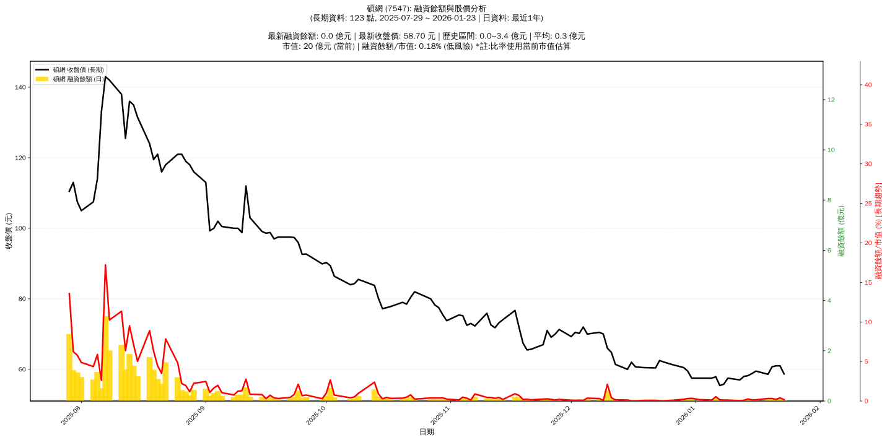

# 📈 碩網 (7547) 融資餘額報告

!!! info "基本資訊"
    **🏗️ 名稱**: 碩網
    **🪪 代號**: 7547
    **📅 分析期間**: 2025-07-29 ~ 2026-01-09 (共 113 個交易日)
    **🕒 最新資料**: 2026-01-09
    **🕒 更新時間**: 2026-01-12 17:16:59 CST

## 💰 融資餘額現況

| 📊 指標 | 🔢 數值 | 🚦 狀態 |
|:------------:|:----------:|:-------------------:|
| **最新融資餘額** | 0.0 億元 (40 張) | - |
| **最新收盤價** | 57.50 元 | - |
| **市值** | 19 億元 | - |
| **融資餘額/市值** | 0.12% | 🟢 低風險 |
| **日變化 (DoD)** | -0.0 億元 (-1.86%) | 📉 |
| **週變化 (WoW)** | -0.0 億元 (-33.33%) | 📉 |
| **月變化 (MoM)** | -0.4 億元 (-94.44%) | 📉 |

---

## 📊 歷史統計

| 📊 指標 | 🔢 數值 |
|:------------:|:----------:|
| **歷史最高** | 3.4 億元 |
| **歷史最低** | 0.0 億元 |
| **平均值** | 0.4 億元 |
| **標準差** | 0.6 億元 |
| **當前相對位置** | 0.5% |

---

## 📈 融資餘額趨勢圖

{: style="max-width: 100%; height: auto;"}

---

## 📋 詳細歷史記錄 (最近30日)

<table class="sortable-table">
<thead>
<tr>
<th markdown="span">📅 日期</th>
<th markdown="span">💸 收盤價(元)</th>
<th markdown="span">📊 漲跌(元)</th>
<th markdown="span">📈 漲跌(%)</th>
<th markdown="span">📦 融資餘額(億元)</th>
<th markdown="span">📦 融資餘額(張)</th>
<th markdown="span">↕️ 融資增減(張)</th>
<th markdown="span">📊 融券餘額(張)</th>
<th markdown="span">⚖️ 券資比(%)</th>
</tr>
</thead>
<tbody>
<tr>
<td>2026-01-09</td>
<td>57.50</td>
<td>🔺 +57.50</td>
<td>+57.00%</td>
<td>0.0</td>
<td>40</td>
<td>📈 +18</td>
<td>0</td>
<td>nan%</td>
</tr>
<tr>
<td>2026-01-08</td>
<td>55.80</td>
<td>🔺 +56.80</td>
<td>+55.80%</td>
<td>0.0</td>
<td>42</td>
<td>📈 +49</td>
<td>14</td>
<td>nan%</td>
</tr>
<tr>
<td>2026-01-07</td>
<td>55.40</td>
<td>🔺 +56.00</td>
<td>+55.40%</td>
<td>0.0</td>
<td>58</td>
<td>📈 +57</td>
<td>-7</td>
<td>nan%</td>
</tr>
<tr>
<td>2026-01-06</td>
<td>57.90</td>
<td>🔺 +57.90</td>
<td>+55.50%</td>
<td>0.1</td>
<td>183</td>
<td>📈 +118</td>
<td>-36</td>
<td>nan%</td>
</tr>
<tr>
<td>2026-01-05</td>
<td>57.50</td>
<td>🔺 +58.50</td>
<td>+57.20%</td>
<td>0.0</td>
<td>41</td>
<td>📈 +36</td>
<td>-6</td>
<td>nan%</td>
</tr>
<tr>
<td>2026-01-02</td>
<td>57.50</td>
<td>🔺 +57.80</td>
<td>+57.10%</td>
<td>0.0</td>
<td>60</td>
<td>📈 +51</td>
<td>-4</td>
<td>nan%</td>
</tr>
<tr>
<td>2025-12-31</td>
<td>57.50</td>
<td>🔺 +57.80</td>
<td>+57.00%</td>
<td>0.1</td>
<td>117</td>
<td>📈 +44</td>
<td>-6</td>
<td>nan%</td>
</tr>
<tr>
<td>2025-12-30</td>
<td>59.50</td>
<td>🔺 +59.50</td>
<td>+57.10%</td>
<td>0.1</td>
<td>106</td>
<td>📈 +83</td>
<td>-28</td>
<td>nan%</td>
</tr>
<tr>
<td>2025-12-29</td>
<td>60.50</td>
<td>🔺 +60.60</td>
<td>+59.00%</td>
<td>0.0</td>
<td>71</td>
<td>📈 +67</td>
<td>-17</td>
<td>nan%</td>
</tr>
<tr>
<td>2025-12-26</td>
<td>61.40</td>
<td>🔺 +61.50</td>
<td>+60.30%</td>
<td>0.0</td>
<td>28</td>
<td>📈 +13</td>
<td>1</td>
<td>nan%</td>
</tr>
<tr>
<td>2025-12-24</td>
<td>62.10</td>
<td>🔺 +62.10</td>
<td>+61.50%</td>
<td>0.0</td>
<td>11</td>
<td>📈 +9</td>
<td>1</td>
<td>nan%</td>
</tr>
<tr>
<td>2025-12-23</td>
<td>62.50</td>
<td>🔺 +62.60</td>
<td>+62.10%</td>
<td>0.0</td>
<td>14</td>
<td>📈 +13</td>
<td>2</td>
<td>nan%</td>
</tr>
<tr>
<td>2025-12-22</td>
<td>60.40</td>
<td>🔺 +62.00</td>
<td>+60.40%</td>
<td>0.0</td>
<td>28</td>
<td>📈 +26</td>
<td>5</td>
<td>nan%</td>
</tr>
<tr>
<td>2025-12-19</td>
<td>60.50</td>
<td>🔺 +60.90</td>
<td>+60.30%</td>
<td>0.0</td>
<td>25</td>
<td>📈 +9</td>
<td>2</td>
<td>nan%</td>
</tr>
<tr>
<td>2025-12-18</td>
<td>60.60</td>
<td>🔺 +60.60</td>
<td>+60.50%</td>
<td>0.0</td>
<td>19</td>
<td>📈 +9</td>
<td>nan</td>
<td>nan%</td>
</tr>
<tr>
<td>2025-12-17</td>
<td>60.70</td>
<td>🔺 +61.60</td>
<td>+60.70%</td>
<td>0.0</td>
<td>12</td>
<td>📈 +10</td>
<td>1</td>
<td>nan%</td>
</tr>
<tr>
<td>2025-12-16</td>
<td>62.00</td>
<td>🔺 +62.00</td>
<td>+61.70%</td>
<td>0.0</td>
<td>10</td>
<td>📈 +4</td>
<td>-1</td>
<td>nan%</td>
</tr>
<tr>
<td>2025-12-15</td>
<td>60.00</td>
<td>🔺 +62.00</td>
<td>+60.00%</td>
<td>0.0</td>
<td>40</td>
<td>📈 +15</td>
<td>4</td>
<td>nan%</td>
</tr>
<tr>
<td>2025-12-12</td>
<td>61.40</td>
<td>🔺 +62.50</td>
<td>+61.20%</td>
<td>0.0</td>
<td>48</td>
<td>📈 +27</td>
<td>1</td>
<td>nan%</td>
</tr>
<tr>
<td>2025-12-11</td>
<td>64.80</td>
<td>🔺 +64.80</td>
<td>+61.10%</td>
<td>0.1</td>
<td>126</td>
<td>📈 +64</td>
<td>-12</td>
<td>nan%</td>
</tr>
<tr>
<td>2025-12-10</td>
<td>66.00</td>
<td>🔺 +67.00</td>
<td>+63.80%</td>
<td>0.4</td>
<td>627</td>
<td>📈 +112</td>
<td>-35</td>
<td>nan%</td>
</tr>
<tr>
<td>2025-12-09</td>
<td>70.00</td>
<td>🔺 +70.00</td>
<td>+69.30%</td>
<td>0.0</td>
<td>21</td>
<td>📈 +9</td>
<td>1</td>
<td>nan%</td>
</tr>
<tr>
<td>2025-12-08</td>
<td>70.50</td>
<td>🔺 +70.60</td>
<td>+69.10%</td>
<td>0.1</td>
<td>87</td>
<td>📈 +15</td>
<td>-1</td>
<td>nan%</td>
</tr>
<tr>
<td>2025-12-05</td>
<td>70.00</td>
<td>🔺 +71.50</td>
<td>+69.60%</td>
<td>0.1</td>
<td>103</td>
<td>📈 +56</td>
<td>4</td>
<td>nan%</td>
</tr>
<tr>
<td>2025-12-04</td>
<td>72.00</td>
<td>🔺 +72.00</td>
<td>+70.10%</td>
<td>0.0</td>
<td>23</td>
<td>📈 +12</td>
<td>-1</td>
<td>nan%</td>
</tr>
<tr>
<td>2025-12-03</td>
<td>70.20</td>
<td>🔺 +70.20</td>
<td>+69.10%</td>
<td>0.0</td>
<td>30</td>
<td>📈 +29</td>
<td>-2</td>
<td>nan%</td>
</tr>
<tr>
<td>2025-12-02</td>
<td>70.50</td>
<td>🔺 +70.70</td>
<td>+69.30%</td>
<td>0.0</td>
<td>24</td>
<td>📈 +13</td>
<td>-2</td>
<td>nan%</td>
</tr>
<tr>
<td>2025-12-01</td>
<td>69.30</td>
<td>🔺 +71.20</td>
<td>+69.30%</td>
<td>0.0</td>
<td>30</td>
<td>📈 +31</td>
<td>-2</td>
<td>nan%</td>
</tr>
<tr>
<td>2025-11-28</td>
<td>71.30</td>
<td>🔺 +72.30</td>
<td>+69.20%</td>
<td>0.0</td>
<td>56</td>
<td>📈 +56</td>
<td>-1</td>
<td>nan%</td>
</tr>
<tr>
<td>2025-11-27</td>
<td>70.00</td>
<td>🔺 +70.00</td>
<td>+68.10%</td>
<td>0.0</td>
<td>36</td>
<td>📈 +26</td>
<td>-3</td>
<td>nan%</td>
</tr>
</tbody>
</table>

---

## ℹ️ 資料來源與方法

!!! note "資料來源說明"
    - **主要來源**: `raw_margin_daily.csv` (Type 13: ShowMarginChart)
    - **資料頻率**: 每日更新
    - **資料範圍**: 近1年交易日資料

!!! info "報告元資訊"
    - **報告產生時間**: 2026-01-12 17:16:59
    - **分析期間**: 113 個交易日
    - **資料來源**: Stage 1 Raw Margin Daily Data

---

:material-information-outline: **本報告僅供參考，投資決策請審慎評估**

