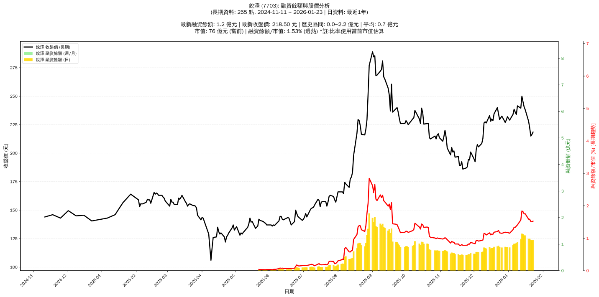

# :chart_with_upwards_trend: 銳澤 (7703) 融資餘額報告

!!! info "基本資訊"
    **:building_construction: 名稱**: 銳澤
    **:identification_card: 代號**: 7703
    **:calendar: 分析期間**: 2025-07-18 ~ 2026-01-09 (共 242 個交易日)
    **:clock3: 最新資料**: 2026-01-09
    **🕒 更新時間**: 2026-01-11 20:27:57 CST

## :moneybag: 融資餘額現況

| :chart: 指標 | :1234: 數值 | :traffic_light: 狀態 |
|:------------:|:----------:|:-------------------:|
| **最新融資餘額** | 1.1 億元 (444 張) | - |
| **最新收盤價** | 241.50 元 | - |
| **市值** | 84 億元 | - |
| **融資餘額/市值** | 1.28% | 🔴 過熱 |
| **日變化 (DoD)** | +0.0 億元 (+2.74%) | 📈 |
| **週變化 (WoW)** | +0.2 億元 (+22.25%) | 📈 |
| **月變化 (MoM)** | +0.2 億元 (+22.64%) | 📈 |

---

## :bar_chart: 歷史統計

| :chart: 指標 | :1234: 數值 |
|:------------:|:----------:|
| **歷史最高** | 2.2 億元 |
| **歷史最低** | 0.0 億元 |
| **平均值** | 0.7 億元 |
| **標準差** | 0.5 億元 |
| **當前相對位置** | 49.1% |

---

## :chart_with_upwards_trend: 融資餘額趨勢圖

    

---

## :clipboard: 詳細歷史記錄 (最近30日)

<table class="sortable-table">
<thead>
<tr>
<th>:calendar: 日期</th>
<th>:money_with_wings: 收盤價(元)</th>
<th>:chart: 漲跌(元)</th>
<th>:chart_with_upwards_trend: 漲跌(%)</th>
<th>:package: 融資餘額(億元)</th>
<th>:package: 融資餘額(張)</th>
<th>:arrow_up_down: 融資增減(張)</th>
<th>:chart: 融券餘額(張)</th>
<th>:balance_scale: 券資比(%)</th>
</tr>
</thead>
<tbody>
<tr>
<td>2026-01-09</td>
<td>241.50</td>
<td>🔺 +7.50</td>
<td>+3.21%</td>
<td>1.1</td>
<td>444</td>
<td>📉 -2</td>
<td>0</td>
<td>0.00%</td>
</tr>
<tr>
<td>2026-01-08</td>
<td>234.00</td>
<td>🔻 -2.00</td>
<td>-0.85%</td>
<td>1.0</td>
<td>446</td>
<td>📈 +16</td>
<td>0</td>
<td>0.00%</td>
</tr>
<tr>
<td>2026-01-07</td>
<td>236.00</td>
<td>🔻 -2.50</td>
<td>-1.05%</td>
<td>1.0</td>
<td>430</td>
<td>📈 +4</td>
<td>0</td>
<td>0.00%</td>
</tr>
<tr>
<td>2026-01-06</td>
<td>238.50</td>
<td>🔺 +4.50</td>
<td>+1.92%</td>
<td>1.0</td>
<td>426</td>
<td>📈 +16</td>
<td>0</td>
<td>0.00%</td>
</tr>
<tr>
<td>2026-01-05</td>
<td>234.00</td>
<td>🔺 +5.00</td>
<td>+2.18%</td>
<td>1.0</td>
<td>410</td>
<td>📈 +27</td>
<td>0</td>
<td>0.00%</td>
</tr>
<tr>
<td>2026-01-02</td>
<td>229.00</td>
<td>🔻 -3.00</td>
<td>-1.29%</td>
<td>0.9</td>
<td>383</td>
<td>📉 -3</td>
<td>0</td>
<td>0.00%</td>
</tr>
<tr>
<td>2025-12-31</td>
<td>232.00</td>
<td>🔺 +3.00</td>
<td>+1.31%</td>
<td>0.9</td>
<td>386</td>
<td>📉 -4</td>
<td>0</td>
<td>0.00%</td>
</tr>
<tr>
<td>2025-12-30</td>
<td>229.00</td>
<td>🔺 +2.00</td>
<td>+0.88%</td>
<td>0.9</td>
<td>390</td>
<td>📉 -7</td>
<td>0</td>
<td>0.00%</td>
</tr>
<tr>
<td>2025-12-29</td>
<td>227.00</td>
<td>🔻 -5.50</td>
<td>-2.37%</td>
<td>0.9</td>
<td>397</td>
<td>📈 +21</td>
<td>0</td>
<td>0.00%</td>
</tr>
<tr>
<td>2025-12-26</td>
<td>232.50</td>
<td>🔺 +3.00</td>
<td>+1.31%</td>
<td>0.9</td>
<td>376</td>
<td>📉 -10</td>
<td>0</td>
<td>0.00%</td>
</tr>
<tr>
<td>2025-12-24</td>
<td>229.50</td>
<td>🔻 -5.00</td>
<td>-2.13%</td>
<td>0.9</td>
<td>386</td>
<td>📉 -16</td>
<td>0</td>
<td>0.00%</td>
</tr>
<tr>
<td>2025-12-23</td>
<td>234.50</td>
<td>🔻 -5.50</td>
<td>-2.29%</td>
<td>0.9</td>
<td>402</td>
<td>📈 +20</td>
<td>0</td>
<td>0.00%</td>
</tr>
<tr>
<td>2025-12-22</td>
<td>240.00</td>
<td>🔺 +5.50</td>
<td>+2.35%</td>
<td>0.9</td>
<td>382</td>
<td>📉 -2</td>
<td>0</td>
<td>0.00%</td>
</tr>
<tr>
<td>2025-12-19</td>
<td>234.50</td>
<td>🔺 +6.00</td>
<td>+2.63%</td>
<td>0.9</td>
<td>384</td>
<td>📈 +11</td>
<td>0</td>
<td>0.00%</td>
</tr>
<tr>
<td>2025-12-18</td>
<td>228.50</td>
<td>🔻 -1.50</td>
<td>-0.65%</td>
<td>0.9</td>
<td>373</td>
<td>➡️ +0</td>
<td>0</td>
<td>0.00%</td>
</tr>
<tr>
<td>2025-12-17</td>
<td>230.00</td>
<td>🔺 +2.00</td>
<td>+0.88%</td>
<td>0.9</td>
<td>373</td>
<td>📈 +5</td>
<td>1</td>
<td>0.27%</td>
</tr>
<tr>
<td>2025-12-16</td>
<td>228.00</td>
<td>🔻 -5.00</td>
<td>-2.15%</td>
<td>0.8</td>
<td>368</td>
<td>📉 -12</td>
<td>1</td>
<td>0.27%</td>
</tr>
<tr>
<td>2025-12-15</td>
<td>233.00</td>
<td>🔺 +6.50</td>
<td>+2.87%</td>
<td>0.9</td>
<td>380</td>
<td>📈 +11</td>
<td>1</td>
<td>0.26%</td>
</tr>
<tr>
<td>2025-12-12</td>
<td>226.50</td>
<td>🔻 -1.00</td>
<td>-0.44%</td>
<td>0.8</td>
<td>369</td>
<td>📉 -10</td>
<td>1</td>
<td>0.27%</td>
</tr>
<tr>
<td>2025-12-11</td>
<td>227.50</td>
<td>🔺 +1.00</td>
<td>+0.44%</td>
<td>0.9</td>
<td>379</td>
<td>📉 -7</td>
<td>2</td>
<td>0.53%</td>
</tr>
<tr>
<td>2025-12-10</td>
<td>226.50</td>
<td>🔺 +13.50</td>
<td>+6.34%</td>
<td>0.9</td>
<td>386</td>
<td>📈 +49</td>
<td>2</td>
<td>0.52%</td>
</tr>
<tr>
<td>2025-12-09</td>
<td>213.00</td>
<td>🔺 +4.50</td>
<td>+2.16%</td>
<td>0.7</td>
<td>337</td>
<td>📉 -3</td>
<td>0</td>
<td>0.00%</td>
</tr>
<tr>
<td>2025-12-08</td>
<td>208.50</td>
<td>🔺 +3.00</td>
<td>+1.46%</td>
<td>0.7</td>
<td>340</td>
<td>📈 +3</td>
<td>0</td>
<td>0.00%</td>
</tr>
<tr>
<td>2025-12-05</td>
<td>205.50</td>
<td>🔻 -2.00</td>
<td>-0.96%</td>
<td>0.7</td>
<td>337</td>
<td>📉 -5</td>
<td>0</td>
<td>0.00%</td>
</tr>
<tr>
<td>2025-12-04</td>
<td>207.50</td>
<td>🔺 +4.50</td>
<td>+2.22%</td>
<td>0.7</td>
<td>342</td>
<td>📉 -7</td>
<td>0</td>
<td>0.00%</td>
</tr>
<tr>
<td>2025-12-03</td>
<td>203.00</td>
<td>🔺 +10.50</td>
<td>+5.45%</td>
<td>0.7</td>
<td>349</td>
<td>📈 +21</td>
<td>0</td>
<td>0.00%</td>
</tr>
<tr>
<td>2025-12-02</td>
<td>192.50</td>
<td>🔻 -2.50</td>
<td>-1.28%</td>
<td>0.6</td>
<td>328</td>
<td>➡️ +0</td>
<td>10</td>
<td>3.05%</td>
</tr>
<tr>
<td>2025-12-01</td>
<td>195.00</td>
<td>🔻 -6.00</td>
<td>-2.99%</td>
<td>0.6</td>
<td>328</td>
<td>📉 -1</td>
<td>10</td>
<td>3.05%</td>
</tr>
<tr>
<td>2025-11-28</td>
<td>201.00</td>
<td>🔺 +7.00</td>
<td>+3.61%</td>
<td>0.7</td>
<td>329</td>
<td>📈 +9</td>
<td>10</td>
<td>3.04%</td>
</tr>
<tr>
<td>2025-11-27</td>
<td>194.00</td>
<td>🔻 -0.50</td>
<td>-0.26%</td>
<td>0.6</td>
<td>320</td>
<td>➡️ +0</td>
<td>10</td>
<td>3.12%</td>
</tr>
</tbody>
</table>

---

## :information_source: 資料來源與方法

!!! note "資料來源說明"
    - **主要來源**: `raw_margin_daily.csv` (Type 13: ShowMarginChart)
    - **資料頻率**: 每日更新
    - **資料範圍**: 近1年交易日資料

!!! info "報告元資訊"
    - **報告產生時間**: 2026-01-11 20:27:57
    - **分析期間**: 242 個交易日
    - **資料來源**: Stage 1 Raw Margin Daily Data

---

:material-information-outline: **本報告僅供參考，投資決策請審慎評估**

