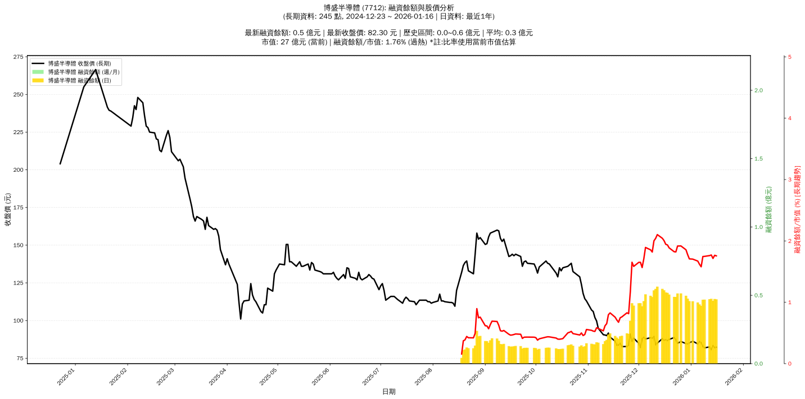

# :chart_with_upwards_trend: 博盛半導體 (7712) 融資餘額報告

!!! info "基本資訊"
    **:building_construction: 名稱**: 博盛半導體
    **:identification_card: 代號**: 7712
    **:calendar: 分析期間**: 2025-07-18 ~ 2026-01-09 (共 242 個交易日)
    **:clock3: 最新資料**: 2026-01-09
    **🕒 更新時間**: 2026-01-12 12:09:40 CST

## :moneybag: 融資餘額現況

| :chart: 指標 | :1234: 數值 | :traffic_light: 狀態 |
|:------------:|:----------:|:-------------------:|
| **最新融資餘額** | 0.5 億元 (572 張) | - |
| **最新收盤價** | 81.90 元 | - |
| **市值** | 27 億元 | - |
| **融資餘額/市值** | 1.76% | 🔴 過熱 |
| **日變化 (DoD)** | +0.0 億元 (+0.14%) | 📈 |
| **週變化 (WoW)** | +0.0 億元 (+2.62%) | 📈 |
| **月變化 (MoM)** | -0.1 億元 (-12.66%) | 📉 |

---

## :bar_chart: 歷史統計

| :chart: 指標 | :1234: 數值 |
|:------------:|:----------:|
| **歷史最高** | 0.6 億元 |
| **歷史最低** | 0.0 億元 |
| **平均值** | 0.2 億元 |
| **標準差** | 0.2 億元 |
| **當前相對位置** | 81.8% |

---

## :chart_with_upwards_trend: 融資餘額趨勢圖

    

---

## :clipboard: 詳細歷史記錄 (最近30日)

<table class="sortable-table">
<thead>
<tr>
<th>:calendar: 日期</th>
<th>:money_with_wings: 收盤價(元)</th>
<th>:chart: 漲跌(元)</th>
<th>:chart_with_upwards_trend: 漲跌(%)</th>
<th>:package: 融資餘額(億元)</th>
<th>:package: 融資餘額(張)</th>
<th>:arrow_up_down: 融資增減(張)</th>
<th>:chart: 融券餘額(張)</th>
<th>:balance_scale: 券資比(%)</th>
</tr>
</thead>
<tbody>
<tr>
<td>2026-01-09</td>
<td>81.90</td>
<td>🔻 -0.90</td>
<td>-1.09%</td>
<td>0.5</td>
<td>572</td>
<td>📈 +7</td>
<td>0</td>
<td>0.00%</td>
</tr>
<tr>
<td>2026-01-08</td>
<td>82.80</td>
<td>🔻 -2.50</td>
<td>-2.93%</td>
<td>0.5</td>
<td>565</td>
<td>📈 +69</td>
<td>0</td>
<td>0.00%</td>
</tr>
<tr>
<td>2026-01-07</td>
<td>85.30</td>
<td>🔻 -0.80</td>
<td>-0.93%</td>
<td>0.4</td>
<td>496</td>
<td>📉 -8</td>
<td>0</td>
<td>0.00%</td>
</tr>
<tr>
<td>2026-01-06</td>
<td>86.10</td>
<td>🔺 +1.60</td>
<td>+1.89%</td>
<td>0.4</td>
<td>504</td>
<td>📉 -26</td>
<td>1</td>
<td>0.20%</td>
</tr>
<tr>
<td>2026-01-05</td>
<td>84.50</td>
<td>🔻 -1.80</td>
<td>-2.09%</td>
<td>0.4</td>
<td>530</td>
<td>📈 +1</td>
<td>1</td>
<td>0.19%</td>
</tr>
<tr>
<td>2026-01-02</td>
<td>86.30</td>
<td>🔺 +1.10</td>
<td>+1.29%</td>
<td>0.5</td>
<td>529</td>
<td>📉 -8</td>
<td>7</td>
<td>1.32%</td>
</tr>
<tr>
<td>2025-12-31</td>
<td>85.20</td>
<td>🔺 +0.70</td>
<td>+0.83%</td>
<td>0.5</td>
<td>537</td>
<td>📉 -26</td>
<td>6</td>
<td>1.12%</td>
</tr>
<tr>
<td>2025-12-30</td>
<td>84.50</td>
<td>🔻 -0.20</td>
<td>-0.24%</td>
<td>0.5</td>
<td>563</td>
<td>📉 -24</td>
<td>1</td>
<td>0.18%</td>
</tr>
<tr>
<td>2025-12-29</td>
<td>84.70</td>
<td>🔻 -1.40</td>
<td>-1.63%</td>
<td>0.5</td>
<td>587</td>
<td>📉 -10</td>
<td>6</td>
<td>1.02%</td>
</tr>
<tr>
<td>2025-12-26</td>
<td>86.10</td>
<td>🔺 +1.20</td>
<td>+1.41%</td>
<td>0.5</td>
<td>597</td>
<td>📉 -8</td>
<td>6</td>
<td>1.01%</td>
</tr>
<tr>
<td>2025-12-24</td>
<td>84.90</td>
<td>🔻 -2.40</td>
<td>-2.75%</td>
<td>0.5</td>
<td>605</td>
<td>📈 +46</td>
<td>1</td>
<td>0.17%</td>
</tr>
<tr>
<td>2025-12-23</td>
<td>87.30</td>
<td>🔻 -1.40</td>
<td>-1.58%</td>
<td>0.5</td>
<td>559</td>
<td>📈 +8</td>
<td>0</td>
<td>0.00%</td>
</tr>
<tr>
<td>2025-12-22</td>
<td>88.70</td>
<td>🔺 +1.20</td>
<td>+1.37%</td>
<td>0.5</td>
<td>551</td>
<td>📉 -27</td>
<td>0</td>
<td>0.00%</td>
</tr>
<tr>
<td>2025-12-19</td>
<td>87.50</td>
<td>🔺 +0.80</td>
<td>+0.92%</td>
<td>0.5</td>
<td>578</td>
<td>📉 -20</td>
<td>0</td>
<td>0.00%</td>
</tr>
<tr>
<td>2025-12-18</td>
<td>86.70</td>
<td>🔻 -0.60</td>
<td>-0.69%</td>
<td>0.5</td>
<td>598</td>
<td>📈 +1</td>
<td>0</td>
<td>0.00%</td>
</tr>
<tr>
<td>2025-12-17</td>
<td>87.30</td>
<td>🔺 +0.40</td>
<td>+0.46%</td>
<td>0.5</td>
<td>597</td>
<td>📉 -21</td>
<td>0</td>
<td>0.00%</td>
</tr>
<tr>
<td>2025-12-16</td>
<td>86.90</td>
<td>🔻 -1.10</td>
<td>-1.25%</td>
<td>0.5</td>
<td>618</td>
<td>📉 -4</td>
<td>0</td>
<td>0.00%</td>
</tr>
<tr>
<td>2025-12-15</td>
<td>88.00</td>
<td>🔺 +3.00</td>
<td>+3.53%</td>
<td>0.5</td>
<td>622</td>
<td>📉 -41</td>
<td>6</td>
<td>0.96%</td>
</tr>
<tr>
<td>2025-12-12</td>
<td>85.00</td>
<td>🔺 +1.10</td>
<td>+1.31%</td>
<td>0.6</td>
<td>663</td>
<td>📈 +11</td>
<td>0</td>
<td>0.00%</td>
</tr>
<tr>
<td>2025-12-11</td>
<td>83.90</td>
<td>🔻 -5.50</td>
<td>-6.15%</td>
<td>0.5</td>
<td>652</td>
<td>📈 +52</td>
<td>1</td>
<td>0.15%</td>
</tr>
<tr>
<td>2025-12-10</td>
<td>89.40</td>
<td>🔺 +1.10</td>
<td>+1.25%</td>
<td>0.5</td>
<td>600</td>
<td>📈 +48</td>
<td>1</td>
<td>0.17%</td>
</tr>
<tr>
<td>2025-12-09</td>
<td>88.30</td>
<td>🔻 -0.30</td>
<td>-0.34%</td>
<td>0.5</td>
<td>552</td>
<td>📉 -9</td>
<td>1</td>
<td>0.18%</td>
</tr>
<tr>
<td>2025-12-08</td>
<td>88.60</td>
<td>🔺 +0.80</td>
<td>+0.91%</td>
<td>0.5</td>
<td>561</td>
<td>📉 -17</td>
<td>1</td>
<td>0.18%</td>
</tr>
<tr>
<td>2025-12-05</td>
<td>87.80</td>
<td>🔻 -1.10</td>
<td>-1.24%</td>
<td>0.5</td>
<td>578</td>
<td>📈 +63</td>
<td>1</td>
<td>0.17%</td>
</tr>
<tr>
<td>2025-12-04</td>
<td>88.90</td>
<td>🔺 +0.90</td>
<td>+1.02%</td>
<td>0.5</td>
<td>515</td>
<td>📈 +38</td>
<td>2</td>
<td>0.39%</td>
</tr>
<tr>
<td>2025-12-03</td>
<td>88.00</td>
<td>🔺 +5.90</td>
<td>+7.19%</td>
<td>0.4</td>
<td>477</td>
<td>📉 -62</td>
<td>2</td>
<td>0.42%</td>
</tr>
<tr>
<td>2025-12-02</td>
<td>82.10</td>
<td>🔻 -2.80</td>
<td>-3.30%</td>
<td>0.4</td>
<td>539</td>
<td>📈 +18</td>
<td>0</td>
<td>0.00%</td>
</tr>
<tr>
<td>2025-12-01</td>
<td>84.90</td>
<td>🔻 -3.40</td>
<td>-3.85%</td>
<td>0.4</td>
<td>521</td>
<td>📈 +40</td>
<td>2</td>
<td>0.38%</td>
</tr>
<tr>
<td>2025-11-28</td>
<td>88.30</td>
<td>🔺 +2.00</td>
<td>+2.32%</td>
<td>0.4</td>
<td>481</td>
<td>📉 -32</td>
<td>1</td>
<td>0.21%</td>
</tr>
<tr>
<td>2025-11-27</td>
<td>86.30</td>
<td>🔻 -4.70</td>
<td>-5.16%</td>
<td>0.4</td>
<td>513</td>
<td>📈 +168</td>
<td>0</td>
<td>0.00%</td>
</tr>
</tbody>
</table>

---

## :information_source: 資料來源與方法

!!! note "資料來源說明"
    - **主要來源**: `raw_margin_daily.csv` (Type 13: ShowMarginChart)
    - **資料頻率**: 每日更新
    - **資料範圍**: 近1年交易日資料

!!! info "報告元資訊"
    - **報告產生時間**: 2026-01-12 12:09:40
    - **分析期間**: 242 個交易日
    - **資料來源**: Stage 1 Raw Margin Daily Data

---

:material-information-outline: **本報告僅供參考，投資決策請審慎評估**

