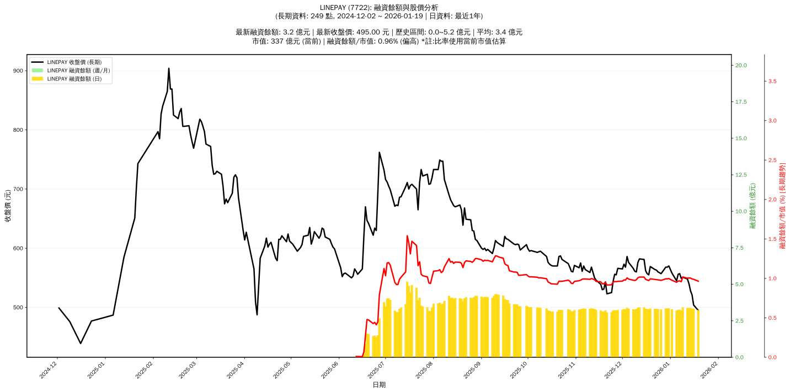

# :chart_with_upwards_trend: LINEPAY (7722) 融資餘額報告

!!! info "基本資訊"
    **:building_construction: 名稱**: LINEPAY
    **:identification_card: 代號**: 7722
    **:calendar: 分析期間**: 2025-07-18 ~ 2026-01-09 (共 242 個交易日)
    **:clock3: 最新資料**: 2026-01-09
    **🕒 更新時間**: 2026-01-11 23:12:42 CST

## :moneybag: 融資餘額現況

| :chart: 指標 | :1234: 數值 | :traffic_light: 狀態 |
|:------------:|:----------:|:-------------------:|
| **最新融資餘額** | 3.4 億元 (622 張) | - |
| **最新收盤價** | 551.00 元 | - |
| **市值** | 375 億元 | - |
| **融資餘額/市值** | 0.91% | 🟠 偏高 |
| **日變化 (DoD)** | +0.2 億元 (+6.35%) | 📈 |
| **週變化 (WoW)** | +0.1 億元 (+4.28%) | 📈 |
| **月變化 (MoM)** | +0.1 億元 (+3.73%) | 📈 |

---

## :bar_chart: 歷史統計

| :chart: 指標 | :1234: 數值 |
|:------------:|:----------:|
| **歷史最高** | 5.2 億元 |
| **歷史最低** | 0.0 億元 |
| **平均值** | 3.4 億元 |
| **標準差** | 0.8 億元 |
| **當前相對位置** | 65.9% |

---

## :chart_with_upwards_trend: 融資餘額趨勢圖

{: style="max-width: 100%; height: auto;"}

---

## :clipboard: 詳細歷史記錄 (最近30日)

<table class="sortable-table">
<thead>
<tr>
<th>:calendar: 日期</th>
<th>:money_with_wings: 收盤價(元)</th>
<th>:chart: 漲跌(元)</th>
<th>:chart_with_upwards_trend: 漲跌(%)</th>
<th>:package: 融資餘額(億元)</th>
<th>:package: 融資餘額(張)</th>
<th>:arrow_up_down: 融資增減(張)</th>
<th>:chart: 融券餘額(張)</th>
<th>:balance_scale: 券資比(%)</th>
</tr>
</thead>
<tbody>
<tr>
<td>2026-01-09</td>
<td>551.00</td>
<td>🔺 +2.00</td>
<td>+0.36%</td>
<td>3.4</td>
<td>622</td>
<td>📈 +35</td>
<td>0</td>
<td>0.00%</td>
</tr>
<tr>
<td>2026-01-08</td>
<td>549.00</td>
<td>🔻 -8.00</td>
<td>-1.44%</td>
<td>3.2</td>
<td>587</td>
<td>📈 +2</td>
<td>0</td>
<td>0.00%</td>
</tr>
<tr>
<td>2026-01-07</td>
<td>557.00</td>
<td>🔺 +1.00</td>
<td>+0.18%</td>
<td>3.3</td>
<td>585</td>
<td>➡️ +0</td>
<td>0</td>
<td>0.00%</td>
</tr>
<tr>
<td>2026-01-06</td>
<td>556.00</td>
<td>🔺 +11.00</td>
<td>+2.02%</td>
<td>3.3</td>
<td>585</td>
<td>📉 -2</td>
<td>0</td>
<td>0.00%</td>
</tr>
<tr>
<td>2026-01-05</td>
<td>545.00</td>
<td>🔻 -13.00</td>
<td>-2.33%</td>
<td>3.2</td>
<td>587</td>
<td>📉 -2</td>
<td>0</td>
<td>0.00%</td>
</tr>
<tr>
<td>2026-01-02</td>
<td>558.00</td>
<td>🔻 -12.00</td>
<td>-2.11%</td>
<td>3.3</td>
<td>589</td>
<td>➡️ +0</td>
<td>0</td>
<td>0.00%</td>
</tr>
<tr>
<td>2025-12-31</td>
<td>570.00</td>
<td>🔺 +2.00</td>
<td>+0.35%</td>
<td>3.4</td>
<td>589</td>
<td>➡️ +0</td>
<td>0</td>
<td>0.00%</td>
</tr>
<tr>
<td>2025-12-30</td>
<td>568.00</td>
<td>➖ +0.00</td>
<td>+0.00%</td>
<td>3.3</td>
<td>589</td>
<td>➡️ +0</td>
<td>0</td>
<td>0.00%</td>
</tr>
<tr>
<td>2025-12-29</td>
<td>568.00</td>
<td>🔺 +11.00</td>
<td>+1.97%</td>
<td>3.3</td>
<td>589</td>
<td>➡️ +0</td>
<td>0</td>
<td>0.00%</td>
</tr>
<tr>
<td>2025-12-26</td>
<td>557.00</td>
<td>🔻 -3.00</td>
<td>-0.54%</td>
<td>3.3</td>
<td>589</td>
<td>📉 -1</td>
<td>0</td>
<td>0.00%</td>
</tr>
<tr>
<td>2025-12-24</td>
<td>560.00</td>
<td>🔻 -3.00</td>
<td>-0.53%</td>
<td>3.3</td>
<td>590</td>
<td>📈 +1</td>
<td>0</td>
<td>0.00%</td>
</tr>
<tr>
<td>2025-12-23</td>
<td>563.00</td>
<td>🔻 -1.00</td>
<td>-0.18%</td>
<td>3.3</td>
<td>589</td>
<td>➡️ +0</td>
<td>0</td>
<td>0.00%</td>
</tr>
<tr>
<td>2025-12-22</td>
<td>564.00</td>
<td>🔻 -5.00</td>
<td>-0.88%</td>
<td>3.3</td>
<td>589</td>
<td>📈 +1</td>
<td>0</td>
<td>0.00%</td>
</tr>
<tr>
<td>2025-12-19</td>
<td>569.00</td>
<td>🔺 +14.00</td>
<td>+2.52%</td>
<td>3.3</td>
<td>588</td>
<td>📉 -2</td>
<td>0</td>
<td>0.00%</td>
</tr>
<tr>
<td>2025-12-18</td>
<td>555.00</td>
<td>🔻 -2.00</td>
<td>-0.36%</td>
<td>3.3</td>
<td>590</td>
<td>📉 -2</td>
<td>0</td>
<td>0.00%</td>
</tr>
<tr>
<td>2025-12-17</td>
<td>557.00</td>
<td>🔻 -5.00</td>
<td>-0.89%</td>
<td>3.3</td>
<td>592</td>
<td>➡️ +0</td>
<td>0</td>
<td>0.00%</td>
</tr>
<tr>
<td>2025-12-16</td>
<td>562.00</td>
<td>🔻 -19.00</td>
<td>-3.27%</td>
<td>3.3</td>
<td>592</td>
<td>📈 +3</td>
<td>0</td>
<td>0.00%</td>
</tr>
<tr>
<td>2025-12-15</td>
<td>581.00</td>
<td>🔻 -1.00</td>
<td>-0.17%</td>
<td>3.4</td>
<td>589</td>
<td>📈 +1</td>
<td>0</td>
<td>0.00%</td>
</tr>
<tr>
<td>2025-12-12</td>
<td>582.00</td>
<td>🔺 +6.00</td>
<td>+1.04%</td>
<td>3.4</td>
<td>588</td>
<td>📉 -1</td>
<td>0</td>
<td>0.00%</td>
</tr>
<tr>
<td>2025-12-11</td>
<td>576.00</td>
<td>🔺 +16.00</td>
<td>+2.86%</td>
<td>3.4</td>
<td>589</td>
<td>📉 -1</td>
<td>0</td>
<td>0.00%</td>
</tr>
<tr>
<td>2025-12-10</td>
<td>560.00</td>
<td>🔻 -1.00</td>
<td>-0.18%</td>
<td>3.3</td>
<td>590</td>
<td>📈 +6</td>
<td>0</td>
<td>0.00%</td>
</tr>
<tr>
<td>2025-12-09</td>
<td>561.00</td>
<td>🔻 -5.00</td>
<td>-0.88%</td>
<td>3.3</td>
<td>584</td>
<td>📈 +3</td>
<td>0</td>
<td>0.00%</td>
</tr>
<tr>
<td>2025-12-08</td>
<td>566.00</td>
<td>🔻 -10.00</td>
<td>-1.74%</td>
<td>3.3</td>
<td>581</td>
<td>📈 +2</td>
<td>0</td>
<td>0.00%</td>
</tr>
<tr>
<td>2025-12-05</td>
<td>576.00</td>
<td>🔻 -10.00</td>
<td>-1.71%</td>
<td>3.3</td>
<td>579</td>
<td>📈 +1</td>
<td>0</td>
<td>0.00%</td>
</tr>
<tr>
<td>2025-12-04</td>
<td>586.00</td>
<td>🔺 +18.00</td>
<td>+3.17%</td>
<td>3.4</td>
<td>578</td>
<td>📉 -2</td>
<td>0</td>
<td>0.00%</td>
</tr>
<tr>
<td>2025-12-03</td>
<td>568.00</td>
<td>🔻 -5.00</td>
<td>-0.87%</td>
<td>3.3</td>
<td>580</td>
<td>📈 +4</td>
<td>0</td>
<td>0.00%</td>
</tr>
<tr>
<td>2025-12-02</td>
<td>573.00</td>
<td>🔺 +8.00</td>
<td>+1.42%</td>
<td>3.3</td>
<td>576</td>
<td>📈 +1</td>
<td>0</td>
<td>0.00%</td>
</tr>
<tr>
<td>2025-12-01</td>
<td>565.00</td>
<td>🔻 -1.00</td>
<td>-0.18%</td>
<td>3.2</td>
<td>575</td>
<td>📈 +3</td>
<td>0</td>
<td>0.00%</td>
</tr>
<tr>
<td>2025-11-28</td>
<td>566.00</td>
<td>🔺 +11.00</td>
<td>+1.98%</td>
<td>3.2</td>
<td>572</td>
<td>📉 -9</td>
<td>0</td>
<td>0.00%</td>
</tr>
<tr>
<td>2025-11-27</td>
<td>555.00</td>
<td>🔻 -1.00</td>
<td>-0.18%</td>
<td>3.2</td>
<td>581</td>
<td>➡️ +0</td>
<td>0</td>
<td>0.00%</td>
</tr>
</tbody>
</table>

---

## :information_source: 資料來源與方法

!!! note "資料來源說明"
    - **主要來源**: `raw_margin_daily.csv` (Type 13: ShowMarginChart)
    - **資料頻率**: 每日更新
    - **資料範圍**: 近1年交易日資料

!!! info "報告元資訊"
    - **報告產生時間**: 2026-01-11 23:12:42
    - **分析期間**: 242 個交易日
    - **資料來源**: Stage 1 Raw Margin Daily Data

---

:material-information-outline: **本報告僅供參考，投資決策請審慎評估**

