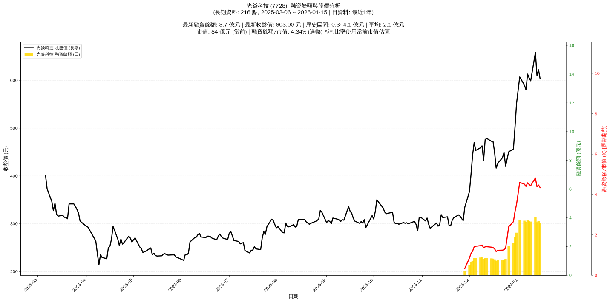

# :chart_with_upwards_trend: 光焱科技 (7728) 融資餘額報告

!!! info "基本資訊"
    **:building_construction: 名稱**: 光焱科技
    **:identification_card: 代號**: 7728
    **:calendar: 分析期間**: 2025-07-18 ~ 2026-01-09 (共 212 個交易日)
    **:clock3: 最新資料**: 2026-01-09
    **🕒 更新時間**: 2026-01-11 23:11:34 CST

## :moneybag: 融資餘額現況

| :chart: 指標 | :1234: 數值 | :traffic_light: 狀態 |
|:------------:|:----------:|:-------------------:|
| **最新融資餘額** | 3.7 億元 (624 張) | - |
| **最新收盤價** | 599.00 元 | - |
| **市值** | 83 億元 | - |
| **融資餘額/市值** | 4.50% | 🔴 過熱 |
| **日變化 (DoD)** | -0.0 億元 (-1.31%) | 📉 |
| **週變化 (WoW)** | -0.1 億元 (-3.48%) | 📉 |
| **月變化 (MoM)** | +2.6 億元 (+224.52%) | 📈 |

---

## :bar_chart: 歷史統計

| :chart: 指標 | :1234: 數值 |
|:------------:|:----------:|
| **歷史最高** | 3.9 億元 |
| **歷史最低** | 0.3 億元 |
| **平均值** | 1.8 億元 |
| **標準差** | 1.2 億元 |
| **當前相對位置** | 96.2% |

---

## :chart_with_upwards_trend: 融資餘額趨勢圖

    

---

## :clipboard: 詳細歷史記錄 (最近30日)

<table class="sortable-table">
<thead>
<tr>
<th>:calendar: 日期</th>
<th>:money_with_wings: 收盤價(元)</th>
<th>:chart: 漲跌(元)</th>
<th>:chart_with_upwards_trend: 漲跌(%)</th>
<th>:package: 融資餘額(億元)</th>
<th>:package: 融資餘額(張)</th>
<th>:arrow_up_down: 融資增減(張)</th>
<th>:chart: 融券餘額(張)</th>
<th>:balance_scale: 券資比(%)</th>
</tr>
</thead>
<tbody>
<tr>
<td>2026-01-09</td>
<td>599.00</td>
<td>🔻 -6.00</td>
<td>-0.99%</td>
<td>3.7</td>
<td>624</td>
<td>📉 -2</td>
<td>62</td>
<td>9.94%</td>
</tr>
<tr>
<td>2026-01-08</td>
<td>605.00</td>
<td>🔻 -8.00</td>
<td>-1.31%</td>
<td>3.8</td>
<td>626</td>
<td>📉 -3</td>
<td>64</td>
<td>10.20%</td>
</tr>
<tr>
<td>2026-01-07</td>
<td>613.00</td>
<td>🔺 +33.00</td>
<td>+5.69%</td>
<td>3.9</td>
<td>629</td>
<td>📉 -10</td>
<td>64</td>
<td>10.20%</td>
</tr>
<tr>
<td>2026-01-06</td>
<td>580.00</td>
<td>🔻 -10.00</td>
<td>-1.69%</td>
<td>3.7</td>
<td>639</td>
<td>📉 -5</td>
<td>89</td>
<td>13.90%</td>
</tr>
<tr>
<td>2026-01-05</td>
<td>590.00</td>
<td>🔻 -17.00</td>
<td>-2.80%</td>
<td>3.8</td>
<td>644</td>
<td>📈 +6</td>
<td>90</td>
<td>14.00%</td>
</tr>
<tr>
<td>2026-01-02</td>
<td>607.00</td>
<td>🔺 +55.00</td>
<td>+9.96%</td>
<td>3.9</td>
<td>638</td>
<td>📈 +101</td>
<td>66</td>
<td>10.30%</td>
</tr>
<tr>
<td>2025-12-31</td>
<td>552.00</td>
<td>🔺 +50.00</td>
<td>+9.96%</td>
<td>3.0</td>
<td>537</td>
<td>📈 +8</td>
<td>29</td>
<td>5.40%</td>
</tr>
<tr>
<td>2025-12-30</td>
<td>502.00</td>
<td>🔺 +45.50</td>
<td>+9.97%</td>
<td>2.7</td>
<td>529</td>
<td>📈 +39</td>
<td>28</td>
<td>5.29%</td>
</tr>
<tr>
<td>2025-12-29</td>
<td>456.50</td>
<td>🔺 +6.00</td>
<td>+1.33%</td>
<td>2.2</td>
<td>490</td>
<td>📈 +41</td>
<td>28</td>
<td>5.71%</td>
</tr>
<tr>
<td>2025-12-26</td>
<td>450.50</td>
<td>🔺 +29.50</td>
<td>+7.01%</td>
<td>2.0</td>
<td>449</td>
<td>📈 +182</td>
<td>28</td>
<td>6.24%</td>
</tr>
<tr>
<td>2025-12-24</td>
<td>421.00</td>
<td>🔻 -28.00</td>
<td>-6.24%</td>
<td>1.1</td>
<td>267</td>
<td>📈 +30</td>
<td>27</td>
<td>10.10%</td>
</tr>
<tr>
<td>2025-12-23</td>
<td>449.00</td>
<td>🔺 +11.00</td>
<td>+2.51%</td>
<td>1.1</td>
<td>237</td>
<td>📉 -2</td>
<td>27</td>
<td>11.40%</td>
</tr>
<tr>
<td>2025-12-22</td>
<td>438.00</td>
<td>🔺 +11.50</td>
<td>+2.70%</td>
<td>1.0</td>
<td>239</td>
<td>📉 -5</td>
<td>27</td>
<td>11.30%</td>
</tr>
<tr>
<td>2025-12-19</td>
<td>426.50</td>
<td>🔺 +10.00</td>
<td>+2.40%</td>
<td>1.0</td>
<td>244</td>
<td>📈 +6</td>
<td>27</td>
<td>11.10%</td>
</tr>
<tr>
<td>2025-12-18</td>
<td>416.50</td>
<td>🔻 -33.00</td>
<td>-7.34%</td>
<td>1.0</td>
<td>238</td>
<td>📉 -7</td>
<td>27</td>
<td>11.30%</td>
</tr>
<tr>
<td>2025-12-17</td>
<td>449.50</td>
<td>🔻 -23.00</td>
<td>-4.87%</td>
<td>1.1</td>
<td>245</td>
<td>➡️ +0</td>
<td>27</td>
<td>11.00%</td>
</tr>
<tr>
<td>2025-12-16</td>
<td>472.50</td>
<td>➖ +0.00</td>
<td>+0.00%</td>
<td>1.2</td>
<td>245</td>
<td>📉 -3</td>
<td>28</td>
<td>11.40%</td>
</tr>
<tr>
<td>2025-12-15</td>
<td>472.50</td>
<td>🔻 -6.00</td>
<td>-1.25%</td>
<td>1.2</td>
<td>248</td>
<td>📉 -1</td>
<td>28</td>
<td>11.30%</td>
</tr>
<tr>
<td>2025-12-12</td>
<td>478.50</td>
<td>🔺 +2.50</td>
<td>+0.53%</td>
<td>1.2</td>
<td>249</td>
<td>➡️ +0</td>
<td>28</td>
<td>11.20%</td>
</tr>
<tr>
<td>2025-12-11</td>
<td>476.00</td>
<td>🔺 +43.00</td>
<td>+9.93%</td>
<td>1.2</td>
<td>249</td>
<td>📉 -17</td>
<td>28</td>
<td>11.20%</td>
</tr>
<tr>
<td>2025-12-10</td>
<td>433.00</td>
<td>🔻 -30.00</td>
<td>-6.48%</td>
<td>1.2</td>
<td>266</td>
<td>📉 -6</td>
<td>29</td>
<td>10.90%</td>
</tr>
<tr>
<td>2025-12-09</td>
<td>463.00</td>
<td>🔺 +4.00</td>
<td>+0.87%</td>
<td>1.3</td>
<td>272</td>
<td>📈 +3</td>
<td>30</td>
<td>11.00%</td>
</tr>
<tr>
<td>2025-12-08</td>
<td>459.00</td>
<td>🔺 +5.50</td>
<td>+1.21%</td>
<td>1.2</td>
<td>269</td>
<td>📈 +2</td>
<td>22</td>
<td>8.18%</td>
</tr>
<tr>
<td>2025-12-05</td>
<td>453.50</td>
<td>🔻 -16.50</td>
<td>-3.51%</td>
<td>1.2</td>
<td>267</td>
<td>📈 +14</td>
<td>21</td>
<td>7.87%</td>
</tr>
<tr>
<td>2025-12-04</td>
<td>470.00</td>
<td>🔺 +26.00</td>
<td>+5.86%</td>
<td>1.2</td>
<td>253</td>
<td>📈 +26</td>
<td>17</td>
<td>6.72%</td>
</tr>
<tr>
<td>2025-12-03</td>
<td>444.00</td>
<td>🔺 +40.00</td>
<td>+9.90%</td>
<td>1.0</td>
<td>227</td>
<td>📈 +1</td>
<td>1</td>
<td>0.44%</td>
</tr>
<tr>
<td>2025-12-02</td>
<td>404.00</td>
<td>🔺 +36.50</td>
<td>+9.93%</td>
<td>0.9</td>
<td>226</td>
<td>📈 +29</td>
<td>0</td>
<td>0.00%</td>
</tr>
<tr>
<td>2025-12-01</td>
<td>367.50</td>
<td>🔺 +33.00</td>
<td>+9.87%</td>
<td>0.7</td>
<td>197</td>
<td>📈 +114</td>
<td>0</td>
<td>0.00%</td>
</tr>
<tr>
<td>2025-11-28</td>
<td>334.50</td>
<td>🔺 +28.00</td>
<td>+9.14%</td>
<td>0.3</td>
<td>83</td>
<td>📈 +83</td>
<td>0</td>
<td>0.00%</td>
</tr>
<tr>
<td>2025-11-27</td>
<td>306.50</td>
<td>🔻 -4.50</td>
<td>-1.45%</td>
<td>nan</td>
<td>nan</td>
<td>➡️ +nan</td>
<td>nan</td>
<td>nan%</td>
</tr>
</tbody>
</table>

---

## :information_source: 資料來源與方法

!!! note "資料來源說明"
    - **主要來源**: `raw_margin_daily.csv` (Type 13: ShowMarginChart)
    - **資料頻率**: 每日更新
    - **資料範圍**: 近1年交易日資料

!!! info "報告元資訊"
    - **報告產生時間**: 2026-01-11 23:11:34
    - **分析期間**: 212 個交易日
    - **資料來源**: Stage 1 Raw Margin Daily Data

---

:material-information-outline: **本報告僅供參考，投資決策請審慎評估**

