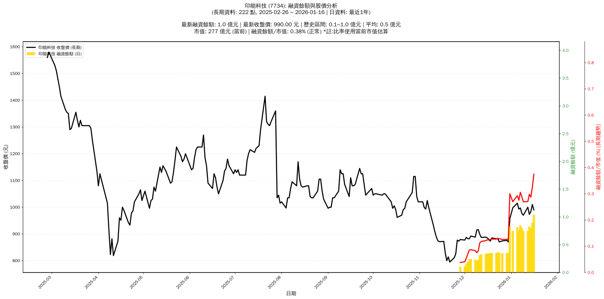

# :chart_with_upwards_trend: 印能科技 (7734) 融資餘額報告

!!! info "基本資訊"
    **:building_construction: 名稱**: 印能科技
    **:identification_card: 代號**: 7734
    **:calendar: 分析期間**: 2025-07-18 ~ 2026-01-09 (共 217 個交易日)
    **:clock3: 最新資料**: 2026-01-09
    **🕒 更新時間**: 2026-01-11 23:12:55 CST

## :moneybag: 融資餘額現況

| :chart: 指標 | :1234: 數值 | :traffic_light: 狀態 |
|:------------:|:----------:|:-------------------:|
| **最新融資餘額** | 0.7 億元 (77 張) | - |
| **最新收盤價** | 970.00 元 | - |
| **市值** | 272 億元 | - |
| **融資餘額/市值** | 0.27% | 🟢 低風險 |
| **日變化 (DoD)** | -0.1 億元 (-6.77%) | 📉 |
| **週變化 (WoW)** | -0.0 億元 (-0.21%) | 📉 |
| **月變化 (MoM)** | +0.5 億元 (+226.16%) | 📈 |

---

## :bar_chart: 歷史統計

| :chart: 指標 | :1234: 數值 |
|:------------:|:----------:|
| **歷史最高** | 0.8 億元 |
| **歷史最低** | 0.1 億元 |
| **平均值** | 0.4 億元 |
| **標準差** | 0.2 億元 |
| **當前相對位置** | 86.4% |

---

## :chart_with_upwards_trend: 融資餘額趨勢圖

{: style="max-width: 100%; height: auto;"}

---

## :clipboard: 詳細歷史記錄 (最近30日)

<table class="sortable-table">
<thead>
<tr>
<th>:calendar: 日期</th>
<th>:money_with_wings: 收盤價(元)</th>
<th>:chart: 漲跌(元)</th>
<th>:chart_with_upwards_trend: 漲跌(%)</th>
<th>:package: 融資餘額(億元)</th>
<th>:package: 融資餘額(張)</th>
<th>:arrow_up_down: 融資增減(張)</th>
<th>:chart: 融券餘額(張)</th>
<th>:balance_scale: 券資比(%)</th>
</tr>
</thead>
<tbody>
<tr>
<td>2026-01-09</td>
<td>970.00</td>
<td>🔻 -7.00</td>
<td>-0.72%</td>
<td>0.7</td>
<td>77</td>
<td>📉 -5</td>
<td>0</td>
<td>0.00%</td>
</tr>
<tr>
<td>2026-01-08</td>
<td>977.00</td>
<td>🔻 -20.00</td>
<td>-2.01%</td>
<td>0.8</td>
<td>82</td>
<td>📉 -3</td>
<td>0</td>
<td>0.00%</td>
</tr>
<tr>
<td>2026-01-07</td>
<td>997.00</td>
<td>🔺 +4.00</td>
<td>+0.40%</td>
<td>0.8</td>
<td>85</td>
<td>📈 +8</td>
<td>1</td>
<td>1.18%</td>
</tr>
<tr>
<td>2026-01-06</td>
<td>993.00</td>
<td>🔻 -22.00</td>
<td>-2.17%</td>
<td>0.8</td>
<td>77</td>
<td>📉 -3</td>
<td>1</td>
<td>1.30%</td>
</tr>
<tr>
<td>2026-01-05</td>
<td>1015.00</td>
<td>🔺 +17.00</td>
<td>+1.70%</td>
<td>0.8</td>
<td>80</td>
<td>📈 +5</td>
<td>1</td>
<td>1.25%</td>
</tr>
<tr>
<td>2026-01-02</td>
<td>998.00</td>
<td>🔺 +41.00</td>
<td>+4.28%</td>
<td>0.7</td>
<td>75</td>
<td>📉 -12</td>
<td>1</td>
<td>1.33%</td>
</tr>
<tr>
<td>2025-12-31</td>
<td>957.00</td>
<td>🔺 +87.00</td>
<td>+10.00%</td>
<td>0.8</td>
<td>87</td>
<td>📈 +46</td>
<td>1</td>
<td>1.15%</td>
</tr>
<tr>
<td>2025-12-30</td>
<td>870.00</td>
<td>🔻 -6.00</td>
<td>-0.68%</td>
<td>0.4</td>
<td>41</td>
<td>📈 +1</td>
<td>0</td>
<td>0.00%</td>
</tr>
<tr>
<td>2025-12-29</td>
<td>876.00</td>
<td>🔺 +2.00</td>
<td>+0.23%</td>
<td>0.4</td>
<td>40</td>
<td>➡️ +0</td>
<td>0</td>
<td>0.00%</td>
</tr>
<tr>
<td>2025-12-26</td>
<td>874.00</td>
<td>🔺 +4.00</td>
<td>+0.46%</td>
<td>0.3</td>
<td>40</td>
<td>📉 -1</td>
<td>0</td>
<td>0.00%</td>
</tr>
<tr>
<td>2025-12-24</td>
<td>870.00</td>
<td>🔻 -12.00</td>
<td>-1.36%</td>
<td>0.4</td>
<td>41</td>
<td>➡️ +0</td>
<td>0</td>
<td>0.00%</td>
</tr>
<tr>
<td>2025-12-23</td>
<td>882.00</td>
<td>➖ +0.00</td>
<td>+0.00%</td>
<td>0.4</td>
<td>41</td>
<td>📈 +1</td>
<td>0</td>
<td>0.00%</td>
</tr>
<tr>
<td>2025-12-22</td>
<td>882.00</td>
<td>🔻 -3.00</td>
<td>-0.34%</td>
<td>0.4</td>
<td>40</td>
<td>➡️ +0</td>
<td>0</td>
<td>0.00%</td>
</tr>
<tr>
<td>2025-12-19</td>
<td>885.00</td>
<td>🔺 +12.00</td>
<td>+1.37%</td>
<td>0.4</td>
<td>40</td>
<td>➡️ +0</td>
<td>0</td>
<td>0.00%</td>
</tr>
<tr>
<td>2025-12-18</td>
<td>873.00</td>
<td>🔻 -7.00</td>
<td>-0.80%</td>
<td>0.3</td>
<td>40</td>
<td>📈 +1</td>
<td>0</td>
<td>0.00%</td>
</tr>
<tr>
<td>2025-12-17</td>
<td>880.00</td>
<td>🔻 -5.00</td>
<td>-0.56%</td>
<td>0.3</td>
<td>39</td>
<td>➡️ +0</td>
<td>0</td>
<td>0.00%</td>
</tr>
<tr>
<td>2025-12-16</td>
<td>885.00</td>
<td>🔻 -3.00</td>
<td>-0.34%</td>
<td>0.3</td>
<td>39</td>
<td>📈 +1</td>
<td>0</td>
<td>0.00%</td>
</tr>
<tr>
<td>2025-12-15</td>
<td>888.00</td>
<td>🔺 +1.00</td>
<td>+0.11%</td>
<td>0.3</td>
<td>38</td>
<td>📈 +1</td>
<td>0</td>
<td>0.00%</td>
</tr>
<tr>
<td>2025-12-12</td>
<td>887.00</td>
<td>🔻 -11.00</td>
<td>-1.22%</td>
<td>0.3</td>
<td>37</td>
<td>📈 +2</td>
<td>0</td>
<td>0.00%</td>
</tr>
<tr>
<td>2025-12-11</td>
<td>898.00</td>
<td>🔻 -18.00</td>
<td>-1.97%</td>
<td>0.3</td>
<td>35</td>
<td>📈 +10</td>
<td>0</td>
<td>0.00%</td>
</tr>
<tr>
<td>2025-12-10</td>
<td>916.00</td>
<td>🔺 +1.00</td>
<td>+0.11%</td>
<td>0.2</td>
<td>25</td>
<td>📈 +2</td>
<td>0</td>
<td>0.00%</td>
</tr>
<tr>
<td>2025-12-09</td>
<td>915.00</td>
<td>🔺 +27.00</td>
<td>+3.04%</td>
<td>0.2</td>
<td>23</td>
<td>📉 -3</td>
<td>0</td>
<td>0.00%</td>
</tr>
<tr>
<td>2025-12-08</td>
<td>888.00</td>
<td>🔻 -4.00</td>
<td>-0.45%</td>
<td>0.2</td>
<td>26</td>
<td>📉 -1</td>
<td>0</td>
<td>0.00%</td>
</tr>
<tr>
<td>2025-12-05</td>
<td>892.00</td>
<td>🔺 +10.00</td>
<td>+1.13%</td>
<td>0.2</td>
<td>27</td>
<td>➡️ +0</td>
<td>0</td>
<td>0.00%</td>
</tr>
<tr>
<td>2025-12-04</td>
<td>882.00</td>
<td>➖ +0.00</td>
<td>+0.00%</td>
<td>0.2</td>
<td>27</td>
<td>📈 +5</td>
<td>0</td>
<td>0.00%</td>
</tr>
<tr>
<td>2025-12-03</td>
<td>882.00</td>
<td>🔻 -5.00</td>
<td>-0.56%</td>
<td>0.2</td>
<td>22</td>
<td>📈 +5</td>
<td>0</td>
<td>0.00%</td>
</tr>
<tr>
<td>2025-12-02</td>
<td>887.00</td>
<td>🔺 +10.00</td>
<td>+1.14%</td>
<td>0.2</td>
<td>17</td>
<td>📈 +4</td>
<td>0</td>
<td>0.00%</td>
</tr>
<tr>
<td>2025-12-01</td>
<td>877.00</td>
<td>🔻 -2.00</td>
<td>-0.23%</td>
<td>0.1</td>
<td>13</td>
<td>📈 +1</td>
<td>0</td>
<td>0.00%</td>
</tr>
<tr>
<td>2025-11-28</td>
<td>879.00</td>
<td>🔺 +6.00</td>
<td>+0.69%</td>
<td>0.1</td>
<td>12</td>
<td>📈 +12</td>
<td>0</td>
<td>0.00%</td>
</tr>
<tr>
<td>2025-11-27</td>
<td>873.00</td>
<td>🔻 -4.00</td>
<td>-0.46%</td>
<td>nan</td>
<td>nan</td>
<td>➡️ +nan</td>
<td>nan</td>
<td>nan%</td>
</tr>
</tbody>
</table>

---

## :information_source: 資料來源與方法

!!! note "資料來源說明"
    - **主要來源**: `raw_margin_daily.csv` (Type 13: ShowMarginChart)
    - **資料頻率**: 每日更新
    - **資料範圍**: 近1年交易日資料

!!! info "報告元資訊"
    - **報告產生時間**: 2026-01-11 23:12:55
    - **分析期間**: 217 個交易日
    - **資料來源**: Stage 1 Raw Margin Daily Data

---

:material-information-outline: **本報告僅供參考，投資決策請審慎評估**

