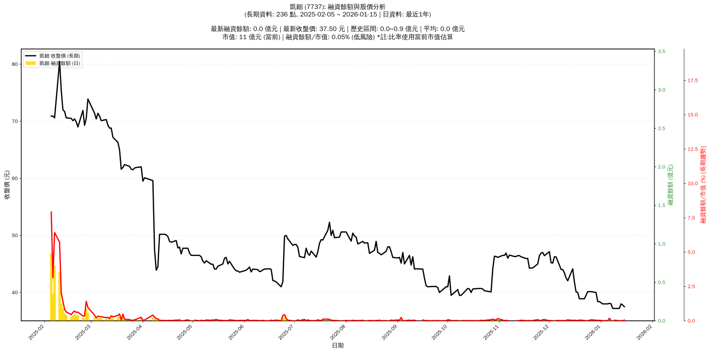

# 📈 凱鈿 (7737) 融資餘額報告

!!! info "基本資訊"
    **🏗️ 名稱**: 凱鈿
    **🪪 代號**: 7737
    **📅 分析期間**: 2025-07-23 ~ 2026-01-14 (共 235 個交易日)
    **🕒 最新資料**: 2026-01-14
    **🕒 更新時間**: 2026-01-15 12:56:13 CST

## 💰 融資餘額現況

| 📊 指標 | 🔢 數值 | 🚦 狀態 |
|:------------:|:----------:|:-------------------:|
| **最新融資餘額** | 0.0 億元 (1 張) | - |
| **最新收盤價** | 37.80 元 | - |
| **市值** | 11 億元 | - |
| **融資餘額/市值** | 0.00% | 🟢 低風險 |
| **日變化 (DoD)** | -0.0 億元 (-66.84%) | 📉 |
| **週變化 (WoW)** | -0.0 億元 (-87.57%) | 📉 |
| **月變化 (MoM)** | -0.0 億元 (-89.30%) | 📉 |

---

## 📊 歷史統計

| 📊 指標 | 🔢 數值 |
|:------------:|:----------:|
| **歷史最高** | 0.9 億元 |
| **歷史最低** | 0.0 億元 |
| **平均值** | 0.0 億元 |
| **標準差** | 0.1 億元 |
| **當前相對位置** | 0.0% |

---

## 📈 融資餘額趨勢圖

{: style="max-width: 100%; height: auto;"}

---

## 📋 詳細歷史記錄 (最近30日)

<table class="sortable-table">
<thead>
<tr>
<th markdown="span">📅 日期</th>
<th markdown="span">💸 收盤價(元)</th>
<th markdown="span">📊 漲跌(元)</th>
<th markdown="span">📈 漲跌(%)</th>
<th markdown="span">📦 融資餘額(億元)</th>
<th markdown="span">📦 融資餘額(張)</th>
<th markdown="span">↕️ 融資增減(張)</th>
<th markdown="span">📊 融券餘額(張)</th>
<th markdown="span">⚖️ 券資比(%)</th>
</tr>
</thead>
<tbody>
<tr>
<td>2026-01-14</td>
<td>37.80</td>
<td>🔺 +37.50</td>
<td>+37.50%</td>
<td>0.0</td>
<td>1</td>
<td>📈 +2</td>
<td>nan</td>
<td>nan%</td>
</tr>
<tr>
<td>2026-01-13</td>
<td>38.00</td>
<td>🔺 +37.80</td>
<td>+37.80%</td>
<td>0.0</td>
<td>3</td>
<td>📈 +3</td>
<td>nan</td>
<td>nan%</td>
</tr>
<tr>
<td>2026-01-12</td>
<td>37.20</td>
<td>🔺 +38.00</td>
<td>+37.25%</td>
<td>0.0</td>
<td>2</td>
<td>📈 +6</td>
<td>nan</td>
<td>nan%</td>
</tr>
<tr>
<td>2026-01-09</td>
<td>37.20</td>
<td>🔺 +38.75</td>
<td>+35.55%</td>
<td>0.0</td>
<td>13</td>
<td>📈 +39</td>
<td>nan</td>
<td>nan%</td>
</tr>
<tr>
<td>2026-01-08</td>
<td>37.20</td>
<td>🔺 +37.20</td>
<td>+37.20%</td>
<td>nan</td>
<td>nan</td>
<td>➡️ +nan</td>
<td>nan</td>
<td>nan%</td>
</tr>
<tr>
<td>2026-01-07</td>
<td>38.00</td>
<td>🔺 +38.00</td>
<td>+37.00%</td>
<td>0.0</td>
<td>8</td>
<td>📈 +6</td>
<td>nan</td>
<td>nan%</td>
</tr>
<tr>
<td>2026-01-06</td>
<td>38.10</td>
<td>🔺 +40.00</td>
<td>+34.20%</td>
<td>0.0</td>
<td>54</td>
<td>📈 +120</td>
<td>-1</td>
<td>nan%</td>
</tr>
<tr>
<td>2026-01-05</td>
<td>38.00</td>
<td>🔺 +38.25</td>
<td>+38.10%</td>
<td>0.0</td>
<td>2</td>
<td>📈 +2</td>
<td>nan</td>
<td>nan%</td>
</tr>
<tr>
<td>2026-01-02</td>
<td>38.00</td>
<td>🔺 +38.35</td>
<td>+38.00%</td>
<td>0.0</td>
<td>3</td>
<td>📈 +2</td>
<td>nan</td>
<td>nan%</td>
</tr>
<tr>
<td>2025-12-31</td>
<td>38.40</td>
<td>🔺 +38.40</td>
<td>+37.55%</td>
<td>0.0</td>
<td>10</td>
<td>📈 +13</td>
<td>-1</td>
<td>nan%</td>
</tr>
<tr>
<td>2025-12-30</td>
<td>38.40</td>
<td>🔺 +38.40</td>
<td>+38.00%</td>
<td>0.0</td>
<td>9</td>
<td>📈 +1</td>
<td>nan</td>
<td>nan%</td>
</tr>
<tr>
<td>2025-12-29</td>
<td>40.00</td>
<td>🔺 +39.50</td>
<td>+38.20%</td>
<td>0.0</td>
<td>11</td>
<td>📈 +12</td>
<td>nan</td>
<td>nan%</td>
</tr>
<tr>
<td>2025-12-26</td>
<td>40.15</td>
<td>🔺 +40.10</td>
<td>+39.00%</td>
<td>0.0</td>
<td>20</td>
<td>📈 +22</td>
<td>nan</td>
<td>nan%</td>
</tr>
<tr>
<td>2025-12-24</td>
<td>40.15</td>
<td>🔺 +40.15</td>
<td>+40.15%</td>
<td>0.0</td>
<td>2</td>
<td>📈 +1</td>
<td>nan</td>
<td>nan%</td>
</tr>
<tr>
<td>2025-12-23</td>
<td>39.50</td>
<td>🔺 +40.15</td>
<td>+40.15%</td>
<td>0.0</td>
<td>1</td>
<td>➡️ +0</td>
<td>nan</td>
<td>nan%</td>
</tr>
<tr>
<td>2025-12-22</td>
<td>38.90</td>
<td>🔺 +39.50</td>
<td>+38.00%</td>
<td>0.0</td>
<td>8</td>
<td>📈 +19</td>
<td>nan</td>
<td>nan%</td>
</tr>
<tr>
<td>2025-12-19</td>
<td>38.90</td>
<td>🔺 +39.05</td>
<td>+38.15%</td>
<td>0.0</td>
<td>15</td>
<td>📈 +22</td>
<td>-2</td>
<td>nan%</td>
</tr>
<tr>
<td>2025-12-18</td>
<td>40.00</td>
<td>🔺 +40.05</td>
<td>+38.45%</td>
<td>0.0</td>
<td>5</td>
<td>📈 +4</td>
<td>nan</td>
<td>nan%</td>
</tr>
<tr>
<td>2025-12-17</td>
<td>40.10</td>
<td>🔺 +40.50</td>
<td>+39.85%</td>
<td>0.0</td>
<td>9</td>
<td>📈 +10</td>
<td>nan</td>
<td>nan%</td>
</tr>
<tr>
<td>2025-12-16</td>
<td>41.85</td>
<td>🔺 +40.70</td>
<td>+40.00%</td>
<td>0.0</td>
<td>11</td>
<td>📈 +14</td>
<td>nan</td>
<td>nan%</td>
</tr>
<tr>
<td>2025-12-15</td>
<td>44.15</td>
<td>🔺 +41.95</td>
<td>+40.20%</td>
<td>0.0</td>
<td>8</td>
<td>📈 +17</td>
<td>nan</td>
<td>nan%</td>
</tr>
<tr>
<td>2025-12-12</td>
<td>42.05</td>
<td>🔺 +44.15</td>
<td>+42.00%</td>
<td>0.0</td>
<td>17</td>
<td>📈 +30</td>
<td>nan</td>
<td>nan%</td>
</tr>
<tr>
<td>2025-12-11</td>
<td>42.55</td>
<td>🔺 +43.00</td>
<td>+42.05%</td>
<td>0.0</td>
<td>9</td>
<td>📈 +11</td>
<td>nan</td>
<td>nan%</td>
</tr>
<tr>
<td>2025-12-10</td>
<td>43.45</td>
<td>🔺 +42.55</td>
<td>+42.55%</td>
<td>0.0</td>
<td>1</td>
<td>📈 +1</td>
<td>nan</td>
<td>nan%</td>
</tr>
<tr>
<td>2025-12-09</td>
<td>44.00</td>
<td>🔺 +44.00</td>
<td>+42.00%</td>
<td>0.0</td>
<td>6</td>
<td>📈 +10</td>
<td>nan</td>
<td>nan%</td>
</tr>
<tr>
<td>2025-12-08</td>
<td>44.05</td>
<td>🔺 +44.20</td>
<td>+44.00%</td>
<td>0.0</td>
<td>4</td>
<td>📈 +8</td>
<td>nan</td>
<td>nan%</td>
</tr>
<tr>
<td>2025-12-05</td>
<td>46.25</td>
<td>🔺 +46.25</td>
<td>+44.05%</td>
<td>0.0</td>
<td>6</td>
<td>📈 +7</td>
<td>nan</td>
<td>nan%</td>
</tr>
<tr>
<td>2025-12-04</td>
<td>46.25</td>
<td>🔺 +46.25</td>
<td>+46.25%</td>
<td>nan</td>
<td>nan</td>
<td>➡️ +nan</td>
<td>nan</td>
<td>nan%</td>
</tr>
<tr>
<td>2025-12-03</td>
<td>45.15</td>
<td>🔺 +46.25</td>
<td>+46.25%</td>
<td>0.0</td>
<td>1</td>
<td>➡️ +0</td>
<td>nan</td>
<td>nan%</td>
</tr>
<tr>
<td>2025-12-02</td>
<td>45.20</td>
<td>🔺 +45.20</td>
<td>+45.15%</td>
<td>0.0</td>
<td>5</td>
<td>📈 +4</td>
<td>nan</td>
<td>nan%</td>
</tr>
</tbody>
</table>

---

## ℹ️ 資料來源與方法

!!! note "資料來源說明"
    - **主要來源**: `raw_margin_daily.csv` (Type 13: ShowMarginChart)
    - **資料頻率**: 每日更新
    - **資料範圍**: 近1年交易日資料

!!! info "報告元資訊"
    - **報告產生時間**: 2026-01-15 12:56:13
    - **分析期間**: 235 個交易日
    - **資料來源**: Stage 1 Raw Margin Daily Data

---

:material-information-outline: **本報告僅供參考，投資決策請審慎評估**

