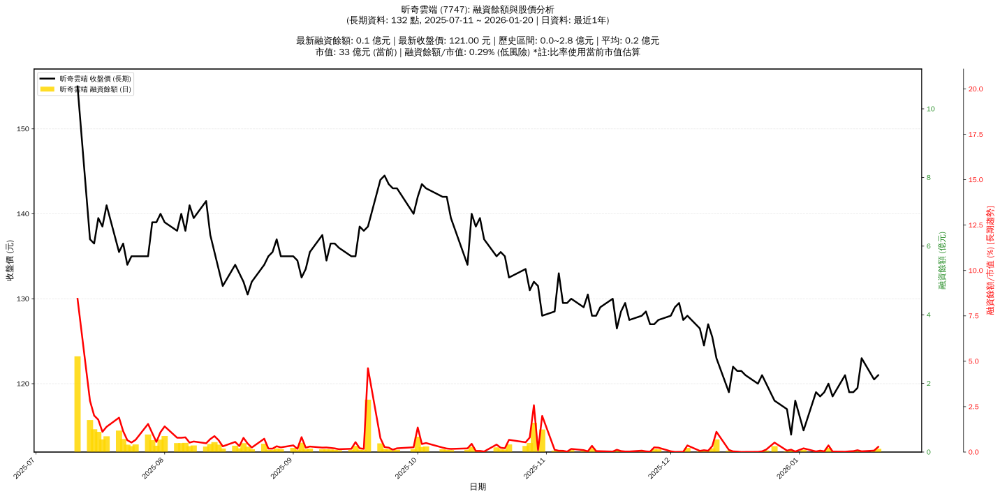

# 📈 昕奇雲端 (7747) 融資餘額報告

!!! info "基本資訊"
    **🏗️ 名稱**: 昕奇雲端
    **🪪 代號**: 7747
    **📅 分析期間**: 2025-07-22 ~ 2026-01-13 (共 127 個交易日)
    **🕒 最新資料**: 2026-01-13
    **🕒 更新時間**: 2026-01-14 22:40:52 CST

## 💰 融資餘額現況

| 📊 指標 | 🔢 數值 | 🚦 狀態 |
|:------------:|:----------:|:-------------------:|
| **最新融資餘額** | 0.0 億元 (11 張) | - |
| **最新收盤價** | 119.00 元 | - |
| **市值** | 33 億元 | - |
| **融資餘額/市值** | 0.04% | 🟢 低風險 |
| **日變化 (DoD)** | +0.0 億元 (+116.36%) | 📈 |
| **週變化 (WoW)** | -0.0 億元 (-49.79%) | 📉 |
| **月變化 (MoM)** | -0.4 億元 (-96.45%) | 📉 |

---

## 📊 歷史統計

| 📊 指標 | 🔢 數值 |
|:------------:|:----------:|
| **歷史最高** | 2.8 億元 |
| **歷史最低** | 0.0 億元 |
| **平均值** | 0.2 億元 |
| **標準差** | 0.3 億元 |
| **當前相對位置** | 0.4% |

---

## 📈 融資餘額趨勢圖

{: style="max-width: 100%; height: auto;"}

---

## 📋 詳細歷史記錄 (最近30日)

<table class="sortable-table">
<thead>
<tr>
<th markdown="span">📅 日期</th>
<th markdown="span">💸 收盤價(元)</th>
<th markdown="span">📊 漲跌(元)</th>
<th markdown="span">📈 漲跌(%)</th>
<th markdown="span">📦 融資餘額(億元)</th>
<th markdown="span">📦 融資餘額(張)</th>
<th markdown="span">↕️ 融資增減(張)</th>
<th markdown="span">📊 融券餘額(張)</th>
<th markdown="span">⚖️ 券資比(%)</th>
</tr>
</thead>
<tbody>
<tr>
<td>2026-01-13</td>
<td>119.00</td>
<td>🔺 +120.00</td>
<td>+118.00%</td>
<td>0.0</td>
<td>11</td>
<td>📈 +6</td>
<td>-1</td>
<td>nan%</td>
</tr>
<tr>
<td>2026-01-12</td>
<td>121.00</td>
<td>🔺 +121.00</td>
<td>+119.00%</td>
<td>0.0</td>
<td>5</td>
<td>📈 +4</td>
<td>nan</td>
<td>nan%</td>
</tr>
<tr>
<td>2026-01-09</td>
<td>118.50</td>
<td>🔺 +119.00</td>
<td>+118.50%</td>
<td>0.0</td>
<td>8</td>
<td>📈 +7</td>
<td>nan</td>
<td>nan%</td>
</tr>
<tr>
<td>2026-01-08</td>
<td>120.00</td>
<td>🔺 +120.00</td>
<td>+118.50%</td>
<td>0.1</td>
<td>101</td>
<td>📈 +7</td>
<td>nan</td>
<td>nan%</td>
</tr>
<tr>
<td>2026-01-07</td>
<td>119.00</td>
<td>🔺 +119.50</td>
<td>+118.50%</td>
<td>0.0</td>
<td>11</td>
<td>📈 +5</td>
<td>-1</td>
<td>nan%</td>
</tr>
<tr>
<td>2026-01-06</td>
<td>118.50</td>
<td>🔺 +119.00</td>
<td>+118.00%</td>
<td>0.0</td>
<td>22</td>
<td>📈 +20</td>
<td>-1</td>
<td>nan%</td>
</tr>
<tr>
<td>2026-01-05</td>
<td>119.00</td>
<td>🔺 +119.50</td>
<td>+118.50%</td>
<td>0.0</td>
<td>9</td>
<td>📈 +10</td>
<td>nan</td>
<td>nan%</td>
</tr>
<tr>
<td>2026-01-02</td>
<td>114.50</td>
<td>🔺 +121.50</td>
<td>+113.00%</td>
<td>0.1</td>
<td>59</td>
<td>📈 +33</td>
<td>-1</td>
<td>nan%</td>
</tr>
<tr>
<td>2025-12-31</td>
<td>118.00</td>
<td>🔺 +118.00</td>
<td>+114.00%</td>
<td>0.0</td>
<td>8</td>
<td>📈 +7</td>
<td>-1</td>
<td>nan%</td>
</tr>
<tr>
<td>2025-12-30</td>
<td>114.00</td>
<td>🔺 +116.50</td>
<td>+114.00%</td>
<td>0.0</td>
<td>38</td>
<td>📈 +13</td>
<td>-2</td>
<td>nan%</td>
</tr>
<tr>
<td>2025-12-29</td>
<td>117.00</td>
<td>🔺 +119.00</td>
<td>+116.00%</td>
<td>0.0</td>
<td>23</td>
<td>📈 +16</td>
<td>-1</td>
<td>nan%</td>
</tr>
<tr>
<td>2025-12-26</td>
<td>118.00</td>
<td>🔺 +120.00</td>
<td>+116.00%</td>
<td>0.2</td>
<td>146</td>
<td>📈 +10</td>
<td>nan</td>
<td>nan%</td>
</tr>
<tr>
<td>2025-12-24</td>
<td>120.00</td>
<td>🔺 +120.00</td>
<td>+120.00%</td>
<td>0.0</td>
<td>38</td>
<td>📈 +1</td>
<td>nan</td>
<td>nan%</td>
</tr>
<tr>
<td>2025-12-23</td>
<td>121.00</td>
<td>🔺 +121.00</td>
<td>+118.00%</td>
<td>0.0</td>
<td>11</td>
<td>📈 +9</td>
<td>-3</td>
<td>nan%</td>
</tr>
<tr>
<td>2025-12-22</td>
<td>120.00</td>
<td>🔺 +121.00</td>
<td>+120.00%</td>
<td>0.0</td>
<td>3</td>
<td>📈 +2</td>
<td>-1</td>
<td>nan%</td>
</tr>
<tr>
<td>2025-12-19</td>
<td>121.00</td>
<td>🔺 +121.00</td>
<td>+121.00%</td>
<td>0.0</td>
<td>2</td>
<td>📈 +1</td>
<td>-1</td>
<td>nan%</td>
</tr>
<tr>
<td>2025-12-18</td>
<td>121.50</td>
<td>🔺 +121.50</td>
<td>+121.50%</td>
<td>0.0</td>
<td>1</td>
<td>📈 +1</td>
<td>nan</td>
<td>nan%</td>
</tr>
<tr>
<td>2025-12-17</td>
<td>121.50</td>
<td>🔺 +121.50</td>
<td>+121.50%</td>
<td>0.0</td>
<td>7</td>
<td>📈 +2</td>
<td>nan</td>
<td>nan%</td>
</tr>
<tr>
<td>2025-12-16</td>
<td>122.00</td>
<td>🔺 +122.00</td>
<td>+122.00%</td>
<td>0.0</td>
<td>10</td>
<td>📈 +1</td>
<td>nan</td>
<td>nan%</td>
</tr>
<tr>
<td>2025-12-15</td>
<td>119.00</td>
<td>🔺 +119.50</td>
<td>+119.00%</td>
<td>0.0</td>
<td>33</td>
<td>📈 +11</td>
<td>nan</td>
<td>nan%</td>
</tr>
<tr>
<td>2025-12-12</td>
<td>123.00</td>
<td>🔺 +123.00</td>
<td>+118.00%</td>
<td>0.4</td>
<td>300</td>
<td>📈 +69</td>
<td>-23</td>
<td>nan%</td>
</tr>
<tr>
<td>2025-12-11</td>
<td>125.50</td>
<td>🔺 +125.50</td>
<td>+123.50%</td>
<td>0.1</td>
<td>87</td>
<td>📈 +16</td>
<td>-2</td>
<td>nan%</td>
</tr>
<tr>
<td>2025-12-10</td>
<td>127.00</td>
<td>🔺 +127.00</td>
<td>+124.50%</td>
<td>0.0</td>
<td>19</td>
<td>📈 +16</td>
<td>-2</td>
<td>nan%</td>
</tr>
<tr>
<td>2025-12-09</td>
<td>124.50</td>
<td>🔺 +127.50</td>
<td>+123.00%</td>
<td>0.0</td>
<td>27</td>
<td>📈 +23</td>
<td>-2</td>
<td>nan%</td>
</tr>
<tr>
<td>2025-12-08</td>
<td>126.50</td>
<td>🔺 +128.00</td>
<td>+126.00%</td>
<td>0.0</td>
<td>17</td>
<td>📈 +16</td>
<td>1</td>
<td>nan%</td>
</tr>
<tr>
<td>2025-12-05</td>
<td>128.00</td>
<td>🔺 +129.50</td>
<td>+126.50%</td>
<td>0.1</td>
<td>94</td>
<td>📈 +27</td>
<td>5</td>
<td>nan%</td>
</tr>
<tr>
<td>2025-12-04</td>
<td>127.50</td>
<td>🔺 +129.00</td>
<td>+127.50%</td>
<td>0.0</td>
<td>4</td>
<td>📈 +6</td>
<td>2</td>
<td>nan%</td>
</tr>
<tr>
<td>2025-12-03</td>
<td>129.50</td>
<td>🔺 +129.50</td>
<td>+128.00%</td>
<td>0.0</td>
<td>3</td>
<td>📈 +4</td>
<td>1</td>
<td>nan%</td>
</tr>
<tr>
<td>2025-12-02</td>
<td>129.00</td>
<td>🔺 +129.00</td>
<td>+129.00%</td>
<td>0.0</td>
<td>2</td>
<td>📈 +2</td>
<td>0</td>
<td>nan%</td>
</tr>
<tr>
<td>2025-12-01</td>
<td>128.00</td>
<td>🔺 +129.00</td>
<td>+128.00%</td>
<td>0.0</td>
<td>11</td>
<td>📈 +6</td>
<td>-1</td>
<td>nan%</td>
</tr>
</tbody>
</table>

---

## ℹ️ 資料來源與方法

!!! note "資料來源說明"
    - **主要來源**: `raw_margin_daily.csv` (Type 13: ShowMarginChart)
    - **資料頻率**: 每日更新
    - **資料範圍**: 近1年交易日資料

!!! info "報告元資訊"
    - **報告產生時間**: 2026-01-14 22:40:52
    - **分析期間**: 127 個交易日
    - **資料來源**: Stage 1 Raw Margin Daily Data

---

:material-information-outline: **本報告僅供參考，投資決策請審慎評估**

