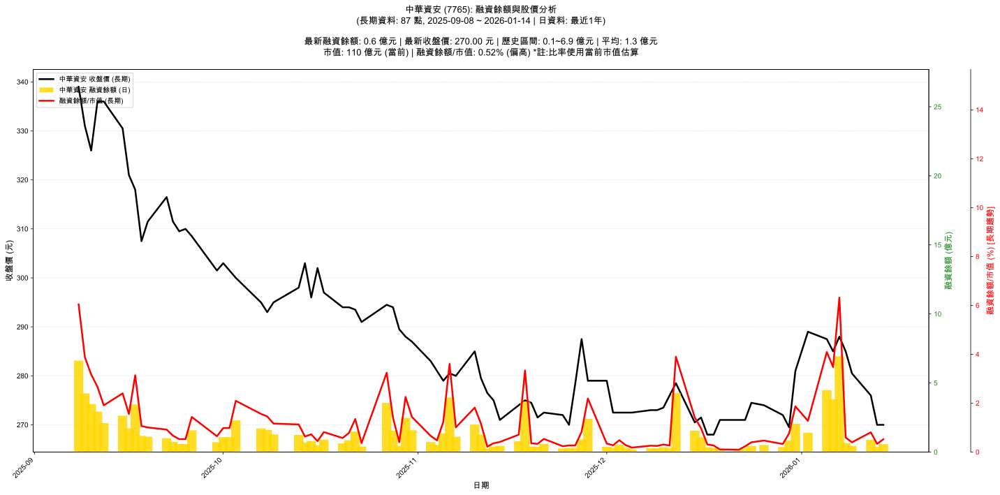

# :chart_with_upwards_trend: 中華資安 (7765) 融資餘額報告

!!! info "基本資訊"
    **:building_construction: 名稱**: 中華資安
    **:identification_card: 代號**: 7765
    **:calendar: 分析期間**: 2025-09-08 ~ 2026-01-09 (共 84 個交易日)
    **:clock3: 最新資料**: 2026-01-09
    **🕒 更新時間**: 2026-01-11 23:11:56 CST

## :moneybag: 融資餘額現況

| :chart: 指標 | :1234: 數值 | :traffic_light: 狀態 |
|:------------:|:----------:|:-------------------:|
| **最新融資餘額** | 0.4 億元 (155 張) | - |
| **最新收盤價** | 280.50 元 | - |
| **市值** | 113 億元 | - |
| **融資餘額/市值** | 0.38% | 🟡 正常 |
| **日變化 (DoD)** | -0.2 億元 (-33.09%) | 📉 |
| **週變化 (WoW)** | -1.0 億元 (-68.92%) | 📉 |
| **月變化 (MoM)** | +0.1 億元 (+29.24%) | 📈 |

---

## :bar_chart: 歷史統計

| :chart: 指標 | :1234: 數值 |
|:------------:|:----------:|
| **歷史最高** | 6.9 億元 |
| **歷史最低** | 0.1 億元 |
| **平均值** | 1.4 億元 |
| **標準差** | 1.4 億元 |
| **當前相對位置** | 4.9% |

---

## :chart_with_upwards_trend: 融資餘額趨勢圖

    

---

## :clipboard: 詳細歷史記錄 (最近30日)

<table class="sortable-table">
<thead>
<tr>
<th>:calendar: 日期</th>
<th>:money_with_wings: 收盤價(元)</th>
<th>:chart: 漲跌(元)</th>
<th>:chart_with_upwards_trend: 漲跌(%)</th>
<th>:package: 融資餘額(億元)</th>
<th>:package: 融資餘額(張)</th>
<th>:arrow_up_down: 融資增減(張)</th>
<th>:chart: 融券餘額(張)</th>
<th>:balance_scale: 券資比(%)</th>
</tr>
</thead>
<tbody>
<tr>
<td>2026-01-09</td>
<td>280.50</td>
<td>🔺 +281.00</td>
<td>+278.50%</td>
<td>0.4</td>
<td>155</td>
<td>📈 +31</td>
<td>-5</td>
<td>nan%</td>
</tr>
<tr>
<td>2026-01-08</td>
<td>285.00</td>
<td>🔺 +285.50</td>
<td>+281.50%</td>
<td>0.6</td>
<td>228</td>
<td>📈 +30</td>
<td>-4</td>
<td>nan%</td>
</tr>
<tr>
<td>2026-01-07</td>
<td>288.00</td>
<td>🔺 +288.00</td>
<td>+284.00%</td>
<td>6.9</td>
<td>2,405</td>
<td>📈 +31</td>
<td>0</td>
<td>nan%</td>
</tr>
<tr>
<td>2026-01-06</td>
<td>285.00</td>
<td>🔺 +288.50</td>
<td>+284.00%</td>
<td>3.8</td>
<td>1,337</td>
<td>📈 +81</td>
<td>15</td>
<td>nan%</td>
</tr>
<tr>
<td>2026-01-05</td>
<td>287.50</td>
<td>🔺 +289.50</td>
<td>+283.00%</td>
<td>4.5</td>
<td>1,560</td>
<td>📈 +58</td>
<td>13</td>
<td>nan%</td>
</tr>
<tr>
<td>2026-01-02</td>
<td>289.00</td>
<td>🔺 +289.00</td>
<td>+278.00%</td>
<td>1.4</td>
<td>484</td>
<td>📈 +122</td>
<td>11</td>
<td>nan%</td>
</tr>
<tr>
<td>2025-12-31</td>
<td>281.00</td>
<td>🔺 +289.00</td>
<td>+278.00%</td>
<td>2.0</td>
<td>729</td>
<td>📈 +139</td>
<td>40</td>
<td>nan%</td>
</tr>
<tr>
<td>2025-12-30</td>
<td>269.50</td>
<td>🔺 +285.00</td>
<td>+269.00%</td>
<td>0.8</td>
<td>310</td>
<td>📈 +157</td>
<td>78</td>
<td>nan%</td>
</tr>
<tr>
<td>2025-12-29</td>
<td>272.00</td>
<td>🔺 +273.50</td>
<td>+270.50%</td>
<td>0.4</td>
<td>132</td>
<td>📈 +39</td>
<td>5</td>
<td>nan%</td>
</tr>
<tr>
<td>2025-12-26</td>
<td>274.00</td>
<td>🔺 +274.00</td>
<td>+269.50%</td>
<td>0.5</td>
<td>188</td>
<td>📈 +46</td>
<td>1</td>
<td>nan%</td>
</tr>
<tr>
<td>2025-12-24</td>
<td>274.50</td>
<td>🔺 +274.50</td>
<td>+272.50%</td>
<td>0.4</td>
<td>159</td>
<td>📈 +36</td>
<td>11</td>
<td>nan%</td>
</tr>
<tr>
<td>2025-12-23</td>
<td>271.00</td>
<td>🔺 +276.00</td>
<td>+271.00%</td>
<td>0.3</td>
<td>94</td>
<td>📈 +47</td>
<td>33</td>
<td>nan%</td>
</tr>
<tr>
<td>2025-12-22</td>
<td>271.00</td>
<td>🔺 +273.00</td>
<td>+270.00%</td>
<td>0.1</td>
<td>38</td>
<td>📈 +16</td>
<td>-1</td>
<td>nan%</td>
</tr>
<tr>
<td>2025-12-19</td>
<td>271.00</td>
<td>🔺 +272.00</td>
<td>+269.00%</td>
<td>0.1</td>
<td>43</td>
<td>📈 +10</td>
<td>1</td>
<td>nan%</td>
</tr>
<tr>
<td>2025-12-18</td>
<td>268.00</td>
<td>🔺 +269.00</td>
<td>+267.00%</td>
<td>0.3</td>
<td>110</td>
<td>📈 +26</td>
<td>2</td>
<td>nan%</td>
</tr>
<tr>
<td>2025-12-17</td>
<td>268.00</td>
<td>🔺 +269.00</td>
<td>+267.00%</td>
<td>0.3</td>
<td>126</td>
<td>📈 +48</td>
<td>-3</td>
<td>nan%</td>
</tr>
<tr>
<td>2025-12-16</td>
<td>271.50</td>
<td>🔺 +272.50</td>
<td>+264.00%</td>
<td>1.1</td>
<td>392</td>
<td>📈 +141</td>
<td>-68</td>
<td>nan%</td>
</tr>
<tr>
<td>2025-12-15</td>
<td>270.50</td>
<td>🔺 +274.00</td>
<td>+270.50%</td>
<td>1.5</td>
<td>572</td>
<td>📈 +45</td>
<td>10</td>
<td>nan%</td>
</tr>
<tr>
<td>2025-12-12</td>
<td>278.50</td>
<td>🔺 +278.50</td>
<td>+272.50%</td>
<td>4.3</td>
<td>1,535</td>
<td>📈 +41</td>
<td>-15</td>
<td>nan%</td>
</tr>
<tr>
<td>2025-12-11</td>
<td>276.00</td>
<td>🔺 +278.00</td>
<td>+275.00%</td>
<td>0.3</td>
<td>107</td>
<td>📈 +49</td>
<td>22</td>
<td>nan%</td>
</tr>
<tr>
<td>2025-12-10</td>
<td>273.50</td>
<td>🔺 +279.00</td>
<td>+273.50%</td>
<td>0.3</td>
<td>123</td>
<td>📈 +38</td>
<td>15</td>
<td>nan%</td>
</tr>
<tr>
<td>2025-12-09</td>
<td>273.00</td>
<td>🔺 +274.00</td>
<td>+272.00%</td>
<td>0.3</td>
<td>100</td>
<td>📈 +32</td>
<td>8</td>
<td>nan%</td>
</tr>
<tr>
<td>2025-12-08</td>
<td>273.00</td>
<td>🔺 +273.00</td>
<td>+270.00%</td>
<td>0.3</td>
<td>104</td>
<td>📈 +48</td>
<td>17</td>
<td>nan%</td>
</tr>
<tr>
<td>2025-12-05</td>
<td>272.50</td>
<td>🔺 +273.00</td>
<td>+271.00%</td>
<td>0.2</td>
<td>73</td>
<td>📈 +19</td>
<td>5</td>
<td>nan%</td>
</tr>
<tr>
<td>2025-12-04</td>
<td>272.50</td>
<td>🔺 +274.00</td>
<td>+272.50%</td>
<td>0.3</td>
<td>114</td>
<td>📈 +11</td>
<td>3</td>
<td>nan%</td>
</tr>
<tr>
<td>2025-12-03</td>
<td>272.50</td>
<td>🔺 +274.00</td>
<td>+272.00%</td>
<td>0.5</td>
<td>195</td>
<td>📈 +21</td>
<td>10</td>
<td>nan%</td>
</tr>
<tr>
<td>2025-12-02</td>
<td>272.50</td>
<td>🔺 +273.00</td>
<td>+270.00%</td>
<td>0.3</td>
<td>111</td>
<td>📈 +44</td>
<td>7</td>
<td>nan%</td>
</tr>
<tr>
<td>2025-12-01</td>
<td>279.00</td>
<td>🔺 +279.00</td>
<td>+274.50%</td>
<td>0.4</td>
<td>136</td>
<td>📈 +32</td>
<td>-10</td>
<td>nan%</td>
</tr>
<tr>
<td>2025-11-28</td>
<td>279.00</td>
<td>🔺 +281.00</td>
<td>+277.50%</td>
<td>2.4</td>
<td>860</td>
<td>📈 +22</td>
<td>-6</td>
<td>nan%</td>
</tr>
<tr>
<td>2025-11-27</td>
<td>287.50</td>
<td>🔺 +287.50</td>
<td>+277.50%</td>
<td>0.9</td>
<td>317</td>
<td>📈 +38</td>
<td>-5</td>
<td>nan%</td>
</tr>
</tbody>
</table>

---

## :information_source: 資料來源與方法

!!! note "資料來源說明"
    - **主要來源**: `raw_margin_daily.csv` (Type 13: ShowMarginChart)
    - **資料頻率**: 每日更新
    - **資料範圍**: 近1年交易日資料

!!! info "報告元資訊"
    - **報告產生時間**: 2026-01-11 23:11:56
    - **分析期間**: 84 個交易日
    - **資料來源**: Stage 1 Raw Margin Daily Data

---

:material-information-outline: **本報告僅供參考，投資決策請審慎評估**

