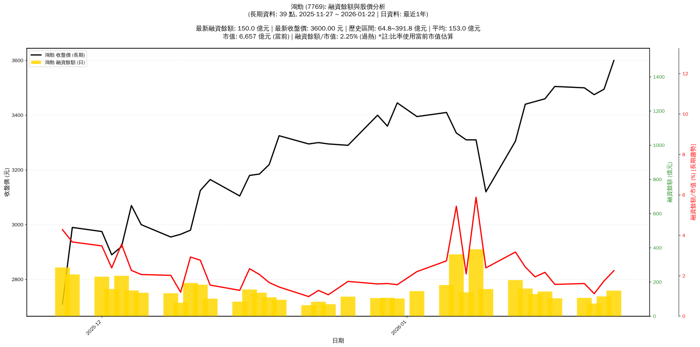

# :chart_with_upwards_trend: 鴻勁 (7769) 融資餘額報告

!!! info "基本資訊"
    **:building_construction: 名稱**: 鴻勁
    **:identification_card: 代號**: 7769
    **:calendar: 分析期間**: 2025-11-27 ~ 2026-01-09 (共 30 個交易日)
    **:clock3: 最新資料**: 2026-01-09
    **🕒 更新時間**: 2026-01-11 23:12:31 CST

## :moneybag: 融資餘額現況

| :chart: 指標 | :1234: 數值 | :traffic_light: 狀態 |
|:------------:|:----------:|:-------------------:|
| **最新融資餘額** | 159.3 億元 (5,106 張) | - |
| **最新收盤價** | 3120.00 元 | - |
| **市值** | 5,929 億元 | - |
| **融資餘額/市值** | 2.69% | 🔴 過熱 |
| **日變化 (DoD)** | -232.5 億元 (-59.34%) | 📉 |
| **週變化 (WoW)** | +12.3 億元 (+8.34%) | 📈 |
| **月變化 (MoM)** | -35.7 億元 (-18.32%) | 📉 |

---

## :bar_chart: 歷史統計

| :chart: 指標 | :1234: 數值 |
|:------------:|:----------:|
| **歷史最高** | 391.8 億元 |
| **歷史最低** | 64.8 億元 |
| **平均值** | 158.8 億元 |
| **標準差** | 80.6 億元 |
| **當前相對位置** | 28.9% |

---

## :chart_with_upwards_trend: 融資餘額趨勢圖

    

---

## :clipboard: 詳細歷史記錄 (最近30日)

<table class="sortable-table">
<thead>
<tr>
<th>:calendar: 日期</th>
<th>:money_with_wings: 收盤價(元)</th>
<th>:chart: 漲跌(元)</th>
<th>:chart_with_upwards_trend: 漲跌(%)</th>
<th>:package: 融資餘額(億元)</th>
<th>:package: 融資餘額(張)</th>
<th>:arrow_up_down: 融資增減(張)</th>
<th>:chart: 融券餘額(張)</th>
<th>:balance_scale: 券資比(%)</th>
</tr>
</thead>
<tbody>
<tr>
<td>2026-01-09</td>
<td>3120.00</td>
<td>🔺 +3295.00</td>
<td>+3060.00%</td>
<td>159.3</td>
<td>5,106</td>
<td>📈 +1,429</td>
<td>513</td>
<td>nan%</td>
</tr>
<tr>
<td>2026-01-08</td>
<td>3310.00</td>
<td>🔺 +3310.00</td>
<td>+3115.00%</td>
<td>391.8</td>
<td>11,838</td>
<td>📈 +1,405</td>
<td>-81</td>
<td>nan%</td>
</tr>
<tr>
<td>2026-01-07</td>
<td>3310.00</td>
<td>🔺 +3370.00</td>
<td>+3260.00%</td>
<td>139.7</td>
<td>4,220</td>
<td>📈 +1,033</td>
<td>416</td>
<td>nan%</td>
</tr>
<tr>
<td>2026-01-06</td>
<td>3335.00</td>
<td>🔺 +3380.00</td>
<td>+3140.00%</td>
<td>362.2</td>
<td>10,860</td>
<td>📈 +1,936</td>
<td>446</td>
<td>nan%</td>
</tr>
<tr>
<td>2026-01-05</td>
<td>3410.00</td>
<td>🔺 +3430.00</td>
<td>+3340.00%</td>
<td>182.5</td>
<td>5,352</td>
<td>📈 +897</td>
<td>-32</td>
<td>nan%</td>
</tr>
<tr>
<td>2026-01-02</td>
<td>3395.00</td>
<td>🔺 +3435.00</td>
<td>+3330.00%</td>
<td>147.0</td>
<td>4,331</td>
<td>📈 +1,199</td>
<td>390</td>
<td>nan%</td>
</tr>
<tr>
<td>2025-12-31</td>
<td>3445.00</td>
<td>🔺 +3445.00</td>
<td>+3380.00%</td>
<td>103.9</td>
<td>3,015</td>
<td>📈 +575</td>
<td>-51</td>
<td>nan%</td>
</tr>
<tr>
<td>2025-12-30</td>
<td>3360.00</td>
<td>🔺 +3450.00</td>
<td>+3320.00%</td>
<td>107.8</td>
<td>3,209</td>
<td>📈 +815</td>
<td>429</td>
<td>nan%</td>
</tr>
<tr>
<td>2025-12-29</td>
<td>3400.00</td>
<td>🔺 +3435.00</td>
<td>+3350.00%</td>
<td>106.5</td>
<td>3,132</td>
<td>📈 +516</td>
<td>130</td>
<td>nan%</td>
</tr>
<tr>
<td>2025-12-26</td>
<td>3290.00</td>
<td>🔺 +3400.00</td>
<td>+3290.00%</td>
<td>114.7</td>
<td>3,487</td>
<td>📈 +970</td>
<td>635</td>
<td>nan%</td>
</tr>
<tr>
<td>2025-12-24</td>
<td>3295.00</td>
<td>🔺 +3295.00</td>
<td>+3255.00%</td>
<td>70.8</td>
<td>2,148</td>
<td>📈 +327</td>
<td>52</td>
<td>nan%</td>
</tr>
<tr>
<td>2025-12-23</td>
<td>3300.00</td>
<td>🔺 +3335.00</td>
<td>+3250.00%</td>
<td>85.0</td>
<td>2,576</td>
<td>📈 +459</td>
<td>40</td>
<td>nan%</td>
</tr>
<tr>
<td>2025-12-22</td>
<td>3295.00</td>
<td>🔺 +3325.00</td>
<td>+3275.00%</td>
<td>64.8</td>
<td>1,967</td>
<td>📈 +495</td>
<td>155</td>
<td>nan%</td>
</tr>
<tr>
<td>2025-12-19</td>
<td>3325.00</td>
<td>🔺 +3330.00</td>
<td>+3250.00%</td>
<td>96.3</td>
<td>2,896</td>
<td>📈 +634</td>
<td>176</td>
<td>nan%</td>
</tr>
<tr>
<td>2025-12-18</td>
<td>3220.00</td>
<td>🔺 +3310.00</td>
<td>+3180.00%</td>
<td>110.9</td>
<td>3,443</td>
<td>📈 +878</td>
<td>245</td>
<td>nan%</td>
</tr>
<tr>
<td>2025-12-17</td>
<td>3185.00</td>
<td>🔺 +3300.00</td>
<td>+3175.00%</td>
<td>137.5</td>
<td>4,317</td>
<td>📈 +1,401</td>
<td>705</td>
<td>nan%</td>
</tr>
<tr>
<td>2025-12-16</td>
<td>3180.00</td>
<td>🔺 +3195.00</td>
<td>+3075.00%</td>
<td>156.6</td>
<td>4,924</td>
<td>📈 +1,246</td>
<td>352</td>
<td>nan%</td>
</tr>
<tr>
<td>2025-12-15</td>
<td>3105.00</td>
<td>🔺 +3195.00</td>
<td>+3105.00%</td>
<td>85.3</td>
<td>2,748</td>
<td>📈 +660</td>
<td>233</td>
<td>nan%</td>
</tr>
<tr>
<td>2025-12-12</td>
<td>3165.00</td>
<td>🔺 +3215.00</td>
<td>+3140.00%</td>
<td>102.6</td>
<td>3,242</td>
<td>📈 +689</td>
<td>126</td>
<td>nan%</td>
</tr>
<tr>
<td>2025-12-11</td>
<td>3125.00</td>
<td>🔺 +3245.00</td>
<td>+3100.00%</td>
<td>184.5</td>
<td>5,904</td>
<td>📈 +1,277</td>
<td>337</td>
<td>nan%</td>
</tr>
<tr>
<td>2025-12-10</td>
<td>2980.00</td>
<td>🔺 +3150.00</td>
<td>+2975.00%</td>
<td>195.0</td>
<td>6,545</td>
<td>📈 +2,043</td>
<td>1,253</td>
<td>nan%</td>
</tr>
<tr>
<td>2025-12-09</td>
<td>2965.00</td>
<td>🔺 +2985.00</td>
<td>+2915.00%</td>
<td>79.2</td>
<td>2,671</td>
<td>📈 +709</td>
<td>254</td>
<td>nan%</td>
</tr>
<tr>
<td>2025-12-08</td>
<td>2955.00</td>
<td>🔺 +2980.00</td>
<td>+2850.00%</td>
<td>134.7</td>
<td>4,558</td>
<td>📈 +1,065</td>
<td>211</td>
<td>nan%</td>
</tr>
<tr>
<td>2025-12-05</td>
<td>3000.00</td>
<td>🔺 +3000.00</td>
<td>+2900.00%</td>
<td>137.4</td>
<td>4,580</td>
<td>📈 +907</td>
<td>11</td>
<td>nan%</td>
</tr>
<tr>
<td>2025-12-04</td>
<td>3070.00</td>
<td>🔺 +3090.00</td>
<td>+2985.00%</td>
<td>151.0</td>
<td>4,918</td>
<td>📈 +967</td>
<td>-15</td>
<td>nan%</td>
</tr>
<tr>
<td>2025-12-03</td>
<td>2920.00</td>
<td>🔺 +3080.00</td>
<td>+2890.00%</td>
<td>236.8</td>
<td>8,109</td>
<td>📈 +3,130</td>
<td>1,586</td>
<td>nan%</td>
</tr>
<tr>
<td>2025-12-02</td>
<td>2890.00</td>
<td>🔺 +2980.00</td>
<td>+2830.00%</td>
<td>159.3</td>
<td>5,511</td>
<td>📈 +1,325</td>
<td>420</td>
<td>nan%</td>
</tr>
<tr>
<td>2025-12-01</td>
<td>2975.00</td>
<td>🔺 +2975.00</td>
<td>+2785.00%</td>
<td>231.7</td>
<td>7,787</td>
<td>📈 +1,995</td>
<td>359</td>
<td>nan%</td>
</tr>
<tr>
<td>2025-11-28</td>
<td>2990.00</td>
<td>🔺 +3040.00</td>
<td>+2935.00%</td>
<td>244.6</td>
<td>8,179</td>
<td>📈 +2,403</td>
<td>1,056</td>
<td>nan%</td>
</tr>
<tr>
<td>2025-11-27</td>
<td>2710.00</td>
<td>🔺 +3000.00</td>
<td>+2705.00%</td>
<td>285.2</td>
<td>10,523</td>
<td>📈 +4,824</td>
<td>1,536</td>
<td>nan%</td>
</tr>
</tbody>
</table>

---

## :information_source: 資料來源與方法

!!! note "資料來源說明"
    - **主要來源**: `raw_margin_daily.csv` (Type 13: ShowMarginChart)
    - **資料頻率**: 每日更新
    - **資料範圍**: 近1年交易日資料

!!! info "報告元資訊"
    - **報告產生時間**: 2026-01-11 23:12:31
    - **分析期間**: 30 個交易日
    - **資料來源**: Stage 1 Raw Margin Daily Data

---

:material-information-outline: **本報告僅供參考，投資決策請審慎評估**

