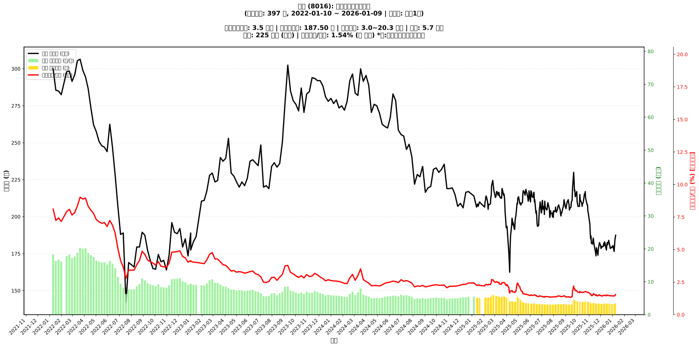

# 📈 矽創 (8016) 融資餘額報告

!!! info "基本資訊"
    **🏗️ 名稱**: 矽創
    **🪪 代號**: 8016
    **📅 分析期間**: 2025-07-18 ~ 2026-01-09 (共 242 個交易日)
    **🕒 最新資料**: 2026-01-09
    **🕒 更新時間**: 2026-01-12 17:17:10 CST

## 💰 融資餘額現況

| 📊 指標 | 🔢 數值 | 🚦 狀態 |
|:------------:|:----------:|:-------------------:|
| **最新融資餘額** | 3.5 億元 (1,853 張) | - |
| **最新收盤價** | 187.50 元 | - |
| **市值** | 225 億元 | - |
| **融資餘額/市值** | 1.54% | 🔴 過熱 |
| **日變化 (DoD)** | +0.1 億元 (+2.13%) | 📈 |
| **週變化 (WoW)** | +0.3 億元 (+8.20%) | 📈 |
| **月變化 (MoM)** | +0.1 億元 (+3.21%) | 📈 |

---

## 📊 歷史統計

| 📊 指標 | 🔢 數值 |
|:------------:|:----------:|
| **歷史最高** | 6.1 億元 |
| **歷史最低** | 3.0 億元 |
| **平均值** | 3.9 億元 |
| **標準差** | 0.9 億元 |
| **當前相對位置** | 15.2% |

---

## 📈 融資餘額趨勢圖

{: style="max-width: 100%; height: auto;"}

---

## 📋 詳細歷史記錄 (最近30日)

<table class="sortable-table">
<thead>
<tr>
<th markdown="span">📅 日期</th>
<th markdown="span">💸 收盤價(元)</th>
<th markdown="span">📊 漲跌(元)</th>
<th markdown="span">📈 漲跌(%)</th>
<th markdown="span">📦 融資餘額(億元)</th>
<th markdown="span">📦 融資餘額(張)</th>
<th markdown="span">↕️ 融資增減(張)</th>
<th markdown="span">📊 融券餘額(張)</th>
<th markdown="span">⚖️ 券資比(%)</th>
</tr>
</thead>
<tbody>
<tr>
<td>2026-01-09</td>
<td>187.50</td>
<td>🔺 +1.50</td>
<td>+0.81%</td>
<td>3.5</td>
<td>1,853</td>
<td>📈 +24</td>
<td>3</td>
<td>0.16%</td>
</tr>
<tr>
<td>2026-01-08</td>
<td>186.00</td>
<td>🔺 +2.00</td>
<td>+1.09%</td>
<td>3.4</td>
<td>1,829</td>
<td>📈 +45</td>
<td>3</td>
<td>0.16%</td>
</tr>
<tr>
<td>2026-01-07</td>
<td>184.00</td>
<td>🔺 +3.50</td>
<td>+1.94%</td>
<td>3.3</td>
<td>1,784</td>
<td>📉 -63</td>
<td>2</td>
<td>0.11%</td>
</tr>
<tr>
<td>2026-01-06</td>
<td>180.50</td>
<td>🔺 +4.00</td>
<td>+2.27%</td>
<td>3.3</td>
<td>1,847</td>
<td>📈 +4</td>
<td>1</td>
<td>0.05%</td>
</tr>
<tr>
<td>2026-01-05</td>
<td>176.50</td>
<td>🔻 -4.00</td>
<td>-2.22%</td>
<td>3.3</td>
<td>1,843</td>
<td>📈 +64</td>
<td>9</td>
<td>0.49%</td>
</tr>
<tr>
<td>2026-01-02</td>
<td>180.50</td>
<td>🔺 +1.00</td>
<td>+0.56%</td>
<td>3.2</td>
<td>1,779</td>
<td>📉 -33</td>
<td>17</td>
<td>0.96%</td>
</tr>
<tr>
<td>2025-12-31</td>
<td>179.50</td>
<td>🔺 +0.50</td>
<td>+0.28%</td>
<td>3.3</td>
<td>1,812</td>
<td>📉 -18</td>
<td>17</td>
<td>0.94%</td>
</tr>
<tr>
<td>2025-12-30</td>
<td>179.00</td>
<td>🔻 -0.50</td>
<td>-0.28%</td>
<td>3.3</td>
<td>1,830</td>
<td>📈 +12</td>
<td>17</td>
<td>0.93%</td>
</tr>
<tr>
<td>2025-12-29</td>
<td>179.50</td>
<td>🔺 +1.00</td>
<td>+0.56%</td>
<td>3.3</td>
<td>1,818</td>
<td>📉 -13</td>
<td>17</td>
<td>0.94%</td>
</tr>
<tr>
<td>2025-12-26</td>
<td>178.50</td>
<td>🔻 -3.00</td>
<td>-1.65%</td>
<td>3.3</td>
<td>1,831</td>
<td>📈 +13</td>
<td>17</td>
<td>0.93%</td>
</tr>
<tr>
<td>2025-12-24</td>
<td>181.50</td>
<td>🔻 -1.00</td>
<td>-0.55%</td>
<td>3.3</td>
<td>1,818</td>
<td>📈 +14</td>
<td>17</td>
<td>0.94%</td>
</tr>
<tr>
<td>2025-12-23</td>
<td>182.50</td>
<td>🔻 -1.50</td>
<td>-0.82%</td>
<td>3.3</td>
<td>1,804</td>
<td>➡️ +0</td>
<td>17</td>
<td>0.94%</td>
</tr>
<tr>
<td>2025-12-22</td>
<td>184.00</td>
<td>🔺 +3.00</td>
<td>+1.66%</td>
<td>3.3</td>
<td>1,804</td>
<td>📉 -45</td>
<td>17</td>
<td>0.94%</td>
</tr>
<tr>
<td>2025-12-19</td>
<td>181.00</td>
<td>🔻 -1.50</td>
<td>-0.82%</td>
<td>3.3</td>
<td>1,849</td>
<td>📈 +2</td>
<td>9</td>
<td>0.49%</td>
</tr>
<tr>
<td>2025-12-18</td>
<td>182.50</td>
<td>🔺 +1.50</td>
<td>+0.83%</td>
<td>3.4</td>
<td>1,847</td>
<td>📉 -31</td>
<td>2</td>
<td>0.11%</td>
</tr>
<tr>
<td>2025-12-17</td>
<td>181.00</td>
<td>🔺 +3.50</td>
<td>+1.97%</td>
<td>3.4</td>
<td>1,878</td>
<td>📈 +46</td>
<td>2</td>
<td>0.11%</td>
</tr>
<tr>
<td>2025-12-16</td>
<td>177.50</td>
<td>🔻 -1.00</td>
<td>-0.56%</td>
<td>3.3</td>
<td>1,832</td>
<td>📉 -12</td>
<td>1</td>
<td>0.05%</td>
</tr>
<tr>
<td>2025-12-15</td>
<td>178.50</td>
<td>🔻 -4.00</td>
<td>-2.19%</td>
<td>3.3</td>
<td>1,844</td>
<td>📈 +1</td>
<td>1</td>
<td>0.05%</td>
</tr>
<tr>
<td>2025-12-12</td>
<td>182.50</td>
<td>🔻 -0.50</td>
<td>-0.27%</td>
<td>3.4</td>
<td>1,843</td>
<td>📈 +3</td>
<td>3</td>
<td>0.16%</td>
</tr>
<tr>
<td>2025-12-11</td>
<td>183.00</td>
<td>🔺 +2.50</td>
<td>+1.39%</td>
<td>3.4</td>
<td>1,840</td>
<td>📉 -25</td>
<td>3</td>
<td>0.16%</td>
</tr>
<tr>
<td>2025-12-10</td>
<td>180.50</td>
<td>🔻 -1.50</td>
<td>-0.82%</td>
<td>3.4</td>
<td>1,865</td>
<td>📈 +26</td>
<td>3</td>
<td>0.16%</td>
</tr>
<tr>
<td>2025-12-09</td>
<td>182.00</td>
<td>🔺 +2.00</td>
<td>+1.11%</td>
<td>3.3</td>
<td>1,839</td>
<td>📈 +23</td>
<td>2</td>
<td>0.11%</td>
</tr>
<tr>
<td>2025-12-08</td>
<td>180.00</td>
<td>🔺 +0.50</td>
<td>+0.28%</td>
<td>3.3</td>
<td>1,816</td>
<td>📈 +5</td>
<td>2</td>
<td>0.11%</td>
</tr>
<tr>
<td>2025-12-05</td>
<td>179.50</td>
<td>🔻 -0.50</td>
<td>-0.28%</td>
<td>3.3</td>
<td>1,811</td>
<td>📉 -5</td>
<td>2</td>
<td>0.11%</td>
</tr>
<tr>
<td>2025-12-04</td>
<td>180.00</td>
<td>🔺 +1.00</td>
<td>+0.56%</td>
<td>3.3</td>
<td>1,816</td>
<td>📈 +5</td>
<td>2</td>
<td>0.11%</td>
</tr>
<tr>
<td>2025-12-03</td>
<td>179.00</td>
<td>🔺 +0.50</td>
<td>+0.28%</td>
<td>3.2</td>
<td>1,811</td>
<td>📉 -14</td>
<td>2</td>
<td>0.11%</td>
</tr>
<tr>
<td>2025-12-02</td>
<td>178.50</td>
<td>🔻 -2.00</td>
<td>-1.11%</td>
<td>3.3</td>
<td>1,825</td>
<td>📉 -15</td>
<td>2</td>
<td>0.11%</td>
</tr>
<tr>
<td>2025-12-01</td>
<td>180.50</td>
<td>🔻 -2.00</td>
<td>-1.10%</td>
<td>3.3</td>
<td>1,840</td>
<td>📉 -2</td>
<td>2</td>
<td>0.11%</td>
</tr>
<tr>
<td>2025-11-28</td>
<td>182.50</td>
<td>🔺 +1.50</td>
<td>+0.83%</td>
<td>3.4</td>
<td>1,842</td>
<td>📉 -71</td>
<td>22</td>
<td>1.19%</td>
</tr>
<tr>
<td>2025-11-27</td>
<td>181.00</td>
<td>🔺 +1.50</td>
<td>+0.84%</td>
<td>3.5</td>
<td>1,913</td>
<td>📈 +11</td>
<td>24</td>
<td>1.25%</td>
</tr>
</tbody>
</table>

---

## ℹ️ 資料來源與方法

!!! note "資料來源說明"
    - **主要來源**: `raw_margin_daily.csv` (Type 13: ShowMarginChart)
    - **資料頻率**: 每日更新
    - **資料範圍**: 近1年交易日資料

!!! info "報告元資訊"
    - **報告產生時間**: 2026-01-12 17:17:10
    - **分析期間**: 242 個交易日
    - **資料來源**: Stage 1 Raw Margin Daily Data

---

:material-information-outline: **本報告僅供參考，投資決策請審慎評估**

