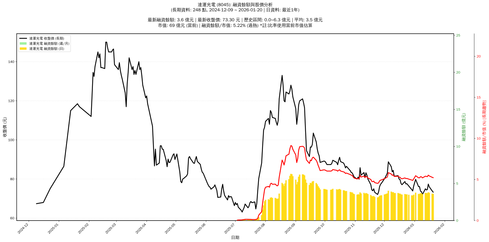

# :chart_with_upwards_trend: 達運光電 (8045) 融資餘額報告

!!! info "基本資訊"
    **:building_construction: 名稱**: 達運光電
    **:identification_card: 代號**: 8045
    **:calendar: 分析期間**: 2025-07-18 ~ 2026-01-09 (共 242 個交易日)
    **:clock3: 最新資料**: 2026-01-09
    **🕒 更新時間**: 2026-01-11 23:12:56 CST

## :moneybag: 融資餘額現況

| :chart: 指標 | :1234: 數值 | :traffic_light: 狀態 |
|:------------:|:----------:|:-------------------:|
| **最新融資餘額** | 3.6 億元 (4,978 張) | - |
| **最新收盤價** | 72.10 元 | - |
| **市值** | 68 億元 | - |
| **融資餘額/市值** | 5.24% | 🔴 過熱 |
| **日變化 (DoD)** | -0.1 億元 (-2.34%) | 📉 |
| **週變化 (WoW)** | -0.2 億元 (-4.79%) | 📉 |
| **月變化 (MoM)** | -0.3 億元 (-6.62%) | 📉 |

---

## :bar_chart: 歷史統計

| :chart: 指標 | :1234: 數值 |
|:------------:|:----------:|
| **歷史最高** | 6.3 億元 |
| **歷史最低** | 0.0 億元 |
| **平均值** | 3.5 億元 |
| **標準差** | 1.6 億元 |
| **當前相對位置** | 56.7% |

---

## :chart_with_upwards_trend: 融資餘額趨勢圖

{: style="max-width: 100%; height: auto;"}

---

## :clipboard: 詳細歷史記錄 (最近30日)

<table class="sortable-table">
<thead>
<tr>
<th>:calendar: 日期</th>
<th>:money_with_wings: 收盤價(元)</th>
<th>:chart: 漲跌(元)</th>
<th>:chart_with_upwards_trend: 漲跌(%)</th>
<th>:package: 融資餘額(億元)</th>
<th>:package: 融資餘額(張)</th>
<th>:arrow_up_down: 融資增減(張)</th>
<th>:chart: 融券餘額(張)</th>
<th>:balance_scale: 券資比(%)</th>
</tr>
</thead>
<tbody>
<tr>
<td>2026-01-09</td>
<td>72.10</td>
<td>🔻 -1.40</td>
<td>-1.90%</td>
<td>3.6</td>
<td>4,978</td>
<td>📉 -22</td>
<td>3</td>
<td>0.06%</td>
</tr>
<tr>
<td>2026-01-08</td>
<td>73.50</td>
<td>🔻 -0.30</td>
<td>-0.41%</td>
<td>3.7</td>
<td>5,000</td>
<td>📈 +5</td>
<td>3</td>
<td>0.06%</td>
</tr>
<tr>
<td>2026-01-07</td>
<td>73.80</td>
<td>🔻 -2.30</td>
<td>-3.02%</td>
<td>3.7</td>
<td>4,995</td>
<td>📈 +271</td>
<td>5</td>
<td>0.10%</td>
</tr>
<tr>
<td>2026-01-06</td>
<td>76.10</td>
<td>➖ +0.00</td>
<td>+0.00%</td>
<td>3.6</td>
<td>4,724</td>
<td>📉 -4</td>
<td>5</td>
<td>0.11%</td>
</tr>
<tr>
<td>2026-01-05</td>
<td>76.10</td>
<td>🔻 -3.70</td>
<td>-4.64%</td>
<td>3.6</td>
<td>4,728</td>
<td>📈 +4</td>
<td>5</td>
<td>0.11%</td>
</tr>
<tr>
<td>2026-01-02</td>
<td>79.80</td>
<td>🔺 +3.40</td>
<td>+4.45%</td>
<td>3.8</td>
<td>4,724</td>
<td>📈 +146</td>
<td>6</td>
<td>0.13%</td>
</tr>
<tr>
<td>2025-12-31</td>
<td>76.40</td>
<td>🔺 +2.50</td>
<td>+3.38%</td>
<td>3.5</td>
<td>4,578</td>
<td>📈 +9</td>
<td>5</td>
<td>0.11%</td>
</tr>
<tr>
<td>2025-12-30</td>
<td>73.90</td>
<td>🔻 -0.70</td>
<td>-0.94%</td>
<td>3.4</td>
<td>4,569</td>
<td>📈 +3</td>
<td>9</td>
<td>0.20%</td>
</tr>
<tr>
<td>2025-12-29</td>
<td>74.60</td>
<td>🔻 -1.80</td>
<td>-2.36%</td>
<td>3.4</td>
<td>4,566</td>
<td>📈 +6</td>
<td>14</td>
<td>0.31%</td>
</tr>
<tr>
<td>2025-12-26</td>
<td>76.40</td>
<td>🔻 -1.20</td>
<td>-1.55%</td>
<td>3.5</td>
<td>4,560</td>
<td>📉 -3</td>
<td>22</td>
<td>0.48%</td>
</tr>
<tr>
<td>2025-12-24</td>
<td>77.60</td>
<td>🔺 +0.10</td>
<td>+0.13%</td>
<td>3.5</td>
<td>4,563</td>
<td>📈 +3</td>
<td>28</td>
<td>0.61%</td>
</tr>
<tr>
<td>2025-12-23</td>
<td>77.50</td>
<td>🔻 -1.20</td>
<td>-1.52%</td>
<td>3.5</td>
<td>4,560</td>
<td>📈 +5</td>
<td>30</td>
<td>0.66%</td>
</tr>
<tr>
<td>2025-12-22</td>
<td>78.70</td>
<td>🔺 +1.60</td>
<td>+2.08%</td>
<td>3.6</td>
<td>4,555</td>
<td>➡️ +0</td>
<td>34</td>
<td>0.75%</td>
</tr>
<tr>
<td>2025-12-19</td>
<td>77.10</td>
<td>🔻 -0.60</td>
<td>-0.77%</td>
<td>3.5</td>
<td>4,555</td>
<td>➡️ +0</td>
<td>34</td>
<td>0.75%</td>
</tr>
<tr>
<td>2025-12-18</td>
<td>77.70</td>
<td>🔻 -2.00</td>
<td>-2.51%</td>
<td>3.5</td>
<td>4,555</td>
<td>📉 -11</td>
<td>34</td>
<td>0.75%</td>
</tr>
<tr>
<td>2025-12-17</td>
<td>79.70</td>
<td>🔻 -0.30</td>
<td>-0.38%</td>
<td>3.6</td>
<td>4,566</td>
<td>📉 -2</td>
<td>34</td>
<td>0.74%</td>
</tr>
<tr>
<td>2025-12-16</td>
<td>80.00</td>
<td>🔻 -1.70</td>
<td>-2.08%</td>
<td>3.7</td>
<td>4,568</td>
<td>📈 +10</td>
<td>34</td>
<td>0.74%</td>
</tr>
<tr>
<td>2025-12-15</td>
<td>81.70</td>
<td>🔺 +0.20</td>
<td>+0.25%</td>
<td>3.7</td>
<td>4,558</td>
<td>📉 -1</td>
<td>32</td>
<td>0.70%</td>
</tr>
<tr>
<td>2025-12-12</td>
<td>81.50</td>
<td>➖ +0.00</td>
<td>+0.00%</td>
<td>3.7</td>
<td>4,559</td>
<td>📈 +3</td>
<td>34</td>
<td>0.75%</td>
</tr>
<tr>
<td>2025-12-11</td>
<td>81.50</td>
<td>🔻 -2.90</td>
<td>-3.44%</td>
<td>3.7</td>
<td>4,556</td>
<td>📈 +2</td>
<td>34</td>
<td>0.75%</td>
</tr>
<tr>
<td>2025-12-10</td>
<td>84.40</td>
<td>🔺 +0.70</td>
<td>+0.84%</td>
<td>3.8</td>
<td>4,554</td>
<td>📈 +6</td>
<td>33</td>
<td>0.72%</td>
</tr>
<tr>
<td>2025-12-09</td>
<td>83.70</td>
<td>🔻 -2.60</td>
<td>-3.01%</td>
<td>3.8</td>
<td>4,548</td>
<td>📈 +11</td>
<td>33</td>
<td>0.73%</td>
</tr>
<tr>
<td>2025-12-08</td>
<td>86.30</td>
<td>🔻 -2.50</td>
<td>-2.82%</td>
<td>3.9</td>
<td>4,537</td>
<td>📈 +1</td>
<td>30</td>
<td>0.66%</td>
</tr>
<tr>
<td>2025-12-05</td>
<td>88.80</td>
<td>🔺 +5.70</td>
<td>+6.86%</td>
<td>4.0</td>
<td>4,536</td>
<td>📈 +124</td>
<td>27</td>
<td>0.60%</td>
</tr>
<tr>
<td>2025-12-04</td>
<td>83.10</td>
<td>🔺 +1.10</td>
<td>+1.34%</td>
<td>3.7</td>
<td>4,412</td>
<td>📈 +1</td>
<td>29</td>
<td>0.66%</td>
</tr>
<tr>
<td>2025-12-03</td>
<td>82.00</td>
<td>🔺 +1.00</td>
<td>+1.23%</td>
<td>3.6</td>
<td>4,411</td>
<td>📈 +9</td>
<td>29</td>
<td>0.66%</td>
</tr>
<tr>
<td>2025-12-02</td>
<td>81.00</td>
<td>🔺 +0.90</td>
<td>+1.12%</td>
<td>3.6</td>
<td>4,402</td>
<td>📈 +1</td>
<td>35</td>
<td>0.80%</td>
</tr>
<tr>
<td>2025-12-01</td>
<td>80.10</td>
<td>🔺 +2.20</td>
<td>+2.82%</td>
<td>3.5</td>
<td>4,401</td>
<td>📈 +15</td>
<td>35</td>
<td>0.80%</td>
</tr>
<tr>
<td>2025-11-28</td>
<td>77.90</td>
<td>🔺 +0.60</td>
<td>+0.78%</td>
<td>3.4</td>
<td>4,386</td>
<td>📉 -7</td>
<td>35</td>
<td>0.80%</td>
</tr>
<tr>
<td>2025-11-27</td>
<td>77.30</td>
<td>🔺 +1.20</td>
<td>+1.58%</td>
<td>3.4</td>
<td>4,393</td>
<td>📈 +10</td>
<td>34</td>
<td>0.77%</td>
</tr>
</tbody>
</table>

---

## :information_source: 資料來源與方法

!!! note "資料來源說明"
    - **主要來源**: `raw_margin_daily.csv` (Type 13: ShowMarginChart)
    - **資料頻率**: 每日更新
    - **資料範圍**: 近1年交易日資料

!!! info "報告元資訊"
    - **報告產生時間**: 2026-01-11 23:12:56
    - **分析期間**: 242 個交易日
    - **資料來源**: Stage 1 Raw Margin Daily Data

---

:material-information-outline: **本報告僅供參考，投資決策請審慎評估**

