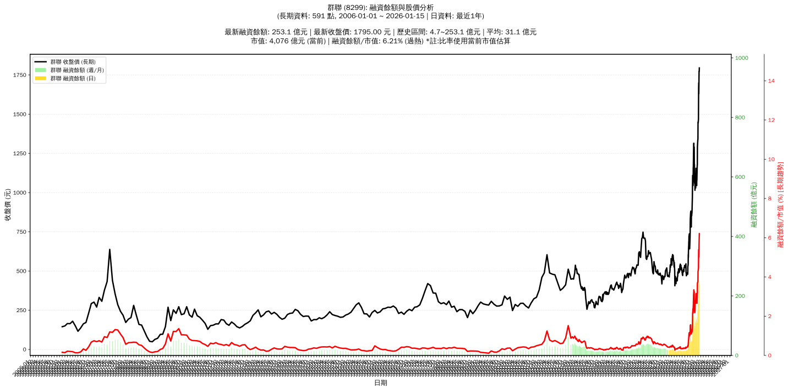

# :chart_with_upwards_trend: 群聯 (8299) 融資餘額報告

!!! info "基本資訊"
    **:building_construction: 名稱**: 群聯
    **:identification_card: 代號**: 8299
    **:calendar: 分析期間**: 2025-07-18 ~ 2026-01-09 (共 242 個交易日)
    **:clock3: 最新資料**: 2026-01-09
    **🕒 更新時間**: 2026-01-11 20:27:57 CST

## :moneybag: 融資餘額現況

| :chart: 指標 | :1234: 數值 | :traffic_light: 狀態 |
|:------------:|:----------:|:-------------------:|
| **最新融資餘額** | 204.0 億元 (12,516 張) | - |
| **最新收盤價** | 1630.00 元 | - |
| **市值** | 3,515 億元 | - |
| **融資餘額/市值** | 5.80% | 🔴 過熱 |
| **日變化 (DoD)** | -15.7 億元 (-7.13%) | 📉 |
| **週變化 (WoW)** | +27.6 億元 (+15.62%) | 📈 |
| **月變化 (MoM)** | +83.0 億元 (+68.63%) | 📈 |

---

## :bar_chart: 歷史統計

| :chart: 指標 | :1234: 數值 |
|:------------:|:----------:|
| **歷史最高** | 219.7 億元 |
| **歷史最低** | 11.1 億元 |
| **平均值** | 43.1 億元 |
| **標準差** | 46.7 億元 |
| **當前相對位置** | 92.5% |

---

## :chart_with_upwards_trend: 融資餘額趨勢圖

    

---

## :clipboard: 詳細歷史記錄 (最近30日)

<table class="sortable-table">
<thead>
<tr>
<th>:calendar: 日期</th>
<th>:money_with_wings: 收盤價(元)</th>
<th>:chart: 漲跌(元)</th>
<th>:chart_with_upwards_trend: 漲跌(%)</th>
<th>:package: 融資餘額(億元)</th>
<th>:package: 融資餘額(張)</th>
<th>:arrow_up_down: 融資增減(張)</th>
<th>:chart: 融券餘額(張)</th>
<th>:balance_scale: 券資比(%)</th>
</tr>
</thead>
<tbody>
<tr>
<td>2026-01-09</td>
<td>1630.00</td>
<td>🔻 -70.00</td>
<td>-4.12%</td>
<td>204.0</td>
<td>12,516</td>
<td>📉 -406</td>
<td>234</td>
<td>1.87%</td>
</tr>
<tr>
<td>2026-01-08</td>
<td>1700.00</td>
<td>🔺 +25.00</td>
<td>+1.49%</td>
<td>219.7</td>
<td>12,922</td>
<td>📉 -186</td>
<td>319</td>
<td>2.47%</td>
</tr>
<tr>
<td>2026-01-07</td>
<td>1675.00</td>
<td>🔺 +60.00</td>
<td>+3.72%</td>
<td>219.6</td>
<td>13,108</td>
<td>📈 +192</td>
<td>404</td>
<td>3.08%</td>
</tr>
<tr>
<td>2026-01-06</td>
<td>1615.00</td>
<td>🔺 +145.00</td>
<td>+9.86%</td>
<td>208.6</td>
<td>12,916</td>
<td>📈 +571</td>
<td>468</td>
<td>3.62%</td>
</tr>
<tr>
<td>2026-01-05</td>
<td>1470.00</td>
<td>🔺 +25.00</td>
<td>+1.73%</td>
<td>181.5</td>
<td>12,345</td>
<td>📈 +134</td>
<td>384</td>
<td>3.11%</td>
</tr>
<tr>
<td>2026-01-02</td>
<td>1445.00</td>
<td>🔻 -5.00</td>
<td>-0.34%</td>
<td>176.4</td>
<td>12,211</td>
<td>📈 +175</td>
<td>395</td>
<td>3.23%</td>
</tr>
<tr>
<td>2025-12-31</td>
<td>1450.00</td>
<td>🔺 +110.00</td>
<td>+8.21%</td>
<td>174.5</td>
<td>12,036</td>
<td>📈 +516</td>
<td>435</td>
<td>3.61%</td>
</tr>
<tr>
<td>2025-12-30</td>
<td>1340.00</td>
<td>➖ +0.00</td>
<td>+0.00%</td>
<td>154.4</td>
<td>11,520</td>
<td>📈 +121</td>
<td>403</td>
<td>3.50%</td>
</tr>
<tr>
<td>2025-12-29</td>
<td>1340.00</td>
<td>🔺 +30.00</td>
<td>+2.29%</td>
<td>152.7</td>
<td>11,399</td>
<td>📉 -176</td>
<td>442</td>
<td>3.88%</td>
</tr>
<tr>
<td>2025-12-26</td>
<td>1310.00</td>
<td>🔺 +20.00</td>
<td>+1.55%</td>
<td>151.6</td>
<td>11,575</td>
<td>📈 +11</td>
<td>406</td>
<td>3.51%</td>
</tr>
<tr>
<td>2025-12-24</td>
<td>1290.00</td>
<td>🔺 +115.00</td>
<td>+9.79%</td>
<td>149.2</td>
<td>11,564</td>
<td>📈 +514</td>
<td>409</td>
<td>3.54%</td>
</tr>
<tr>
<td>2025-12-23</td>
<td>1175.00</td>
<td>➖ +0.00</td>
<td>+0.00%</td>
<td>129.8</td>
<td>11,050</td>
<td>📈 +452</td>
<td>229</td>
<td>2.07%</td>
</tr>
<tr>
<td>2025-12-22</td>
<td>1175.00</td>
<td>🔺 +65.00</td>
<td>+5.86%</td>
<td>124.5</td>
<td>10,598</td>
<td>📈 +831</td>
<td>397</td>
<td>3.75%</td>
</tr>
<tr>
<td>2025-12-19</td>
<td>1110.00</td>
<td>🔺 +30.00</td>
<td>+2.78%</td>
<td>108.4</td>
<td>9,767</td>
<td>📉 -452</td>
<td>320</td>
<td>3.28%</td>
</tr>
<tr>
<td>2025-12-18</td>
<td>1080.00</td>
<td>🔻 -15.00</td>
<td>-1.37%</td>
<td>110.4</td>
<td>10,219</td>
<td>📉 -170</td>
<td>267</td>
<td>2.61%</td>
</tr>
<tr>
<td>2025-12-17</td>
<td>1095.00</td>
<td>🔺 +50.00</td>
<td>+4.78%</td>
<td>113.8</td>
<td>10,389</td>
<td>📉 -40</td>
<td>224</td>
<td>2.16%</td>
</tr>
<tr>
<td>2025-12-16</td>
<td>1045.00</td>
<td>🔻 -75.00</td>
<td>-6.70%</td>
<td>109.0</td>
<td>10,429</td>
<td>📈 +172</td>
<td>96</td>
<td>0.92%</td>
</tr>
<tr>
<td>2025-12-15</td>
<td>1125.00</td>
<td>➖ +0.00</td>
<td>+0.00%</td>
<td>115.4</td>
<td>10,257</td>
<td>📉 -403</td>
<td>0</td>
<td>0.00%</td>
</tr>
<tr>
<td>2025-12-12</td>
<td>1125.00</td>
<td>🔺 +20.00</td>
<td>+1.81%</td>
<td>119.9</td>
<td>10,660</td>
<td>📉 -148</td>
<td>0</td>
<td>0.00%</td>
</tr>
<tr>
<td>2025-12-11</td>
<td>1105.00</td>
<td>🔻 -20.00</td>
<td>-1.78%</td>
<td>119.4</td>
<td>10,808</td>
<td>📈 +54</td>
<td>0</td>
<td>0.00%</td>
</tr>
<tr>
<td>2025-12-10</td>
<td>1125.00</td>
<td>🔻 -30.00</td>
<td>-2.60%</td>
<td>121.0</td>
<td>10,754</td>
<td>📉 -366</td>
<td>2</td>
<td>0.02%</td>
</tr>
<tr>
<td>2025-12-09</td>
<td>1155.00</td>
<td>➖ +0.00</td>
<td>+0.00%</td>
<td>128.4</td>
<td>11,120</td>
<td>📈 +85</td>
<td>111</td>
<td>1.00%</td>
</tr>
<tr>
<td>2025-12-08</td>
<td>1155.00</td>
<td>🔺 +75.00</td>
<td>+6.94%</td>
<td>127.5</td>
<td>11,035</td>
<td>📈 +226</td>
<td>164</td>
<td>1.49%</td>
</tr>
<tr>
<td>2025-12-05</td>
<td>1080.00</td>
<td>🔺 +50.00</td>
<td>+4.85%</td>
<td>116.7</td>
<td>10,809</td>
<td>📈 +280</td>
<td>187</td>
<td>1.73%</td>
</tr>
<tr>
<td>2025-12-04</td>
<td>1030.00</td>
<td>🔻 -40.00</td>
<td>-3.74%</td>
<td>108.4</td>
<td>10,529</td>
<td>📈 +207</td>
<td>179</td>
<td>1.70%</td>
</tr>
<tr>
<td>2025-12-03</td>
<td>1070.00</td>
<td>➖ +0.00</td>
<td>+0.00%</td>
<td>110.4</td>
<td>10,322</td>
<td>📉 -58</td>
<td>189</td>
<td>1.83%</td>
</tr>
<tr>
<td>2025-12-02</td>
<td>1070.00</td>
<td>🔻 -35.00</td>
<td>-3.17%</td>
<td>111.1</td>
<td>10,380</td>
<td>📈 +79</td>
<td>197</td>
<td>1.90%</td>
</tr>
<tr>
<td>2025-12-01</td>
<td>1105.00</td>
<td>🔻 -15.00</td>
<td>-1.34%</td>
<td>113.8</td>
<td>10,301</td>
<td>📈 +315</td>
<td>214</td>
<td>2.08%</td>
</tr>
<tr>
<td>2025-11-28</td>
<td>1120.00</td>
<td>🔺 +65.00</td>
<td>+6.16%</td>
<td>111.8</td>
<td>9,986</td>
<td>📈 +518</td>
<td>223</td>
<td>2.23%</td>
</tr>
<tr>
<td>2025-11-27</td>
<td>1055.00</td>
<td>🔺 +40.00</td>
<td>+3.94%</td>
<td>99.9</td>
<td>9,468</td>
<td>📈 +459</td>
<td>205</td>
<td>2.17%</td>
</tr>
</tbody>
</table>

---

## :information_source: 資料來源與方法

!!! note "資料來源說明"
    - **主要來源**: `raw_margin_daily.csv` (Type 13: ShowMarginChart)
    - **資料頻率**: 每日更新
    - **資料範圍**: 近1年交易日資料

!!! info "報告元資訊"
    - **報告產生時間**: 2026-01-11 20:27:57
    - **分析期間**: 242 個交易日
    - **資料來源**: Stage 1 Raw Margin Daily Data

---

:material-information-outline: **本報告僅供參考，投資決策請審慎評估**

