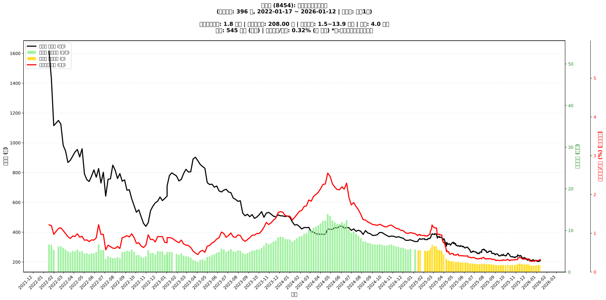

# 📈 富邦媒 (8454) 融資餘額報告

!!! info "基本資訊"
    **🏗️ 名稱**: 富邦媒
    **🪪 代號**: 8454
    **📅 分析期間**: 2025-07-23 ~ 2026-01-14 (共 242 個交易日)
    **🕒 最新資料**: 2026-01-14
    **🕒 更新時間**: 2026-01-15 22:29:40 CST

## 💰 融資餘額現況

| 📊 指標 | 🔢 數值 | 🚦 狀態 |
|:------------:|:----------:|:-------------------:|
| **最新融資餘額** | 1.7 億元 (837 張) | - |
| **最新收盤價** | 207.50 元 | - |
| **市值** | 545 億元 | - |
| **融資餘額/市值** | 0.32% | 🟡 正常 |
| **日變化 (DoD)** | +0.0 億元 (+0.05%) | 📈 |
| **週變化 (WoW)** | +0.1 億元 (+5.99%) | 📈 |
| **兩週變化 (2Wo2W)** | +0.2 億元 (+12.11%) | 📈 |
| **月變化 (MoM)** | +0.1 億元 (+8.50%) | 📈 |

---

## 📊 歷史統計

| 📊 指標 | 🔢 數值 |
|:------------:|:----------:|
| **歷史最高** | 6.6 億元 |
| **歷史最低** | 1.5 億元 |
| **平均值** | 2.6 億元 |
| **標準差** | 1.4 億元 |
| **當前相對位置** | 4.7% |

---

## 📈 融資餘額趨勢圖

{: style="max-width: 100%; height: auto;"}

---

## 📋 詳細歷史記錄 (最近30日)

<table class="sortable-table">
<thead>
<tr>
<th markdown="span">📅 日期</th>
<th markdown="span">💸 收盤價(元)</th>
<th markdown="span">📊 漲跌(元)</th>
<th markdown="span">📈 漲跌(%)</th>
<th markdown="span">📦 融資餘額(億元)</th>
<th markdown="span">📦 融資餘額(張)</th>
<th markdown="span">↕️ 融資增減(張)</th>
<th markdown="span">📊 融券餘額(張)</th>
<th markdown="span">⚖️ 券資比(%)</th>
</tr>
</thead>
<tbody>
<tr>
<td>2026-01-14</td>
<td>207.50</td>
<td>🔺 +4.00</td>
<td>+1.97%</td>
<td>1.7</td>
<td>837</td>
<td>📉 -16</td>
<td>24</td>
<td>2.87%</td>
</tr>
<tr>
<td>2026-01-13</td>
<td>203.50</td>
<td>🔻 -4.50</td>
<td>-2.16%</td>
<td>1.7</td>
<td>853</td>
<td>📈 +10</td>
<td>8</td>
<td>0.94%</td>
</tr>
<tr>
<td>2026-01-12</td>
<td>208.00</td>
<td>🔺 +2.50</td>
<td>+1.22%</td>
<td>1.8</td>
<td>843</td>
<td>📈 +20</td>
<td>9</td>
<td>1.07%</td>
</tr>
<tr>
<td>2026-01-09</td>
<td>205.50</td>
<td>🔺 +1.00</td>
<td>+0.49%</td>
<td>1.7</td>
<td>823</td>
<td>📈 +4</td>
<td>9</td>
<td>1.09%</td>
</tr>
<tr>
<td>2026-01-08</td>
<td>204.50</td>
<td>🔻 -4.50</td>
<td>-2.15%</td>
<td>1.7</td>
<td>819</td>
<td>📈 +35</td>
<td>9</td>
<td>1.10%</td>
</tr>
<tr>
<td>2026-01-07</td>
<td>209.00</td>
<td>🔺 +6.00</td>
<td>+2.96%</td>
<td>1.6</td>
<td>784</td>
<td>📈 +2</td>
<td>10</td>
<td>1.28%</td>
</tr>
<tr>
<td>2026-01-06</td>
<td>203.00</td>
<td>➖ +0.00</td>
<td>+0.00%</td>
<td>1.6</td>
<td>782</td>
<td>📉 -7</td>
<td>10</td>
<td>1.28%</td>
</tr>
<tr>
<td>2026-01-05</td>
<td>203.00</td>
<td>🔻 -3.00</td>
<td>-1.46%</td>
<td>1.6</td>
<td>789</td>
<td>📉 -8</td>
<td>9</td>
<td>1.14%</td>
</tr>
<tr>
<td>2026-01-02</td>
<td>206.00</td>
<td>🔻 -1.50</td>
<td>-0.72%</td>
<td>1.6</td>
<td>797</td>
<td>📈 +10</td>
<td>9</td>
<td>1.13%</td>
</tr>
<tr>
<td>2025-12-31</td>
<td>207.50</td>
<td>🔻 -2.50</td>
<td>-1.19%</td>
<td>1.6</td>
<td>787</td>
<td>📈 +2</td>
<td>8</td>
<td>1.02%</td>
</tr>
<tr>
<td>2025-12-30</td>
<td>210.00</td>
<td>🔺 +1.00</td>
<td>+0.48%</td>
<td>1.6</td>
<td>785</td>
<td>📉 -9</td>
<td>11</td>
<td>1.40%</td>
</tr>
<tr>
<td>2025-12-29</td>
<td>209.00</td>
<td>🔺 +1.50</td>
<td>+0.72%</td>
<td>1.7</td>
<td>794</td>
<td>📈 +67</td>
<td>10</td>
<td>1.26%</td>
</tr>
<tr>
<td>2025-12-26</td>
<td>207.50</td>
<td>🔻 -4.50</td>
<td>-2.12%</td>
<td>1.5</td>
<td>727</td>
<td>📈 +10</td>
<td>8</td>
<td>1.10%</td>
</tr>
<tr>
<td>2025-12-24</td>
<td>212.00</td>
<td>🔻 -1.50</td>
<td>-0.70%</td>
<td>1.5</td>
<td>717</td>
<td>📉 -13</td>
<td>7</td>
<td>0.98%</td>
</tr>
<tr>
<td>2025-12-23</td>
<td>213.50</td>
<td>🔻 -2.00</td>
<td>-0.93%</td>
<td>1.6</td>
<td>730</td>
<td>📈 +7</td>
<td>7</td>
<td>0.96%</td>
</tr>
<tr>
<td>2025-12-22</td>
<td>215.50</td>
<td>🔺 +4.50</td>
<td>+2.13%</td>
<td>1.6</td>
<td>723</td>
<td>📈 +14</td>
<td>9</td>
<td>1.24%</td>
</tr>
<tr>
<td>2025-12-19</td>
<td>211.00</td>
<td>🔺 +1.50</td>
<td>+0.72%</td>
<td>1.5</td>
<td>709</td>
<td>📉 -8</td>
<td>9</td>
<td>1.27%</td>
</tr>
<tr>
<td>2025-12-18</td>
<td>209.50</td>
<td>🔻 -1.00</td>
<td>-0.48%</td>
<td>1.5</td>
<td>717</td>
<td>📉 -3</td>
<td>9</td>
<td>1.26%</td>
</tr>
<tr>
<td>2025-12-17</td>
<td>210.50</td>
<td>🔺 +0.50</td>
<td>+0.24%</td>
<td>1.5</td>
<td>720</td>
<td>📈 +1</td>
<td>9</td>
<td>1.25%</td>
</tr>
<tr>
<td>2025-12-16</td>
<td>210.00</td>
<td>🔺 +0.50</td>
<td>+0.24%</td>
<td>1.5</td>
<td>719</td>
<td>📉 -9</td>
<td>8</td>
<td>1.11%</td>
</tr>
<tr>
<td>2025-12-15</td>
<td>209.50</td>
<td>🔻 -5.50</td>
<td>-2.56%</td>
<td>1.5</td>
<td>728</td>
<td>📈 +3</td>
<td>8</td>
<td>1.10%</td>
</tr>
<tr>
<td>2025-12-12</td>
<td>215.00</td>
<td>🔺 +1.50</td>
<td>+0.70%</td>
<td>1.6</td>
<td>725</td>
<td>📉 -9</td>
<td>9</td>
<td>1.24%</td>
</tr>
<tr>
<td>2025-12-11</td>
<td>213.50</td>
<td>🔻 -2.00</td>
<td>-0.93%</td>
<td>1.6</td>
<td>734</td>
<td>📉 -123</td>
<td>11</td>
<td>1.50%</td>
</tr>
<tr>
<td>2025-12-10</td>
<td>215.50</td>
<td>🔺 +2.00</td>
<td>+0.94%</td>
<td>1.8</td>
<td>857</td>
<td>📈 +2</td>
<td>10</td>
<td>1.17%</td>
</tr>
<tr>
<td>2025-12-09</td>
<td>213.50</td>
<td>🔻 -3.50</td>
<td>-1.61%</td>
<td>1.8</td>
<td>855</td>
<td>📈 +3</td>
<td>10</td>
<td>1.17%</td>
</tr>
<tr>
<td>2025-12-08</td>
<td>217.00</td>
<td>🔺 +5.00</td>
<td>+2.36%</td>
<td>1.8</td>
<td>852</td>
<td>📉 -11</td>
<td>11</td>
<td>1.29%</td>
</tr>
<tr>
<td>2025-12-05</td>
<td>212.00</td>
<td>🔻 -2.00</td>
<td>-0.93%</td>
<td>1.8</td>
<td>863</td>
<td>📉 -6</td>
<td>11</td>
<td>1.27%</td>
</tr>
<tr>
<td>2025-12-04</td>
<td>214.00</td>
<td>🔻 -2.00</td>
<td>-0.93%</td>
<td>1.9</td>
<td>869</td>
<td>📈 +24</td>
<td>13</td>
<td>1.50%</td>
</tr>
<tr>
<td>2025-12-03</td>
<td>216.00</td>
<td>🔻 -3.00</td>
<td>-1.37%</td>
<td>1.8</td>
<td>845</td>
<td>📈 +15</td>
<td>11</td>
<td>1.30%</td>
</tr>
<tr>
<td>2025-12-02</td>
<td>219.00</td>
<td>🔻 -3.50</td>
<td>-1.57%</td>
<td>1.8</td>
<td>830</td>
<td>📈 +11</td>
<td>11</td>
<td>1.33%</td>
</tr>
</tbody>
</table>

---

## ℹ️ 資料來源與方法

!!! note "資料來源說明"
    - **主要來源**: `raw_margin_daily.csv` (Type 13: ShowMarginChart)
    - **資料頻率**: 每日更新
    - **資料範圍**: 近1年交易日資料

!!! info "報告元資訊"
    - **報告產生時間**: 2026-01-15 22:29:40
    - **分析期間**: 242 個交易日
    - **資料來源**: Stage 1 Raw Margin Daily Data

---

:material-information-outline: **本報告僅供參考，投資決策請審慎評估**

