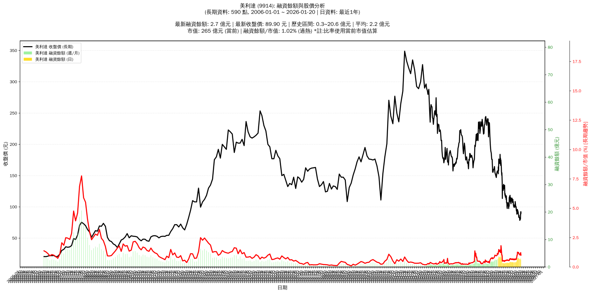

# 📈 美利達 (9914) 融資餘額報告

!!! info "基本資訊"
    **🏗️ 名稱**: 美利達
    **🪪 代號**: 9914
    **📅 分析期間**: 2025-07-23 ~ 2026-01-14 (共 242 個交易日)
    **🕒 最新資料**: 2026-01-14
    **🕒 更新時間**: 2026-01-15 20:35:31 CST

## 💰 融資餘額現況

| 📊 指標 | 🔢 數值 | 🚦 狀態 |
|:------------:|:----------:|:-------------------:|
| **最新融資餘額** | 3.2 億元 (3,591 張) | - |
| **最新收盤價** | 89.00 元 | - |
| **市值** | 261 億元 | - |
| **融資餘額/市值** | 1.22% | 🔴 過熱 |
| **日變化 (DoD)** | +0.2 億元 (+7.11%) | 📈 |
| **週變化 (WoW)** | +0.4 億元 (+14.30%) | 📈 |
| **兩週變化 (2Wo2W)** | -0.1 億元 (-3.33%) | 📉 |
| **月變化 (MoM)** | -0.4 億元 (-13.51%) | 📉 |

---

## 📊 歷史統計

| 📊 指標 | 🔢 數值 |
|:------------:|:----------:|
| **歷史最高** | 4.8 億元 |
| **歷史最低** | 1.3 億元 |
| **平均值** | 2.2 億元 |
| **標準差** | 0.9 億元 |
| **當前相對位置** | 54.1% |

---

## 📈 融資餘額趨勢圖

{: style="max-width: 100%; height: auto;"}

---

## 📋 詳細歷史記錄 (最近30日)

<table class="sortable-table">
<thead>
<tr>
<th markdown="span">📅 日期</th>
<th markdown="span">💸 收盤價(元)</th>
<th markdown="span">📊 漲跌(元)</th>
<th markdown="span">📈 漲跌(%)</th>
<th markdown="span">📦 融資餘額(億元)</th>
<th markdown="span">📦 融資餘額(張)</th>
<th markdown="span">↕️ 融資增減(張)</th>
<th markdown="span">📊 融券餘額(張)</th>
<th markdown="span">⚖️ 券資比(%)</th>
</tr>
</thead>
<tbody>
<tr>
<td>2026-01-14</td>
<td>89.00</td>
<td>🔺 +4.90</td>
<td>+5.83%</td>
<td>3.2</td>
<td>3,591</td>
<td>📈 +43</td>
<td>149</td>
<td>4.15%</td>
</tr>
<tr>
<td>2026-01-13</td>
<td>84.10</td>
<td>🔺 +3.70</td>
<td>+4.60%</td>
<td>3.0</td>
<td>3,548</td>
<td>📈 +24</td>
<td>129</td>
<td>3.64%</td>
</tr>
<tr>
<td>2026-01-12</td>
<td>80.40</td>
<td>🔻 -0.60</td>
<td>-0.74%</td>
<td>2.8</td>
<td>3,524</td>
<td>📈 +36</td>
<td>120</td>
<td>3.41%</td>
</tr>
<tr>
<td>2026-01-09</td>
<td>81.00</td>
<td>➖ +0.00</td>
<td>+0.00%</td>
<td>2.8</td>
<td>3,488</td>
<td>📉 -8</td>
<td>124</td>
<td>3.56%</td>
</tr>
<tr>
<td>2026-01-08</td>
<td>81.00</td>
<td>🔺 +0.70</td>
<td>+0.87%</td>
<td>2.8</td>
<td>3,496</td>
<td>📈 +14</td>
<td>124</td>
<td>3.55%</td>
</tr>
<tr>
<td>2026-01-07</td>
<td>80.30</td>
<td>🔺 +0.90</td>
<td>+1.13%</td>
<td>2.8</td>
<td>3,482</td>
<td>📈 +19</td>
<td>110</td>
<td>3.16%</td>
</tr>
<tr>
<td>2026-01-06</td>
<td>79.40</td>
<td>🔺 +0.40</td>
<td>+0.51%</td>
<td>2.7</td>
<td>3,463</td>
<td>📉 -15</td>
<td>81</td>
<td>2.34%</td>
</tr>
<tr>
<td>2026-01-05</td>
<td>79.00</td>
<td>🔺 +0.50</td>
<td>+0.64%</td>
<td>2.7</td>
<td>3,478</td>
<td>📈 +3</td>
<td>80</td>
<td>2.30%</td>
</tr>
<tr>
<td>2026-01-02</td>
<td>78.50</td>
<td>🔻 -4.20</td>
<td>-5.08%</td>
<td>2.7</td>
<td>3,475</td>
<td>📉 -4</td>
<td>42</td>
<td>1.21%</td>
</tr>
<tr>
<td>2025-12-31</td>
<td>82.70</td>
<td>🔻 -0.20</td>
<td>-0.24%</td>
<td>2.9</td>
<td>3,479</td>
<td>📉 -69</td>
<td>57</td>
<td>1.64%</td>
</tr>
<tr>
<td>2025-12-30</td>
<td>82.90</td>
<td>🔻 -0.10</td>
<td>-0.12%</td>
<td>2.9</td>
<td>3,548</td>
<td>📈 +5</td>
<td>80</td>
<td>2.25%</td>
</tr>
<tr>
<td>2025-12-29</td>
<td>83.00</td>
<td>🔺 +0.60</td>
<td>+0.73%</td>
<td>2.9</td>
<td>3,543</td>
<td>📉 -4</td>
<td>77</td>
<td>2.17%</td>
</tr>
<tr>
<td>2025-12-26</td>
<td>82.40</td>
<td>🔻 -0.50</td>
<td>-0.60%</td>
<td>2.9</td>
<td>3,547</td>
<td>📈 +10</td>
<td>43</td>
<td>1.21%</td>
</tr>
<tr>
<td>2025-12-24</td>
<td>82.90</td>
<td>🔻 -1.30</td>
<td>-1.54%</td>
<td>2.9</td>
<td>3,537</td>
<td>📈 +46</td>
<td>67</td>
<td>1.89%</td>
</tr>
<tr>
<td>2025-12-23</td>
<td>84.20</td>
<td>🔻 -2.00</td>
<td>-2.32%</td>
<td>2.9</td>
<td>3,491</td>
<td>📈 +4</td>
<td>91</td>
<td>2.61%</td>
</tr>
<tr>
<td>2025-12-22</td>
<td>86.20</td>
<td>🔺 +0.20</td>
<td>+0.23%</td>
<td>3.0</td>
<td>3,487</td>
<td>📉 -10</td>
<td>91</td>
<td>2.61%</td>
</tr>
<tr>
<td>2025-12-19</td>
<td>86.00</td>
<td>🔺 +1.40</td>
<td>+1.65%</td>
<td>3.0</td>
<td>3,497</td>
<td>📉 -2</td>
<td>91</td>
<td>2.60%</td>
</tr>
<tr>
<td>2025-12-18</td>
<td>84.60</td>
<td>🔺 +1.20</td>
<td>+1.44%</td>
<td>3.0</td>
<td>3,499</td>
<td>📉 -238</td>
<td>89</td>
<td>2.54%</td>
</tr>
<tr>
<td>2025-12-17</td>
<td>83.40</td>
<td>🔻 -2.50</td>
<td>-2.91%</td>
<td>3.1</td>
<td>3,737</td>
<td>📈 +37</td>
<td>40</td>
<td>1.07%</td>
</tr>
<tr>
<td>2025-12-16</td>
<td>85.90</td>
<td>🔻 -1.30</td>
<td>-1.49%</td>
<td>3.2</td>
<td>3,700</td>
<td>📉 -37</td>
<td>40</td>
<td>1.08%</td>
</tr>
<tr>
<td>2025-12-15</td>
<td>87.20</td>
<td>🔻 -0.90</td>
<td>-1.02%</td>
<td>3.3</td>
<td>3,737</td>
<td>📈 +29</td>
<td>50</td>
<td>1.34%</td>
</tr>
<tr>
<td>2025-12-12</td>
<td>88.10</td>
<td>➖ +0.00</td>
<td>+0.00%</td>
<td>3.3</td>
<td>3,708</td>
<td>📈 +11</td>
<td>44</td>
<td>1.19%</td>
</tr>
<tr>
<td>2025-12-11</td>
<td>88.10</td>
<td>🔻 -1.30</td>
<td>-1.45%</td>
<td>3.3</td>
<td>3,697</td>
<td>📉 -10</td>
<td>44</td>
<td>1.19%</td>
</tr>
<tr>
<td>2025-12-10</td>
<td>89.40</td>
<td>🔻 -0.60</td>
<td>-0.67%</td>
<td>3.3</td>
<td>3,707</td>
<td>📈 +155</td>
<td>76</td>
<td>2.05%</td>
</tr>
<tr>
<td>2025-12-09</td>
<td>90.00</td>
<td>🔻 -1.70</td>
<td>-1.85%</td>
<td>3.2</td>
<td>3,552</td>
<td>📈 +49</td>
<td>85</td>
<td>2.39%</td>
</tr>
<tr>
<td>2025-12-08</td>
<td>91.70</td>
<td>🔻 -0.60</td>
<td>-0.65%</td>
<td>3.2</td>
<td>3,503</td>
<td>📉 -49</td>
<td>84</td>
<td>2.40%</td>
</tr>
<tr>
<td>2025-12-05</td>
<td>92.30</td>
<td>🔻 -1.50</td>
<td>-1.60%</td>
<td>3.3</td>
<td>3,552</td>
<td>📈 +18</td>
<td>87</td>
<td>2.45%</td>
</tr>
<tr>
<td>2025-12-04</td>
<td>93.80</td>
<td>🔺 +0.50</td>
<td>+0.54%</td>
<td>3.3</td>
<td>3,534</td>
<td>📉 -24</td>
<td>90</td>
<td>2.55%</td>
</tr>
<tr>
<td>2025-12-03</td>
<td>93.30</td>
<td>🔻 -0.50</td>
<td>-0.53%</td>
<td>3.3</td>
<td>3,558</td>
<td>📈 +14</td>
<td>89</td>
<td>2.50%</td>
</tr>
<tr>
<td>2025-12-02</td>
<td>93.80</td>
<td>🔺 +0.30</td>
<td>+0.32%</td>
<td>3.3</td>
<td>3,544</td>
<td>📉 -12</td>
<td>89</td>
<td>2.51%</td>
</tr>
</tbody>
</table>

---

## ℹ️ 資料來源與方法

!!! note "資料來源說明"
    - **主要來源**: `raw_margin_daily.csv` (Type 13: ShowMarginChart)
    - **資料頻率**: 每日更新
    - **資料範圍**: 近1年交易日資料

!!! info "報告元資訊"
    - **報告產生時間**: 2026-01-15 20:35:31
    - **分析期間**: 242 個交易日
    - **資料來源**: Stage 1 Raw Margin Daily Data

---

:material-information-outline: **本報告僅供參考，投資決策請審慎評估**

