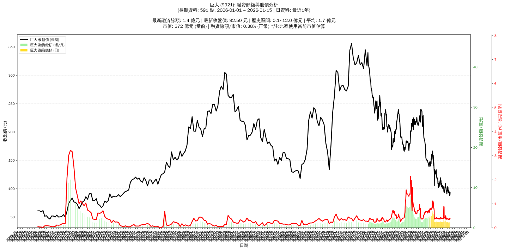

# :chart_with_upwards_trend: 巨大 (9921) 融資餘額報告

!!! info "基本資訊"
    **:building_construction: 名稱**: 巨大
    **:identification_card: 代號**: 9921
    **:calendar: 分析期間**: 2025-07-18 ~ 2026-01-09 (共 242 個交易日)
    **:clock3: 最新資料**: 2026-01-09
    **🕒 更新時間**: 2026-01-12 13:16:30 CST

## :moneybag: 融資餘額現況

| :chart: 指標 | :1234: 數值 | :traffic_light: 狀態 |
|:------------:|:----------:|:-------------------:|
| **最新融資餘額** | 1.4 億元 (1,520 張) | - |
| **最新收盤價** | 89.00 元 | - |
| **市值** | 349 億元 | - |
| **融資餘額/市值** | 0.39% | 🟡 正常 |
| **日變化 (DoD)** | -0.0 億元 (-0.95%) | 📉 |
| **週變化 (WoW)** | -0.1 億元 (-3.67%) | 📉 |
| **月變化 (MoM)** | +0.0 億元 (+0.04%) | 📈 |

---

## :bar_chart: 歷史統計

| :chart: 指標 | :1234: 數值 |
|:------------:|:----------:|
| **歷史最高** | 4.2 億元 |
| **歷史最低** | 1.3 億元 |
| **平均值** | 1.9 億元 |
| **標準差** | 0.8 億元 |
| **當前相對位置** | 2.2% |

---

## :chart_with_upwards_trend: 融資餘額趨勢圖

    

---

## :clipboard: 詳細歷史記錄 (最近30日)

<table class="sortable-table">
<thead>
<tr>
<th markdown="span">:calendar: 日期</th>
<th markdown="span">:money_with_wings: 收盤價(元)</th>
<th markdown="span">:chart: 漲跌(元)</th>
<th markdown="span">:chart_with_upwards_trend: 漲跌(%)</th>
<th markdown="span">:package: 融資餘額(億元)</th>
<th markdown="span">:package: 融資餘額(張)</th>
<th markdown="span">:arrow_up_down: 融資增減(張)</th>
<th markdown="span">:chart: 融券餘額(張)</th>
<th markdown="span">:balance_scale: 券資比(%)</th>
</tr>
</thead>
<tbody>
<tr>
<td>2026-01-09</td>
<td>89.00</td>
<td>🔻 -0.50</td>
<td>-0.56%</td>
<td>1.4</td>
<td>1,520</td>
<td>📉 -6</td>
<td>188</td>
<td>12.40%</td>
</tr>
<tr>
<td>2026-01-08</td>
<td>89.50</td>
<td>🔻 -0.70</td>
<td>-0.78%</td>
<td>1.4</td>
<td>1,526</td>
<td>📈 +1</td>
<td>167</td>
<td>10.90%</td>
</tr>
<tr>
<td>2026-01-07</td>
<td>90.20</td>
<td>🔺 +2.60</td>
<td>+2.97%</td>
<td>1.4</td>
<td>1,525</td>
<td>📈 +7</td>
<td>168</td>
<td>11.00%</td>
</tr>
<tr>
<td>2026-01-06</td>
<td>87.60</td>
<td>🔻 -1.10</td>
<td>-1.24%</td>
<td>1.3</td>
<td>1,518</td>
<td>📈 +20</td>
<td>192</td>
<td>12.60%</td>
</tr>
<tr>
<td>2026-01-05</td>
<td>88.70</td>
<td>🔺 +0.10</td>
<td>+0.11%</td>
<td>1.3</td>
<td>1,498</td>
<td>📉 -87</td>
<td>188</td>
<td>12.60%</td>
</tr>
<tr>
<td>2026-01-02</td>
<td>88.60</td>
<td>🔻 -4.00</td>
<td>-4.32%</td>
<td>1.4</td>
<td>1,585</td>
<td>📈 +65</td>
<td>181</td>
<td>11.40%</td>
</tr>
<tr>
<td>2025-12-31</td>
<td>92.60</td>
<td>🔻 -2.00</td>
<td>-2.11%</td>
<td>1.4</td>
<td>1,520</td>
<td>📈 +32</td>
<td>194</td>
<td>12.80%</td>
</tr>
<tr>
<td>2025-12-30</td>
<td>94.60</td>
<td>🔺 +1.60</td>
<td>+1.72%</td>
<td>1.4</td>
<td>1,488</td>
<td>📉 -8</td>
<td>202</td>
<td>13.60%</td>
</tr>
<tr>
<td>2025-12-29</td>
<td>93.00</td>
<td>➖ +0.00</td>
<td>+0.00%</td>
<td>1.4</td>
<td>1,496</td>
<td>📉 -1</td>
<td>201</td>
<td>13.40%</td>
</tr>
<tr>
<td>2025-12-26</td>
<td>93.00</td>
<td>🔻 -0.30</td>
<td>-0.32%</td>
<td>1.4</td>
<td>1,497</td>
<td>📈 +36</td>
<td>264</td>
<td>17.60%</td>
</tr>
<tr>
<td>2025-12-24</td>
<td>93.30</td>
<td>🔻 -1.50</td>
<td>-1.58%</td>
<td>1.4</td>
<td>1,461</td>
<td>📈 +23</td>
<td>261</td>
<td>17.90%</td>
</tr>
<tr>
<td>2025-12-23</td>
<td>94.80</td>
<td>🔻 -2.50</td>
<td>-2.57%</td>
<td>1.4</td>
<td>1,438</td>
<td>📈 +16</td>
<td>263</td>
<td>18.30%</td>
</tr>
<tr>
<td>2025-12-22</td>
<td>97.30</td>
<td>🔺 +2.30</td>
<td>+2.42%</td>
<td>1.4</td>
<td>1,422</td>
<td>📈 +2</td>
<td>267</td>
<td>18.80%</td>
</tr>
<tr>
<td>2025-12-19</td>
<td>95.00</td>
<td>🔺 +1.00</td>
<td>+1.06%</td>
<td>1.3</td>
<td>1,420</td>
<td>➡️ +0</td>
<td>270</td>
<td>19.00%</td>
</tr>
<tr>
<td>2025-12-18</td>
<td>94.00</td>
<td>🔺 +1.00</td>
<td>+1.08%</td>
<td>1.3</td>
<td>1,420</td>
<td>📉 -2</td>
<td>268</td>
<td>18.90%</td>
</tr>
<tr>
<td>2025-12-17</td>
<td>93.00</td>
<td>🔻 -1.00</td>
<td>-1.06%</td>
<td>1.3</td>
<td>1,422</td>
<td>📈 +51</td>
<td>264</td>
<td>18.60%</td>
</tr>
<tr>
<td>2025-12-16</td>
<td>94.00</td>
<td>🔻 -1.20</td>
<td>-1.26%</td>
<td>1.3</td>
<td>1,371</td>
<td>➡️ +0</td>
<td>267</td>
<td>19.50%</td>
</tr>
<tr>
<td>2025-12-15</td>
<td>95.20</td>
<td>🔻 -1.00</td>
<td>-1.04%</td>
<td>1.3</td>
<td>1,371</td>
<td>📉 -1</td>
<td>272</td>
<td>19.80%</td>
</tr>
<tr>
<td>2025-12-12</td>
<td>96.20</td>
<td>➖ +0.00</td>
<td>+0.00%</td>
<td>1.3</td>
<td>1,372</td>
<td>📈 +13</td>
<td>268</td>
<td>19.50%</td>
</tr>
<tr>
<td>2025-12-11</td>
<td>96.20</td>
<td>🔻 -2.00</td>
<td>-2.04%</td>
<td>1.3</td>
<td>1,359</td>
<td>📉 -18</td>
<td>269</td>
<td>19.80%</td>
</tr>
<tr>
<td>2025-12-10</td>
<td>98.20</td>
<td>🔻 -1.60</td>
<td>-1.60%</td>
<td>1.4</td>
<td>1,377</td>
<td>📈 +35</td>
<td>247</td>
<td>17.90%</td>
</tr>
<tr>
<td>2025-12-09</td>
<td>99.80</td>
<td>🔻 -2.70</td>
<td>-2.63%</td>
<td>1.3</td>
<td>1,342</td>
<td>📉 -18</td>
<td>238</td>
<td>17.70%</td>
</tr>
<tr>
<td>2025-12-08</td>
<td>102.50</td>
<td>🔺 +1.00</td>
<td>+0.99%</td>
<td>1.4</td>
<td>1,360</td>
<td>📉 -7</td>
<td>237</td>
<td>17.40%</td>
</tr>
<tr>
<td>2025-12-05</td>
<td>101.50</td>
<td>🔻 -0.50</td>
<td>-0.49%</td>
<td>1.4</td>
<td>1,367</td>
<td>📈 +17</td>
<td>237</td>
<td>17.30%</td>
</tr>
<tr>
<td>2025-12-04</td>
<td>102.00</td>
<td>🔻 -1.00</td>
<td>-0.97%</td>
<td>1.4</td>
<td>1,350</td>
<td>📈 +24</td>
<td>240</td>
<td>17.80%</td>
</tr>
<tr>
<td>2025-12-03</td>
<td>103.00</td>
<td>➖ +0.00</td>
<td>+0.00%</td>
<td>1.4</td>
<td>1,326</td>
<td>📉 -4</td>
<td>240</td>
<td>18.10%</td>
</tr>
<tr>
<td>2025-12-02</td>
<td>103.00</td>
<td>🔺 +1.50</td>
<td>+1.48%</td>
<td>1.4</td>
<td>1,330</td>
<td>📉 -32</td>
<td>241</td>
<td>18.10%</td>
</tr>
<tr>
<td>2025-12-01</td>
<td>101.50</td>
<td>🔺 +1.00</td>
<td>+1.00%</td>
<td>1.4</td>
<td>1,362</td>
<td>📉 -33</td>
<td>241</td>
<td>17.70%</td>
</tr>
<tr>
<td>2025-11-28</td>
<td>100.50</td>
<td>🔻 -3.00</td>
<td>-2.90%</td>
<td>1.4</td>
<td>1,395</td>
<td>📈 +30</td>
<td>250</td>
<td>17.90%</td>
</tr>
<tr>
<td>2025-11-27</td>
<td>103.50</td>
<td>🔺 +0.50</td>
<td>+0.49%</td>
<td>1.4</td>
<td>1,365</td>
<td>📉 -27</td>
<td>257</td>
<td>18.80%</td>
</tr>
</tbody>
</table>

---

## :information_source: 資料來源與方法

!!! note "資料來源說明"
    - **主要來源**: `raw_margin_daily.csv` (Type 13: ShowMarginChart)
    - **資料頻率**: 每日更新
    - **資料範圍**: 近1年交易日資料

!!! info "報告元資訊"
    - **報告產生時間**: 2026-01-12 13:16:30
    - **分析期間**: 242 個交易日
    - **資料來源**: Stage 1 Raw Margin Daily Data

---

:material-information-outline: **本報告僅供參考，投資決策請審慎評估**

